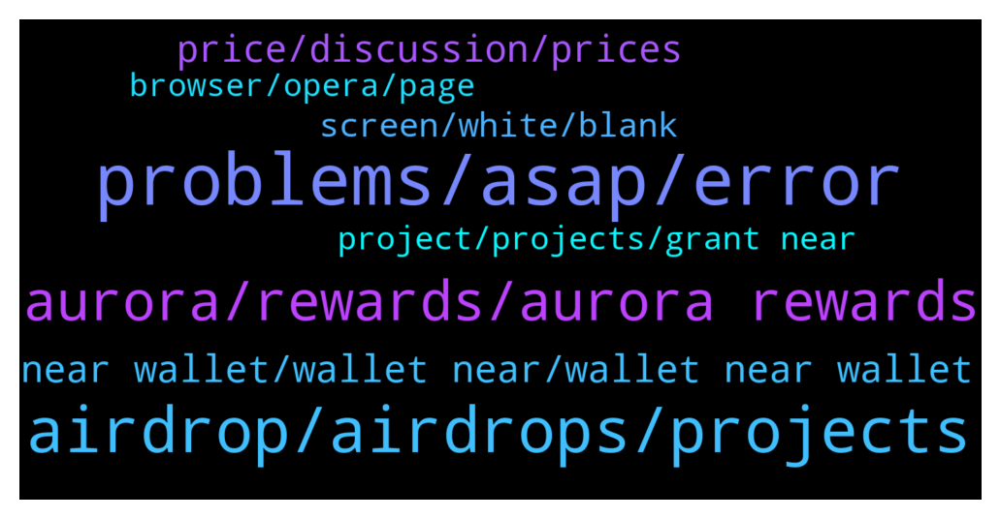

# **@cryptonear**
 ## Analysis for **2022-01-17** - **2022-01-18**.

---

## 📊 **Basic Stats**

**n_messages_sent**: 984

---

---

## 🔝 **Top keywords and related messages**

1. **problems, asap, error**

    @larry_lang --- *there was some problems and display error right now :(* **--->** [TG Discussion](https://t.me/cryptonear/290611)

    @larry_lang --- *hey may u check it again now, please? I think the situation has been better, I can function it well now, so u should be as well, I think* **--->** [TG Discussion](https://t.me/cryptonear/290766)

    @Kripto_Raptor --- *👆 this is the reason for the latest issues or the rpc idk. waiting for a response from the team* **--->** [TG Discussion](https://t.me/cryptonear/288889)

    @onequestion_1 --- *I know, i mean make me sad, because "unknown error"* **--->** [TG Discussion](https://t.me/cryptonear/289417)

    @larry_lang --- *everything is fine but I love it* **--->** [TG Discussion](https://t.me/cryptonear/290763)

    @GeorgePro1 --- *Sorry for the inconvenience   Please check this https://t.me/cryptonear/289288* **--->** [TG Discussion](https://t.me/cryptonear/289607)

2. **airdrop, airdrops, projects**

    @a1sunny --- *No idea bro it's my first time, so 0lease if you guide me i will be thankful to you. I want to get the new Airdrops. No interested in apy/APR. So please...* **--->** [TG Discussion](https://t.me/cryptonear/291259)

    @stedareal --- *Who can help me with 2 NEAR I can't get airdrops,any good Samaritan🙏* **--->** [TG Discussion](https://t.me/cryptonear/289458)

    @larry_lang --- *and to my understanding we dont have any airdrop for $NEAR at this moment* **--->** [TG Discussion](https://t.me/cryptonear/289469)

    @A1Money_intl --- *I believe there's an expected Airdrop coming. Right?   Do you have one sir? And what's expected from this? I don't quite get what's the use case or what to be used for.* **--->** [TG Discussion](https://t.me/cryptonear/290225)

    @shezcrypto --- *Please is there any airdrop going on in Nearprotocol?* **--->** [TG Discussion](https://t.me/cryptonear/290618)

    @Kripto_Raptor --- *which airdrop? we haven't announced any airdrops* **--->** [TG Discussion](https://t.me/cryptonear/288702)

3. **aurora, rewards, aurora rewards**

    @larry_lang --- *i think the aurora team would have the clear answer for that https://t.me/auroraisnear but it would be on a epoch basis- which should be around 12 hours each time* **--->** [TG Discussion](https://t.me/cryptonear/290432)

    @iamkemoo --- *No, it’s just a pool where the $AURORA incentive has ended.* **--->** [TG Discussion](https://t.me/cryptonear/291029)

    @bailey_12 --- *Hi, pls check the following articles for better idea on stake farming with Aurora   https://forum.aurora.dev/t/aurora-validator-v-2-0-setup/100* **--->** [TG Discussion](https://t.me/cryptonear/289896)

    @iamkemoo --- *Since you would stake via the Near wallet you would get your Aurora directly into your wallet and wouldn’t have to bridge them.* **--->** [TG Discussion](https://t.me/cryptonear/291004)

    @TheGo1denBull --- *Except for the Aurora pool that rewards with Aurora instead of Near there is no difference.* **--->** [TG Discussion](https://t.me/cryptonear/288815)

    @larry_lang --- *heyyy so the Aurora reward was stopped hence the downside of APR* **--->** [TG Discussion](https://t.me/cryptonear/290982)

4. **near wallet, wallet near, wallet near wallet**

    @tronghk --- *What's wrong with near wallet? I've had this problem for the past 2 days* **--->** [TG Discussion](https://t.me/cryptonear/290450)

    @Mehmet --- *Yesterday, I sent Near from Huobi to the confirmation address of my Near Wallet for the second time, because I wrote the Near Wallet Confirmation address, my asset did not come to my wallet. Can you help?* **--->** [TG Discussion](https://t.me/cryptonear/288972)

    @KO888 --- *has any one can able to open near wallet* **--->** [TG Discussion](https://t.me/cryptonear/288783)

    @onequestion_1 --- *Does near wallet working already ?* **--->** [TG Discussion](https://t.me/cryptonear/289386)

    @Emre --- *ok but near wallet doesn't show .* **--->** [TG Discussion](https://t.me/cryptonear/288873)

    @protectcoin --- *Hi mod, wanna ask is there any mobile wallet for near?* **--->** [TG Discussion](https://t.me/cryptonear/289743)

5. **price, discussion, prices**

    @larry_lang --- *https://t.me/merchantsofnear. the price should be discussed here* **--->** [TG Discussion](https://t.me/cryptonear/290805)

    @cccckg --- *I just bought in Near at $19.6 this morning …..am I the highest purchasing price in the group?😂😂😂* **--->** [TG Discussion](https://t.me/cryptonear/289199)

    @fynyc --- *Yeah I would like to be early adopter don’t like to buy “expensive” price* **--->** [TG Discussion](https://t.me/cryptonear/290371)

    @TheGo1denBull --- *The community does but this is a personal choice. Are you here to trade or hodl that's up to you but you can get more insight with price discussion here https://t.me/merchantsofnear* **--->** [TG Discussion](https://t.me/cryptonear/290212)

    @TheGo1denBull --- *If you could please discuss prices in this group https://t.me/merchantsofnear* **--->** [TG Discussion](https://t.me/cryptonear/289020)

    @TobiSchwab85 --- *Whats up with price? Whole market?* **--->** [TG Discussion](https://t.me/cryptonear/289791)

6. **screen, white, blank**

    @drc8899 --- *Does anyone know what's going on with the blank wallet page? I still have 0.4near in my account, but I can't open the wallet page* **--->** [TG Discussion](https://t.me/cryptonear/289283)

    @larry_lang --- *If you have blank screen problem with near wallet right now, please try several ways below to fix it: 1/ Funding you wallet at least 0.1 NEAR 2/ Try VPN with different browsers: Firefox, Opera. 3/ Try connect directly to: https://wallet.near.org/send-money If that won't work, please wait, we're checking with wallet team for the problem.* **--->** [TG Discussion](https://t.me/cryptonear/289202)

    @MayorKillah --- *hi, each time I try to go on wallet, the screen blanks... am I doing anything wrong?* **--->** [TG Discussion](https://t.me/cryptonear/290170)

    @nho6kcb --- *I can't login near wallet. Every time you log in, you will see a blank web page. Is there any way to fix it?* **--->** [TG Discussion](https://t.me/cryptonear/289138)

    @onequestion_1 --- *Does wallet work already? Without white screen* **--->** [TG Discussion](https://t.me/cryptonear/290839)

    @The Chosen --- *I'm surprised the web wallet is still showing a blank screen. Will it be resolved soon?* **--->** [TG Discussion](https://t.me/cryptonear/289109)

7. **project, projects, grant near**

    @TheGo1denBull --- *People aren't ready to witness how many projects are about to launch in the NEAR Ecosystem* **--->** [TG Discussion](https://t.me/cryptonear/290357)

    @TheGo1denBull --- *Many devs are cooking up projects on NEAR 👨🏾‍🍳* **--->** [TG Discussion](https://t.me/cryptonear/290294)

    @TheGo1denBull --- *Well Moopay an upcoming project that recieved a grant from Near will have have launchpad in their platform https://paper.moopay.live of course you will have to participate their idk wherever that will be* **--->** [TG Discussion](https://t.me/cryptonear/290374)

    @fynyc --- *By the chance may be u have some place fro ambassador? I am software test engineer and I am bullish on near!* **--->** [TG Discussion](https://t.me/cryptonear/290393)

    @isonar --- *Hi guys! What's the best way to promote my metabuidl project here? Any advice?* **--->** [TG Discussion](https://t.me/cryptonear/289563)

    @NearFritz --- *Yeah, the idea is to have 1000 profesors now, so then we could onboard 1million developers* **--->** [TG Discussion](https://t.me/cryptonear/290297)

