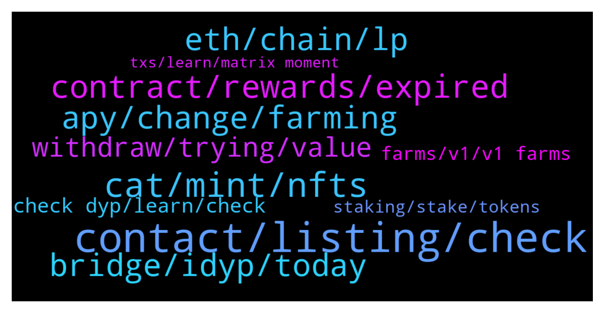

# **@dypfinance**
 ## Analysis for **2022-01-17** - **2022-01-18**.

---

## 📊 **Basic Stats**

**n_messages_sent**: 219

---

---

## 🔝 **Top keywords and related messages**

1. **contact, listing, check**

    @DhoniMSD516 --- *Hey @herbie1996  we wish we can give you promise but sorry we don't have any infos too* **--->** [TG Discussion](https://t.me/dypfinance/240802)

    @makeitrainhaku --- *Hello, who may i contact for a partnership proposal?* **--->** [TG Discussion](https://t.me/dypfinance/240714)

    @Bitmart_Tina_Zhang --- *Dear admin,this is tina,listing Manager from BitMart Exchange. We saw your project,I'm here to seek listing partnership.Who can I contact about listing?(can verify my identity through my profile)* **--->** [TG Discussion](https://t.me/dypfinance/240667)

    @happysunday12 --- *Hi everyone, I'm a new here so nice to meet you all* **--->** [TG Discussion](https://t.me/dypfinance/240871)

    @ohkayhi --- *It would be more convenient to discuss it directly* **--->** [TG Discussion](https://t.me/dypfinance/240910)

    @BeachLifeX --- *Alright I don’t like this though* **--->** [TG Discussion](https://t.me/dypfinance/240438)

2. **cat, mint, nfts**

    @DhoniMSD516 --- *Yes, winning whitelist is easy tho just head here and connect your wallet https://dyp.finance/whitelist If you minted a cat, you have extra free watch minting option* **--->** [TG Discussion](https://t.me/dypfinance/240663)

    @Jabirbobo001 --- *2. If i mint a cat can i put it on other nft market place like opensea and sell?? Or only dyp nftmarket place ?* **--->** [TG Discussion](https://t.me/dypfinance/240687)

    @cgrkaracan --- *If I win the white list and the cat comes out, I will print 1 watch for free* **--->** [TG Discussion](https://t.me/dypfinance/240661)

    @komratkajtek --- *Is nft mint option available? Can't find it* **--->** [TG Discussion](https://t.me/dypfinance/240671)

    @DhoniMSD516 --- *I didn't get what you mean But yes you can mint a cat for 250$* **--->** [TG Discussion](https://t.me/dypfinance/240657)

    @cgrkaracan --- *I can mint my money for 250 dollars* **--->** [TG Discussion](https://t.me/dypfinance/240656)

3. **contract, rewards, expired**

    @BeachLifeX --- *I was collecting rewards on Jan 10th* **--->** [TG Discussion](https://t.me/dypfinance/240415)

    @BeachLifeX --- *It doesn’t matter if my lock time expires.  I am supposed to be able o collect rewards until I remove my lp* **--->** [TG Discussion](https://t.me/dypfinance/240419)

    @BeachLifeX --- *Contract expiration doesn’t matter.  Farm end date is the only thing that matters* **--->** [TG Discussion](https://t.me/dypfinance/240423)

    @BeachLifeX --- *Admin I have not received my rewards for 2 days.  I’m in V1 avax farm* **--->** [TG Discussion](https://t.me/dypfinance/240410)

    @DhoniMSD516 --- *You can yes, but I had to confirm with our devs whether you will be earning rewards after contract expiry* **--->** [TG Discussion](https://t.me/dypfinance/240962)

    @DhoniMSD516 --- *Yes smart contract does that job for you* **--->** [TG Discussion](https://t.me/dypfinance/240817)

4. **bridge, idyp, today**

    @Disguy125 --- *@Tekkol @timdyp  anything new being released this week. Bridge completion etc.* **--->** [TG Discussion](https://t.me/dypfinance/240379)

    @Cimmy_revenger --- *Where we can bridge iDYP ? last weeks , I know announcement from twitter DYP about this.* **--->** [TG Discussion](https://t.me/dypfinance/240680)

    @herbie1996 --- *Morning guys & jubi, please will the bridge be active before the 20th I only ask as I brought some idyp to earn a little profit to help me buy a miner on a white list that runs out on 20th. Please activate it guys. This is my only shot 💎* **--->** [TG Discussion](https://t.me/dypfinance/240801)

    @Cj --- *When will the idyp bridge be online? Was supposed to happen today right?* **--->** [TG Discussion](https://t.me/dypfinance/240319)

    @F --- *Is this mean Idyp bridge is active right now ? 🙂* **--->** [TG Discussion](https://t.me/dypfinance/240861)

    @F --- *What is the bridge will do on the BSC IDYP ?* **--->** [TG Discussion](https://t.me/dypfinance/240629)

5. **eth, chain, lp**

    @WatermelonNoia --- *So if i read the ERC20 tab correctly, 2h30m ago ~32AVAX would have been distributed based on individual pool %s. So if i held 10% of the LP as example (for easy maths sake) that's 3.2AVAX paid out.* **--->** [TG Discussion](https://t.me/dypfinance/240770)

    @cazjp --- *Admin, how much is 587.88 LP on avax? How do I calculate the value in dollors?* **--->** [TG Discussion](https://t.me/dypfinance/240620)

    @DhoniMSD516 --- *Hey you can head to stats page to see the LP value in USD* **--->** [TG Discussion](https://t.me/dypfinance/240621)

    @DhoniMSD516 --- *Hey the payment for CAWS will be in BNB in BSC chain ETH in ETH chain and AVAX in Avax chain all in 250$ worth and not with DYP* **--->** [TG Discussion](https://t.me/dypfinance/240840)

    @Bourk --- *And how do I know how much idyp I have worth in lp?* **--->** [TG Discussion](https://t.me/dypfinance/240955)

    @Bourk --- *Price of lp divided to idyp?* **--->** [TG Discussion](https://t.me/dypfinance/240950)

6. **apy, change, farming**

    @timdyp --- *Maximize your Yield Farming Rewards! Available multi-chain on #Ethereum #BinanceSmartChain #Avalanche  9182 #ETH, 9820 #BNB and 23964 #AVAX worth $35,580,060 paid to farmers!  Join farming by automatically adding liquidity and earn +425% APY https://dyp.finance/farmv2  👉https://twitter.com/dypfinance/status/1483412926375641088* **--->** [TG Discussion](https://t.me/dypfinance/240854)

    @ozgursensei --- *How much apy value can change? For example if you locked your income for 90 days with APY %400? Can it change to %100 2 days later?* **--->** [TG Discussion](https://t.me/dypfinance/240314)

    @ozgursensei --- *Then how can I calculate my earning if it change constantly?* **--->** [TG Discussion](https://t.me/dypfinance/240308)

    @ozgursensei --- *But here is also lock period for farming, why its APY change?* **--->** [TG Discussion](https://t.me/dypfinance/240304)

    @blonewolf06 --- *In earn v1 farm it shows avax at 6055% Apy is that real?* **--->** [TG Discussion](https://t.me/dypfinance/240825)

    @ozgursensei --- *But it calculate according to current apy value, how frequent the apy change?* **--->** [TG Discussion](https://t.me/dypfinance/240310)

7. **withdraw, trying, value**

    @tejchand --- *hi i deposited 66.8 wavax with no lock period but when i withdraw i only get 16 wavax back. dont know what went wrong. please help* **--->** [TG Discussion](https://t.me/dypfinance/240567)

    @shinigamikami --- *Always check your LP value before withdrawing* **--->** [TG Discussion](https://t.me/dypfinance/240586)

    @BeachLifeX --- *No I’m not removing any lp yet* **--->** [TG Discussion](https://t.me/dypfinance/240428)

    @timdyp --- *If you removed your funds, it's impossible to get it back. You can get the assets affected by the IL only if the value of your deposited assets will recover in value, this can happen only when you still providing liquidity. Again, before joining farming and providing liquidity, you should read about IL and understand the concept.  https://academy.binance.com/en/articles/impermanent-loss-explained* **--->** [TG Discussion](https://t.me/dypfinance/240572)

    @Crypto Q --- *I'm trying to deposit my WAVAX and I keep receiving an error saying something about SafeErc20 on Snowtrace what can I do about this?* **--->** [TG Discussion](https://t.me/dypfinance/240753)

    @DhoniMSD516 --- *Can you please check if you can able to withdraw LP?* **--->** [TG Discussion](https://t.me/dypfinance/240424)

8. **check dyp, learn, check**

    @CryptoWilliam --- *Have Dyp team thought of implementing IL protection/insurance kinda like thorrune has? I just saw read abit about thorrune and i think thats a supergreat feature that Dyp should deffiently have also* **--->** [TG Discussion](https://t.me/dypfinance/240703)

    @Drake --- *Is DYP considered a web 3.0 player?  Thanks for the link I'll read it* **--->** [TG Discussion](https://t.me/dypfinance/240357)

    @Drake --- *@hemanrock love the roadway thanks very much!  What is the best investment vehicle for DYP right now if I want to invest?* **--->** [TG Discussion](https://t.me/dypfinance/240361)

    @DhoniMSD516 --- *Hello welcome you can start here https://t.me/dypfinance/229271 to learn about DYP* **--->** [TG Discussion](https://t.me/dypfinance/240872)

    @hemanrock --- *This is DYP official group. Please check more about DYP from here https://t.me/dypfinance/229271  dyp.finance* **--->** [TG Discussion](https://t.me/dypfinance/240702)

    @hemanrock --- *you can check this to know more about DYP https://t.me/dypfinance/229271  you should DYOR before joining farming, learn about IL* **--->** [TG Discussion](https://t.me/dypfinance/240679)

9. **farms, v1, v1 farms**

    @BeachLifeX --- *Bro I asked for the exact date the last deposits into the V1 farms were allowed* **--->** [TG Discussion](https://t.me/dypfinance/240440)

    @BeachLifeX --- *So provide me with the last date to make a deposit in the V1 farms* **--->** [TG Discussion](https://t.me/dypfinance/240432)

    @BeachLifeX --- *When was the last date to deposit on the V1 farms?* **--->** [TG Discussion](https://t.me/dypfinance/240425)

    @BeachLifeX --- *It feels like you guys want me to withdraw  And you’re not telling me the date the last deposit into the V1 farms was allowed* **--->** [TG Discussion](https://t.me/dypfinance/240449)

    @BeachLifeX --- *I don’t know why we’re talking about anything other than the exact date the last deposits into the V1 farms happened* **--->** [TG Discussion](https://t.me/dypfinance/240442)

    @DhoniMSD516 --- *What exactly? We have new V2 farms launched on Dec 9th very before V1 expiry so that users right after V1 expiry can jump in new farms* **--->** [TG Discussion](https://t.me/dypfinance/240439)

10. **staking, stake, tokens**

    @AKBAR071078 --- *I have purchased dyp on hotbit please guide how to stake it* **--->** [TG Discussion](https://t.me/dypfinance/240505)

    @Jabirbobo001 --- *Hello admin, pls i stake my DYP tokens for 90 days, do i have to unstake after 90 days and restake again? Or i will just leave the tokens after 1yr, i will get my 50%APR ?* **--->** [TG Discussion](https://t.me/dypfinance/240481)

    @Kamil --- *Just bought a bag on kucoin,  where i can stake my dyp?* **--->** [TG Discussion](https://t.me/dypfinance/240496)

    @ArchieHerrera --- *I can keep my tokens locked up in v1 staking even though the contract is changing?* **--->** [TG Discussion](https://t.me/dypfinance/240961)

    @blonewolf06 --- *You can only stake lp tokens?* **--->** [TG Discussion](https://t.me/dypfinance/240811)

    @DhoniMSD516 --- *Hello. You can stake on our staking dApp https://dyp.finance/stakev2/eth but first, you need to transfer your DYP to a private wallet like metamask .  Staking Tutorial https://youtu.be/D5g19SuQlcI* **--->** [TG Discussion](https://t.me/dypfinance/240510)

