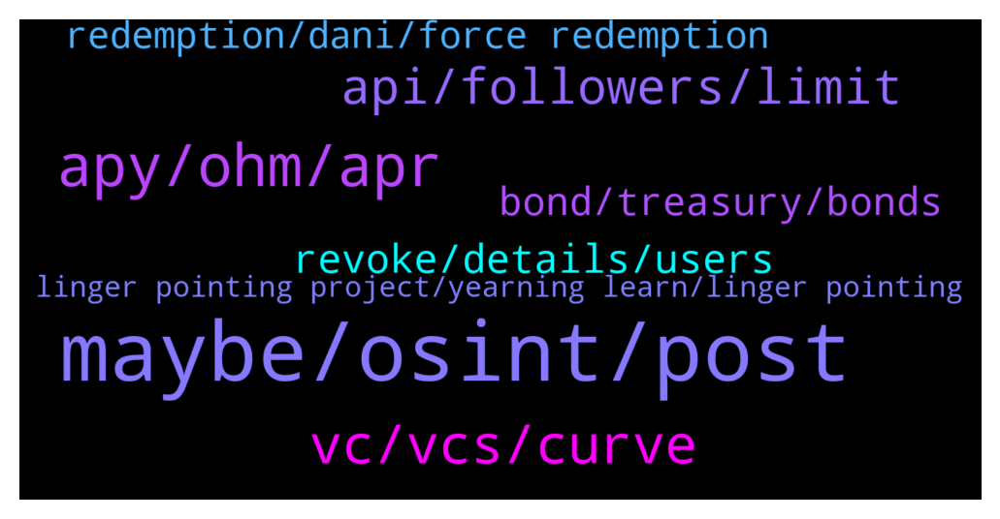

# **@lobsters_chat**
 ## Analysis for **2022-01-17** - **2022-01-18**.

---

## 📊 **Basic Stats**

**n_messages_sent**: 282

---

---

## 🔝 **Top keywords and related messages**

1. **maybe, osint, post**

    @farm42 --- *Same! This would be very useful in due dilligence activities…* **--->** [TG Discussion](https://t.me/lobsters_chat/316258)

    @bernyn --- *Check multichain I think there is no fee, I did it today from eth to ftm* **--->** [TG Discussion](https://t.me/lobsters_chat/316457)

    @enderwiggins1 --- *Guys this is the link - https://discord.gg/y4fTFWUG* **--->** [TG Discussion](https://t.me/lobsters_chat/316320)

    @Alphamint --- *Is there a way to change binance's  deposit address for my account?* **--->** [TG Discussion](https://t.me/lobsters_chat/316018)

    @XekFukOff --- *We need to build an osint crypto toolkit or we need to create a osint crypto project* **--->** [TG Discussion](https://t.me/lobsters_chat/316259)

    @unialpha --- *can you explain in more details what would such a toolkit comprise of? or this is an open ended thing* **--->** [TG Discussion](https://t.me/lobsters_chat/316277)

2. **apy, ohm, apr**

    @Lorddimiter --- *no sir , thats the APY calculation, you will get something which is much closer to 10% every 5 days , which is like 300% APR , so after 3 months u will have increased your ohm to say between 1750-2000 OHM depends on variance* **--->** [TG Discussion](https://t.me/lobsters_chat/316096)

    @Lorddimiter --- *Yes it is, but the base for re-compounding is important here , if the base is very high, then the effect on the re-compounding calc will be extreamly high as well* **--->** [TG Discussion](https://t.me/lobsters_chat/316091)

    @syed_jafri --- *1000% APY compounded daily is only 240% APR* **--->** [TG Discussion](https://t.me/lobsters_chat/316084)

    @ivangbi --- *Altho wait I am sleepy… hm isn’t that just how APY is calculated? It assumes re-compounding, right. The same case for convex or yearn?* **--->** [TG Discussion](https://t.me/lobsters_chat/316087)

    @ivangbi --- *So price dipped by 10x since nov. That means you needed to have 1000% APY from staking to make it back due to having more coins * lower price. APY rn on olympus is still > 3000% and basically in the last 3 months was probably around 1000% adjusted. So… did people lose money or am i math wrong?* **--->** [TG Discussion](https://t.me/lobsters_chat/316080)

    @metacoin --- *The discrepancy between APY and APR gets larger as base APR goes up because APY is an exponential calculation. Therefore 11% APY on yearn is probably close to 10% APR in reality so it's about the same. However with 300% APR the exponential ramps up quickly into the thousands and becomes a useless meme metric* **--->** [TG Discussion](https://t.me/lobsters_chat/316102)

3. **vc, vcs, curve**

    @tandeloff --- *Currently yes, by design they try to do it on their own IMO They wrote they cant delta hedge now since synthetix dont yet allow short selling on optimism  https://docs.lyra.finance/implementation/liquidity-provider-risks* **--->** [TG Discussion](https://t.me/lobsters_chat/316148)

    @Theeylon --- *it depends on the VC, most will immediate dump yer tokens* **--->** [TG Discussion](https://t.me/lobsters_chat/316417)

    @Father0x --- *imo it depends on the vc* **--->** [TG Discussion](https://t.me/lobsters_chat/316412)

    @Joel_john --- *so wait, are VCs bad or good? whats going on?  i thoguht VCs are bad but now everyone is becoming vc omggg* **--->** [TG Discussion](https://t.me/lobsters_chat/316411)

    @AGTsi --- *Hey guys I have a question about bsc stables liquidty. Which service has the best rates to swap stablecoins on BSC ?** **--->** [TG Discussion](https://t.me/lobsters_chat/316452)

    @fiskantes --- *continuous ICO is good framing, but turning it into VC is just uneventful..many VC DAOs exist, just because trying to create a independent reserve currency is hard doesnt mean we should stop trying after first boom and bust* **--->** [TG Discussion](https://t.me/lobsters_chat/316408)

4. **api, followers, limit**

    @rektivist --- *Heya. Anyone knows what tools can be used for twitter new follow tracking?  https://github.com/twintproject/twint proposed by @farm42 stopped working since twitter removed some crucial legacy apis* **--->** [TG Discussion](https://t.me/lobsters_chat/316181)

    @farm42 --- *The basic idea is to pick a list of "worthy"  Twitter accounts and keep track of their social connections, who they subscribe to. That way you can see the coordinated actions and alpha* **--->** [TG Discussion](https://t.me/lobsters_chat/316278)

    @farm42 --- *I was advised to use this tool, it is pretty awesome twitter.com/calchulus/status/1064377019662618624* **--->** [TG Discussion](https://t.me/lobsters_chat/316299)

    @XTO_Crypto --- *Hi everyone, i’m looking for a way to check my PNL & history at specific time ? For instance if I want a recap of what I did frm October 1st to October 31th with graphs & tx history. Is there any tool out there to do that ? Or ready made Dune dashboard may be ? Couldn’t find one to do that all so far. Thanks in advance* **--->** [TG Discussion](https://t.me/lobsters_chat/316200)

    @farm42 --- *Hi! Check out this convo https://t.me/lobsters_chat/316183 I been using Twint in past but seems now you wether need to own a twitter API or own a cool antidetect system + pay for captcha clickers.* **--->** [TG Discussion](https://t.me/lobsters_chat/316253)

    @t_slam --- *is there a notification system in twint in real time to track followers? or is it a chronjob that compares followers?* **--->** [TG Discussion](https://t.me/lobsters_chat/316197)

5. **revoke, details, users**

    @mogglet --- *well checked and handled perfectly, some users have not revoked yet ! I suggest check here : https://app.multichain.org/#/approvals* **--->** [TG Discussion](https://t.me/lobsters_chat/316241)

    @ChiTimesChi --- *Also, not sure why they haven't listed WFTM alongside other wNative tokens as "revoke asap"* **--->** [TG Discussion](https://t.me/lobsters_chat/316386)

    @VaeVictis321 --- *They should have performed attack by themself and the distribute it to users back. Instead of doing that announcement. Like we did.* **--->** [TG Discussion](https://t.me/lobsters_chat/316376)

    @PmRiviere --- *Jay is right though the warning update seems to say the revoke is unnecessary* **--->** [TG Discussion](https://t.me/lobsters_chat/316250)

    @SpikeSpiege1 --- *Since you said in your last Twitter update that everything was fixed you should clarify that ppl still need to revoke.* **--->** [TG Discussion](https://t.me/lobsters_chat/316247)

    @SpikeSpiege1 --- *You still need to revoke even though everything is fixed?🧐* **--->** [TG Discussion](https://t.me/lobsters_chat/316242)

6. **bond, treasury, bonds**

    @kapur_sanat --- *i know there’s a lot of protocols that are building out infra for allowing treasuries to sell covered calls on their native tokens (https://ribbonfinance.medium.com/ribbon-treasury-ee311f7ce7d8) - but does anyone know of any treasuries that have actually done this?  i know some treasuries have done KPI option sales/airdrops to investors which is kind of in the ballpark - any succesful examples there would be helpful too* **--->** [TG Discussion](https://t.me/lobsters_chat/316429)

    @ivangbi --- *Ser me no supporter and no simp for this, but if we take away the past and view it just as a "big treasury" since IV now - almost the FDV, then it becomes o-k? Then it needs to make products and use that liquidity well, like what Dani does w "his" bags? Imho, kill the staking APYs (it's not token dilution for no reason, just let it go at the big dip, let people exit). There is no point innit since bonds can't really bring that much anymore: likely token dilution % will be larger than $ of treasury accrual. And... just pivot 100%* **--->** [TG Discussion](https://t.me/lobsters_chat/316123)

    @defi_lobster --- *obviously they want to attract new bond purchasers this way* **--->** [TG Discussion](https://t.me/lobsters_chat/316403)

    @ivangbi --- *Basically, forget about bonds and all that, after some growth point you likely can't even use it well anymore (too tight slippage, too efficient the market idk?) - and do a different thing althogether. Reserve currency = find new ways to grow treasury. Or just become an index* **--->** [TG Discussion](https://t.me/lobsters_chat/316130)

    @mewny --- *because they inflate the total supply to sell bonds at x% under market value* **--->** [TG Discussion](https://t.me/lobsters_chat/316117)

    @mewny --- *well they capture it with their bonds* **--->** [TG Discussion](https://t.me/lobsters_chat/316116)

7. **redemption, dani, force redemption**

    @ivangbi --- *Idk about his ethos or motives outside of what I speculate to be the goalposts short-term here. Where? Rich if he succeeds, very poor if it goes down and he exits* **--->** [TG Discussion](https://t.me/lobsters_chat/316370)

    @ivangbi --- *2. Somebody else forces redemption at any point = why would he do it if his own funds r like 20% or whatever it is, while he can invest a 50%+ kinda* **--->** [TG Discussion](https://t.me/lobsters_chat/316365)

    @ivangbi --- *Ofc everyone will wanna be frens w him to get an injection of capital though* **--->** [TG Discussion](https://t.me/lobsters_chat/316367)

    @ivangbi --- *I’d like to be proven wrong, any vivid Dani supporters here? ^* **--->** [TG Discussion](https://t.me/lobsters_chat/316366)

    @ivangbi --- *Issue is, for Dani it makes sense to buy TIME at 1:1 since he can force a redemption of assets. I doubt he’d collab if anybody else called for redemption. He wants to use this $ to fund his new and old bags, as like an ecosystem (fk ye also thinking of applying to get his cash, y not, probably will be denied tho) so this redemption is imho a meme* **--->** [TG Discussion](https://t.me/lobsters_chat/316363)

    @SpikeSpiege1 --- *He said he was going to hold those.... on Twitter lol.  Drop another 40% and we'll see. Either way good for him.* **--->** [TG Discussion](https://t.me/lobsters_chat/316220)

