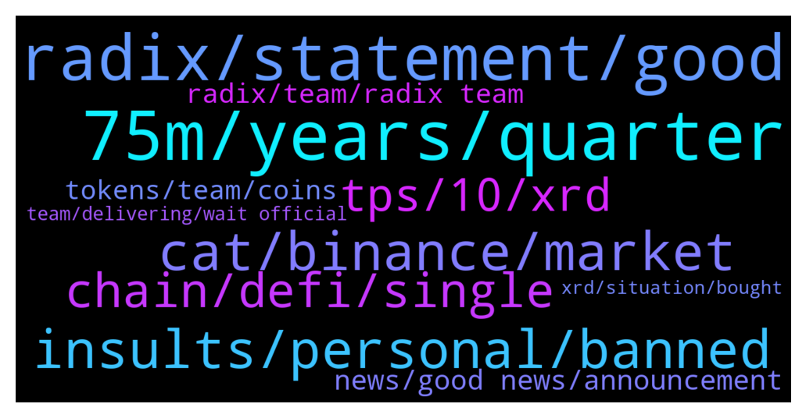

# **@radix_dlt**
 ## Analysis for **2022-01-17** - **2022-01-18**.

---

## 📊 **Basic Stats**

**n_messages_sent**: 1259

---

---

## 🔝 **Top keywords and related messages**

1. **75m, years, quarter**

    @fpieper --- *On this point I agree, it is not clear in the announcement.  Though 75M over 4 years would be too low to make sense. But "roughly quarterly" is not in direct context to the 75M XRD.  @Adam_XRD* **--->** [TG Discussion](https://t.me/radix_dlt/341505)

    @danhughes --- *"Much" is subjective  If it was 1M it would be too much in some opinions ... for others 200M per quater would be fine.  75M seemed reasonable to me given the market conditions, our roadmap etc* **--->** [TG Discussion](https://t.me/radix_dlt/341194)

    @SontaransPervertingHumanHistory --- *I don’t think anyone would think 200M a quarter would be too little 😅🥲  Don’t dump all at once please. Think of the poor schmucks who bought tiny bags at 50c because they believe in you and the project* **--->** [TG Discussion](https://t.me/radix_dlt/341302)

    @Wolvy74 --- *Oh yes, I see 75M times 16 is 1.2Bn. I'm just trying to understand what is happening here reading all emotional messages* **--->** [TG Discussion](https://t.me/radix_dlt/341028)

    @<UNK> --- *Does it mean 75M released over 4 years or several instalments of up to 75M over 4 years?* **--->** [TG Discussion](https://t.me/radix_dlt/340851)

    @coathanger1 --- *750 mil xrd over 4 years seems reasonable to me* **--->** [TG Discussion](https://t.me/radix_dlt/341067)

2. **radix, statement, good**

    @Ja_mie --- *Before everyone jumps to conclusions and risks misinterpreting the statement, I think it would be prudent for Radix to take the opportunity to write a longer and more descriptive statement clarifying in sufficient detail what they are actually trying to say and planning to do here. The statement is arguably too short and open to interpretation, which should have been pre-empted if truth be told, but nonetheless they should clarify before the speculation gets out of hand. It would be better for them and the community than waste time debating it further, in my opinion. Of course after such a statement then everyone could discuss it at length.* **--->** [TG Discussion](https://t.me/radix_dlt/340944)

    @Al_Bunderino --- *Yeah, but they claim to use radix tech...* **--->** [TG Discussion](https://t.me/radix_dlt/341552)

    @Jazzer9F --- *In the 4th installment of his Alexandria blog series, Chief Product Officer at Radix, Matthew Hine, describes how Radix is building the foundation of a new world where #DeFi dApps can scale without limit. 🚀  👉 https://www.radixdlt.com/post/how-radix-engine-is-designed-to-scale-dapps* **--->** [TG Discussion](https://t.me/radix_dlt/341005)

    @FreeTixDao --- *I don't see that they are borrowing any tech, you're right in that they "should" mention Radix a but more but essentially all they are trying to do is build a code library that will run on the Radix platform, as you know the more Dapps built on the Radix platform the better for XRD as a whole so it can only be good.* **--->** [TG Discussion](https://t.me/radix_dlt/341521)

    @FreeTixDao --- *He should mention Radix a bit more but at the end of the day as the platform grows this stuff will happen more and more* **--->** [TG Discussion](https://t.me/radix_dlt/341524)

    @Adam --- *You were having a direct conversation with one of the devs of Radix. I challenge you to find another project of this caliper that will take the time to address your concerns while you insult them of their progress* **--->** [TG Discussion](https://t.me/radix_dlt/341921)

3. **insults, personal, banned**

    @<UNK> --- *Shouldn’t insult people for having genuine concerns mate* **--->** [TG Discussion](https://t.me/radix_dlt/341151)

    @Crypto --- *@Adam_XRD I assume Leo is not allowed to take it upon himself to silence me when you personally solicited my opinions here? i guess mods are not allowed to be so corrupt* **--->** [TG Discussion](https://t.me/radix_dlt/341936)

    @<UNK> --- *No need to make personal accusations here.* **--->** [TG Discussion](https://t.me/radix_dlt/341439)

    @<UNK> --- *You were muted for 7 days for making personal attacks of the same kind that you are now doing here.* **--->** [TG Discussion](https://t.me/radix_dlt/341448)

    @mx471 --- *But I wouldn't be surprised if one day the blocked people would claim that you blocked them for factual criticism.* **--->** [TG Discussion](https://t.me/radix_dlt/342519)

    @Adam_XRD --- *FYI, I have asked the mod team to mute anyone who continues with personal attacks/insults directed at any team member.   After a mute, if you continue you will be banned.   Questions, concerns, and discussion is welcome. Abuse and insults is not OK.* **--->** [TG Discussion](https://t.me/radix_dlt/341700)

4. **cat, binance, market**

    @coathanger1 --- *lol people getting upset about people who devoted 10 years of their lives to creating the most technologically advanced crypto in existence actually paying themselves* **--->** [TG Discussion](https://t.me/radix_dlt/341064)

    @WAGMI --- *Hmm yes, but it's crypto so forgive me for being skeptical any time stuff like this comes out* **--->** [TG Discussion](https://t.me/radix_dlt/340664)

    @Sentient_Sandwich --- *It's not even an unusual situation for a crypto project. The open communication and general trustworthy approach the team have taken up to now suggest it's a pretty good situation* **--->** [TG Discussion](https://t.me/radix_dlt/341487)

    @gpel33 --- *I think this is key. All crypto projects require TRUST* **--->** [TG Discussion](https://t.me/radix_dlt/341833)

    @rubydacheryyyy --- *Although, in a perfect world, I don’t think there should be a “team” for a crypto project.. that’s why people love Bitcoin right? But I understand that a team is very needed at this point in time 🔥* **--->** [TG Discussion](https://t.me/radix_dlt/341718)

    @PeterFATAss --- *I would rather focus marketing inside tje crypto community* **--->** [TG Discussion](https://t.me/radix_dlt/340691)

5. **chain, defi, single**

    @fpieper --- *I tend to say there will be a single relevant protocol in the long term. Of course I am talking about decades and not tomorrow, maybe 10-20 years.  With cross-chain you will always have security issues in your consensus (regarding cross-chain activity).* **--->** [TG Discussion](https://t.me/radix_dlt/342181)

    @Adam_XRD --- *Exactly. It will certainly take time and I do think we will live in a multi-chain era for at least a few years.* **--->** [TG Discussion](https://t.me/radix_dlt/342161)

    @fpieper --- *At least Vitalik already realised that the future will be "multi-chain" (his wording for sharding), but not cross-chain 🤟* **--->** [TG Discussion](https://t.me/radix_dlt/342162)

    @fpieper --- *Elrond has a metachain, maybe. Cosmos has a central (but decentralised) hub right now. I think Near needs quite a large amount of nodes, but not fully sure.  Overall, other sharded networks can maybe reach 1M TPS but without cross-shard atomic composability it is not much worth in the end.  E.g. Elrond supports 30-40 TPS for smart contracts per shard. How usable would that be if you have 30K fragmented DeFi ecosystems?* **--->** [TG Discussion](https://t.me/radix_dlt/342211)

    @Rex --- *Finance will go DeFi, but a single global decentralized network of financial apps does a better job of efficiently allocating capital than the fragmented systems that exist today true but not sure about “a single” maybe multiples but single that’s impossible* **--->** [TG Discussion](https://t.me/radix_dlt/342155)

    @TheWoodsman --- *@fpieper Have you looked at Stacks, the DeFi that seems to be a kind of BTC L2? As far as I can see it's just a sidechain blockchain, so will have scalability limitations, but if there was anything more indepth than that I would keen to read it* **--->** [TG Discussion](https://t.me/radix_dlt/342171)

6. **tps, 10, xrd**

    @Shang En --- *I have a question  It would sounds a little crazy to have this tps But it’s really possible cause I asked two devs team members, they talked about the tps in this channel before. If we really did it at 100m tps, or even 1 billion tps, I have two questions. 1:  In this video,the total tps include current global financial system would be 100m. It’s from https://youtu.be/Z6Nof-FtSDA That’s @Ben_XRD  told me. How much XRD will burn if we achieve 100m tps per year? 2:  if we look at it more aggressively, from @magel36 told me, he said it at the channel before. He said: overall tech breakthroughs like these are underestimated when they go mainstream. In the early days of the internet, they estimated traffic based on phone calls.... We believe millions or even billions of tps will be necessary, and Radix is the only one future proof that will be able to scale without bottlenecks  So in the future, if we have 1 billion tps, how much XRD will burn per year?  Is 300m XRD really enough? If not, does the devs team have any solution?  Thank you for reading it, hope I can get some answers.* **--->** [TG Discussion](https://t.me/radix_dlt/341464)

    @ahsimon --- *I made a "small" change to my reply, based on Florian's comments.  As a result NOT 1600 trillionXRD burned by year. "Only" 1.6 trillion and not the 1.6 Bln that Florian suggested.  A mistake on my part of 10^3 was bad enough, but not 10^6.  "I don’t understand why not increase the fee if $200/XRD, would there be some purpose to do so?"      The reason for keeping the fee in the range of 1-10c was that we wanted to make sure Radix was accessible to even the poor among the 9 billion among us, when it is fully implemented.  Some people subsist on $1/day  "I don’t understand how Allen’s point about diverting some of the burn is answered?"    I was not explicit about "How", because the team will make that decision.  But I can address "why?"  We want to keep the minimal fee in the range of 1-10c as just stated.  But burning all the fees, under these assumptions, burns to much.  So let's just burn enough to manage the amount of deflation we think is needed, and do something useful with the rest of the fee.* **--->** [TG Discussion](https://t.me/radix_dlt/340640)

    @ITProfligate --- *So, 900M XRD more than break even are burned this way, with $200/XRD and 1ct txs fee. That is 3 x as deflationary (more burn) as break even. I don’t understand why not increase the fee if $200/XRD, would there be some purpose to do so? I don’t understand how Allen’s point about diverting some of the burn is answered? I think that diverting some of the burn may prove necessary to continue to encourage investment in the ecosystem. I admit I may be misunderstanding too much in these questions?* **--->** [TG Discussion](https://t.me/radix_dlt/340611)

    @ahsimon --- *Thanks, 1.6*10^12 is-not-equal to 1600 trillion XRD/year burned as I stated, only 1.6 trillion burned per year.  My mistake, at the very last step.    But that does not change the thrust of my comment, just its magnitude.  1.6 trillion is 1600/24 == 67 times more than the maximum possible supply after 40 years, namely 24 billion.  Put differently, under the given assumptions, it would only take about 6 days to burn every XRD that will ever exist.  SOMETHING STILL MUST CHANGE.  What were those assumptions?  It is 5-10 years from now and Radix is wildly successful running on sharded Xian.   It can handle 1 trillion TPS,  The price has risen to $200/XRD, and the fee (not counting Component royalties) has been adjusted to $0.01 per transaction.  My reply (https://t.me/radix_dlt/340581) was in reference to a response to my recent AMA concerning validator incentives, with those assumptions.* **--->** [TG Discussion](https://t.me/radix_dlt/340628)

    @fpieper --- *This is unrealistic (even kind of impossible), because high TPS means high value of the network and therefore high XRD price* **--->** [TG Discussion](https://t.me/radix_dlt/341482)

    @fpieper --- *With 1M TPS and 200$ XRD it should burn 1.2B XRD per year. However, with 1M TPS the price would be higher than. In the end it is easy, the fee is only 1ct which is a very small part of a transaction.* **--->** [TG Discussion](https://t.me/radix_dlt/340583)

7. **news, good news, announcement**

    @tesslerc --- *Just try to phrase stuff with a little more sensitivity in the future. And ideally time such announcements with good news / positive market sentiment. Optimally not to release anything can that be perceived as bad news at the pico bottom 😢* **--->** [TG Discussion](https://t.me/radix_dlt/341497)

    @SontaransPervertingHumanHistory --- *Literally zero clarity.  Clear as mud misleading announcement. Still no idea who is receiving funds and how much each* **--->** [TG Discussion](https://t.me/radix_dlt/341001)

    @<UNK> --- *https://www.radixdlt.com/post/founder-retention-notice-from-rdx-works-limited  The wording of this announcement is a bit lumpy.* **--->** [TG Discussion](https://t.me/radix_dlt/340850)

    @No_Goats_No_Glory --- *Hence why someone up needs to overlook before posting it to the world. Look what it did. This could be avoided.   Not strange to ask for a billion dollar company.* **--->** [TG Discussion](https://t.me/radix_dlt/341256)

    @saeglopur10 --- *I too think that the public announcement is extremely vague and intended to mislead those invested* **--->** [TG Discussion](https://t.me/radix_dlt/340919)

    @Radstakes --- *I agree it was a bit misleading when first announced* **--->** [TG Discussion](https://t.me/radix_dlt/341632)

8. **radix, team, radix team**

    @Crypto --- *Quite honestly, not the impression I get.  Some of the team are great, especially tech team. With others, it just seems like Radix is a refuge for people to have well-paid tech jobs that would be unemployable elsewhere.   A lot of free riders in the company. For instance, a head of exchanges who gets no exchanges… A ton of “marketing” people yet no one has ever heard of “Radix".* **--->** [TG Discussion](https://t.me/radix_dlt/341883)

    @Jacob_XRD --- *I have asked senior Radix team to clarify the points raised here. Once they are online they will be in here answering questions.    Please stop with the wild theories and speculation about exchanges, rug pulls, investors ect, they are completly unfounded and not helping at all.   A lot you you have raised valid concerns, and we will address them and provide clarity where we can.* **--->** [TG Discussion](https://t.me/radix_dlt/341036)

    @korone_stan --- *team members will be virtually anonymous or unreachable anyway once radix gains more traction, that's just how it goes once things get noisy. enjoy your access while you have it* **--->** [TG Discussion](https://t.me/radix_dlt/341714)

    @BenzBoyJon --- *The marketing council could collect all feedback and send it to Radix team 2 review?   We could send you out thoughts and you can submit, instead of us all bombarding them with the same suggestion lol* **--->** [TG Discussion](https://t.me/radix_dlt/340823)

    @Adam_XRD --- *Also, to comment on this specifically:  > A ton of “marketing” people yet no one has ever heard of “Radix".  Firstly, this is a marathon not a sprint. Radix is still at an early stage. There is a long way to go, but we are making strong progress in many places. There was even a mini-recap of some of the marketing achievements in the last Radix Report of 2021 here: https://www.radixdlt.com/post/radix-report-9th-december* **--->** [TG Discussion](https://t.me/radix_dlt/341898)

    @<UNK> --- *Okay , Did radix published full break up on how much it is for team vs share holders ( members not part of team ) ?  May be good idea to publish the transparency reports about the funds from now onwards like the way ALGO does* **--->** [TG Discussion](https://t.me/radix_dlt/340866)

9. **tokens, team, coins**

    @Crypto --- *I agree that its a marathon, not a sprint.  That’s why it surprises when team want to cash out millions before they won a single medal.* **--->** [TG Discussion](https://t.me/radix_dlt/342010)

    @Alex --- *Then everything this morning in this channel is price talk.. It is about the philosophy behind it, that people should be happy if they really believe in the project that even if the tokens get dumped, you will have another attractive entry point, which would not be the case if it was dumped in 4 years with an accumulated volume of those 4 years.* **--->** [TG Discussion](https://t.me/radix_dlt/341321)

    @fpieper --- *Not much is happening, the team is distributing some of their own tokens to their share holders over the next 4 years.* **--->** [TG Discussion](https://t.me/radix_dlt/341035)

    @a00000333 --- *Wanting your share/payout is ok i suppose. What i’m trying to determine is if it’s a team cash out (sorry asking the uncomfortable questions), given they probably have significant salaries. So do they earn large salaries? If so, why the need for their tokens?* **--->** [TG Discussion](https://t.me/radix_dlt/341377)

    @danhughes --- *also interesting, when the community wanted full unlock and big payday over half were fine with it ... team wants a small portion of their payday per quarter and there's muntiny growing* **--->** [TG Discussion](https://t.me/radix_dlt/341113)

    @ashley_tele --- *But you already knew that the team had this allocation of coins for themselves, so why does the announcement of exactly how they are vesting change things? It's just not a rational argument, I don't understand...* **--->** [TG Discussion](https://t.me/radix_dlt/341443)

10. **team, delivering, wait official**

    @Jacob_XRD --- *Come on mate. Of course. Most of the team have dedicated their lives to delivering this projects roadmap. We do this day and night.* **--->** [TG Discussion](https://t.me/radix_dlt/340892)

    @FreeTixDao --- *You're right my friend, I did, it's in such early days though :)* **--->** [TG Discussion](https://t.me/radix_dlt/341527)

    @mx471 --- *ADA is big because it started early, not because the team is so special.* **--->** [TG Discussion](https://t.me/radix_dlt/341964)

    @satoshixy --- *Well, this has to be confirmed by the team!* **--->** [TG Discussion](https://t.me/radix_dlt/340909)

    @<UNK> --- *This is for legal reasons. If we act as an arm of the team, they become liable for what we do.* **--->** [TG Discussion](https://t.me/radix_dlt/340840)

    @Fcrypto2021 --- *Let's calm down, the team is delivering on their road map.  Let's support them* **--->** [TG Discussion](https://t.me/radix_dlt/341085)

