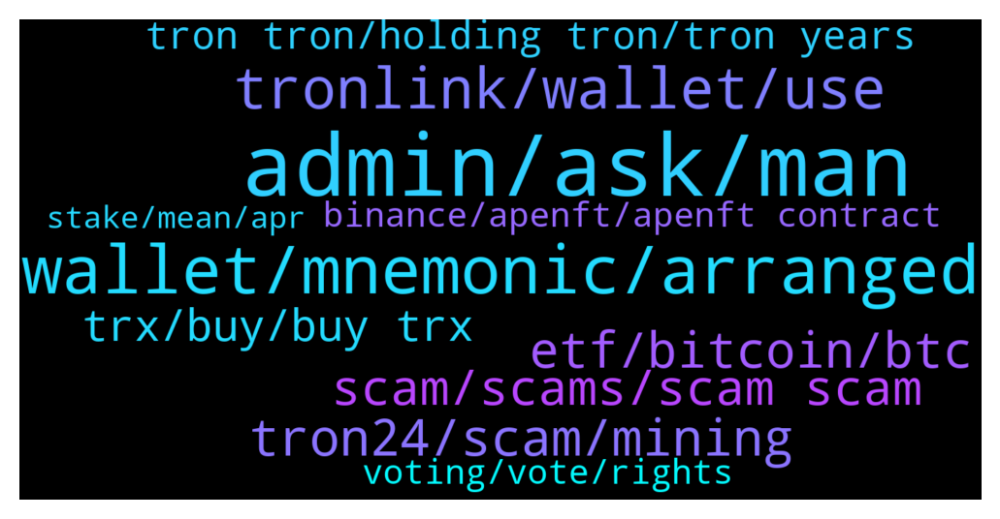

# **@tronnetworkEN**
 ## Analysis for **2022-01-17** - **2022-01-18**.

---

## 📊 **Basic Stats**

**n_messages_sent**: 502

---

---

## 🔝 **Top keywords and related messages**

1. **admin, ask, man**

    @alexachim --- *What’s the support tag in here to ask them a question* **--->** [TG Discussion](https://t.me/tronnetworkEN/3838850)

    @Silvernitrate1 --- *I knew I’m just pulling his legs* **--->** [TG Discussion](https://t.me/tronnetworkEN/3837376)

    @xPommepote --- *You already ask, we already answered to you.* **--->** [TG Discussion](https://t.me/tronnetworkEN/3838437)

    @M --- *You’re calmer than I would be. Respect* **--->** [TG Discussion](https://t.me/tronnetworkEN/3838883)

    @agentpiki --- *No man, you are just asking tons of questions. Seriously, I studied on my own without any help. You just need to ask if sources are legit or not but that is common sense too* **--->** [TG Discussion](https://t.me/tronnetworkEN/3837798)

    @afrifaba --- *Naa bro, we are learning together🙏* **--->** [TG Discussion](https://t.me/tronnetworkEN/3837794)

2. **wallet, mnemonic, arranged**

    @Mark396 --- *Hi guys I have received 600 credit on wallet for providing references to friends can anyone tell me how to collect that in main balance ?!* **--->** [TG Discussion](https://t.me/tronnetworkEN/3839732)

    @Nemos13 --- *And if you forget your seed phrases or someone steal your password..say goodbye to you hard earn money 😄😄* **--->** [TG Discussion](https://t.me/tronnetworkEN/3838127)

    @Issaytt --- *If I try to put the mnemonic keys as I have written them down It might not access because it's not arranged* **--->** [TG Discussion](https://t.me/tronnetworkEN/3839583)

    @Vijai Kumar --- *How to do backup  mnemonic* **--->** [TG Discussion](https://t.me/tronnetworkEN/3838905)

    @Carlos_TRX --- *If you can't cancel it and you're not sure, it's best to create another wallet and send your funds there...* **--->** [TG Discussion](https://t.me/tronnetworkEN/3839466)

    @xPommepote --- *Delete your app and install again and import your wallet using seed phrase or private key* **--->** [TG Discussion](https://t.me/tronnetworkEN/3839544)

3. **tronlink, wallet, use**

    @NguraSailo --- *i have trx bep20 on Trust Wallet. How do I exchange it for tron mainnet* **--->** [TG Discussion](https://t.me/tronnetworkEN/3836944)

    @Filipe --- *Hi, where can I get a setup trc20 network info for metamask?* **--->** [TG Discussion](https://t.me/tronnetworkEN/3835980)

    @ashgup87 --- *How can we buy Tron coin using trust wallet?* **--->** [TG Discussion](https://t.me/tronnetworkEN/3836024)

    @TGamechanger --- *Can TRONLINK accept ACH or wire transfers from the bank?  I can’t find the option* **--->** [TG Discussion](https://t.me/tronnetworkEN/3837542)

    @Nemos13 --- *AnD I can access my metamask from any part of the world 😄* **--->** [TG Discussion](https://t.me/tronnetworkEN/3838151)

    @Fabs_trx --- *Tronlink is so much better to use than MetaMask imo 🙈 people should be asking how to use other networks on tronlink 🤯* **--->** [TG Discussion](https://t.me/tronnetworkEN/3835991)

4. **tron24, scam, mining**

    @Neeraj --- *Tron24 use tron name that way people join this app auther name not join this app* **--->** [TG Discussion](https://t.me/tronnetworkEN/3837251)

    @PiterSpain --- *I'm sorry for your loss :(  There is no mining on TRON so stay away from mining apps   Please next time use the search 🔎 and search for key words, you will see many negative comments about tron24* **--->** [TG Discussion](https://t.me/tronnetworkEN/3835590)

    @agentpiki --- *It just uses tron name and destroy good image of tron.  Scammers should be punished.   You all should not fall victim to scam schemes* **--->** [TG Discussion](https://t.me/tronnetworkEN/3837253)

    @Kd --- *Is tron24 mining app is real app or fake app from tron community?* **--->** [TG Discussion](https://t.me/tronnetworkEN/3836146)

    @agentpiki --- *Does it say tron24?   IT IS TRON ONLY.   Tron24 is scam* **--->** [TG Discussion](https://t.me/tronnetworkEN/3837195)

    @KingsDove_TRX --- *There is no Tron mining app. That is a scam* **--->** [TG Discussion](https://t.me/tronnetworkEN/3836148)

5. **etf, bitcoin, btc**

    @Nemos13 --- *It is the same thing..I don't have to worry about CEX running with my Bitcoin or  I am forgetting my seed phrases..ETF is safe ..it is security and Bitcoin is not security unless it approved by Regulators or SEC.* **--->** [TG Discussion](https://t.me/tronnetworkEN/3838118)

    @Nemos13 --- *Sooner or later..they gonna regulate Bitcoin like ETF.. otherwise, Cryptocurrency will be band...they no longer can ignored the growing cryptocurrency industry..😄* **--->** [TG Discussion](https://t.me/tronnetworkEN/3838132)

    @Nemos13 --- *I am new to cryptocurrency markets but I am already loving it ..I like block chain and smart contract..If India band cryptocurrency...I leave this country 😄😄* **--->** [TG Discussion](https://t.me/tronnetworkEN/3838150)

    @Nemos13 --- *India and USA are bringing law this year to regulate crypto..* **--->** [TG Discussion](https://t.me/tronnetworkEN/3838145)

    @zingustan --- *Sir india is thinking to ban it* **--->** [TG Discussion](https://t.me/tronnetworkEN/3838143)

    @Nemos13 --- *I would rather invest in Bitcoin ETF than Bitcoin itself..😄😄* **--->** [TG Discussion](https://t.me/tronnetworkEN/3838102)

6. **scam, scams, scam scam**

    @Neeraj --- *How do you not know about this scam* **--->** [TG Discussion](https://t.me/tronnetworkEN/3836712)

    @Moneyversac --- *And you didn't think it was a scam hahhahahah* **--->** [TG Discussion](https://t.me/tronnetworkEN/3835603)

    @mesirvemalanga --- *So much scam, is there a way to completely block people from contacting you here?* **--->** [TG Discussion](https://t.me/tronnetworkEN/3839400)

    @PiterSpain --- *I can't figure out how people still fall in such low level scams* **--->** [TG Discussion](https://t.me/tronnetworkEN/3837237)

    @7777777777777777777 --- *I got 100 scamers in pm...* **--->** [TG Discussion](https://t.me/tronnetworkEN/3835645)

    @GOVINDA --- *I hope trim is scam now* **--->** [TG Discussion](https://t.me/tronnetworkEN/3836461)

7. **trx, buy, buy trx**

    @Apurv9 --- *Then how tron buy and sell from TRX ?* **--->** [TG Discussion](https://t.me/tronnetworkEN/3837201)

    @xPommepote --- *Everything is explained on tronscan, follow the link and go to apply section. You’ll need at least 10k TRX to supply* **--->** [TG Discussion](https://t.me/tronnetworkEN/3838040)

    @PiterSpain --- *SUNSwap.com (Check v2/v1.5/v1) Trontrade.io  And some /exchanges more* **--->** [TG Discussion](https://t.me/tronnetworkEN/3840083)

    @agentpiki --- *We buy trx from exchanges, and stake them* **--->** [TG Discussion](https://t.me/tronnetworkEN/3837217)

    @ccmedianetwork --- *You can buy trx from any exchanger* **--->** [TG Discussion](https://t.me/tronnetworkEN/3836209)

    @SanthoshKumarSingh --- *Is there any legit trx investment available* **--->** [TG Discussion](https://t.me/tronnetworkEN/3836611)

8. **tron tron, holding tron, tron years**

    @zingustan --- *Sir the transaction fee is too high make it low then I invest all my money in tron* **--->** [TG Discussion](https://t.me/tronnetworkEN/3837700)

    @Nemos13 --- *Tron and Fantom for long hold... Fan fact: Shib Inu and baby doge have more holders than ethereum and Bitcoin 😄😄* **--->** [TG Discussion](https://t.me/tronnetworkEN/3838097)

    @RvRvRv577 --- *I wish, I get atleast half of my tron back* **--->** [TG Discussion](https://t.me/tronnetworkEN/3835555)

    @Nemos13 --- *Tron are underrated and have tremendous opportunity to grow... Ethereum and Solana is overrated..For new investers..Tron is better choice 💪💪* **--->** [TG Discussion](https://t.me/tronnetworkEN/3838091)

    @Legit --- *When will Tron finish their Snapshot* **--->** [TG Discussion](https://t.me/tronnetworkEN/3836063)

    @borntoachiev --- *When will see tron at 0.2 0.3$* **--->** [TG Discussion](https://t.me/tronnetworkEN/3838802)

9. **binance, apenft, apenft contract**

    @Devithan --- *i didnt get transfer of trx from tronlink to binance* **--->** [TG Discussion](https://t.me/tronnetworkEN/3836408)

    @TGamechanger --- *How can you verify on Binance.US that USDT TRC20 is the option that you are buying?* **--->** [TG Discussion](https://t.me/tronnetworkEN/3837562)

    @xPommepote --- *It’s only when you’ll withdraw, you will be able to choose the network. So check if TRC-20 is an option for binance.us* **--->** [TG Discussion](https://t.me/tronnetworkEN/3837563)

    @Fabs_trx --- *Should send to binance and then withdraw as trc20* **--->** [TG Discussion](https://t.me/tronnetworkEN/3838868)

    @Fabs_trx --- *You can ask on binance smart chain group* **--->** [TG Discussion](https://t.me/tronnetworkEN/3838628)

    @agentpiki --- *deposit to binance and withdraw as TRC* **--->** [TG Discussion](https://t.me/tronnetworkEN/3836948)

10. **voting, vote, rights**

    @afrifaba --- *What is the disadvantages in the voting?* **--->** [TG Discussion](https://t.me/tronnetworkEN/3837721)

    @afrifaba --- *What should I consider before voting for a SRs* **--->** [TG Discussion](https://t.me/tronnetworkEN/3839845)

    @afrifaba --- *I have been learning about the voting but still not getting it* **--->** [TG Discussion](https://t.me/tronnetworkEN/3839059)

    @uthman760 --- *Please can someone help me explain what voting means on tronlink Pro, and have to get rewards from vote 🙏🙏🙏* **--->** [TG Discussion](https://t.me/tronnetworkEN/3839043)

    @agentpiki --- *You can check the APR when you try to use tron vote.  You have to read all to understand* **--->** [TG Discussion](https://t.me/tronnetworkEN/3837286)

    @afrifaba --- *Can use all my voting rights for one SRs and will that increase my reward?* **--->** [TG Discussion](https://t.me/tronnetworkEN/3839865)

