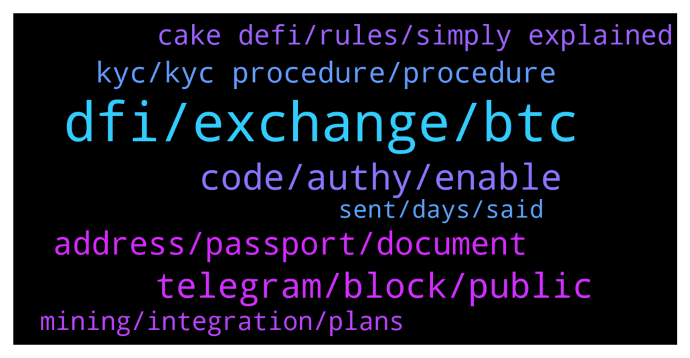

# **@CakeDeFi_EN**
 ## Analysis for **2022-01-18** - **2022-01-19**.

---

## 📊 **Basic Stats**

**n_messages_sent**: 185

---

---

## 🔝 **Top keywords and related messages**

1. **dfi, exchange, btc**

    @zachgax --- *Those fees are negligible I feel in terms of swapping between different coins. Since there are many factors involved. The exchange you’re on, the fees they charge, and ultimate the price difference between the coin and dfi when you perform the swap.* **--->** [TG Discussion](https://t.me/CakeDeFi_EN/166382)

    @UGilgamesh --- *Hi everyone! I'm wondering - having some tricky things to do to charge my Cryptopay card with some of my earned DFI (indeed, I have to swap DFI to dLTC in the light wallet, send dLTC to cake defi and then send LTC to my Cryptopay account and charge the card) - whether it is planned by Cake DeFi to provide some day a virtual card or something similar to pay directly from my Cake account.  Is that even a thing or I'm just dreaming about it?* **--->** [TG Discussion](https://t.me/CakeDeFi_EN/166349)

    @YSL --- *Is there a way to auto freeze the rewards from the freezer ?* **--->** [TG Discussion](https://t.me/CakeDeFi_EN/166384)

    @ExPwr --- *So LTC will be better than BTC in terms of the fees?* **--->** [TG Discussion](https://t.me/CakeDeFi_EN/166376)

    @zachgax --- *You can auto-stake, but it doesn’t auto freeze. And I think that’s a better system. Because Freezing cannot be undone, so it’s better if you manually authorise it.   What I do is freeze in batches so that my freezer isn’t littered with very small amounts. So I let my rewards add up to a certain amount of DFI, then I freeze it.* **--->** [TG Discussion](https://t.me/CakeDeFi_EN/166392)

    @YSL --- *Just computed the compounding effect to auto freeze the rewards for another 10 years is huge .. I do hope cakedefi able to have this features to allow users to have option to auto freeze the rewards too .* **--->** [TG Discussion](https://t.me/CakeDeFi_EN/166390)

2. **code, authy, enable**

    @springle0514 --- *This is what it’s giving me when I tired to log in. I never got an email.* **--->** [TG Discussion](https://t.me/CakeDeFi_EN/165783)

    @Neil --- *This is where it gets tricky, I can't log in because it wants an authy code.* **--->** [TG Discussion](https://t.me/CakeDeFi_EN/165887)

    @Neil --- *I did have it enabled but authy has forgotten that I had a cake account. So cake isn't recognising the code I generate* **--->** [TG Discussion](https://t.me/CakeDeFi_EN/165885)

    @Neil --- *Thanks, im not looking to disable it but when I updated authy it seems to.have lost cake as an account. So not sure how to re add without a qr code* **--->** [TG Discussion](https://t.me/CakeDeFi_EN/165882)

    @Cryptoziano --- *Is the platform down right now? I cannot log in.* **--->** [TG Discussion](https://t.me/CakeDeFi_EN/165718)

    @springle0514 --- *Hi guys i am trying to remove my 2FA on my account and I still haven’t heard back from Cake Defi support* **--->** [TG Discussion](https://t.me/CakeDeFi_EN/166215)

3. **telegram, block, public**

    @Hahs --- *I already saw four message from admins* **--->** [TG Discussion](https://t.me/CakeDeFi_EN/165842)

    @DmgBautista --- *Also, tale care with scammers, as this is a public chat. No mod will DM or call you directly, as well as there is also not support in telegram, so also block and report any fictional support that might DM or call you. Only the Cake official channels are the way to go. Stay safe! 👍* **--->** [TG Discussion](https://t.me/CakeDeFi_EN/165791)

    @Serenity --- *there's a scammer who has joined this channel, beware.* **--->** [TG Discussion](https://t.me/CakeDeFi_EN/166049)

    @Roxxiej --- *I have and they gave me the option to use telegram* **--->** [TG Discussion](https://t.me/CakeDeFi_EN/166098)

    @springle0514 --- *Thanks man. I sent a message. I’ve already received 5 admins messages lol* **--->** [TG Discussion](https://t.me/CakeDeFi_EN/165792)

    @Serenity --- *to whom can i report it? She goes by the name Merit. Got a screenshot of her profile.* **--->** [TG Discussion](https://t.me/CakeDeFi_EN/166051)

4. **address, passport, document**

    @Roxxiej --- *Ok thank you, im battling with my proof of address on my bank statement my physical address is on there and defi keeps rejecting it* **--->** [TG Discussion](https://t.me/CakeDeFi_EN/166092)

    @baskuy --- *I  am si many difficulties to do the vérification of my account.* **--->** [TG Discussion](https://t.me/CakeDeFi_EN/166236)

    @krcnugr --- *Is my address paper accepted for government-approved account verification? color black white* **--->** [TG Discussion](https://t.me/CakeDeFi_EN/166156)

    @kisundamotekar --- *I cant verify my identity, cause I only have National Identity Card not Passport* **--->** [TG Discussion](https://t.me/CakeDeFi_EN/165956)

    @gottagrabthere --- *From uk how can I use my driving license to do my verification as don’t own a passport.* **--->** [TG Discussion](https://t.me/CakeDeFi_EN/166463)

    @gottagrabthere --- *If there could be a way of making it possible to verify our identity through driving license that would be high un demand for surely ?* **--->** [TG Discussion](https://t.me/CakeDeFi_EN/166465)

5. **kyc, kyc procedure, procedure**

    @Roxxiej --- *I have a shawn that is helping me is that wrong* **--->** [TG Discussion](https://t.me/CakeDeFi_EN/166103)

    @springle0514 --- *Hello I just signed up for cake And I submitted all my documents for KYC and then the next day I got a message saying that I was banned for violating the terms and conditions. Is there an admin here who can help me with this and tell me exactly what I did to violate the terms?  Thanks* **--->** [TG Discussion](https://t.me/CakeDeFi_EN/165777)

    @DmgBautista --- *Your adress is private information! We do not do KYC procedure here and do not contact with the responsible ones for it. Please do not share nothing like that here and anywere.   We can only try to guide you the best we can, and that has been done. The information provided to you by support was clear, you need to match the adress in your proof of adress document with the one you provided on sign-in.   We are not going to review your documents here.  If you believe KYC procedure is not being correctly adressed, you can submit a question with regards to it to the below support contact and they can review it I believe. But for sure not here.  https://cake.zendesk.com/hc/en-us/requests/new* **--->** [TG Discussion](https://t.me/CakeDeFi_EN/166139)

    @jezzkng --- *For banned account, it's subject to our kyc team's decision by referencing the local law. sorry we prob might not be able to help.* **--->** [TG Discussion](https://t.me/CakeDeFi_EN/165785)

    @umutalemdar --- *I am doing kyc verification but it says network error* **--->** [TG Discussion](https://t.me/CakeDeFi_EN/166404)

    @BerndMack --- *!KYC The reason should be in the mail. 📧 Often there are different spellings of the address or the name.* **--->** [TG Discussion](https://t.me/CakeDeFi_EN/166306)

6. **cake defi, rules, simply explained**

    @Michael_Schredl --- *CAKE DeFi – Countries NOT available https://support.cakedefi.com/hc/en-us/articles/360040335072-Which-countries-are-currently-not-able-to-use-the-Cake-Services-* **--->** [TG Discussion](https://t.me/CakeDeFi_EN/166289)

    @DmgBautista --- *That is allowed, under my best knowledge. I guess you will need to contact Cake support and expose your situation, to try and understand what might have happened. You can find the link below  https://cake.zendesk.com/hc/en-us/requests/new* **--->** [TG Discussion](https://t.me/CakeDeFi_EN/165790)

    @Michael_Schredl --- *Start your DeFi Journey Here: Cake  DeFi Services Simply Explained https://support.cakedefi.com/hc/en-us/articles/900003427506-Cake-Service-simply-explained* **--->** [TG Discussion](https://t.me/CakeDeFi_EN/166006)

    @Kassius84 --- *Start your DeFi Journey Here: Cake  DeFi Services Simply Explained https://support.cakedefi.com/hc/en-us/articles/900003427506-Cake-Service-simply-explained* **--->** [TG Discussion](https://t.me/CakeDeFi_EN/165729)

    @Michael_Schredl --- *I don't think so, Cake is following the law of singapore* **--->** [TG Discussion](https://t.me/CakeDeFi_EN/166466)

    @DmgBautista --- *Maybe in the future who knows, but for now, not existent. Cake is faithfull to its moto for the users of providing cashflow, so the rewards are liquid and readily available for you* **--->** [TG Discussion](https://t.me/CakeDeFi_EN/166388)

7. **mining, integration, plans**

    @J --- *Are there any plans of adding the mining of more coins like Solana, XRP, Luna, DOT, etc?* **--->** [TG Discussion](https://t.me/CakeDeFi_EN/165688)

    @Sean --- *Is Cake going to support API tax software integration soon cause they are my only problem this year* **--->** [TG Discussion](https://t.me/CakeDeFi_EN/166169)

    @Ebusco02 (lagos) --- *Can someone teach me how the liquidity mining works* **--->** [TG Discussion](https://t.me/CakeDeFi_EN/166005)

    @efresh357 --- *hello i am new here. can anyone point me to a guide on how the mining and stake process work?* **--->** [TG Discussion](https://t.me/CakeDeFi_EN/165726)

    @DmgBautista --- *Hi! Currently, there are no such plans* **--->** [TG Discussion](https://t.me/CakeDeFi_EN/166350)

    @Felix B. --- *I'll start my tax report end of January. It will be fun 🤣* **--->** [TG Discussion](https://t.me/CakeDeFi_EN/166178)

