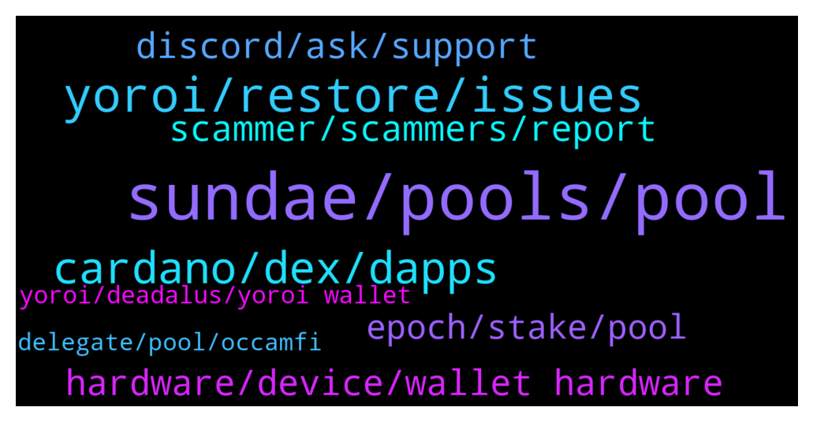

# **@Cardano**
 ## Analysis for **2022-01-18** - **2022-01-19**.

---

## 📊 **Basic Stats**

**n_messages_sent**: 418

---

---

## 🔝 **Top keywords and related messages**

1. **sundae, pools, pool**

    @Sailesh --- *hi is it too late to changes taking  pools to get Sundae tokens?* **--->** [TG Discussion](https://t.me/Cardano/771806)

    @dstrategies --- *sundaswap has not launched yet (on the main net)* **--->** [TG Discussion](https://t.me/Cardano/772298)

    @Sailesh --- *I was looking at ticker BCSH1 which is in red yet has ony 13% saturation* **--->** [TG Discussion](https://t.me/Cardano/772076)

    @mostudio --- *any of the scooper pools are good, just make sure the one you are joining is not over saturated* **--->** [TG Discussion](https://t.me/Cardano/771454)

    @Tustyrusty --- *Thx, I can't find any info on why one may be eliminated/retired. I'm in a good pool which is near top of subs so am reluctant to re-stake* **--->** [TG Discussion](https://t.me/Cardano/771760)

    @Tustyrusty --- *I guess I'll just re-stake but it's a bit pin with a blindfold!* **--->** [TG Discussion](https://t.me/Cardano/771765)

2. **yoroi, restore, issues**

    @glitch04 --- *Check the wallet using a third party explorer like Cardanoscan.io that will tell you where the wallet is delegated Yoroi is having syncing issues and has not been accurate you may need to try another wallet alternative like ccvault.io adalite.io or tyhponwallet.io* **--->** [TG Discussion](https://t.me/Cardano/771134)

    @glitch04 --- *Yoroi is having syncing issues with their backend servers so it would be an extended wait* **--->** [TG Discussion](https://t.me/Cardano/771135)

    @pool0AAAA --- *Yes, problem with Yoroi, you are not alone. :)* **--->** [TG Discussion](https://t.me/Cardano/770838)

    @cutyflame --- *hello guys, i cant restore my yoroi wallet on chrome, but i can restore it on yoroi android. is there something wrong with the chrome extension version?* **--->** [TG Discussion](https://t.me/Cardano/772020)

    @Shark1alfa --- *Hi. Brave says "yoroi is dissabled". How can i fix it?* **--->** [TG Discussion](https://t.me/Cardano/771021)

    @cutyflame --- *i can even restore it on ccvault extension. but why cant restore on yoroi extension.  pls help. thanks man* **--->** [TG Discussion](https://t.me/Cardano/772021)

3. **cardano, dex, dapps**

    @ExInfernis --- *Does anyone know why most of the dapps on cardano are not supporting official wallets like yoroi/daedalus? For example sundae swap is supporting nami and ccvault. I dont see any good reason for this is as a lot of people are using the official wallets for safety.* **--->** [TG Discussion](https://t.me/Cardano/770948)

    @colombos1991 --- *I think is more trusted to use cardano wallet that was made by cardano and not other company..* **--->** [TG Discussion](https://t.me/Cardano/771283)

    @colombos1991 --- *Last question:) So the only wallet that cardano team itself was made is deadalus?* **--->** [TG Discussion](https://t.me/Cardano/771281)

    @pieroltt --- *Hey guys, have any wallet for android to begin invest in the dapps build on cardano??? Only pc available for now?* **--->** [TG Discussion](https://t.me/Cardano/772143)

    @apex_pool_spo --- *I hope they will have a good launch, it will be good for Cardano.* **--->** [TG Discussion](https://t.me/Cardano/772102)

    @BabyImReckless --- *does anyone know if there is a wallet that lets you stake bep20 Cardano?  for standard Cardano?* **--->** [TG Discussion](https://t.me/Cardano/771207)

4. **hardware, device, wallet hardware**

    @glitch04 --- *You would need to create a wallet with the device and transfer everything over to that new hardware secured wallet* **--->** [TG Discussion](https://t.me/Cardano/771819)

    @glitch04 --- *they use less resources but the risk is you losing a little bit of the security unless you have the wallet hardware secured* **--->** [TG Discussion](https://t.me/Cardano/771269)

    @colombos1991 --- *So you can say that to use hardware wallet with Adalite os better than to use deadalus without hardware wallet?* **--->** [TG Discussion](https://t.me/Cardano/771277)

    @glitch04 --- *Depends on if you have resources to run the full wallet or not* **--->** [TG Discussion](https://t.me/Cardano/771253)

    @colombos1991 --- *So it doesn’t matter if you use also hardwallet too with adalite* **--->** [TG Discussion](https://t.me/Cardano/771271)

    @colombos1991 --- *What you mean is light version? Is less safe?* **--->** [TG Discussion](https://t.me/Cardano/771266)

5. **discord, ask, support**

    @andre426hemi --- *They're told me to ask here. You told me to ask there. 😂* **--->** [TG Discussion](https://t.me/Cardano/771932)

    @glitch04 --- *Best to ask that in their channel at the link above* **--->** [TG Discussion](https://t.me/Cardano/771328)

    @glitch04 --- *That would be best answered by their support channel* **--->** [TG Discussion](https://t.me/Cardano/771929)

    @glitch04 --- *That makes no sense they are the ones behind the project it's up to them when they launch it* **--->** [TG Discussion](https://t.me/Cardano/771936)

    @glitch04 --- *Several have reported issues they have issued multiple fixes to address the issue but some are still reporting localized outages* **--->** [TG Discussion](https://t.me/Cardano/771903)

    @glitch04 --- *https://sundaeswap.finance/   Visit their site or their support discord listed above* **--->** [TG Discussion](https://t.me/Cardano/772226)

6. **scammer, scammers, report**

    @yogidan --- *me too. this is scam right? https://sundaeswap.finance/posts/wen-sundae* **--->** [TG Discussion](https://t.me/Cardano/772189)

    @glitch04 --- *dm me and I can take a look anyone that dm's you first is a scammer* **--->** [TG Discussion](https://t.me/Cardano/771145)

    @CryptoKnight999 --- *Hello All, Is there anyone I can DM regarding business proposal?* **--->** [TG Discussion](https://t.me/Cardano/772115)

    @avishai4791 --- *Some stupid guy with your name Fabian called me  Stipid scam* **--->** [TG Discussion](https://t.me/Cardano/771685)

    @Bernard --- *Off to DMOR.  Thanks again.  Best wishes to all.* **--->** [TG Discussion](https://t.me/Cardano/771981)

    @santiloopz --- *Yes and ignore private messages. All scammers.* **--->** [TG Discussion](https://t.me/Cardano/770884)

7. **epoch, stake, pool**

    @apex_pool_spo --- *when you delegate to another stake pool, the current epoch and the next epoch you still delegate to the old stake pool, the epoch after that you delegate to the new stake pool.* **--->** [TG Discussion](https://t.me/Cardano/771554)

    @glitch04 --- *you have until the 25th so no if you move before the epoch, any further help you will need to ask in their support channel* **--->** [TG Discussion](https://t.me/Cardano/771809)

    @apex_pool_spo --- *you won't need, nothing will happen in 5 epochs (25 days).* **--->** [TG Discussion](https://t.me/Cardano/771766)

    @peeved82 --- *This current epoch ends on Jan 20, the next epoch ends on Jan 25.  How do I change Delegators between epochs?* **--->** [TG Discussion](https://t.me/Cardano/771731)

    @CryptoM22 --- *is also confusing because after 20 days the first reward is paid, and in my case I have to switch pools.  but indeed at the time of the transaction you stake in the new pool.* **--->** [TG Discussion](https://t.me/Cardano/771615)

    @apex_pool_spo --- *you can change the stake pool anytime, but the change will be active at the epoch transition.* **--->** [TG Discussion](https://t.me/Cardano/771732)

8. **yoroi, deadalus, yoroi wallet**

    @cryptoshaun --- *Hello I’m in a pool for sundeaswap tokens but I use yoroi wallet does that mean I won’t get them* **--->** [TG Discussion](https://t.me/Cardano/771373)

    @WhoisKaymind --- *sundaeswap wont connect my ccvault from yoroi? anyone knows? thnx* **--->** [TG Discussion](https://t.me/Cardano/771023)

    @Zyroxa --- *theres no contracts to add as they are native tokens 😊* **--->** [TG Discussion](https://t.me/Cardano/771683)

    @avishai4791 --- *Do we need to add the contract to Deadalus or they will just appear there??* **--->** [TG Discussion](https://t.me/Cardano/771682)

    @glitch04 --- *They show up in the "tokens" drop down* **--->** [TG Discussion](https://t.me/Cardano/771797)

    @cryptoshaun --- *@Zyroxa Hello I’m in a pool for sundeaswap tokens but I use yoroi wallet does that mean I won’t get them* **--->** [TG Discussion](https://t.me/Cardano/771376)

