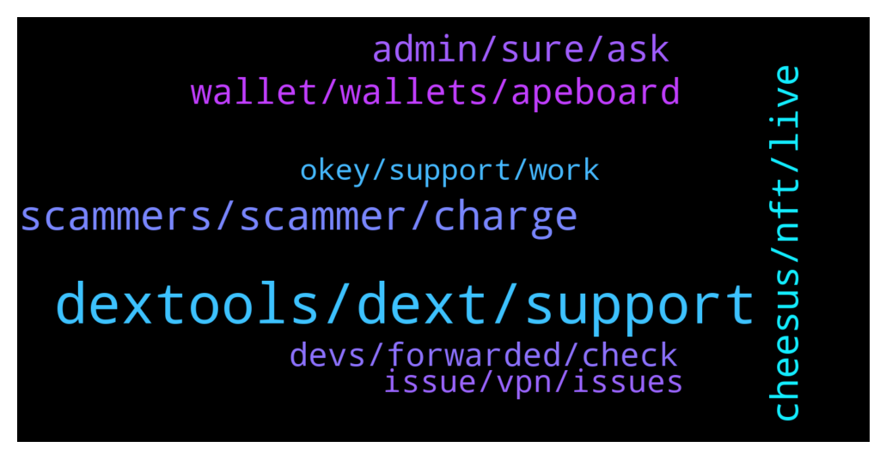

# **@DEXToolsCommunity**
 ## Analysis for **2022-01-17** - **2022-01-19**.

---

## 📊 **Basic Stats**

**n_messages_sent**: 368

---

---

## 🔝 **Top keywords and related messages**

1. **dextools, dext, support**

    @Natalia_Ave --- *To be honest DEXtools was one of things for my personal inspiration, especially your UI. There so many sources of info, things in one place and they don't seem like mess, but matches perfectly!   Future of DeFi is very hard to predict, but I believe that step by step DeFi will enter our daily routine in different ways!  done* **--->** [TG Discussion](https://t.me/DEXToolsCommunity/326110)

    @hmk18990 --- *this is dextools support guys so better to talk in https://t.me/DEXTtraderslounge for your other needs @GrowSilent* **--->** [TG Discussion](https://t.me/DEXToolsCommunity/326913)

    @hmk18990 --- *this is dextools support for other talks you can use https://t.me/DEXTtraderslounge* **--->** [TG Discussion](https://t.me/DEXToolsCommunity/326586)

    @xbtwael --- *Thanks for all the time you gave us today!!!! I have 2 questions to wrap all this up. What do you think about DEXTools? And the future of DeFi?* **--->** [TG Discussion](https://t.me/DEXToolsCommunity/326107)

    @Kris --- *Those listing on Dext, too many are rug pull. Would be good if you can come up with some system to minimize it. Please !!!!!!!* **--->** [TG Discussion](https://t.me/DEXToolsCommunity/325418)

    @Luis_Diiaz --- *Do you have to pay to be published in the dextool bot channel?* **--->** [TG Discussion](https://t.me/DEXToolsCommunity/325785)

2. **scammers, scammer, charge**

    @hmk18990 --- *For the news, advertisements, sponsorships please DM @guillermorodriguez78 he's the only in charge (and he'll never DM you first)* **--->** [TG Discussion](https://t.me/DEXToolsCommunity/326896)

    @stanes --- *Please DM @guillermorodriguez78 he is the person-in-charge.  Be aware of scammers, HE WILL NEVER DM YOU FIRST.* **--->** [TG Discussion](https://t.me/DEXToolsCommunity/325532)

    @jointhefuture4_0 --- *ah no, its a scammer indeed, with your username in his bio* **--->** [TG Discussion](https://t.me/DEXToolsCommunity/326683)

    @resn0ta --- *I already sent one scam guy dirty picture for asking me about promo...* **--->** [TG Discussion](https://t.me/DEXToolsCommunity/326906)

    @Olliver --- *just a quick question doe sthe community support dm me first or is it a scamemr who contacted me?* **--->** [TG Discussion](https://t.me/DEXToolsCommunity/325639)

    @Gaex99 --- *Last question mate , regarding the " livepair sponsor" how do the people  get it?* **--->** [TG Discussion](https://t.me/DEXToolsCommunity/325531)

3. **cheesus, nft, live**

    @xbtwael --- *I saw Cheesus launched  https://cheesus.ai/en/main can you share what that is?* **--->** [TG Discussion](https://t.me/DEXToolsCommunity/326058)

    @Natalia_Ave --- *Cheesus provides pure data and objective metrics to give you onchain truth, but we don't give you any financial advices or fully ensure security of any project  So metrics for every project includes: - project profit and loss  - different types of holders e.g. traders, who bring life by selling and buying tokens, holders, who just hold tokens, do nothing with them, freeloaders who receive tokens by airdrop or any free distribution. Moreover we can track bots and fake wallets who pump prices and increase trading volume.  These data show how active the project are and you can conclude whether the project is worth investing in.  done* **--->** [TG Discussion](https://t.me/DEXToolsCommunity/326087)

    @xbtwael --- *After the succesful fundraise, a common challenge for DeFi protocols seem to be adoption. What are some of the plans to stimulate adoption and build out the ecosystem around Cheesus?* **--->** [TG Discussion](https://t.me/DEXToolsCommunity/326098)

    @xbtwael --- *Can you explain what Cheesus is? and what you guys are hoping to achieve?* **--->** [TG Discussion](https://t.me/DEXToolsCommunity/326054)

    @xbtwael --- *I saw the ILO is currently live right now! Can you share where people can get involved with the Cheesus IDO?* **--->** [TG Discussion](https://t.me/DEXToolsCommunity/326090)

    @xbtwael --- *As you mentioned some features are live for public now, when does Cheesus plan to fully launch? Any date in mind?* **--->** [TG Discussion](https://t.me/DEXToolsCommunity/326071)

4. **admin, sure, ask**

    @DiamondHandDaniel --- *You have read my DMs @pablojan but have given me no response  It's been weeks, please be professional and help us get this done* **--->** [TG Discussion](https://t.me/DEXToolsCommunity/325903)

    @hmk18990 --- *as I said before. he's the only one. so no other admin can help you about this.* **--->** [TG Discussion](https://t.me/DEXToolsCommunity/326905)

    @napascual --- *Sure, just remember admins never dm first* **--->** [TG Discussion](https://t.me/DEXToolsCommunity/326413)

    @Ford_Probe1 --- *Hi can i dm you regarding a question?* **--->** [TG Discussion](https://t.me/DEXToolsCommunity/326410)

    @stanes --- *Sure, you can ask here or DM me but no admin will DM you first.* **--->** [TG Discussion](https://t.me/DEXToolsCommunity/326925)

    @INF_king --- *Just mention them and I'll DM* **--->** [TG Discussion](https://t.me/DEXToolsCommunity/325764)

5. **wallet, wallets, apeboard**

    @Olliver --- *Thank you for anwsering, dont know what roc is so i have not haha, is it another wallet or whats rpc?* **--->** [TG Discussion](https://t.me/DEXToolsCommunity/325641)

    @dougkey --- *hello how do we add multiple wallets? to standard subscription. been doing one wallet, but cant tell how to add multiple* **--->** [TG Discussion](https://t.me/DEXToolsCommunity/325393)

    @stanes --- *Apeboard let you have a look at all the holdings on all the chains for a specific wallet. It's complementary to Dextools.* **--->** [TG Discussion](https://t.me/DEXToolsCommunity/325415)

    @dougkey --- *hi - thanks, yes i have subscription (1000dext).  It says 'multiple wallets' where you add your wallet and 'up to 500 wallets'  there is a link to Apeboard.  do you do it on Apeboard?    so like, when I connect to dext, I want it to show / pull other wallets (without conneting each wallet separately)* **--->** [TG Discussion](https://t.me/DEXToolsCommunity/325410)

    @bastardganpunk --- *You can connect other wallets too, or what do you mean?* **--->** [TG Discussion](https://t.me/DEXToolsCommunity/325880)

    @stanes --- *You can track all the wallets you want by adding them on "wallet info". But no way to see your positions directly in the charts for the moment.* **--->** [TG Discussion](https://t.me/DEXToolsCommunity/325397)

6. **devs, forwarded, check**

    @FredericDEXT --- *Ok, thanks for confirming ,it's already reported to the devs* **--->** [TG Discussion](https://t.me/DEXToolsCommunity/326562)

    @FredericDEXT --- *We will check, but it should be the same* **--->** [TG Discussion](https://t.me/DEXToolsCommunity/326560)

    @FredericDEXT --- *@napascual is our lead dev, he can check.* **--->** [TG Discussion](https://t.me/DEXToolsCommunity/325763)

    @FredericDEXT --- *It's already reported to the devs* **--->** [TG Discussion](https://t.me/DEXToolsCommunity/325760)

    @FredericDEXT --- *We will check asap. Thanks for reporting* **--->** [TG Discussion](https://t.me/DEXToolsCommunity/325758)

    @JoeyDieleman --- *Hmm.. will forward it to the devs* **--->** [TG Discussion](https://t.me/DEXToolsCommunity/326484)

7. **issue, vpn, issues**

    @rpoole69 --- *Having same issue, no vpn, intermittent* **--->** [TG Discussion](https://t.me/DEXToolsCommunity/326483)

    @matt_000110 --- *It is annoying. I think they gave up w me* **--->** [TG Discussion](https://t.me/DEXToolsCommunity/326241)

    @gumbercules --- *Have you tried a different RPC? Are you on the ethereum network? If neither works then it's probably a honeypot contract. Also check if you have enough gas to cover the tx* **--->** [TG Discussion](https://t.me/DEXToolsCommunity/325638)

    @Monolithof --- *Ok the issue has been solved. Im back to standard account again* **--->** [TG Discussion](https://t.me/DEXToolsCommunity/325826)

    @hmk18990 --- *yup and this is another issue just arrived :) if anyone using US VPNs with CF DNS or CF Warp in the US probably will have issues.* **--->** [TG Discussion](https://t.me/DEXToolsCommunity/326499)

    @trojantechltd --- *But always works with a vpn* **--->** [TG Discussion](https://t.me/DEXToolsCommunity/326482)

