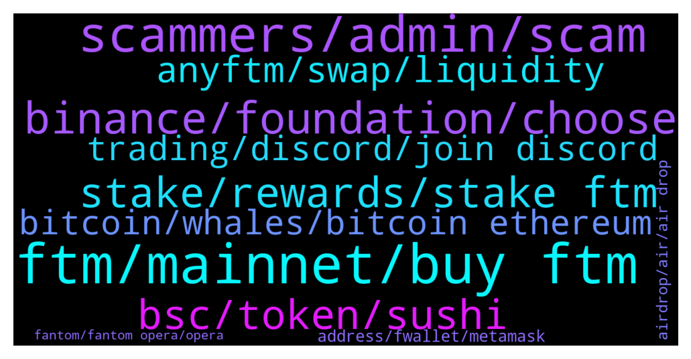

# **@Fantom_English**
 ## Analysis for **2022-01-18** - **2022-01-19**.

---

## 📊 **Basic Stats**

**n_messages_sent**: 459

---

---

## 🔝 **Top keywords and related messages**

1. **ftm, mainnet, buy ftm**

    @Darth_Tr4der --- *hey bros u think ftm can stay above 2.80?* **--->** [TG Discussion](https://t.me/Fantom_English/634537)

    @exten_vision --- *Why is FTM falling and will there be growth again?* **--->** [TG Discussion](https://t.me/Fantom_English/634352)

    @SendPie --- *Admin, how to bridge ftm over* **--->** [TG Discussion](https://t.me/Fantom_English/635069)

    @Andre --- *I just purchased 75 FTM today🏃🏽‍♂️🔥🔥🔥💯* **--->** [TG Discussion](https://t.me/Fantom_English/634218)

    @pajamasfreak --- *Ftmscan or bsc scan for sure* **--->** [TG Discussion](https://t.me/Fantom_English/635775)

    @ZeZingh --- *guys does anyone know how do i pay with ftm on shopping . io* **--->** [TG Discussion](https://t.me/Fantom_English/635592)

2. **scammers, admin, scam**

    @Tanglang1989 --- *HAHAAH 6 scammers already contacted me. Man, TG is such a mess* **--->** [TG Discussion](https://t.me/Fantom_English/635774)

    @alishaik123 --- *Admin, plz confirm if you have any other official group apart from this. Lot of scammers are trying to create groups and working hard to make them look legit* **--->** [TG Discussion](https://t.me/Fantom_English/634984)

    @ricky787 --- *Scammers are relentless I just joined this chat and I have scammer already asking for my wallet address lol* **--->** [TG Discussion](https://t.me/Fantom_English/635548)

    @alishaik123 --- *Guys, there is a scam going on. Scammers calim to be from FTM Admin team and ask you to send 5 BNB coins in exchange for 5000 FTM coins as some giveaway is going on. Don't fall for such traps* **--->** [TG Discussion](https://t.me/Fantom_English/634990)

    @alishaik123 --- *Scammers are claiming to send you 5000 FTM coins for 5 BNB coins. They are calling it a Airdrop.* **--->** [TG Discussion](https://t.me/Fantom_English/635617)

    @VM --- *So i posted that my coins are just on binance and there are plenty of msgs i received. Is it a scam?* **--->** [TG Discussion](https://t.me/Fantom_English/634527)

3. **binance, foundation, choose**

    @Solmoon90 --- *Im buying ftm with visa on binance. Will I be able to swap it to foundation?* **--->** [TG Discussion](https://t.me/Fantom_English/634299)

    @Mcjig --- *binance non us is best place right now* **--->** [TG Discussion](https://t.me/Fantom_English/634418)

    @PastorLasim --- *But I can locate it on binance* **--->** [TG Discussion](https://t.me/Fantom_English/634419)

    @Drokzid --- *how can i get my SPELL and CRV from Binance to my FTM wallet?* **--->** [TG Discussion](https://t.me/Fantom_English/636023)

    @pajamasfreak --- *You should be able to choose that during checkout* **--->** [TG Discussion](https://t.me/Fantom_English/635596)

    @pajamasfreak --- *Should ask quartz team, I am not too familiar with theirs.* **--->** [TG Discussion](https://t.me/Fantom_English/634790)

4. **stake, rewards, stake ftm**

    @jonnytot --- *What’s the easiest/ best protocol to stake or farm ? I’m looking at tomb or spooky swap..  been holding ftm for a long long time but now want to get my hands dirty . TIA* **--->** [TG Discussion](https://t.me/Fantom_English/634795)

    @Ts --- *where can i stake my ftm* **--->** [TG Discussion](https://t.me/Fantom_English/634772)

    @First --- *Is there a borrow farm? like stake BTC, borrow other coins* **--->** [TG Discussion](https://t.me/Fantom_English/634693)

    @Jannik_M --- *I also did not change anything since delegating a month ago* **--->** [TG Discussion](https://t.me/Fantom_English/635985)

    @KunalBhatia --- *Hi Team,  Good evening... i have a question... where can we stake FTM for a nice APY ?* **--->** [TG Discussion](https://t.me/Fantom_English/635200)

    @okdecoin --- *Hello, where can I stake ftm?* **--->** [TG Discussion](https://t.me/Fantom_English/635705)

5. **bsc, token, sushi**

    @Mell0w_633 --- *I don't understand how does it work, looks like I can't buy ERC20 tokens on sushi swap, while I'm using FTM network. I thought that might be I could buy some ERC20 tokens on sushi swap on FTM network with lower fees, tokens like QRDO, QUARTZ, Merit Circle etc... But looks like it doesn't work that way* **--->** [TG Discussion](https://t.me/Fantom_English/634798)

    @Tanglang1989 --- *I've swapped ages ago BNB to fantom, but I can't find that swap in either BSC scan nor Fantom Scan. What should I do? I need all the info for my taxes. Thank you.* **--->** [TG Discussion](https://t.me/Fantom_English/635756)

    @Janevietani --- *BUSD on BSC ? swap BUSD for BNB then bridge your BNB BEP2 to BNB Fantom using spookyswap bridge* **--->** [TG Discussion](https://t.me/Fantom_English/635663)

    @nimus06 --- *hello do you know if there is a bridge from BSC to Opera ? wanted to bridge USDT and Link but seems it's not possible 🤷🏽‍♂️* **--->** [TG Discussion](https://t.me/Fantom_English/634764)

    @pajamasfreak --- *Of course you can’t. erc20 tokens are on eth network.* **--->** [TG Discussion](https://t.me/Fantom_English/634799)

    @Jesus --- *any help please? i cant see the FTM tokens that i have in my metamask in the bsc* **--->** [TG Discussion](https://t.me/Fantom_English/634381)

6. **anyftm, swap, liquidity**

    @ryoshi_155 --- *help i still have ftm stuck in anyswap bridge* **--->** [TG Discussion](https://t.me/Fantom_English/634731)

    @pajamasfreak --- *you might get anyFTM. when there is no liquidity, bridge you will give you anyFTM , you can wait until there is liquidity so you can swap anyFTM to FTM or if you dont wanna wait liquidity, you can bridge it back to erc20 FTM  check it on https://app.multichain.org/#/pool go to Pool -> FTM -> Remove -> anyFTM to FTM ( which one network that have liquidity )* **--->** [TG Discussion](https://t.me/Fantom_English/634742)

    @Ayzx2000 --- *Spookyswap bridge not working either says destination chain had insufficient liquidity to bridge for 100 FTM* **--->** [TG Discussion](https://t.me/Fantom_English/634439)

    @Christel --- *I try Spooky swap Bridge but it tells me I have not sufficient funds FTM !* **--->** [TG Discussion](https://t.me/Fantom_English/634829)

    @Serge --- *in anyswap.net I see my FTM went to…(not show where when you do swap)* **--->** [TG Discussion](https://t.me/Fantom_English/635206)

    @Serge --- *Admin I did swap 4 days ago and still now I don’t see my FTM in my MetaMask wallet???* **--->** [TG Discussion](https://t.me/Fantom_English/635032)

7. **trading, discord, join discord**

    @aceanderson1906 --- *I’ll get you back as well!* **--->** [TG Discussion](https://t.me/Fantom_English/634498)

    @Ts --- *i was in ALICE and QTUM trading group aswell* **--->** [TG Discussion](https://t.me/Fantom_English/634625)

    @Mcjig --- *here, and you can talk in discord* **--->** [TG Discussion](https://t.me/Fantom_English/634588)

    @yododo --- *Talk to the bot and send it to your meta* **--->** [TG Discussion](https://t.me/Fantom_English/634495)

    @Johnnyfantom --- *Take steps? Check the chat, everyday we make posts* **--->** [TG Discussion](https://t.me/Fantom_English/635018)

    @AhmedB4233024 --- *Does someone can help me ? Can not join the discord channel. After "verify" nothing happens* **--->** [TG Discussion](https://t.me/Fantom_English/634297)

8. **bitcoin, whales, bitcoin ethereum**

    @zenkert --- *As there are no whales in other coins and tokens 🙈 Stupidity post.* **--->** [TG Discussion](https://t.me/Fantom_English/634191)

    @Nemos13 --- *Just wait.. Big hedge fund and institution money will leave Bitcoin and ethereum because of interest rate and inflation.. handful of whales is holding Bitcoin and ethereum..* **--->** [TG Discussion](https://t.me/Fantom_English/634188)

    @Khurram --- *🇵🇰 GOVT INTENDS TO REGULARIZE CRYPTOCURRENCY IN PAKISTAN: SHIBLI FARAZ (Federal Minister)* **--->** [TG Discussion](https://t.me/Fantom_English/636041)

    @I_am_FTM_Degen --- *Nothing. All are just shilling like degen* **--->** [TG Discussion](https://t.me/Fantom_English/634622)

    @polv89 --- *No doubts on the operation, I just wish I had someone else's opinion* **--->** [TG Discussion](https://t.me/Fantom_English/636093)

    @Russell --- *is there any tg communities for noobs trying to learn more about crypto* **--->** [TG Discussion](https://t.me/Fantom_English/634580)

9. **address, fwallet, metamask**

    @Janevietani --- *can you check your rpc setting ?* **--->** [TG Discussion](https://t.me/Fantom_English/635977)

    @Janevietani --- *Try disconnect metamask with fwallet then remove those address  from fwallet after then re connect  metamask to fwallet* **--->** [TG Discussion](https://t.me/Fantom_English/635995)

    @kwpoq --- *Nope, just blank page... Same on internet explorer, I'm checking tor now* **--->** [TG Discussion](https://t.me/Fantom_English/635829)

    @Serge --- *When I put my address MetaMask wallet anyswap.net show me nothing(Null)* **--->** [TG Discussion](https://t.me/Fantom_English/635209)

    @kwpoq --- *Is there something wrong with pwawallet? Page is completely blank 😳* **--->** [TG Discussion](https://t.me/Fantom_English/635820)

    @elbo64 --- *Is it your network settings on metamask ?* **--->** [TG Discussion](https://t.me/Fantom_English/635857)

10. **airdrop, air, air drop**

    @Johnnyfantom --- *Guys do a bit of research, read Andre's tweets etc, the airdrop is an NFT for the project, to be either used for voting or to sell. And please stop asking in this group* **--->** [TG Discussion](https://t.me/Fantom_English/635381)

    @Stahr --- *Hi everyone :) is there an up and coming airdrop for fantom holders?* **--->** [TG Discussion](https://t.me/Fantom_English/636111)

    @wkaplan --- *For the ftm airdrop (solid) - how do we get an allocation ?* **--->** [TG Discussion](https://t.me/Fantom_English/634860)

    @Felix --- *what exactly must one do to qualify for the Ve3,3 AirDrop* **--->** [TG Discussion](https://t.me/Fantom_English/635815)

    @zenkert --- *No airdrops ever, by the Fantom Foundation.* **--->** [TG Discussion](https://t.me/Fantom_English/636114)

    @Boldam1 --- *Is there any airdrop going on?* **--->** [TG Discussion](https://t.me/Fantom_English/635518)

