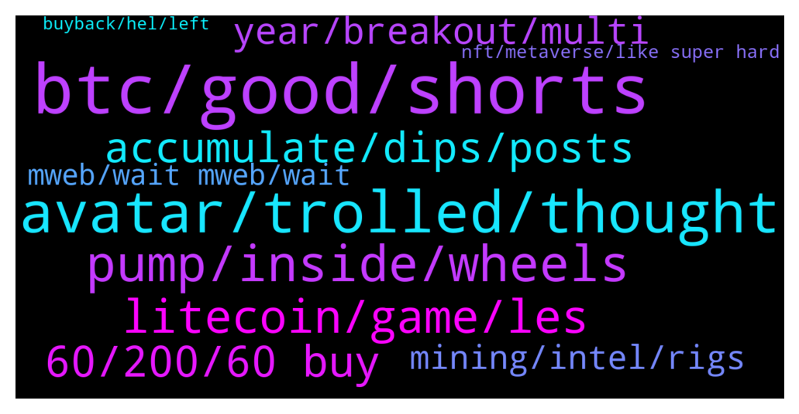

# **@Litecoin**
 ## Analysis for **2022-01-18** - **2022-01-19**.

---

## 📊 **Basic Stats**

**n_messages_sent**: 232

---

---

## 🔝 **Top keywords and related messages**

1. **btc, good, shorts**

    @K_arlso_n --- *LTC not have support from market... This is shit for MM and no more, LTC all short.* **--->** [TG Discussion](https://t.me/Litecoin/2049387)

    @Augusto --- *But im still waiting ltc reach 200 or more,* **--->** [TG Discussion](https://t.me/Litecoin/2048967)

    @Bigcfidolla --- *If you can't afford ltc spread try neo* **--->** [TG Discussion](https://t.me/Litecoin/2049027)

    @arnego2 --- *Top 1+   I think that LTC is best placed in ecommerce.* **--->** [TG Discussion](https://t.me/Litecoin/2049633)

    @RorschachTesst --- *The foundation should drop omni and go after metaverse providers and offer ltc as a in game currency. Microsoft is the next big player* **--->** [TG Discussion](https://t.me/Litecoin/2049631)

    @J --- *Check! How is your 0,1 ltc? Still hodling?* **--->** [TG Discussion](https://t.me/Litecoin/2049681)

2. **avatar, trolled, thought**

    @Gurpreet --- *I have been verified now what to do next* **--->** [TG Discussion](https://t.me/Litecoin/2049470)

    @jon_poole --- *You aren’t ranked has any admin why are you replying me?* **--->** [TG Discussion](https://t.me/Litecoin/2049498)

    @BennyBennyBlanco --- *@TonyNakamoto  You think if I carried this around, I get a lot of likes or hate 😂😂* **--->** [TG Discussion](https://t.me/Litecoin/2048980)

    @Congressional_Liason --- *I'll get a new one. Thanks.* **--->** [TG Discussion](https://t.me/Litecoin/2049413)

    @finitemaz --- *But please get an avatar per @termsconditions* **--->** [TG Discussion](https://t.me/Litecoin/2049408)

    @jon_poole --- *Don’t reply me you know nothing* **--->** [TG Discussion](https://t.me/Litecoin/2049492)

3. **pump, inside, wheels**

    @TonyNakamoto --- *R werk'd at a Walm0rt once and the bathroom was always a rek* **--->** [TG Discussion](https://t.me/Litecoin/2048883)

    @cloudlite15 --- *Hopefully the toilets won't be clogged up with mud like geysers* **--->** [TG Discussion](https://t.me/Litecoin/2048881)

    @cloudlite15 --- *They said theres going to be built in air purifieyers* **--->** [TG Discussion](https://t.me/Litecoin/2048868)

    @cloudlite15 --- *I may have to do some DIY and install one inside myself* **--->** [TG Discussion](https://t.me/Litecoin/2048878)

    @cloudlite15 --- *I can just park at the Walmart EV charging station and go inside the store for the toilets* **--->** [TG Discussion](https://t.me/Litecoin/2048879)

    @cloudlite15 --- *There's a built in air purifier so you won't mind my armpit and feet stench sir* **--->** [TG Discussion](https://t.me/Litecoin/2048891)

4. **litecoin, game, les**

    @syonfive --- *i have buy ed litecoin at ath 400usd and wait for 800usd* **--->** [TG Discussion](https://t.me/Litecoin/2049243)

    @Decentralized_Nomad --- *That's because Litecoin is an almost finished project. What do you want from Litecoin?* **--->** [TG Discussion](https://t.me/Litecoin/2048812)

    @adamozi --- *Being in crypto is not only about watching coins, it's also about participating in a community ... preferably in a positive way* **--->** [TG Discussion](https://t.me/Litecoin/2049274)

    @PPCFTW1 --- *why is litecoin such a POS* **--->** [TG Discussion](https://t.me/Litecoin/2049283)

    @BennyBennyBlanco --- *Litecoin is better than that guy* **--->** [TG Discussion](https://t.me/Litecoin/2048981)

    @cloudlite15 --- *Live there and wait for litecoin moon* **--->** [TG Discussion](https://t.me/Litecoin/2048888)

5. **60, 200, 60 buy**

    @RabbitL0v3r --- *Ser, I sold, makin m0rket panic, hence why price is low 😔😔😔* **--->** [TG Discussion](https://t.me/Litecoin/2049682)

    @cvsridvan --- *If the price is 60, I will buy 200 ltc.* **--->** [TG Discussion](https://t.me/Litecoin/2049297)

    @ck42069 --- *Dont worry it will fall to 40bucks to bro* **--->** [TG Discussion](https://t.me/Litecoin/2049298)

    @ck42069 --- *Ye Ill see you once this thing hits 100 bucks and scam wicks to double digits* **--->** [TG Discussion](https://t.me/Litecoin/2048817)

    @J --- *Thnx!! Sell order placed at $60,- and buy orders at $200,-..* **--->** [TG Discussion](https://t.me/Litecoin/2049707)

    @Yhtrcgtfv566 --- *Then wait till the price is high like most people do. Just be patient.* **--->** [TG Discussion](https://t.me/Litecoin/2049228)

6. **accumulate, dips, posts**

    @Congressional_Liason --- *Haha 😂 You are buying. Good luck scaring weak hands. You do you.   Everyone else, research, and let's think for ourselves.   Fake bearish charting and chronic fudders are here to wreck you while they accumulate the dips.  I enjoy a good dip. They will say it will go lower; then it will bounce. :D  Research the fundamentals, and upcoming events. The market will follow the improvements.* **--->** [TG Discussion](https://t.me/Litecoin/2049388)

    @LemuelE03 --- *Bear market not yet confirmed tho, right?* **--->** [TG Discussion](https://t.me/Litecoin/2049113)

    @finitemaz --- *It's just degenerates who convinced themselves they move markets in this chat.  I can already tell you know more than most people engaging in price movements here.* **--->** [TG Discussion](https://t.me/Litecoin/2049406)

    @Congressional_Liason --- *Well maybe. People who do that chronically think their posts affect them while they accumulate. Otherwise, they would not be here.   They wreck new owners and weak hands, but they don't care as long as they get more. I buy more when such posts increase, and the news is good, like now. :)    Think for Yourself, new people; the negative posters are buying too, that's why they are here.  Think for yourselves and enjoy.   I love these dips being long. Omnilite, MWEB, Flare, Adoption, Collaboration; it's all coming to LTC this year and soon when least expected.* **--->** [TG Discussion](https://t.me/Litecoin/2049383)

    @bake_Crypto --- *Because, omg the big interest increase* **--->** [TG Discussion](https://t.me/Litecoin/2049325)

    @ck42069 --- *Not just because of the macro reasons but because of the massive 3.5 billion USD liquidation drawdown that happened in november december and january* **--->** [TG Discussion](https://t.me/Litecoin/2048827)

7. **year, breakout, multi**

    @Zer0fact0r --- *Since we didn't get a blow off top like 2017, I think it's also safe to say it wouldn't be a 18month long winter.* **--->** [TG Discussion](https://t.me/Litecoin/2049392)

    @Notbiden --- *Financial year ends are not even here yet that doesn't happen to march* **--->** [TG Discussion](https://t.me/Litecoin/2049342)

    @Zer0fact0r --- *Still look more like may 21 than  Feb 18.* **--->** [TG Discussion](https://t.me/Litecoin/2049139)

    @Yhtrcgtfv566 --- *February 14th, and then we all live happily ever after* **--->** [TG Discussion](https://t.me/Litecoin/2049118)

    @ryanswright --- *my guess is Feb 22 at latest. Maybe we get some love for valentines day* **--->** [TG Discussion](https://t.me/Litecoin/2049082)

    @National_Instruments --- *I think the uptrend will start in early February* **--->** [TG Discussion](https://t.me/Litecoin/2049079)

8. **mining, intel, rigs**

    @Macro5674 --- *So I guess everything comes in it maybe ! Mining rigs, pool etc etc !* **--->** [TG Discussion](https://t.me/Litecoin/2049235)

    @Macro5674 --- *Okies just saw it again ! What he said was he going to build an open bitcoin mining system https://www.engadget.com/jack-dorseys-block-is-officially-building-an-open-bitcoin-mining-system-114033482.html* **--->** [TG Discussion](https://t.me/Litecoin/2049234)

    @Macro5674 --- *But Intel getting into mining industry is really bigger news I guess as its really gonna make mining rigs cheap and available everywhere and in turn make it more decentralized I guess !* **--->** [TG Discussion](https://t.me/Litecoin/2049236)

    @Macro5674 --- *From what I heard, related to mining industry he creating a decentralized mega pool for all POW miners to mine !* **--->** [TG Discussion](https://t.me/Litecoin/2049231)

    @Yhtrcgtfv566 --- *So Charlie go to AMD and tell 'm that memory intensive scrypt needs a high profile chip manufacturer too.* **--->** [TG Discussion](https://t.me/Litecoin/2049226)

    @Macro5674 --- *Intel coming to support crypto eco system is super bullish news and positive outlook for future !* **--->** [TG Discussion](https://t.me/Litecoin/2049209)

9. **mweb, wait mweb, wait**

    @Zer0fact0r --- *If your coins are in mweb, you wouldn't want to go LN. It's inferior.* **--->** [TG Discussion](https://t.me/Litecoin/2049515)

    @Ben --- *Most of us think of the same thing, which is the lightening network sudden jump can happen after mweb, the logic might be the same* **--->** [TG Discussion](https://t.me/Litecoin/2049456)

    @Zer0fact0r --- *Lightning and mweb are 2 different thing. Lightning balance can be probe and merchants will likely adopt chainalysis and LN user will be data collected.* **--->** [TG Discussion](https://t.me/Litecoin/2049507)

    @K_arlso_n --- *If LTC coder new releases, this shit go to the dip. We wait MWEB? Good luck. I am in short wait MWEB.* **--->** [TG Discussion](https://t.me/Litecoin/2049418)

    @ck42069 --- *Release mweb on the day that FED announces the first rate hike.* **--->** [TG Discussion](https://t.me/Litecoin/2049293)

    @K_arlso_n --- *We wait mweb.... Hahaha... We go to the deep, we ready?* **--->** [TG Discussion](https://t.me/Litecoin/2049378)

10. **nft, metaverse, like super hard**

    @RorschachTesst --- *The metaverse can actually take us to top 3. With NFTs we're just chasing the trend* **--->** [TG Discussion](https://t.me/Litecoin/2049636)

    @RorschachTesst --- *Like go super hard on marketing for the metaverse. We absolutely cannot compete in the nft space* **--->** [TG Discussion](https://t.me/Litecoin/2049632)

    @RabbitL0v3r --- *Metaverse crapto is just AR/VR NFT's* **--->** [TG Discussion](https://t.me/Litecoin/2049641)

    @arnego2 --- *Metaverse is not even in the kiddo shoes.* **--->** [TG Discussion](https://t.me/Litecoin/2049639)

    @arnego2 --- *NFT is a Fraction of ecommerce. Once people go belly up and you are big in NFT you have to suffer the consequences.* **--->** [TG Discussion](https://t.me/Litecoin/2049638)

    @PPCFTW1 --- *also can i get an nft cause i have a ledger nano with the ltc logo ?* **--->** [TG Discussion](https://t.me/Litecoin/2049138)

