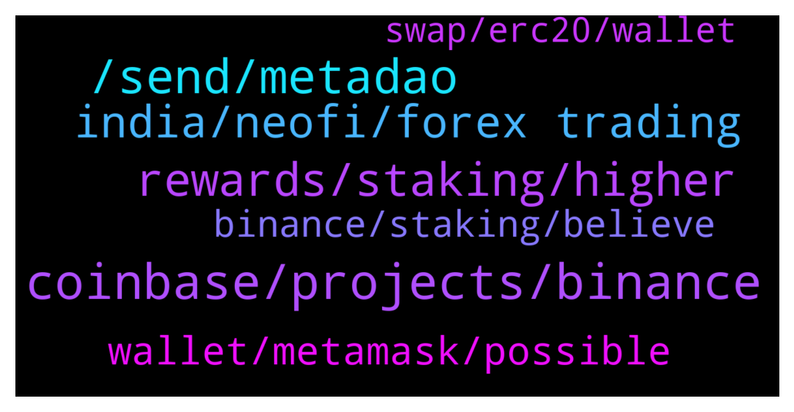

# **@Synthetixi**
 ## Analysis for **2022-01-18** - **2022-01-19**.

---

## 📊 **Basic Stats**

**n_messages_sent**: 149

---

---

## 🔝 **Top keywords and related messages**

1. **coinbase, projects, binance**

    @Chi --- *Excellent write up.....amazing what Synthetix has going for it....over the coming weeks and months Synthetix will grow at a fast pace and easy to see Synthetix in top 30 at the very least very soon* **--->** [TG Discussion](https://t.me/Synthetixi/18725)

    @Alex --- *I'm just thankful I found Synthetix before complete mass adoption.....it's coming* **--->** [TG Discussion](https://t.me/Synthetixi/18706)

    @Muhammad --- *I heard that Synthetix is sky rocking soon how true is that?* **--->** [TG Discussion](https://t.me/Synthetixi/18573)

    @Crypto --- *Thank you Chi Liun, and thank you for the /up vote! I appreciate those a lot. Synthetix is one of my greatest passions and I'm honored to help educate fellow community members!  And whoever else replied to my comment with /up I appreciate it.  I've been saying for a long time, top 30 is within reach very soon, maybe even top 10 in next 12 months.  Some may say this is conservative, some may say not aggresive enough target. Will not please everyone, but this is just my thought process.* **--->** [TG Discussion](https://t.me/Synthetixi/18726)

    @Russell --- *Can anyone tell me what is the use case of Synthetix?* **--->** [TG Discussion](https://t.me/Synthetixi/18747)

    @Moira --- *is there possibility of partnership of Synthetix with microsoft?* **--->** [TG Discussion](https://t.me/Synthetixi/18662)

2. **, send, metadao**

    @Michigan --- *Hey admin, my wife try purchasing tokens but it keeps declining as gas fee out, I try many things options but it's still fail to pull through.* **--->** [TG Discussion](https://t.me/Synthetixi/18795)

    @Thomas --- *Can I check directly from the app?* **--->** [TG Discussion](https://t.me/Synthetixi/18563)

    @Tyron_Hodl --- *You can search their channel and join.* **--->** [TG Discussion](https://t.me/Synthetixi/18823)

    @Benjamin --- *Please check gwei.  Also send me a message* **--->** [TG Discussion](https://t.me/Synthetixi/18796)

    @Benjamin --- *You can send me a direct message* **--->** [TG Discussion](https://t.me/Synthetixi/18755)

    @Benjamin --- *There's an account impersonating me, please I won't Pm you first. Be sure to check it's me you're chatting with* **--->** [TG Discussion](https://t.me/Synthetixi/18734)

3. **rewards, staking, higher**

    @Mulyana --- *During staking, so I do not need to hurry right? First come first serving not* **--->** [TG Discussion](https://t.me/Synthetixi/18791)

    @Oscar --- *I want to ask how much will be maximum reward if i stake 4000 or more thousands token* **--->** [TG Discussion](https://t.me/Synthetixi/18613)

    @Ahmed --- *Any staking reward calculator available already? Or its fixed percentage?* **--->** [TG Discussion](https://t.me/Synthetixi/18611)

    @Mulyana --- *Does the reward also change depending on the validator?* **--->** [TG Discussion](https://t.me/Synthetixi/18667)

    @Daniels --- *Buy cheap. Math doesn't lie. Once staking starts we'll see little selling pressure.* **--->** [TG Discussion](https://t.me/Synthetixi/18801)

    @Benjamin --- *It's dependant on how much circulating supply  Based on historical data, Initially the rewards are very higher. I am expecting rewards to be more than 20% APR initially (As we have lot of interest from community for staking) . Could be very high also* **--->** [TG Discussion](https://t.me/Synthetixi/18614)

4. **india, neofi, forex trading**

    @John --- *Publicity in india too bad i think. Now crypto has no any ban in India. So millions of people of india outside crypto need to know about Synthetix and its news. You guys only trying media.Think different. Publicity through ads/newspaper/Tv etc..  more effective. Am from kerala, India here nobody really knows what is crypto?  and what is Synthetix?* **--->** [TG Discussion](https://t.me/Synthetixi/18767)

    @Tyron_Hodl --- *NeoFi is designed to give you instant access to pre-built portfolios modeled after some of the most popular crypto indexes, hedge funds, and ideas.* **--->** [TG Discussion](https://t.me/Synthetixi/18815)

    @Tyron_Hodl --- *The world is evolving and people are making money and I want you to invest in NeoFi* **--->** [TG Discussion](https://t.me/Synthetixi/18810)

    @John --- *Thanks make more live...  North india developed in Crypto i think. But south india very bad in crypto field more engaged in Forex trading...* **--->** [TG Discussion](https://t.me/Synthetixi/18771)

    @John --- *Most of the indian people are aware about forex trading. So please change india into crypto atleast through ads or news...* **--->** [TG Discussion](https://t.me/Synthetixi/18768)

    @Paul --- *i am learn forex trading so what should i do any person teach me* **--->** [TG Discussion](https://t.me/Synthetixi/18621)

5. **wallet, metamask, possible**

    @Keith --- *Synthetix token staking by trust wallet?* **--->** [TG Discussion](https://t.me/Synthetixi/18686)

    @Skeeter --- *What about atomic wallet? one of best non custodial wallet😊 hope we will be able stake over there too* **--->** [TG Discussion](https://t.me/Synthetixi/18688)

    @Crypto --- *Sure you can use any wallet to stake Synthetix* **--->** [TG Discussion](https://t.me/Synthetixi/18687)

    @Ahmed --- *Thank you looking for ledger nano option I think its not there yet.* **--->** [TG Discussion](https://t.me/Synthetixi/18610)

    @Bridgette --- *Staking is possible with all wallets I know* **--->** [TG Discussion](https://t.me/Synthetixi/18608)

    @Anais --- *So staking is possible only with mobile wallet or metamask. Its not possible if we hold it in hardware wallet?* **--->** [TG Discussion](https://t.me/Synthetixi/18606)

6. **binance, staking, believe**

    @Crypto --- *Launchpad, trading contests, tons of community campaigns like AMAs, defended Synthetix about the recent crash, and at every step of the way has shown they support Synthetix strongly. They will DEFINITELY host staking for Synthetix. I am 99% sure of this.   I hope these insights help everyone to understand why I, and my company LDA strongly back and believe in Matic as the main marketshare holder for Ethereum which I believe will beat out all of the other platforms for dapps, games, DeFi, and other blockchain protocols.* **--->** [TG Discussion](https://t.me/Synthetixi/18724)

    @Benjamin --- *There's no details yet regarding binance supporting Synthetix staking. If there's any update, we'll announce it to the community.* **--->** [TG Discussion](https://t.me/Synthetixi/18718)

    @Skeeter --- *Maker (MKR) Skyrockets 50% In 24HR Following Coinbase Pro’s Listing Announcement... Synthetix will go to the moon after all annoucements.. binance us, staking, mainnet, listings, etc* **--->** [TG Discussion](https://t.me/Synthetixi/18721)

    @Benjamin --- *Also connect the dots please. Synthetix is doing so well, i hardly believe binance wouldnt support staking.  I can not believe people are struggling with Synthetix (not particularly you)* **--->** [TG Discussion](https://t.me/Synthetixi/18649)

    @Crypto --- *Bro the team can't report on what isn't reportable bro  You just need to be patient bud  Don't give the admin a hard time lol  He can only report what info he has been given, and no announcement has been made about Synthetix staking on Binance yet, but it WILL happen, I'll put my personal guarantee on that* **--->** [TG Discussion](https://t.me/Synthetixi/18720)

    @Benjamin --- *No idea, maybe you ask this on binance group.* **--->** [TG Discussion](https://t.me/Synthetixi/18564)

