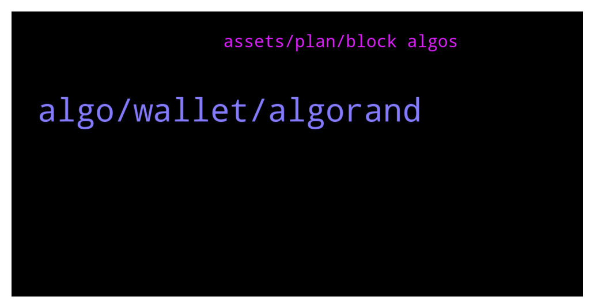

# **@algorand**
 ## Analysis for **2022-01-18** - **2022-01-19**.

---

## 📊 **Basic Stats**

**n_messages_sent**: 136

---

---

## 🔝 **Top keywords and related messages**

1. **algo, wallet, algorand**

    @NightAlgorand --- *check out this link for all project built on Algorand https://www.algorand.com/ecosystem/use-cases* **--->** [TG Discussion](https://t.me/algorand/333326)

    @dannexagon --- *You guys are not solving my issues* **--->** [TG Discussion](https://t.me/algorand/333742)

    @Rb_71dex --- *haha just saying mate I'm a true algo supporter and investor forever I'm a dev too and i really like the principal of the algorand so yeah it good to be a part of this ecosystem🔥👍* **--->** [TG Discussion](https://t.me/algorand/333448)

    @MackDenver --- *You should post about it in our discord  https://discord.gg/84AActu3at* **--->** [TG Discussion](https://t.me/algorand/333722)

    @maze --- *Hello there I'm from Germany and got a question.  Heard about staking rewards automatically if you hold algorand.  In Germany you need to pay about 10 years taxes if you sell a staking coin.  Can I deactivate staking function?* **--->** [TG Discussion](https://t.me/algorand/333544)

    @Ricky --- *I moved all of my algo into my algo wallet from Coinbase. Does anyone have a source on the actual myalgo wallet APY?* **--->** [TG Discussion](https://t.me/algorand/333366)

2. **assets, plan, block algos**

    @rafamacias --- *Why do I have to block Algos again if, when the App failed, I did not see the previous opt-in's being released?* **--->** [TG Discussion](https://t.me/algorand/333705)

    @Pablo_cast --- *es un contrato nuevo, hay que opt-in otra vez* **--->** [TG Discussion](https://t.me/algorand/333756)

    @rafamacias --- *I will wait for the necessary time until this matter is clarified but I do not plan to block any more Algos on assets for which I already have a respectable amount blocked. I'm sure more than one user is complaining about the same thing. Thanks* **--->** [TG Discussion](https://t.me/algorand/333711)

    @rafamacias --- *I just want to go into real mode and I don't plan to add more assets but if I don't accept the opt-in of ALL the assets for which I already did it once, I can't continue.* **--->** [TG Discussion](https://t.me/algorand/333708)

    @rafamacias --- *I also want to remove some assets but you do not have the opt-out option active yet.* **--->** [TG Discussion](https://t.me/algorand/333706)

    @deadlypuppy --- *"Its a new contract, you have to opt in again"* **--->** [TG Discussion](https://t.me/algorand/333758)

