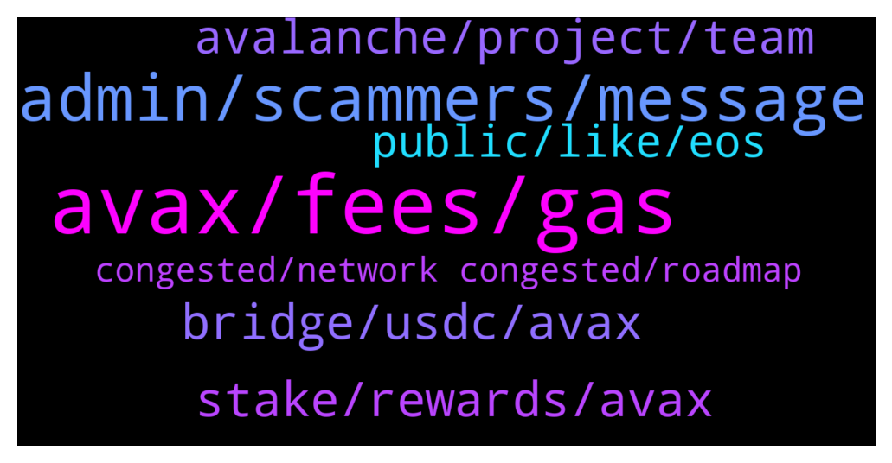

# **@avalancheavax**
 ## Analysis for **2022-01-18** - **2022-01-19**.

---

## 📊 **Basic Stats**

**n_messages_sent**: 172

---

---

## 🔝 **Top keywords and related messages**

1. **avax, fees, gas**

    @modelRh --- *How do I get Avax projects* **--->** [TG Discussion](https://t.me/avalancheavax/323401)

    @JustZee12 --- *Will it convert to avax? Because I don't have enough avax for gas fees* **--->** [TG Discussion](https://t.me/avalancheavax/323217)

    @Hakan_Mdn --- *Yes I know but this shouldn't be important because future is blockchain and chains will be more busy. Now Avax price appr. 90 usd x 0.034 Avax fees: 3 usd, but if Avax will be 3000 usd (in future) 3000 x 0.034: 102 usd.* **--->** [TG Discussion](https://t.me/avalancheavax/322990)

    @Nicolas_A --- *Fees will be adjusted if price goes up as it was done previously* **--->** [TG Discussion](https://t.me/avalancheavax/322991)

    @oathtobarbatos --- *The current med gas price is $0.05 AVAX (25 nAVAX)* **--->** [TG Discussion](https://t.me/avalancheavax/323048)

    @faisala777 --- *I had to pay .02 avax for a transaction* **--->** [TG Discussion](https://t.me/avalancheavax/323050)

2. **admin, scammers, message**

    @suleyboi --- *About 3 people has messaged me, pls how will i know an admin from scammers?* **--->** [TG Discussion](https://t.me/avalancheavax/323058)

    @debrakingston --- *I've tried bullpump about two months ago,and the admin was fake* **--->** [TG Discussion](https://t.me/avalancheavax/323104)

    @THEREALTWENTEMINING --- *your bio says you're the expert* **--->** [TG Discussion](https://t.me/avalancheavax/323402)

    @Nicolas_A --- *Sure you can send me a dm* **--->** [TG Discussion](https://t.me/avalancheavax/323182)

    @modelRh --- *Bsc, and it's full of scams now, lols* **--->** [TG Discussion](https://t.me/avalancheavax/323403)

    @debrakingston --- *Everyone claim to be the admin* **--->** [TG Discussion](https://t.me/avalancheavax/322981)

3. **stake, rewards, avax**

    @Kazue --- *Hi guys. What is the best apy to stake avax with the less risk? I staked on avalanche wallet for 10% any better way to do?* **--->** [TG Discussion](https://t.me/avalancheavax/323096)

    @oathtobarbatos --- *2000 AVAX are required to stake. 25 to delegate.* **--->** [TG Discussion](https://t.me/avalancheavax/323285)

    @Kazue --- *Yes so this is not an option for staking  my precious avax* **--->** [TG Discussion](https://t.me/avalancheavax/323138)

    @luignf --- *Hi how can I stake avax ?* **--->** [TG Discussion](https://t.me/avalancheavax/323000)

    @oathtobarbatos --- *You can stake AVAX in the Avalanche wallet, for example. wallet.avax.network* **--->** [TG Discussion](https://t.me/avalancheavax/323001)

    @oathtobarbatos --- *2000 AVAX are required to stake* **--->** [TG Discussion](https://t.me/avalancheavax/323002)

4. **bridge, usdc, avax**

    @Nicolas_A --- *Bridge.Avax.network if it’s on Ethereum else I would recommend synapse protocol / Celer network* **--->** [TG Discussion](https://t.me/avalancheavax/323216)

    @JustZee12 --- *Best bridge for bnb/eth to avax?* **--->** [TG Discussion](https://t.me/avalancheavax/323211)

    @Nicolas_A --- *Bridge only has USDC.e if you usdc you have to swap it afterwards for example* **--->** [TG Discussion](https://t.me/avalancheavax/323186)

    @wireframester --- *Hello, I cant find USDC on the avalanche bridge, I only see USDC.e, which is not what i want! any advice? Scammer and anyone else, spare me your PMs!* **--->** [TG Discussion](https://t.me/avalancheavax/323184)

    @Raffaeler --- *Hi guys, there is a bridge to bring avax from bsc to avalanche network? On anyswap avax is not supported, i need to bring avax because is first transaction. NO SCAMMER IN PM PLS* **--->** [TG Discussion](https://t.me/avalancheavax/323287)

    @oathtobarbatos --- *Try using allbridge.io or celer bridge or synapse protocol* **--->** [TG Discussion](https://t.me/avalancheavax/323288)

5. **avalanche, project, team**

    @Olagbemide --- *Beta finance  is coming  to avalanche  platform  is that true* **--->** [TG Discussion](https://t.me/avalancheavax/323333)

    @Nicolas_A --- *To be live on Avalanche and to contact the marketing team* **--->** [TG Discussion](https://t.me/avalancheavax/323230)

    @Cody_0x --- *Hey team. What is the rules re speaking about up and coming projects to avalanche?  I am invested in a project which is migrating to avalanche this month.   It is a diamond, trust worthy project with a great use case in my opinion.    Also, I am not affiliated with the project other than invested and support the team, I am curious what are the requirements if the team wants to do an ama on avalanche?  Who would they contact and what is required?  I am just reaching out for a bit of intel really that is all at the moment.* **--->** [TG Discussion](https://t.me/avalancheavax/323228)

    @Miracript --- *beta + avalanche 🥰   beta first* **--->** [TG Discussion](https://t.me/avalancheavax/323364)

    @Nemos13 --- *Avalanche is so underrated.. Avalanche is better than Ethereum and Solana...My money with Avalanche 😄😄💪💪💪* **--->** [TG Discussion](https://t.me/avalancheavax/323093)

    @oathtobarbatos --- *Avalanche administrators won't DM you first, also, they won't ask you for money.* **--->** [TG Discussion](https://t.me/avalancheavax/323061)

6. **public, like, eos**

    @86u_yhLx30 --- *https://nitter.net/pic/media%2FE1l8L2dXMAExklv.jpg%3Fname%3Dorig  Not sure if what you says makes much sense. 42% initially belonged to VCs and insiders. 19% was allocated to foundations.* **--->** [TG Discussion](https://t.me/avalancheavax/323031)

    @ManyWizzard --- *Wsup guys. Look at the article which I've found. It seems like btc and eth maxis desperately trying to keep their chains alive. What do you think about it? https://yanmaani.github.io/proof-of-stake-is-a-scam-and-the-people-promoting-it-are-scammers/* **--->** [TG Discussion](https://t.me/avalancheavax/323177)

    @86u_yhLx30 --- *I'm not saying EOS is fundamentally better overall. Just saying its allocations are considerably less shady.* **--->** [TG Discussion](https://t.me/avalancheavax/323032)

    @Nicolas_A --- *60% of initial tokens are for public and the ecosystem. The public was able to purchase at the same price / terms as any VC. Except ETH all the tokens you mentioned are excuse me quite underwhelming. Really cute to make a 4 billion public raise (wow big public allocation 👏👏👏) like EOS and deliver nothing* **--->** [TG Discussion](https://t.me/avalancheavax/323030)

    @86u_yhLx30 --- *eth, cardano, eos, tezos all have around 80% belonging to the public* **--->** [TG Discussion](https://t.me/avalancheavax/323027)

    @86u_yhLx30 --- *Yeah, i see that. It's inflation of over 30% isn't a great thing either* **--->** [TG Discussion](https://t.me/avalancheavax/323037)

7. **congested, network congested, roadmap**

    @angkou --- *Do we have a new roadmap?* **--->** [TG Discussion](https://t.me/avalancheavax/323183)

    @Sushil --- *Hello Everyone how are you today 😊* **--->** [TG Discussion](https://t.me/avalancheavax/323324)

    @alexbwork --- *all day congested…. and this is only with couple active projects…* **--->** [TG Discussion](https://t.me/avalancheavax/323067)

    @Laikevin --- *Omg the network is so congested* **--->** [TG Discussion](https://t.me/avalancheavax/323012)

    @Juan David Jaramillo 🇨🇴 --- *is the network congested now or something?* **--->** [TG Discussion](https://t.me/avalancheavax/323042)

    @elik7302 --- *I cannot see 2022 roadmap, is there any?* **--->** [TG Discussion](https://t.me/avalancheavax/323010)

