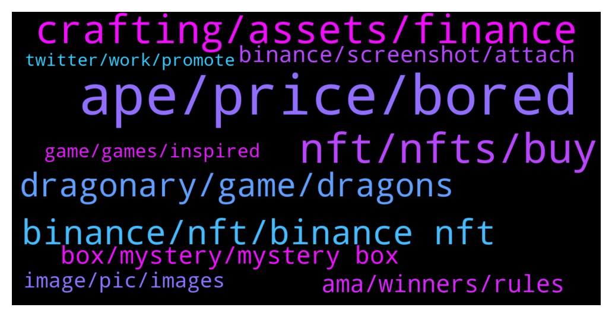

# **@binancenfts**
 ## Analysis for **2022-01-18** - **2022-01-19**.

---

## 📊 **Basic Stats**

**n_messages_sent**: 600

---

---

## 🔝 **Top keywords and related messages**

1. **ape, price, bored**

    @Anand_jio --- *Lowest price from seller...grab soon guys....soon it will became 100$+....Already bored ape series reached 100$+..so get soon....* **--->** [TG Discussion](https://t.me/binancenfts/435754)

    @porschem --- *I want to buy DM me pls* **--->** [TG Discussion](https://t.me/binancenfts/435895)

    @c_hinmay --- *Level 2 Hunter ... bidding at 15 busd only HashLand NFT #52509* **--->** [TG Discussion](https://t.me/binancenfts/436162)

    @EM --- *$2.34 Wow! This is by far the cheapest Bored Ape Soldier!* **--->** [TG Discussion](https://t.me/binancenfts/436739)

    @Ramuk_Arvind --- *Just now watching your collection.... And also noticed that u listed by mistake 10busd for groomed ape* **--->** [TG Discussion](https://t.me/binancenfts/436635)

    @Gheter --- *Choose yours and tell me they are cheap and profitable* **--->** [TG Discussion](https://t.me/binancenfts/437076)

2. **nft, nfts, buy**

    @Kid_dummy --- *How will they know my work is perfect....where do I post my nft for them to see it* **--->** [TG Discussion](https://t.me/binancenfts/436048)

    @tommycrypto21 --- *Almost every one is selling NFTs, and also P2E. but we all have to research* **--->** [TG Discussion](https://t.me/binancenfts/437560)

    @katelynMal --- *Can anyone explain something about the NFTs* **--->** [TG Discussion](https://t.me/binancenfts/435977)

    @SushiGMI --- *I look great in this NFT, thanks for the purchase🍣* **--->** [TG Discussion](https://t.me/binancenfts/436104)

    @c_hinmay --- *Price? Just out of curiosity coz I know the nft star 😅😁* **--->** [TG Discussion](https://t.me/binancenfts/436411)

    @patrickbiede --- *Please how can I sell my NFTs of I want to se* **--->** [TG Discussion](https://t.me/binancenfts/436910)

3. **crafting, assets, finance**

    @minhazurrahman --- *Can you please share your tokonomics & roadmap plan for 2022..? @tionyobed  #Crafting* **--->** [TG Discussion](https://t.me/binancenfts/437344)

    @xperia3 --- *Hi! ⛵️  When I check the website of Crafting Finance, I see there are 4 different classes as RaftStable, Raft, UnivRaft, and BondRaft. What are the main differences of these classes? Can you please explain the reason of creating them?  @tionyobed  #Crafting* **--->** [TG Discussion](https://t.me/binancenfts/437345)

    @Venlessw --- *Dear sir,,@tionyobed  Do your crafting finance have reward giving system by STAKING , Holding or adding liquidity?? Can $CRF Reward giving system attract investors??#Crafting* **--->** [TG Discussion](https://t.me/binancenfts/437358)

    @Blonquis --- *Hello, do you know of any project that could be a purchase opportunity?* **--->** [TG Discussion](https://t.me/binancenfts/436652)

    @tionyobed --- *1.Important event proposal power in Crafting DAO 2. Voting power in Crafting DAO 3. Could be used in Near economy and have some benefits like airdrops and could be used in other ecological projects. 4.Proof of early participants, could get more NFT airdrops in future 5. The copy right of the design, user could use it and make re-design 6. User could use it to issue synthetic assets* **--->** [TG Discussion](https://t.me/binancenfts/437327)

    @ChloeSofie --- *I read your whitepaper about crafting loss. I wanna know what is this? Is this the weak point of crafting finance? #Crafting @tionyobed* **--->** [TG Discussion](https://t.me/binancenfts/437349)

4. **binance, nft, binance nft**

    @Kid_dummy --- *How do I sell my NFT on Binance* **--->** [TG Discussion](https://t.me/binancenfts/436040)

    @StriderX88 --- *Please delete warning as I am talking about binance nfts, thanks* **--->** [TG Discussion](https://t.me/binancenfts/435833)

    @Eugene2301 --- *Does anyone know how long it takes to get approval to create NFT on binance?* **--->** [TG Discussion](https://t.me/binancenfts/436714)

    @Cryptoxue --- *I'm looking for an NFTs with a strong community and team, which one should I go for on binance network?* **--->** [TG Discussion](https://t.me/binancenfts/436532)

    @Sahib_BNB --- *How to Buy an NFT on Binance NFT Marketplace: https://www.binance.com/en/support/faq/777d6487fb7b491696571e3cbf3518f7* **--->** [TG Discussion](https://t.me/binancenfts/437498)

    @Fasna --- *Anyone experiencing Google recaptcha issue while listing NFts?* **--->** [TG Discussion](https://t.me/binancenfts/436982)

5. **dragonary, game, dragons**

    @elmakhannam --- *I’m actually a bit of a noob in blockchain game,How do i play Dragonary on my Desktop? How many players are playing Dragonary?anyone can play it or any requirement for play? #Dragonary* **--->** [TG Discussion](https://t.me/binancenfts/436291)

    @famian99 --- *I deposited my first CYT my Coinary wallet today, however these are still not displayed even though the transaction is confirmed, is there a certain delay? And also why can't I connect to the desktop version of Dragonary?#Dragonary* **--->** [TG Discussion](https://t.me/binancenfts/436337)

    @Jallenreyesm --- *In order to play Dragonary, users can login to the game using their Gmail or Facebook account. By this feature, could you please elaborate to us your game's security feature and mechanism? How would your users ensure that their connected social media account will be protected from Dragonary?   #Dragonary* **--->** [TG Discussion](https://t.me/binancenfts/436295)

    @cocoteaaa --- *After downloading the game you’ve mentioned that there will be 3 dragons waiting ingame? Are these free dragons? Can we sell them on marketplaces? #Dragonary  @acoinary @RamiroCH* **--->** [TG Discussion](https://t.me/binancenfts/436301)

    @Venlessw --- *The structure of the Dragonary game is geared only for experienced and professional players? or can any average user play?#Dragonary* **--->** [TG Discussion](https://t.me/binancenfts/436321)

    @gulsenyavuz --- *Hello, I have several questions about the game. Do you still plan to add metamask-type Wallets later on? #Dragonary* **--->** [TG Discussion](https://t.me/binancenfts/436345)

6. **box, mystery, mystery box**

    @fqkissfire --- *Why can't I see the blind box I hold in the APP ~NFT~personal center recently?  Can only see ordinary collections* **--->** [TG Discussion](https://t.me/binancenfts/435923)

    @fqkissfire --- *Yes I do it . But no blind box option shows up.* **--->** [TG Discussion](https://t.me/binancenfts/435931)

    @M7566868 --- *My delisted NFTs are not displaying in my nft assets* **--->** [TG Discussion](https://t.me/binancenfts/436898)

    @amit2017kk --- *@ChibiMaya_bnb i got this but it is written not tradable then, what's use of this box?* **--->** [TG Discussion](https://t.me/binancenfts/436207)

    @semeerkv --- *Then I think your nft is mystery box nft . You can check mystery box nft sections* **--->** [TG Discussion](https://t.me/binancenfts/436908)

    @ikaFelicia02 --- *I dont know that kyc mystery box event too* **--->** [TG Discussion](https://t.me/binancenfts/436222)

7. **ama, winners, rules**

    @Sajids110 --- *I have missed the AMA but It was awesome* **--->** [TG Discussion](https://t.me/binancenfts/437411)

    @minhazurrahman --- *Thanks that's a great ama @tionyobed* **--->** [TG Discussion](https://t.me/binancenfts/437401)

    @Kenikky --- *Thanks again for joining us for this AMA* **--->** [TG Discussion](https://t.me/binancenfts/437400)

    @UBAFinance --- *Thank you for @BinanceNFTs and all of you guys for supporting UBA!* **--->** [TG Discussion](https://t.me/binancenfts/436033)

    @Kenikky --- *Thanks for answering all these questions guys* **--->** [TG Discussion](https://t.me/binancenfts/436277)

    @SNiluminda --- *Thank you for explaining to us about the game.* **--->** [TG Discussion](https://t.me/binancenfts/436371)

8. **binance, screenshot, attach**

    @Comrade217 --- *It's happens, Binance signs out randomly* **--->** [TG Discussion](https://t.me/binancenfts/437448)

    @xxilsmr --- *There should be a screenshot from the binance website.* **--->** [TG Discussion](https://t.me/binancenfts/436836)

    @MuhammadAmmar5001 --- *I want to list my collection on binance platform.* **--->** [TG Discussion](https://t.me/binancenfts/435722)

    @Bikasba --- *I'm new in binance ..  Is there any roles for new user..* **--->** [TG Discussion](https://t.me/binancenfts/436209)

    @TLMH0 --- *anyone having trubble siging in binance today ?* **--->** [TG Discussion](https://t.me/binancenfts/437435)

    @c_hinmay --- *Post full screenshot including binance interface* **--->** [TG Discussion](https://t.me/binancenfts/435827)

9. **image, pic, images**

    @Anand_jio --- *1x55 2x 55 Up to 55x55 same Pic with different series came* **--->** [TG Discussion](https://t.me/binancenfts/436200)

    @c_hinmay --- *But what if he has clicked and owns the photograph?🤔* **--->** [TG Discussion](https://t.me/binancenfts/436190)

    @ashwin24aug --- *Then there is no use of copyright* **--->** [TG Discussion](https://t.me/binancenfts/436183)

    @devonrog --- *How can there be 2 same ?* **--->** [TG Discussion](https://t.me/binancenfts/436175)

    @Comrade217 --- *Do people really purchase 2d image for this high amount?* **--->** [TG Discussion](https://t.me/binancenfts/437466)

    @semeerkv --- *Bro .Use collage for multiple pic* **--->** [TG Discussion](https://t.me/binancenfts/437011)

10. **game, games, inspired**

    @arianagrinder89 --- *As we can see, many games on the market have a rather limited storyline. Do you believe your universe has enough depth? Is your story going to entertain us in addition to making money?#Dragonary* **--->** [TG Discussion](https://t.me/binancenfts/436332)

    @YilanGulsum --- *Were there any movies, books, games, etc., that inspired you when dealing with the story of your game? #Dragonary* **--->** [TG Discussion](https://t.me/binancenfts/436316)

    @Unlucky0014 --- *Are there any movies, books, games, etc., that have inspired you for your game's story?#Dragonary* **--->** [TG Discussion](https://t.me/binancenfts/436296)

    @Kenikky --- *I'm a bit of a sucker when it comes to game Lore and storytelling.* **--->** [TG Discussion](https://t.me/binancenfts/436252)

    @Kenikky --- *Think a lot of Binancians here have very similar stories especially playing their NES or SEGA on a Saturday morning haha 😄* **--->** [TG Discussion](https://t.me/binancenfts/436245)

    @acoinary --- *Well, I was inspired to develop a game because I've been a gamer since I was born. This is not the first game I have developed. A few years ago, I created a mobile game that was my first experience in this field. I can indeed say that developing a game like Dragonary is really hard, demands a lot of work, and requires a large team to do it. Since I've been a gamer my whole life, I find that not owning the items I was paying for in a game is wrong. Therefore, I encourage the Play-to-own what you pay for.* **--->** [TG Discussion](https://t.me/binancenfts/436244)

