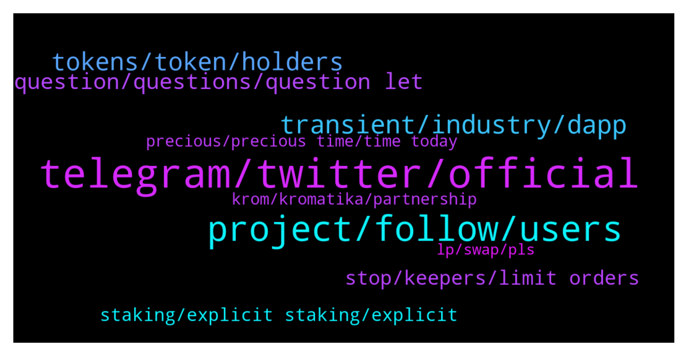

# **@chainlinkofficial**
 ## Analysis for **2022-01-18** - **2022-01-19**.

---

## 📊 **Basic Stats**

**n_messages_sent**: 224

---

---

## 🔝 **Top keywords and related messages**

1. **telegram, twitter, official**

    @manhhhg --- *Hello I'am new? How do I know where the chainlink is in the roadmap.* **--->** [TG Discussion](https://t.me/chainlinkofficial/366054)

    @twinturbo_dev --- *like someone from chain link works jere* **--->** [TG Discussion](https://t.me/chainlinkofficial/365652)

    @kiraaa_the_death_God --- *Hello everyone, whom may I contact. I have an interesting offer that would benefit the chain link community.* **--->** [TG Discussion](https://t.me/chainlinkofficial/366243)

    @Abilityseed --- *Can I get Link white paper* **--->** [TG Discussion](https://t.me/chainlinkofficial/366319)

    @josder --- *Is there not any by TG?* **--->** [TG Discussion](https://t.me/chainlinkofficial/365718)

    @evanrabbi --- *You can hire me as moderator to manage your business discussion group well🙂* **--->** [TG Discussion](https://t.me/chainlinkofficial/366270)

2. **project, follow, users**

    @The_Stache --- *I like that you guys are building a solid foundation before the influx of traffic. This is the right way. Do you expect and increase of launches on your Launchpad?* **--->** [TG Discussion](https://t.me/chainlinkofficial/365978)

    @twinturbo_dev --- *how long before the iOS / android application* **--->** [TG Discussion](https://t.me/chainlinkofficial/365961)

    @ivansnowmobile --- *Currently, we do not have any plans regarding it - only slight renewals of our frontpage, but if some big updates will come, our team might think of it. Besides, we are constantly gathering feedback from our community, so if it will feel that current logo does not represent the project's values, we will also consider the change.* **--->** [TG Discussion](https://t.me/chainlinkofficial/365864)

    @RomainSwitzerland --- *No 😌 As a rule the team doesn’t offer timelines for development targets. You can follow development progress via github* **--->** [TG Discussion](https://t.me/chainlinkofficial/366382)

    @ShermanShillax --- *Hey guys, i there an estimation on when CCIP will be released? I've tried looking for a date but i cant find anything.* **--->** [TG Discussion](https://t.me/chainlinkofficial/366381)

    @ivansnowmobile --- *For example, last summer we have launched predictions for EURO 2020 matches: thus this was our first attempt to give our users opportunity to predict not only in crypto field.* **--->** [TG Discussion](https://t.me/chainlinkofficial/365828)

3. **transient, industry, dapp**

    @Lonzocrypto --- *What makes our project special is that we are looking to provide a decentralised platform that is simple enough to provide a newest entrant in the space the services to onboard and manage their portfolio from A to Z, while remaining sophisticated to satisfy the demands of more seasoned users.   We believe that this is one of the keys to fostering mass adoption in the space.* **--->** [TG Discussion](https://t.me/chainlinkofficial/365933)

    @zero4356 --- *Is there a plan to allow using credit/ debit cards to buy crypto or will it stay as decentralised as possible? If so, would this be rolled out in the app?* **--->** [TG Discussion](https://t.me/chainlinkofficial/365958)

    @Blockbaas --- *I have a question for the developers... Which Programming Language is the best to develope with Blockchain (of course solidity) and? Python or Js(react) ?* **--->** [TG Discussion](https://t.me/chainlinkofficial/366048)

    @marcromeron --- *You mentioned "outcomes of various events" like for example?* **--->** [TG Discussion](https://t.me/chainlinkofficial/365827)

    @Linkederic --- *You should check out some of Patrick Collins' youtube videos that discuss blockchain developer tooling! https://www.youtube.com/watch?v=BX4o_G76xEc* **--->** [TG Discussion](https://t.me/chainlinkofficial/366050)

    @BeauTransient --- *Keeping across our socials is a great way - that way you can see when our dapps are dropping, how they are impacting key industry and have some fund along the way :) Details below.* **--->** [TG Discussion](https://t.me/chainlinkofficial/366089)

4. **tokens, token, holders**

    @Lonzocrypto --- *Sphynx is an all in one decentralised exchange. We go beyond just being a standalone swap.  We have launched on two chains, BSC and ETH with the following features:   - Charts   - Swap (Pancake, Uniswap and Sphynx) tokens   - Limit orders (ready to go live)   - Stop Loss (going live this week)   - Launchpad (BSC and ETH)   - Farming   - Staking   - Bridge (pending for prices to match, but ready to go)   - Lottery   - NFTs (Whitelist to Presales and Fees of the bridge)  Our ecosystem is all in one, all our utilities work indirectly back to the sphynx token.   Our vision is to make our holders feel like shareholders rather than just token holders. With that we redistribute 50% of the whole ecosystem fees back to the holders on a weekly basis.   This does not mean we have to sell tokens or hurt the chart as these fees come in BNB or ETH. And they go back to the holders of Sphynx token.* **--->** [TG Discussion](https://t.me/chainlinkofficial/365929)

    @copynat --- *Yeah we don’t know how to price this so went with just 1 link. To busy developing 😂* **--->** [TG Discussion](https://t.me/chainlinkofficial/366464)

    @Cong --- *In MCM say 1 bn total,* **--->** [TG Discussion](https://t.me/chainlinkofficial/366256)

    @Zach1229 --- *So on Sphynx I will be able to use stop loss trading my favorite meme coins?* **--->** [TG Discussion](https://t.me/chainlinkofficial/365963)

    @copynat --- *There is no inflation if you measure everything in LINK :D* **--->** [TG Discussion](https://t.me/chainlinkofficial/366474)

    @nam_nguyenson --- *Chainlink’s token total supply is 1 billion* **--->** [TG Discussion](https://t.me/chainlinkofficial/366258)

5. **question, questions, question let**

    @Marino_locos --- *So do we just ask questions?* **--->** [TG Discussion](https://t.me/chainlinkofficial/365914)

    @PolivodaTatiana --- *I'm sure our readers have the same question* **--->** [TG Discussion](https://t.me/chainlinkofficial/366085)

    @marcromeron --- *I know that you could not tell me nothing about that. So I think the best way to know is asking my last question....* **--->** [TG Discussion](https://t.me/chainlinkofficial/365949)

    @marcromeron --- *Here we go with a very interesting question...* **--->** [TG Discussion](https://t.me/chainlinkofficial/365853)

    @marcromeron --- *Let's go to the second question...* **--->** [TG Discussion](https://t.me/chainlinkofficial/365831)

    @marcromeron --- *Let's jump to our first question...* **--->** [TG Discussion](https://t.me/chainlinkofficial/365822)

6. **stop, keepers, limit orders**

    @Lonzocrypto --- *With the help of Chainlink we have been able to add extra features to our platform and change the way people tend to trade by implementing stop loss and limit orders through the chainlink keepers. This is the start for us using keepers as we plan to implement in many more places on our platform.  We have implemented VRF to the lottery contract to make it a more verified random generation of the numbers so players feel more confident with our platform and the fact it’s a way being more certified of being decentralised.   We also implement price feeds which allows us to receive accurate, real-time token pricing data.* **--->** [TG Discussion](https://t.me/chainlinkofficial/365937)

    @joebogan --- *So basically it’s like pinksale, pancakeswap and a launchpad all rolled into one? Plus the Dex will have tools that you would normally only get on a CEX (such as stop loss and limit orders)?* **--->** [TG Discussion](https://t.me/chainlinkofficial/365968)

    @Anderstalige --- *Looking forward to the developing partnership with gaugecash!* **--->** [TG Discussion](https://t.me/chainlinkofficial/366438)

    @ivansnowmobile --- *Chainlink has been our trusted partner from the very start of our project. Our main partnership directions are: using their price feeds and their oracle technology for defining the final prices of each pool. Recently we have integrated Chainlink Keepers for automatic commission claims, so we can say for sure that top tech solutions presented by the Chainlink team have been a great help for Prosper’s development. We hope that we will extend this partnership and make our project better together.* **--->** [TG Discussion](https://t.me/chainlinkofficial/365842)

    @joebogan --- *How does that work? Will that all be managed through the app?* **--->** [TG Discussion](https://t.me/chainlinkofficial/365996)

    @QuantumLeap68 --- *whole lotta partnerships and price in cellar…* **--->** [TG Discussion](https://t.me/chainlinkofficial/366462)

7. **staking, explicit staking, explicit**

    @nam_nguyenson --- *Explicit Staking is still being developed and planned for release in 2022. Be on the lookout for that.* **--->** [TG Discussion](https://t.me/chainlinkofficial/366263)

    @Ale --- *Where will the staking rewards come from?* **--->** [TG Discussion](https://t.me/chainlinkofficial/365623)

    @marcromeron --- *Take in consideration that once staking is live the LINK token, will be used as collateral by node operators to take on high value jobs.* **--->** [TG Discussion](https://t.me/chainlinkofficial/365628)

    @Agustín --- *Hello! I have a question if someone can answer, where is the best place to do staking with this token (Link)?* **--->** [TG Discussion](https://t.me/chainlinkofficial/366375)

    @marcromeron --- *Staking is not yet live. This article provides an overview of explicit staking from the Chainlink 2.0 Whitepaper. This presentation by Sergey discusses staking and the difference between implicit and explicit staking, while in this other presentation Sergey announced the team is planning to implement some form of staking in 2022.  As a rule the team doesn’t offer specific timelines for development targets.* **--->** [TG Discussion](https://t.me/chainlinkofficial/365614)

    @Zilllli --- *Any info on rewards for staking LINK?* **--->** [TG Discussion](https://t.me/chainlinkofficial/365741)

8. **precious, precious time, time today**

    @marcromeron --- *Thank you very much @ivansnowmobile for your precious time!!* **--->** [TG Discussion](https://t.me/chainlinkofficial/365883)

    @PolivodaTatiana --- *Awesome, thank you so much for your time today* **--->** [TG Discussion](https://t.me/chainlinkofficial/366101)

    @marcromeron --- *Thank you very much @Lonzocrypto for your precious time.* **--->** [TG Discussion](https://t.me/chainlinkofficial/365993)

    @marcromeron --- *Wait until the end. Thank you* **--->** [TG Discussion](https://t.me/chainlinkofficial/365915)

    @marcromeron --- *Welcome and thank you for your time today.* **--->** [TG Discussion](https://t.me/chainlinkofficial/365816)

    @marcromeron --- *We appreciate your trust in us!!* **--->** [TG Discussion](https://t.me/chainlinkofficial/365939)

9. **krom, kromatika, partnership**

    @Aristokrates_eth --- *Thank you Chainlink for the collaboration and integrating Kromatika into the Chainlink keepers ecosystem. Looking forward to the future collaboration between CHainlink and Kromatika* **--->** [TG Discussion](https://t.me/chainlinkofficial/366424)

    @pra_rz --- *Do you have a partner ship with krom?* **--->** [TG Discussion](https://t.me/chainlinkofficial/366407)

    @WeAreSamo --- *Hi everybody 👋 i am very proud about partnership with $krom , you should Come to discover THE FUTURE of #dex without Swap fees, front running bots and slippage Price. Team #krom is Amazing🤩🤩🤩 Ciao 😜👍* **--->** [TG Discussion](https://t.me/chainlinkofficial/366448)

    @carevski --- *such a nice move for both Kromatika and Chainlink ❤️* **--->** [TG Discussion](https://t.me/chainlinkofficial/366429)

    @thenewseer --- *Krom don’t have partnership with link* **--->** [TG Discussion](https://t.me/chainlinkofficial/366423)

    @johnnybravok --- *Chainlink is pushing Civilization and Krom, amazing* **--->** [TG Discussion](https://t.me/chainlinkofficial/366406)

10. **lp, swap, pls**

    @acadexnetworkchat --- *Hello admin, pls I nid help I swap my token but not see anytin, pls help* **--->** [TG Discussion](https://t.me/chainlinkofficial/366148)

    @Lonzocrypto --- *our swap automatically detects where the LP is* **--->** [TG Discussion](https://t.me/chainlinkofficial/365997)

    @twinturbo_dev --- *youll need to switch between the LP sphynx/ pancake depending on where the LP is at for tokens* **--->** [TG Discussion](https://t.me/chainlinkofficial/365980)

    @twinturbo_dev --- *seems to cost less to use* **--->** [TG Discussion](https://t.me/chainlinkofficial/366016)

    @twinturbo_dev --- *i like it the swap works, just used it.* **--->** [TG Discussion](https://t.me/chainlinkofficial/366015)

    @Lonzocrypto --- *its farming where u need to be careful between the LPs but we've made it clear as possible and working to make it even more easier for users* **--->** [TG Discussion](https://t.me/chainlinkofficial/365998)

