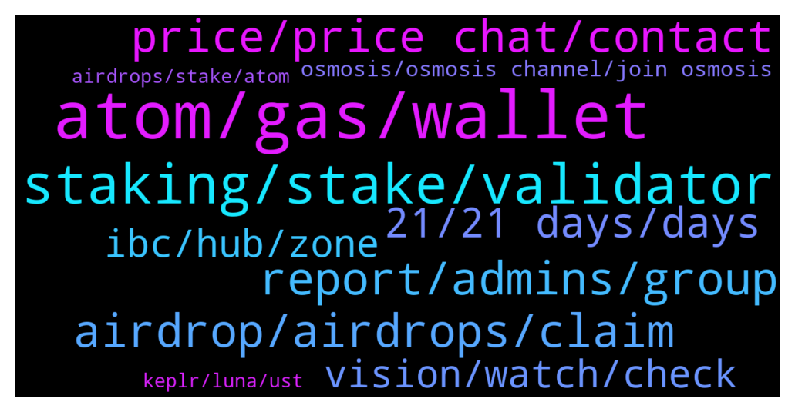

# **@cosmosproject**
 ## Analysis for **2022-01-18** - **2022-01-19**.

---

## 📊 **Basic Stats**

**n_messages_sent**: 532

---

---

## 🔝 **Top keywords and related messages**

1. **atom, gas, wallet**

    @Dome --- *hello guys, is there someone kind enough to give me some advice on how to make my atom as much as possible? (I started investing yesterday in cosmos) thank you very much for your patience🙏* **--->** [TG Discussion](https://t.me/cosmosproject/477553)

    @Thanhdcb --- *so the role of atom now not big as imagine. and utility of it as same as other chain* **--->** [TG Discussion](https://t.me/cosmosproject/477465)

    @ZoltanAtom --- *Which wallet are you using for your Atoms ?* **--->** [TG Discussion](https://t.me/cosmosproject/477556)

    @ascuoladibitcoin --- *If the token atom is continuously inflactionated how can it grow in terms of price?  More liquidity - less power price so less value.. who can help me to understand this ?* **--->** [TG Discussion](https://t.me/cosmosproject/477491)

    @LED7NFT --- *Pardon .. what is the usecase of ATOM coin ?* **--->** [TG Discussion](https://t.me/cosmosproject/476829)

    @Dad_Dado --- *How to change password in atomic wallet?* **--->** [TG Discussion](https://t.me/cosmosproject/476933)

2. **staking, stake, validator**

    @Matt_Blocks_United --- *Staking is one of your best options. Current APY on our node is over 14%. You can stake in Guarda, Rainbow, Trust wallet, Ledger Live, Keplr and Cosmostation. But Keplr is the preferred wallet.   We have a staking tutorial that shows both Keplr and Cosmostation in action with a connected Ledger. You can check it out here https://blocksunited.com/how-to-stake-cosmos-atom-tokens/* **--->** [TG Discussion](https://t.me/cosmosproject/477605)

    @AtomJazz --- *Staking is really simple. You need Keplr or Cosmostation wallet, you then need to select a validator (ideally someone with commission lower then 10% and not an exchange validator like Binance Coinbase or Kraken)* **--->** [TG Discussion](https://t.me/cosmosproject/476610)

    @Gabriel --- *Hi. I'm new, how can I get started in $ATOM staking?* **--->** [TG Discussion](https://t.me/cosmosproject/476886)

    @N8Biz --- *Where is the best place to stake ATOM and is there a lockup?* **--->** [TG Discussion](https://t.me/cosmosproject/476551)

    @Thomas --- *Hi,  Is there any guide available on liquid staking? So I can join lp on osmo?* **--->** [TG Discussion](https://t.me/cosmosproject/477430)

    @JasonOfArgonaut --- *I thought it was LPs would be used to stake?  But it's the other way around? That could result in mass unbonding* **--->** [TG Discussion](https://t.me/cosmosproject/477440)

3. **report, admins, group**

    @Frankisblessed --- *Dw when he dms me he will know what I'm talking about* **--->** [TG Discussion](https://t.me/cosmosproject/476766)

    @lindsey_with_an_e --- *how do I properly report something like this ? sorry never on telegram. and also why is it consistently replying to me with the bot “new users are restricted…” etc but the captcha bot doesnt even work for me when I click to complete it* **--->** [TG Discussion](https://t.me/cosmosproject/476844)

    @lindsey_with_an_e --- *oh gotcha thanks! but how do I properly report this? its DANGEROUS in how many fake posts theyve amassed that seem true with people receiving SO MUCH and also then taking advantage of the ACTUALLY amazing cosmos ecosystem and and how they do reward people involved more so than anyone ive seen in so many ways and playing off that...  only option for reporting seems to be spam that really doesnt fit exactly the issue?* **--->** [TG Discussion](https://t.me/cosmosproject/476847)

    @ZoltanAtom --- *It’s all bots. Not really community.* **--->** [TG Discussion](https://t.me/cosmosproject/476850)

    @radiancedeploy --- *!!Be aware, Jazz fake’s write scam messages!!* **--->** [TG Discussion](https://t.me/cosmosproject/476317)

    @catdotfish --- *If you jave a dev friend that can code a bot to automatically send to a new address the token would be better* **--->** [TG Discussion](https://t.me/cosmosproject/477026)

4. **airdrop, airdrops, claim**

    @Juljan20 --- *Wat is diference to keprl or cosmostation for airdrop ?🙏* **--->** [TG Discussion](https://t.me/cosmosproject/477607)

    @Dad_Dado --- *Don’t we all , I need fund out how to make claim on my airdrop and turn it to money drop* **--->** [TG Discussion](https://t.me/cosmosproject/476638)

    @AtomJazz --- *Oh damn, you then have airdrops like stars, HUAHUA, desmos etc all waiting for you to claim* **--->** [TG Discussion](https://t.me/cosmosproject/476624)

    @AtomJazz --- *You'll need it anyway to claim airdrops* **--->** [TG Discussion](https://t.me/cosmosproject/476617)

    @jimmywh --- *So many airdrops with snapshots taken from october to december. I made the mistake to stake through Binance. That was a big mistake as I am missing out on all of them.  Just staked through another validator, so I am looking forward to take part in the airdrops to come. 🤠* **--->** [TG Discussion](https://t.me/cosmosproject/477395)

    @lassikem --- *How to claim Desmos airdrop or is it even possible anymore?* **--->** [TG Discussion](https://t.me/cosmosproject/477725)

5. **price, price chat, contact**

    @natali_smith_1 --- *Hello, friends! Who else has received a message about FREN? I am interested in your opinion* **--->** [TG Discussion](https://t.me/cosmosproject/477535)

    @JasonOfArgonaut --- *Weve already explained this.   I will.leave it in your capable hands Jazz* **--->** [TG Discussion](https://t.me/cosmosproject/477072)

    @G45788 --- *Pls unban me from price trading or you can add me there* **--->** [TG Discussion](https://t.me/cosmosproject/476853)

    @ZoltanAtom --- *I have no control over there. Price chat is driven by community. Please DM to Price chat Admins.* **--->** [TG Discussion](https://t.me/cosmosproject/476854)

    @ZoltanAtom --- *Hello,you can send to me direct message about it.* **--->** [TG Discussion](https://t.me/cosmosproject/476758)

    @G45788 --- *Give me a contact.I don t know who is admin there* **--->** [TG Discussion](https://t.me/cosmosproject/476855)

6. **21, 21 days, days**

    @Juljan20 --- *Thankyou for this aprecable information !ai unstake  from validator 0 fee. Time to unlock my atom ai put my atom to Block United thank you🙏👍* **--->** [TG Discussion](https://t.me/cosmosproject/477625)

    @Dad_Dado --- *My ATOM and AWC is still in my atomic wallet but can’t unstake or move them around* **--->** [TG Discussion](https://t.me/cosmosproject/476989)

    @Matt_Blocks_United --- *I wish it was more obvious in the wallet that the option of redelegate was below unstake.* **--->** [TG Discussion](https://t.me/cosmosproject/477633)

    @ZoltanAtom --- *Unfortunately you will need to wait 21 days “undelegation period”* **--->** [TG Discussion](https://t.me/cosmosproject/477630)

    @JasonOfArgonaut --- *Can you see if the atom was unstaked by the scammer already?  A countdown timer visible* **--->** [TG Discussion](https://t.me/cosmosproject/477004)

    @Dad_Dado --- *In Atomic wallet when clicking on claim rewards or when clicking unstake, says can’t* **--->** [TG Discussion](https://t.me/cosmosproject/476958)

7. **vision, watch, check**

    @Oofthissux23 --- *Ah, it used to be only CosmosYear* **--->** [TG Discussion](https://t.me/cosmosproject/476583)

    @CosmosAdmiral --- *Hi. Are there any ambassador program for Cosmos that I can apply?* **--->** [TG Discussion](https://t.me/cosmosproject/477373)

    @danieldiez10 --- *someone has the link to the channel of the cosmos network proposals?* **--->** [TG Discussion](https://t.me/cosmosproject/476513)

    @ZoltanAtom --- *Whole Cosmos is the Web 3.0 !* **--->** [TG Discussion](https://t.me/cosmosproject/476546)

    @Jczheng --- *ok. It seems I need to take time to learn about cosmos.Thanks* **--->** [TG Discussion](https://t.me/cosmosproject/477666)

    @Lucas_Lukasiak --- *Thanks.  Ya, I’m reading they are using the Cosmos SDK to try and create their own alternative* **--->** [TG Discussion](https://t.me/cosmosproject/476342)

8. **ibc, hub, zone**

    @felipefig987 --- *It seems IBC is really necessary for the whole blockchain ecosystem* **--->** [TG Discussion](https://t.me/cosmosproject/476872)

    @AtomJazz --- *Crazy right? Why would anyone try to make alternative to IBC. It's fully open sourced and without any rent accrual mechanism* **--->** [TG Discussion](https://t.me/cosmosproject/476344)

    @ZoltanAtom --- *Of course. IBC is the way to interconnected All Cosmos chains!* **--->** [TG Discussion](https://t.me/cosmosproject/476877)

    @Mordrew --- *Here is a great video that goes into some detail on IBC.  Very informative and with a greater understanding of IBC, it's not just for Cosmos, one can't help but be bullish for the future of the Cosmos ecosystem and its underlying protocols.  https://www.youtube.com/watch?v=dYuTYykRhH4* **--->** [TG Discussion](https://t.me/cosmosproject/477290)

    @Mordrew --- *Afternoon everybody.  I have written a subreddit article with some history on the new, soon to be IBC Gang member - Carbon (SWTH).  Here is the link: https://www.reddit.com/r/CryptoCurrency/comments/s6amnp/who_exactly_is_this_soon_to_be_ibc_gang_member/* **--->** [TG Discussion](https://t.me/cosmosproject/476303)

    @Igdtilkhd --- *At one time, the hashgard was responsible for setting up the ibc protocol* **--->** [TG Discussion](https://t.me/cosmosproject/476883)

9. **osmosis, osmosis channel, join osmosis**

    @lionkim958 --- *Transaction details here. On the bottom there's a fail mark for osmosis acknowledgement: https://www.mintscan.io/osmosis/txs/1BEEF14F9227CCF358F33BD6E9ED235390B3F69F03C8CBAD737A851BE3997F6C* **--->** [TG Discussion](https://t.me/cosmosproject/477220)

    @crypto4life4eva --- *Just want to know how to get funds from osmosis to eth…* **--->** [TG Discussion](https://t.me/cosmosproject/477247)

    @TicoJohnny --- *Never used it, which is why you should ask in their channels. Should be able to move Osmosis to Secret to their secretswap and get some wrapped Eth. https://scrt.network/blog/secret-ethereum-bridge-is-live-on-mainnet* **--->** [TG Discussion](https://t.me/cosmosproject/477249)

    @ZoltanAtom --- *You should use Osmosis dex and swap any other asset to starts.   Please join Osmosis channel for further details and questions ;  https://t.me/osmosis_chat* **--->** [TG Discussion](https://t.me/cosmosproject/476777)

    @ggwashinton1 --- *I just use Keplr, connect to Osmosis, press stake.    Pretty easy* **--->** [TG Discussion](https://t.me/cosmosproject/476461)

    @ZoltanAtom --- *Hello,better to ask Osmosis channel,Admins will share it with you.* **--->** [TG Discussion](https://t.me/cosmosproject/476542)

10. **keplr, luna, ust**

    @Kostas --- *i am trying to send ust from keplr to another address and i always get an error message of insufficient funds..does anyone know what the problem might be?* **--->** [TG Discussion](https://t.me/cosmosproject/476434)

    @Dad_Dado --- *I don’t understand keplr, I linked my atomic wallet to keplr already* **--->** [TG Discussion](https://t.me/cosmosproject/476942)

    @Dad_Dado --- *I was told to connect it to Keplr, and seems same to me* **--->** [TG Discussion](https://t.me/cosmosproject/476614)

    @Matt_Blocks_United --- *@ZoltanAtom any idea how to submit a ticket at Keplr's support site?* **--->** [TG Discussion](https://t.me/cosmosproject/477647)

    @ZoltanAtom --- *Hello,sure there is ;  I wrote a small faq to troubleshoot disruptions with keplr interchain transfer: scroll dow into this article https://link.medium.com/PHTYp7SBwjb* **--->** [TG Discussion](https://t.me/cosmosproject/477432)

    @ciao_xyz --- *Hi, i don t see my atom (in the keplr wallet) when i m connected on osmosis* **--->** [TG Discussion](https://t.me/cosmosproject/476427)

