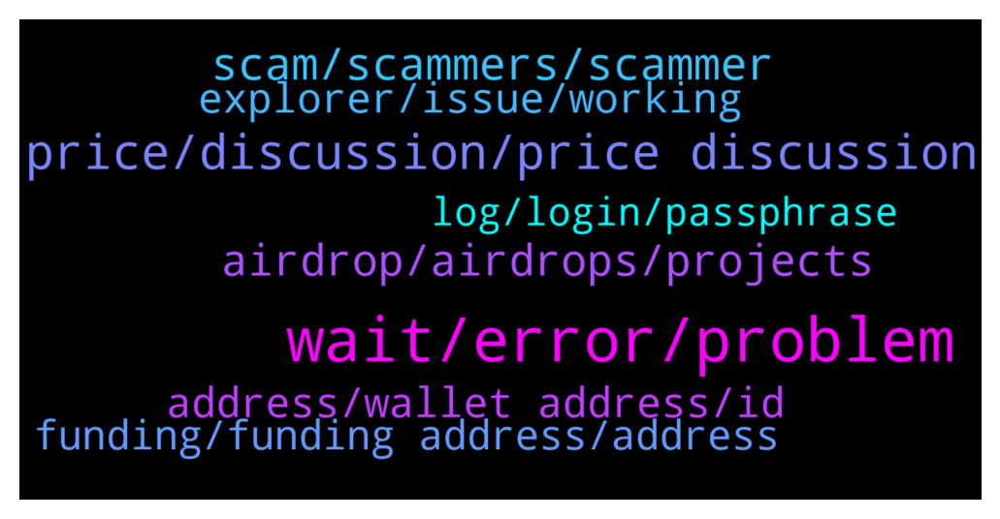

# **@cryptonear**
 ## Analysis for **2022-01-18** - **2022-01-19**.

---

## 📊 **Basic Stats**

**n_messages_sent**: 950

---

---

## 🔝 **Top keywords and related messages**

1. **wait, error, problem**

    @Aflatoon123 --- *The screen just loads and loads😔* **--->** [TG Discussion](https://t.me/cryptonear/291315)

    @larry_lang --- *there was some problems and display error right now :(* **--->** [TG Discussion](https://t.me/cryptonear/290611)

    @larry_lang --- *everything is fine but I love it* **--->** [TG Discussion](https://t.me/cryptonear/290763)

    @fei_1100 --- *It looks abrupt and has no connection* **--->** [TG Discussion](https://t.me/cryptonear/290920)

    @larry_lang --- *maybe u should wait more or f5 even restart, if it still not went well, seem like more time is in need :(* **--->** [TG Discussion](https://t.me/cryptonear/290779)

    @Aflatoon123 --- *Tried in both. Laptop as well as android app* **--->** [TG Discussion](https://t.me/cryptonear/291317)

2. **price, discussion, price discussion**

    @larry_lang --- *https://t.me/merchantsofnear. the price should be discussed here* **--->** [TG Discussion](https://t.me/cryptonear/290805)

    @TheGo1denBull --- *You can have price discussions here https://t.me/merchantsofnear* **--->** [TG Discussion](https://t.me/cryptonear/291466)

    @iamkemoo --- *we talk about prices here mate, please move price discussion to the unofficial price chat: https://t.me/merchantsofnear thank you 🙏* **--->** [TG Discussion](https://t.me/cryptonear/290961)

    @fynyc --- *Yeah I would like to be early adopter don’t like to buy “expensive” price* **--->** [TG Discussion](https://t.me/cryptonear/290371)

    @TheGo1denBull --- *Any price talk...any 10x ect is forbidden* **--->** [TG Discussion](https://t.me/cryptonear/291494)

    @iamkemoo --- *Hey mate, for price related discussions please join the prica chat: https://t.me/merchantsofnear* **--->** [TG Discussion](https://t.me/cryptonear/291078)

3. **scam, scammers, scammer**

    @antieco --- *After this msg I received 4 scammers DM* **--->** [TG Discussion](https://t.me/cryptonear/290319)

    @larry_lang --- *here is the link of our group, u can use this to get rid of scam. https://t.me/cryptonear* **--->** [TG Discussion](https://t.me/cryptonear/290478)

    @CryptO_Gh0st --- *Am getting a DM from A person named solutions he is asking me to validate my wallet. Is it a scam? It happened right after i asked a question here.* **--->** [TG Discussion](https://t.me/cryptonear/290567)

    @Budisalimm --- *Why suddenly I have 2 group with same name  Near protocol officiall  How can I know which ones is scammer?* **--->** [TG Discussion](https://t.me/cryptonear/290474)

    @larry_lang --- *=))) scammer when they take your money=)))* **--->** [TG Discussion](https://t.me/cryptonear/292137)

    @larry_lang --- *it could be scam or something* **--->** [TG Discussion](https://t.me/cryptonear/290477)

4. **airdrop, airdrops, projects**

    @A1Money_intl --- *I believe there's an expected Airdrop coming. Right?   Do you have one sir? And what's expected from this? I don't quite get what's the use case or what to be used for.* **--->** [TG Discussion](https://t.me/cryptonear/290225)

    @WebbieGuy --- *There isn't, but even if there was, what are u going to do with a $0.50 airdrop? Seriously ? Is it even worth asking?* **--->** [TG Discussion](https://t.me/cryptonear/290625)

    @A1Money_intl --- *Does the site Airdrops work all the time?* **--->** [TG Discussion](https://t.me/cryptonear/290216)

    @a1sunny --- *No idea bro it's my first time, so 0lease if you guide me i will be thankful to you. I want to get the new Airdrops. No interested in apy/APR. So please...* **--->** [TG Discussion](https://t.me/cryptonear/291259)

    @JAbioye1 --- *Hey guys quick one, does staking with a validator give me acces to airdrops?* **--->** [TG Discussion](https://t.me/cryptonear/290863)

    @ardakyld --- *is there a possiblity of getting possible future airdrops?* **--->** [TG Discussion](https://t.me/cryptonear/290227)

5. **explorer, issue, working**

    @NEARverse_xd --- *Even i am not able to see my previous txs history on explorer and wallet (maybe 2 days old) but it is showing in my wallet balance. So i think they are still fixing the issues.* **--->** [TG Discussion](https://t.me/cryptonear/291956)

    @kv9990 --- *Pls check on https://near-staking.com/ 👀 explorer/wallet is having some issue lately ,team is working on it.* **--->** [TG Discussion](https://t.me/cryptonear/291206)

    @GeorgePro1 --- *Trust has frontend issue. Please if your transaction is confirmed on the explorer . import your trust wallet recovery phrase in near wallet* **--->** [TG Discussion](https://t.me/cryptonear/292481)

    @TheGo1denBull --- *The devs are working on this issue. The near explorer is down which is affecting the wallet depending on your location. Your funds are safe but please be a little more patient as they resolve this ongoing issue.* **--->** [TG Discussion](https://t.me/cryptonear/290358)

    @TheGo1denBull --- *There is a common issue regarding the near explorer which affects the wallet. In time you won't have this ongoing issue. Please be patient while they work on the bugs* **--->** [TG Discussion](https://t.me/cryptonear/290175)

    @aaazzzz61 --- *I have a small amount of exchange near I bought They are near To Trust Walt Deposit, but in my wallet, the amount and amount near Not shown Did this problem just happen to me? Is on the network near Is there a disturbance?* **--->** [TG Discussion](https://t.me/cryptonear/292477)

6. **address, wallet address, id**

    @iamruark --- *I have about near wallets. If I want to make a new address, do I lose my previous one or are they linked? or are they completely separate? diff passwords/keys etc?* **--->** [TG Discussion](https://t.me/cryptonear/292085)

    @beep42 --- *Half the wallets are expecting the ‘id.near’ syntax but they give you some hash address to “register” your name. Fucking HORRIBLE design. Horrible* **--->** [TG Discussion](https://t.me/cryptonear/290641)

    @ieatapple --- *sorry i meant for my NEAR wallet address, does it change? I withdraw from CDC.com 2 weeks ago and i did add the address once. I vaguely remember that i kinda use the one-time wallet address~* **--->** [TG Discussion](https://t.me/cryptonear/291140)

    @ieatapple --- *yes correct. so that address gets deleted. so now, how do i get myself a new address so that i can withdraw from CDC to NEAR wallet?* **--->** [TG Discussion](https://t.me/cryptonear/291144)

    @ieatapple --- *Hey @iamkemoo - can i check whether do our wallet address ever change? i've withdrawn from crypto.com once to NEAR wallet. Now im trying to find my wallet address again couldn't find it, but within my crypto.com itself already has a saved address of my NEAR Wallet but i wonder does this address change over time?* **--->** [TG Discussion](https://t.me/cryptonear/291138)

    @Srkn_57 --- *I send my near wallet some near yesterday, and I send again today, but I couldnt see my New nears in my wallet. When I controlled I saw to change my wallet adress. It was deleted. How can I take to my wallet?* **--->** [TG Discussion](https://t.me/cryptonear/291533)

7. **funding, funding address, address**

    @Rishabh1309 --- *i accidentally sent my near to the inital funding address.. how can i claim it.. i tried using recovery account option but not getting any option to claim* **--->** [TG Discussion](https://t.me/cryptonear/291318)

    @Rishabh1309 --- *how can i recover funds from single use funding address* **--->** [TG Discussion](https://t.me/cryptonear/291355)

    @NearFritz --- *-> To recover NEAR sent to the funding address after you created the account, please follow the steps on: https://wallet.near.org/recover-account* **--->** [TG Discussion](https://t.me/cryptonear/291320)

    @Rishabh1309 --- *i dont see any option to recover my funds* **--->** [TG Discussion](https://t.me/cryptonear/291212)

    @TheGo1denBull --- *You can use either the single finding address that's 64 characters or make a custom username so if your made a username then send the NEAR to that instead of the initial funding address* **--->** [TG Discussion](https://t.me/cryptonear/289971)

    @beep42 --- *Rainbow doesn’t even work. The whole issue is with this “single use funding address.” That is complicating this whole user flow so much because it doesn’t recognize as a valid address like anywhere. Fucking horrible design. I’m a developer that has an app built on testnet and I can’t even deploy. Fucking joke protocol. Maybe I’ll try again when the tech is more mature.* **--->** [TG Discussion](https://t.me/cryptonear/290610)

