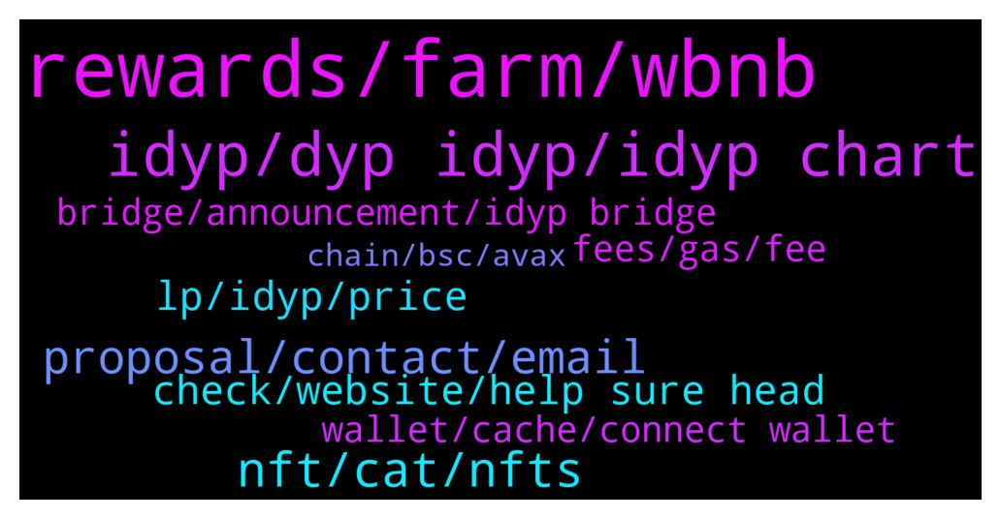

# **@dypfinance**
 ## Analysis for **2022-01-18** - **2022-01-19**.

---

## 📊 **Basic Stats**

**n_messages_sent**: 186

---

---

## 🔝 **Top keywords and related messages**

1. **rewards, farm, wbnb**

    @WatermelonNoia --- *Hi is there a way to interact with the V2 90 day AVAX farm on snowtrace to see the daily rewards amount being sent to my address.  I haven't claimed in a while and keen to understand how the rewards have fluctuated in the current market conditions.   I know we can get a summary on the DYP site but that is an aggregated view. I want to see the underlying info.  @timdyp or @DhoniMSD516* **--->** [TG Discussion](https://t.me/dypfinance/240761)

    @timdyp --- *Maximize your Yield Farming Rewards! Available multi-chain on #Ethereum #BinanceSmartChain #Avalanche  9182 #ETH, 9820 #BNB and 23964 #AVAX worth $35,580,060 paid to farmers!  Join farming by automatically adding liquidity and earn +425% APY https://dyp.finance/farmv2  👉https://twitter.com/dypfinance/status/1483412926375641088* **--->** [TG Discussion](https://t.me/dypfinance/240854)

    @Disguy125 --- *Is it the farming rewards in dyp that are dynamic? It should be high quantity of dyp right* **--->** [TG Discussion](https://t.me/dypfinance/240938)

    @DhoniMSD516 --- *Hey your deposited asset is converted 75% WBNB-iDYP and 25% to DYP so you are seeing WBNB and DYP* **--->** [TG Discussion](https://t.me/dypfinance/240807)

    @Crypto Q --- *So what about the Eth I deposited* **--->** [TG Discussion](https://t.me/dypfinance/240808)

    @DhoniMSD516 --- *Any asset you deposited is converted to above said pair even if you deposit ETH or BNB or BUSD* **--->** [TG Discussion](https://t.me/dypfinance/240810)

2. **idyp, dyp idyp, idyp chart**

    @CryptoWilliam --- *Have Dyp team thought of implementing IL protection/insurance kinda like thorrune has? I just saw read abit about thorrune and i think thats a supergreat feature that Dyp should deffiently have also* **--->** [TG Discussion](https://t.me/dypfinance/240703)

    @DhoniMSD516 --- *$DYP is always hot with continuous updates :)* **--->** [TG Discussion](https://t.me/dypfinance/241131)

    @Disguy125 --- *Is there a DYP/IDYP chart anywhere. To help see whens best to swap between them* **--->** [TG Discussion](https://t.me/dypfinance/241002)

    @Disguy125 --- *But I want to see a Dyp/idyp chart correlation* **--->** [TG Discussion](https://t.me/dypfinance/241004)

    @Kaya --- *What is the difference between dyp and idyp are they two different coins or the same?* **--->** [TG Discussion](https://t.me/dypfinance/241274)

    @DhoniMSD516 --- *Hello welcome you can start here https://t.me/dypfinance/229271 to learn about DYP* **--->** [TG Discussion](https://t.me/dypfinance/240872)

3. **nft, cat, nfts**

    @Jabirbobo001 --- *2. If i mint a cat can i put it on other nft market place like opensea and sell?? Or only dyp nftmarket place ?* **--->** [TG Discussion](https://t.me/dypfinance/240687)

    @jscrib5050 --- *How much are the cat nfts* **--->** [TG Discussion](https://t.me/dypfinance/241197)

    @komratkajtek --- *Is nft mint option available? Can't find it* **--->** [TG Discussion](https://t.me/dypfinance/240671)

    @iamJubi --- *🔥Join Cats and Watches Society #NFTs Whitelist 🎉One Brand New Rolex Daytona Ceramic 116500LN worth $40k Giveaway  To win the watch: ✅Join dyp.finance/whitelist ✅Mint one #NFT once available ✅Like & Retweet this post ✅Join discord.gg/dypcaws ✅Tag 3 friends  👉https://twitter.com/dypfinance/status/1480623073208549380* **--->** [TG Discussion](https://t.me/dypfinance/241153)

    @timdyp --- *👀SNEAK PEAK!!👀 Cats and Watches Society #NFTs  Join Whitelist Now👇 https://dyp.finance/whitelist  #NFTdrop #NFT #DYP  👉https://twitter.com/dypfinance/status/1483834579261788163* **--->** [TG Discussion](https://t.me/dypfinance/241272)

    @daooo11 --- *nft minting only in eth network or bsc too?* **--->** [TG Discussion](https://t.me/dypfinance/240858)

4. **proposal, contact, email**

    @DhoniMSD516 --- *Please email your proposal to contact@dyp.finance* **--->** [TG Discussion](https://t.me/dypfinance/241239)

    @makeitrainhaku --- *Hello, who may i contact for a partnership proposal?* **--->** [TG Discussion](https://t.me/dypfinance/240714)

    @ohkayhi --- *It would be more convenient to discuss it directly* **--->** [TG Discussion](https://t.me/dypfinance/240910)

    @Davidjoobitfinex001 --- *Hello, who should I contact regarding listing?* **--->** [TG Discussion](https://t.me/dypfinance/241238)

    @DhoniMSD516 --- *Hey @herbie1996  we wish we can give you promise but sorry we don't have any infos too* **--->** [TG Discussion](https://t.me/dypfinance/240802)

    @DhoniMSD516 --- *Hey please email your proposal to contact@dyp.finance* **--->** [TG Discussion](https://t.me/dypfinance/241097)

5. **check, website, help sure head**

    @happysunday12 --- *Hi everyone, I'm a new here so nice to meet you all* **--->** [TG Discussion](https://t.me/dypfinance/240871)

    @DhoniMSD516 --- *Sure you can head here to check our products https://t.me/dypfinance/229271* **--->** [TG Discussion](https://t.me/dypfinance/241135)

    @DhoniMSD516 --- *I think third party website https://debank.com/ shows you this infos try it out* **--->** [TG Discussion](https://t.me/dypfinance/240958)

    @hemanrock --- *please check more from here https://dyp.finance/about* **--->** [TG Discussion](https://t.me/dypfinance/240698)

    @Kaya --- *I understand, thank you very much for your help.* **--->** [TG Discussion](https://t.me/dypfinance/241296)

    @hemanrock --- *Hi, we will check this. Thanks for suggession 🙌* **--->** [TG Discussion](https://t.me/dypfinance/240705)

6. **lp, idyp, price**

    @WatermelonNoia --- *So if i read the ERC20 tab correctly, 2h30m ago ~32AVAX would have been distributed based on individual pool %s. So if i held 10% of the LP as example (for easy maths sake) that's 3.2AVAX paid out.* **--->** [TG Discussion](https://t.me/dypfinance/240770)

    @Paulus --- *So what would it mean when we add more LP and it still slit 25% to dyp* **--->** [TG Discussion](https://t.me/dypfinance/241057)

    @TaylorSwift360rekt --- *Having trouble removing LP from V1 WBNB 30* **--->** [TG Discussion](https://t.me/dypfinance/241203)

    @DhoniMSD516 --- *In Stats page the LP value is shown in USD which included both BNB/ETH/AVAX(changes depending on chain) + iDYP* **--->** [TG Discussion](https://t.me/dypfinance/240957)

    @DhoniMSD516 --- *No calculating LP is little complicated, it depends on price of both tokens involved* **--->** [TG Discussion](https://t.me/dypfinance/240954)

    @Bourk --- *And how do I know how much idyp I have worth in lp?* **--->** [TG Discussion](https://t.me/dypfinance/240955)

7. **bridge, announcement, idyp bridge**

    @DhoniMSD516 --- *As our CTO is effected with Covid cannot promise any dates yet, but everything is ready, just one last confirmation from our CTO is needed so whenever he is back strong the bridge will be live* **--->** [TG Discussion](https://t.me/dypfinance/241215)

    @F --- *Is this mean Idyp bridge is active right now ? 🙂* **--->** [TG Discussion](https://t.me/dypfinance/240861)

    @tamtamkanto --- *Is it possible to launch idyp bridge this week? or next week?* **--->** [TG Discussion](https://t.me/dypfinance/241214)

    @Cimmy_revenger --- *Where we can bridge iDYP ? last weeks , I know announcement from twitter DYP about this.* **--->** [TG Discussion](https://t.me/dypfinance/240680)

    @herbie1996 --- *Morning guys & jubi, please will the bridge be active before the 20th I only ask as I brought some idyp to earn a little profit to help me buy a miner on a white list that runs out on 20th. Please activate it guys. This is my only shot 💎* **--->** [TG Discussion](https://t.me/dypfinance/240801)

    @DhoniMSD516 --- *Nope not yet, if bridge is active that will have separate announcement* **--->** [TG Discussion](https://t.me/dypfinance/240862)

8. **fees, gas, fee**

    @N --- *Hi Guys, I really really need some help. Have been trying numerous times to reinvest. Keeps failing but still I pay the gas fee’s. Can anybody help me??? Please DM if you can and many thanks in advance.* **--->** [TG Discussion](https://t.me/dypfinance/241159)

    @MJMuppet_JayJay --- *Can anyone explain me how that happens? As in what does the contract have to do to explain such high gas fees needed?* **--->** [TG Discussion](https://t.me/dypfinance/241021)

    @MJMuppet_JayJay --- *Yea true it automatically takes a 100% max prio fee* **--->** [TG Discussion](https://t.me/dypfinance/241029)

    @Manuel --- *0% DYP fees, but you still need to pay ETH Gas fee* **--->** [TG Discussion](https://t.me/dypfinance/241022)

    @MJMuppet_JayJay --- *The ETH stake has a text bar saying 0% fees, but I still get a prompt for a high gas fee transaction. The fee for a current transactions is about $20 for the approve, but almost 20x that for the deposit* **--->** [TG Discussion](https://t.me/dypfinance/241020)

    @hemanrock --- *apart from mint fees, there will be Gas fees too depends on which network you use like ETH/BSC/AVAX* **--->** [TG Discussion](https://t.me/dypfinance/240688)

9. **wallet, cache, connect wallet**

    @TaylorSwift360rekt --- *Tried to. Is dapp not working properly?* **--->** [TG Discussion](https://t.me/dypfinance/241207)

    @ArchieHerrera --- *My DYP balance is not showing when i click to connect wallet (Earnv1)* **--->** [TG Discussion](https://t.me/dypfinance/240926)

    @DhoniMSD516 --- *It should https://app-bsc.dyp.finance/staking-bnb-30 try clearing cache and retry* **--->** [TG Discussion](https://t.me/dypfinance/241208)

    @DhoniMSD516 --- *Hey insufficient output amount means you are doing more than what is available please dm me your wallet address so that I can check* **--->** [TG Discussion](https://t.me/dypfinance/241160)

    @hemanrock --- *Please clear your cache and cookies in your device.* **--->** [TG Discussion](https://t.me/dypfinance/241038)

    @ArchieHerrera --- *Clicking deposit is the only way i can get the option to connect to my wallet. I'm on the correct chain* **--->** [TG Discussion](https://t.me/dypfinance/240930)

10. **chain, bsc, avax**

    @DhoniMSD516 --- *Hey the payment for CAWS will be in BNB in BSC chain ETH in ETH chain and AVAX in Avax chain all in 250$ worth and not with DYP* **--->** [TG Discussion](https://t.me/dypfinance/240840)

    @DjoeDellon --- *Did I understand correctly that we'll need to pay for the CAWs with DYP? Or will it also be possible to pay for them with eth?* **--->** [TG Discussion](https://t.me/dypfinance/240839)

    @DhoniMSD516 --- *250$ you can in BNB on BSC chain ETH in eth chain and AVAX in avax chain* **--->** [TG Discussion](https://t.me/dypfinance/241199)

    @Disguy125 --- *I have about 10k dyp in both bsc and eth 90day stake plus bsc and eth farms and BSC buyback* **--->** [TG Discussion](https://t.me/dypfinance/241000)

    @timdyp --- *In the coming days, you will begin to see new marketing campaigns designed to increase awareness and promote growth to our brand. These campaigns will include additional giveaways of Rolex watches worth more than $60,000. We will also be giving away crypto rewards in ETH, BNB and AVAX worth up to $50,000 and much more.* **--->** [TG Discussion](https://t.me/dypfinance/240973)

