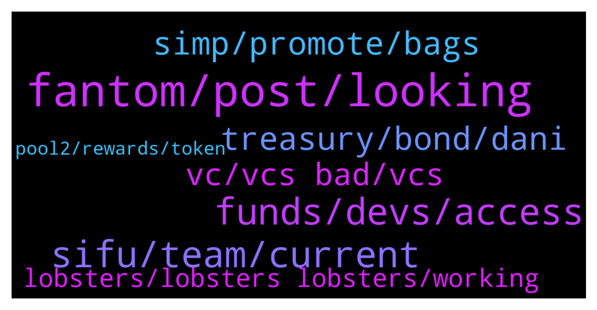

# **@lobsters_chat**
 ## Analysis for **2022-01-18** - **2022-01-19**.

---

## 📊 **Basic Stats**

**n_messages_sent**: 347

---

---

## 🔝 **Top keywords and related messages**

1. **fantom, post, looking**

    @dpbmaverick98 --- *Anyone with a discord guide to build a community on it, tips and experience, anything will be appreciated!* **--->** [TG Discussion](https://t.me/lobsters_chat/316660)

    @duckdegen --- *Where would you post such a thing besides gearbox? I'm already helping you out on gearbox 🙂* **--->** [TG Discussion](https://t.me/lobsters_chat/316421)

    @ivangbi --- *No, only allowed to post this in gearbox discord.* **--->** [TG Discussion](https://t.me/lobsters_chat/316419)

    @philippvienna --- *maybe post start of thread? https://twitter.com/ForwardAnalytic/status/1483409941537107968* **--->** [TG Discussion](https://t.me/lobsters_chat/316443)

    @duckdegen --- *Is it ok to post here advertising that i'm looking for a job?* **--->** [TG Discussion](https://t.me/lobsters_chat/316418)

    @suzumiyachan --- *one of my friends asked me to help her with one, so i've been looking in to them as well. i'm not entirely sure what people are actually looking for in these things, it just seems like they want utility fanclubs?* **--->** [TG Discussion](https://t.me/lobsters_chat/316574)

2. **funds, devs, access**

    @svenblockchain --- *Actually reading (attempting to understand the legaleze - https://www.bailii.org/ew/cases/EWHC/Ch/2022/2.html) it seems he is claiming that nChain (BSV devs) are finishing up a tool to regain access to lost private keys. He is trying to attempt to force 15 other chain devs/companies to implement this or some similar feature in their chains so he can access 'his' funds again. But I could be reading it wrong.* **--->** [TG Discussion](https://t.me/lobsters_chat/316717)

    @svenblockchain --- *This is such a confusing article. He is suing SV Devs? But if you read the article it seems as though he is suing 15 defendents, including most Bitcoin forks, to rewrite the protocol in suh a way that he can regain access to his lost(stolen) keys? What? He lost them post-fork?* **--->** [TG Discussion](https://t.me/lobsters_chat/316714)

    @Nicolas_A --- *Hey guys did this guy got abused by the discovered Multichain bug of yesterday ? https://etherscan.io/tx/0x9600fea499fdbb708d1669b725eb693e08371a883d01054e66cfca13ff925f35 His WETH were sent out to a contract upon arrival on Ethereum mainnet  His address is 0xC02aaA39b223FE8D0A0e5C4F27eAD9083C756Cc2* **--->** [TG Discussion](https://t.me/lobsters_chat/316519)

    @GoingUpTheApples --- *why didn't they white hat hack the funds? any other company would have exploited themselves then distributed funds later, surely* **--->** [TG Discussion](https://t.me/lobsters_chat/316524)

    @ChiTimesChi --- *Is the WETH exploit actually Multichain rescuing users funds?* **--->** [TG Discussion](https://t.me/lobsters_chat/316397)

    @ivangbi --- *Everybody should be keeping $ snx ticker anyway lol* **--->** [TG Discussion](https://t.me/lobsters_chat/316674)

3. **sifu, team, current**

    @justsomedeveloper --- *the $10m mim on top was probably performance bonus/fee? https://snowtrace.io/tx/0xad036b8f46a40c9ef038c9e419a2c14ac829e8b3133c6de3a218dee06912364e* **--->** [TG Discussion](https://t.me/lobsters_chat/316630)

    @rektivist --- *@enderwiggins1 had a service solving the need which he promoted in Dec, but dunno what’s the current status* **--->** [TG Discussion](https://t.me/lobsters_chat/316264)

    @ivangbi --- *Idk about his ethos or motives outside of what I speculate to be the goalposts short-term here. Where? Rich if he succeeds, very poor if it goes down and he exits* **--->** [TG Discussion](https://t.me/lobsters_chat/316370)

    @alexn911 --- *very similar to Salvador's president swingtrading country's funds from his mobile* **--->** [TG Discussion](https://t.me/lobsters_chat/316625)

    @optional1t --- *Rofl wtf? Did they just took out mim to pay whatever he got liquidated for* **--->** [TG Discussion](https://t.me/lobsters_chat/316653)

    @Vezza95 --- *Still shady and a bad CFO keeek 😂 loosin money left and right* **--->** [TG Discussion](https://t.me/lobsters_chat/316628)

4. **treasury, bond, dani**

    @redrose2 --- *what if this happened with usdc usdt* **--->** [TG Discussion](https://t.me/lobsters_chat/316383)

    @ivangbi --- *Treasury here is in real assets and it’s almost 1:1 so it’s fine. The question is whether they will keep sticking to their bond narrative or pivot. @fiskantes seems to be still behind the bond model and “original vision” while Dani turned south and is now admitting to having done continuous ICO, ready to turn it into a VC fund* **--->** [TG Discussion](https://t.me/lobsters_chat/316406)

    @mrtdlgc --- *1hive have also been selling call options for HNY on hedgey finance to diversify treasury, specifically to get DAI in order to pay for contributors. i would call the experiment a success cause all the options sold a month ago hit the strike price and were exercised* **--->** [TG Discussion](https://t.me/lobsters_chat/316453)

    @alexn911 --- *yeah, everyone's left guessing. way to manage the treasury* **--->** [TG Discussion](https://t.me/lobsters_chat/316631)

    @alexn911 --- *like postfactum they tell you that this transaction is team allocation and the other is actually the treasury* **--->** [TG Discussion](https://t.me/lobsters_chat/316623)

    @tongnk --- *It's going to be big. Ribbon got treasury vaults soon. Solv has debt structuring* **--->** [TG Discussion](https://t.me/lobsters_chat/316435)

5. **simp, promote, bags**

    @ivangbi --- *^ successful simp, slid into DMs* **--->** [TG Discussion](https://t.me/lobsters_chat/316587)

    @Cat_Graphy --- *so if no simp, do we have rektdao?  https://twitter.com/ivangbi_/status/1483068996866179073?s=20* **--->** [TG Discussion](https://t.me/lobsters_chat/316571)

    @Pantani0x --- *Is veDAO in anybodys radar?  Solid idea imho but would love to hear opinions on it.* **--->** [TG Discussion](https://t.me/lobsters_chat/316479)

    @banteg --- *simping leads to a demise of civilization ser* **--->** [TG Discussion](https://t.me/lobsters_chat/316570)

    @SpikeSpiege1 --- *But sir where does frog nation fit into this master plan 🤔* **--->** [TG Discussion](https://t.me/lobsters_chat/316368)

    @suzumiyachan --- *it was a reverse simp 😌* **--->** [TG Discussion](https://t.me/lobsters_chat/316590)

6. **vc, vcs bad, vcs**

    @Father0x --- *imo it depends on the vc* **--->** [TG Discussion](https://t.me/lobsters_chat/316412)

    @Joel_john --- *so wait, are VCs bad or good? whats going on?  i thoguht VCs are bad but now everyone is becoming vc omggg* **--->** [TG Discussion](https://t.me/lobsters_chat/316411)

    @Theeylon --- *it depends on the VC, most will immediate dump yer tokens* **--->** [TG Discussion](https://t.me/lobsters_chat/316417)

    @ivangbi --- *I think @tongnk might have stats on this cc* **--->** [TG Discussion](https://t.me/lobsters_chat/316431)

    @ivangbi --- *Where is the extra crv coming from?* **--->** [TG Discussion](https://t.me/lobsters_chat/316336)

    @Joel_john --- *i was kidding bro, obv has a lot of nuance to it* **--->** [TG Discussion](https://t.me/lobsters_chat/316413)

7. **lobsters, lobsters lobsters, working**

    @ivangbi --- *Blz don’t shill before then. Until they gib seafood money, we should hate them all ^_^ lol* **--->** [TG Discussion](https://t.me/lobsters_chat/316670)

    @RickCrosschain --- *Make them pay! Long live the lobsters!* **--->** [TG Discussion](https://t.me/lobsters_chat/316712)

    @ivangbi --- *Yes, I been working on pushing them gib lobsters perks and get them to the bridge side of supporting Andre instead of farma-dampa* **--->** [TG Discussion](https://t.me/lobsters_chat/316666)

    @ivangbi --- *I heard there is a real ve-one coming up. For lobsters, with lobsters.* **--->** [TG Discussion](https://t.me/lobsters_chat/316492)

    @svenblockchain --- *It's only accessible for lobster holders* **--->** [TG Discussion](https://t.me/lobsters_chat/316265)

    @farm42 --- *I’m in Sir, We can organize ourselves at the base of the lobsterDAO, but the Q is if community neededs that?* **--->** [TG Discussion](https://t.me/lobsters_chat/316260)

