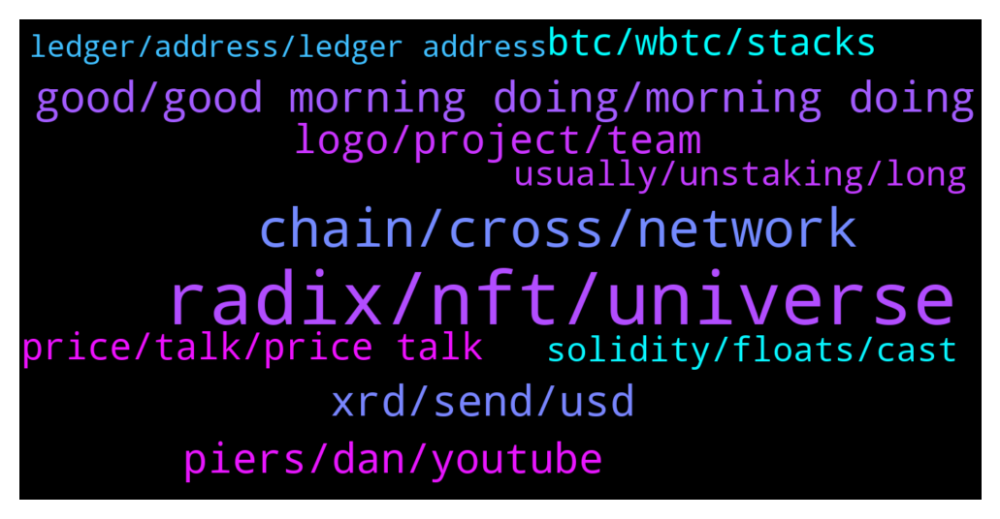

# **@radix_dlt**
 ## Analysis for **2022-01-18** - **2022-01-19**.

---

## 📊 **Basic Stats**

**n_messages_sent**: 487

---

---

## 🔝 **Top keywords and related messages**

1. **radix, nft, universe**

    @soulkiller7 --- *Radix is also mentioned on Quants front page of their website 👀* **--->** [TG Discussion](https://t.me/radix_dlt/342799)

    @pspk_janasena --- *I think radix foundation and radix works are both different entities* **--->** [TG Discussion](https://t.me/radix_dlt/342287)

    @peterkimkz --- *That's right, I don't want Radix to make enemies, especially they have many VCs backing, that's no good for our future :)* **--->** [TG Discussion](https://t.me/radix_dlt/342485)

    @happyDog44647 --- *Thank you! This potentially be Unniswap of Radix right?* **--->** [TG Discussion](https://t.me/radix_dlt/342444)

    @Cpt_Charles --- *https://discord.com/channels/417762285172555786/765994894749597697/932665002178002955  https://discord.com/channels/417762285172555786/765994894749597697/931734621111074856  I did find this in the Radix discord, not sure if it’s what u were after* **--->** [TG Discussion](https://t.me/radix_dlt/342949)

    @chrisijoyah --- *NFTs seems like the most popular Radix project so far 😁* **--->** [TG Discussion](https://t.me/radix_dlt/342602)

2. **chain, cross, network**

    @fpieper --- *I tend to say there will be a single relevant protocol in the long term. Of course I am talking about decades and not tomorrow, maybe 10-20 years.  With cross-chain you will always have security issues in your consensus (regarding cross-chain activity).* **--->** [TG Discussion](https://t.me/radix_dlt/342181)

    @fpieper --- *At least Vitalik already realised that the future will be "multi-chain" (his wording for sharding), but not cross-chain 🤟* **--->** [TG Discussion](https://t.me/radix_dlt/342162)

    @Bent --- *Does this mean that there will be a single protocol (e.g. Ethereum) and none others, or that the protocols that do exist (e.g Ethereum+Cardano+Algorand) will have such good interoperability between eachother that they will be considered a single network?* **--->** [TG Discussion](https://t.me/radix_dlt/342179)

    @fpieper --- *Ergo is not sharded though? And therefore unable to scale in the long term 🤷‍♂* **--->** [TG Discussion](https://t.me/radix_dlt/342454)

    @mx471 --- *@fpieper would other sharded networks also be able to reach millions of TPS (regardless of AC)? Near, Elrond, Cosmos etc.* **--->** [TG Discussion](https://t.me/radix_dlt/342209)

    @fpieper --- *Yeap, network effects are huge. It is similar why one unified internet is much more powerful than multiple smaller "internets" (which are not really compatible with each other). For us having multiple internets sounds crazy, the folks in 20 years will think the same about DLTs.* **--->** [TG Discussion](https://t.me/radix_dlt/342158)

3. **good, good morning doing, morning doing**

    @Alex --- *Awesome thank you Jacob, must have missed that one!* **--->** [TG Discussion](https://t.me/radix_dlt/342828)

    @fpieper --- *Thank you 👍, google translator helped 😂* **--->** [TG Discussion](https://t.me/radix_dlt/342166)

    @Adam_XRD --- *Writing them all up isn't really feasible as it was 3 days with just the odd bathroom break :D* **--->** [TG Discussion](https://t.me/radix_dlt/342129)

    @PeachyKeehn --- *hehe.  Yeah, I can only imagine* **--->** [TG Discussion](https://t.me/radix_dlt/342147)

    @fpieper --- *Yes, everything else would just be stupid 😂* **--->** [TG Discussion](https://t.me/radix_dlt/342431)

    @chrisijoyah --- *All good, we're working on something cool atm so we'll keep you posted 😉* **--->** [TG Discussion](https://t.me/radix_dlt/342101)

4. **xrd, send, usd**

    @Shang En --- *can someone help me to send 1 xrd to me...? i want to unstake but i don't have enough available xre lol* **--->** [TG Discussion](https://t.me/radix_dlt/342729)

    @BamboozleU2 --- *Guys what's the best price to enter in XRD 👀* **--->** [TG Discussion](https://t.me/radix_dlt/342390)

    @brambol --- *What coin should I send to Bitfinex? To buy XRD? What's the pair that allows me to buy it?* **--->** [TG Discussion](https://t.me/radix_dlt/342550)

    @Orbitalz --- *the bridge site needs a XRD back to EXRD converter* **--->** [TG Discussion](https://t.me/radix_dlt/342932)

    @WardNijmegen --- *XLM XRP or TRon are cheap to send* **--->** [TG Discussion](https://t.me/radix_dlt/342552)

    @Cryptosidebob --- *What's the cheapest place to get exrd or xrd I have on erc20 but bridged it to polygon on there wallet and now its stuck. Want to top up more at this price looking for the cheapest place any ideas family* **--->** [TG Discussion](https://t.me/radix_dlt/342649)

5. **piers, dan, youtube**

    @supermariogram --- *the texture of piers‘ hair in the latest tech AMA with dan is bullish af* **--->** [TG Discussion](https://t.me/radix_dlt/342103)

    @Jazzer9F --- *The latest technical AMA between RDX Works Founder Dan Hughes, and CEO Piers Ridyard is now live on YouTube!  https://youtu.be/Jn2FfMFzq0U* **--->** [TG Discussion](https://t.me/radix_dlt/342279)

    @Jacob_XRD --- *Dan has actually answered thos exact questions in a tech AMA on October or November, I’ll try find it for you!* **--->** [TG Discussion](https://t.me/radix_dlt/342827)

    @supermariogram --- *The latest technical AMA between RDX Works Founder Dan Hughes, and CEO Piers Ridyard is now live on YouTube!  https://youtu.be/Jn2FfMFzq0U* **--->** [TG Discussion](https://t.me/radix_dlt/342104)

    @thenotthatgreat --- *there is a youtube video, tried to find it, but seems to have drowned on youtube. you can look at willy woos twitter if that makes you more confident, he watched the demo and tweeted about it in 2018/19* **--->** [TG Discussion](https://t.me/radix_dlt/342810)

    @Jazzer9F --- *For those that missed it live, Piers did a fantastic interview with Cryptonites about how Radix is the only network where DeFi can thrive!   Watch it now: https://www.youtube.com/watch?v=WKoXP0c2C7Q* **--->** [TG Discussion](https://t.me/radix_dlt/342926)

6. **logo, project, team**

    @sebastiannumme1 --- *I mean the biggest project so far is Oci as i can see and the branding/marketing for that project is pretty sad. and the token logo????* **--->** [TG Discussion](https://t.me/radix_dlt/342316)

    @fpieper --- *You can get some airdros from Ociswap https://t.me/ociswap if you like. Disclaimer: I am part of the team 😂* **--->** [TG Discussion](https://t.me/radix_dlt/342443)

    @luke55 --- *First time I read that kind of feedback, what could Oci do better?* **--->** [TG Discussion](https://t.me/radix_dlt/342331)

    @chrisijoyah --- *I know most of these projects do it for marketing purposes too and to create short term buzz, but after the hype they all just seem to fade away.* **--->** [TG Discussion](https://t.me/radix_dlt/342543)

    @fpieper --- *Yes, Ociswap will be a pair wise Dex like Uniswap correct. However, we are currently exploring different approaches and ways to improve on it like protocol owned liquidity or on-ledger pool routing (routing in case of Uniswap is currently off ledger) or reduction of impermanent loss etc. But most of these things have trade-offs (like some POL dexes buy back the liquidity via the funds from an layer 1 developer grant e.g. from avalanche which is not sustainable). Or liquidity mining (staking LP tokens) is nice in the beginning but has the disadvantage that the rewards often run dry at some point and people jump to the next farming opportunity. Therefore our aim is to provide a reasonable and sustainable overall package 😊.* **--->** [TG Discussion](https://t.me/radix_dlt/342445)

    @sebastiannumme1 --- *i hope you have the slickest UI and will have a sick UX when website is launched because the design for the logo itself isnt well thought out and doesnt POP.* **--->** [TG Discussion](https://t.me/radix_dlt/342333)

7. **btc, wbtc, stacks**

    @fpieper --- *I didn't check how decentralised they are right now, they are probably more decentralised than wBTC ^^. I would probably bet more on cross-chain tech which wraps tokens on scalable ledgers. Also BTC has a bit a special position, it may continue to exist as wrapped token on the largest smart contract platform - who knows.* **--->** [TG Discussion](https://t.me/radix_dlt/342183)

    @TheWoodsman --- *So it's like an EVM Roll-up for BTC which then resolves on BTC mainchain through batched transactions? Presumably the sidechain is more centralised and vulnerable to bad actors then as compared to ETH itself? So there is no real advantage in terms of decentralisation or security as opposed to using wBTC on ETH DeFi?  It seems that there are BTC Maxis who would write off ETH/DeFi as scams and centralised and yet somehow consider Stacks worthy of use/investment. Seems hypocritical to me, just want to make sure I'm not missing something.* **--->** [TG Discussion](https://t.me/radix_dlt/342178)

    @TheWoodsman --- *@fpieper Have you looked at Stacks, the DeFi that seems to be a kind of BTC L2? As far as I can see it's just a sidechain blockchain, so will have scalability limitations, but if there was anything more indepth than that I would keen to read it* **--->** [TG Discussion](https://t.me/radix_dlt/342171)

    @Rex --- *Finance will go DeFi, but a single global decentralized network of financial apps does a better job of efficiently allocating capital than the fragmented systems that exist today true but not sure about “a single” maybe multiples but single that’s impossible* **--->** [TG Discussion](https://t.me/radix_dlt/342155)

    @fpieper --- *They have some interesting tech https://stacks.org/stacks-blockchain , but in the end (besides their maybe clever way) they are a blockchain extending BTC with smart contracts. You have low finality of Bitcoin and also doesn't scale (since it is a blockchain)* **--->** [TG Discussion](https://t.me/radix_dlt/342174)

    @TheWoodsman --- *Sorry for my confusion, I'm comparing DeFi on Stacks to Eth DeFi using wBTC. So you're saying Stacks is more decentralised than Eth DeFi (when the underlying collateral is some kind of btc)* **--->** [TG Discussion](https://t.me/radix_dlt/342192)

8. **price, talk, price talk**

    @PR888DN --- *And no other major event coming up soon to boost the price?* **--->** [TG Discussion](https://t.me/radix_dlt/342873)

    @Alex --- *Guys without saying it is price talk. Are there any news I potentially missed, that the market reacts so strong in this direction?* **--->** [TG Discussion](https://t.me/radix_dlt/342771)

    @Kieran --- *No news. We are in a bear market* **--->** [TG Discussion](https://t.me/radix_dlt/342774)

    @Radstakes --- *We can't discuss that here, but please feel free to discuss in the trader channel* **--->** [TG Discussion](https://t.me/radix_dlt/342752)

    @gpel33 --- *Right now. But that's trader talk* **--->** [TG Discussion](https://t.me/radix_dlt/342392)

    @NotBen --- *Not to mention that people complain about low volume, but more volume means more trades, and more trades mean (in aggregate) you need buyers AND sellers* **--->** [TG Discussion](https://t.me/radix_dlt/342249)

9. **solidity, floats, cast**

    @Bent --- *The reason I ask is I'm reading a whitepaper for a project here which complains that you can't really implement traditional finance models in Solidity because you'd need floats to do those maths and Solidity doesn't have floats.* **--->** [TG Discussion](https://t.me/radix_dlt/342944)

    @MaximusGirthian --- *What do you need floats for? Do you have a link to the wp?* **--->** [TG Discussion](https://t.me/radix_dlt/342956)

    @korone_stan --- *can't you cast to float to do stuff and then cast back to int * 10 ^18 when you have to push through the tx? i ask as an idiot who has never worked with solidity* **--->** [TG Discussion](https://t.me/radix_dlt/342959)

    @Bent --- *Thank you. From that discussion it looks like floats won't be supported.* **--->** [TG Discussion](https://t.me/radix_dlt/342955)

    @thenotthatgreat --- *not sure how much you can do with the Decimal type* **--->** [TG Discussion](https://t.me/radix_dlt/342942)

    @Peter (HAM) --- *It makes sense to google something like "finance floating point integer". This is not a Solidity, Scrypto, etc. thing, but floating point numbers are not "good" enough for many situations.* **--->** [TG Discussion](https://t.me/radix_dlt/342965)

10. **usually, unstaking, long**

    @Tamás --- *A week ago it took me about 4-5 min.* **--->** [TG Discussion](https://t.me/radix_dlt/342924)

    @Peter (HAM) --- *When unstaking is there a way to figure out how many epochs waiting are left?* **--->** [TG Discussion](https://t.me/radix_dlt/342892)

    @yr12345678 --- *You can use https://www.radixscan.io/StakerDashboard.shtml to check the status of your unstaked request* **--->** [TG Discussion](https://t.me/radix_dlt/342309)

    @pangelovski --- *Hi, I am trying to unstake from a validator but its been 7 days now and I still havent seen my funds in my Radix wallet. Should it take this long to unstake?* **--->** [TG Discussion](https://t.me/radix_dlt/342307)

    @ericwastaken --- *it's been like 17 mins here, kinda weird* **--->** [TG Discussion](https://t.me/radix_dlt/342925)

    @Kazeracc --- *Minute or so usually, if not less* **--->** [TG Discussion](https://t.me/radix_dlt/342918)

