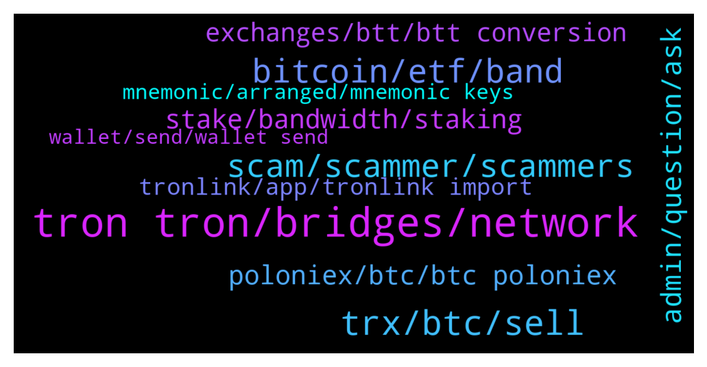

# **@tronnetworkEN**
 ## Analysis for **2022-01-18** - **2022-01-19**.

---

## 📊 **Basic Stats**

**n_messages_sent**: 357

---

---

## 🔝 **Top keywords and related messages**

1. **tron tron, bridges, network**

    @Carlos_TRX --- *TRON is a cryptocurrency, u can buy it in all big exchanges* **--->** [TG Discussion](https://t.me/tronnetworkEN/3841497)

    @Mutahar --- *Hello friends I am new here some one tell me how to earn tron* **--->** [TG Discussion](https://t.me/tronnetworkEN/3840109)

    @agentpiki --- *Bitrue is not tron network project as far as I know. So proceed with caution* **--->** [TG Discussion](https://t.me/tronnetworkEN/3840689)

    @Nemos13 --- *Tron and Fantom for long hold... Fan fact: Shib Inu and baby doge have more holders than ethereum and Bitcoin 😄😄* **--->** [TG Discussion](https://t.me/tronnetworkEN/3838097)

    @Carlos_TRX --- *https://tronwiki.com <—- there you can find all about TRON ecosystem and the right links mate* **--->** [TG Discussion](https://t.me/tronnetworkEN/3838175)

    @Adam --- *Are there any dex for Tron with decent liquidity? Also are there bridges to change between Tron and other chains?* **--->** [TG Discussion](https://t.me/tronnetworkEN/3840079)

2. **trx, btc, sell**

    @ttuanphong --- *Hi, is there a place where I can get some TRX for free? I am learning about cryptocurrencies. Thanks* **--->** [TG Discussion](https://t.me/tronnetworkEN/3841800)

    @alexachim --- *Ok I haven’t checked my ledger in a couple years , I thought I had nothing on there . Turns out I had a lot of trx erc 20 tokens on there. I read on the tron medium website that the only way to convert was using the tron smart contract where I sent everything. But it’s been a few hours with nothing back* **--->** [TG Discussion](https://t.me/tronnetworkEN/3838866)

    @jarcola --- *But I can sell trx for BTC* **--->** [TG Discussion](https://t.me/tronnetworkEN/3840649)

    @jarcola --- *I want to sell some trx for BTC and send BTC to another wallet* **--->** [TG Discussion](https://t.me/tronnetworkEN/3840568)

    @Silvernitrate1 --- *Where can I buy TRX with cheaper rate ?* **--->** [TG Discussion](https://t.me/tronnetworkEN/3841882)

    @Usama --- *By Mistakly i  will deposit usdt to Mera trx account* **--->** [TG Discussion](https://t.me/tronnetworkEN/3840346)

3. **bitcoin, etf, band**

    @Nemos13 --- *I am new to cryptocurrency markets but I am already loving it ..I like block chain and smart contract..If India band cryptocurrency...I leave this country 😄😄* **--->** [TG Discussion](https://t.me/tronnetworkEN/3838150)

    @Nemos13 --- *Sooner or later..they gonna regulate Bitcoin like ETF.. otherwise, Cryptocurrency will be band...they no longer can ignored the growing cryptocurrency industry..😄* **--->** [TG Discussion](https://t.me/tronnetworkEN/3838132)

    @Nemos13 --- *India and USA are bringing law this year to regulate crypto..* **--->** [TG Discussion](https://t.me/tronnetworkEN/3838145)

    @simon866 --- *All hope to make it rich because they where late on the other blockchains   Who knows they may even be right 😉* **--->** [TG Discussion](https://t.me/tronnetworkEN/3838098)

    @Nemos13 --- *This year will be the years of crypto regulations.. 😄😄* **--->** [TG Discussion](https://t.me/tronnetworkEN/3838140)

    @simon866 --- *If they could have stopped Bitcoin and crypto they would have a long time ago  It just shows they are too late and we have already won 👌* **--->** [TG Discussion](https://t.me/tronnetworkEN/3838137)

4. **scam, scammer, scammers**

    @mesirvemalanga --- *So much scam, is there a way to completely block people from contacting you here?* **--->** [TG Discussion](https://t.me/tronnetworkEN/3839400)

    @Hamedtx --- *I'm in Iran an Police nothing to do* **--->** [TG Discussion](https://t.me/tronnetworkEN/3838982)

    @Frankisblessed --- *Bro I don't even have a bank account I'm in deep shit I live in country called Lebanon that got rug pulled* **--->** [TG Discussion](https://t.me/tronnetworkEN/3838617)

    @agentpiki --- *CLOUD MINING = SCAM TRON MINING = SCAM  REFERRAL = SCAM RECRUIT MEMBER BONUS = SCAM* **--->** [TG Discussion](https://t.me/tronnetworkEN/3842010)

    @alexachim --- *Unfortunately this is the smaller of my scams I’ve fallen for* **--->** [TG Discussion](https://t.me/tronnetworkEN/3838884)

    @kamelion --- *@PiterSpain  This one is a scammer @LaurenSchmitt* **--->** [TG Discussion](https://t.me/tronnetworkEN/3839006)

5. **admin, question, ask**

    @alexachim --- *What’s the support tag in here to ask them a question* **--->** [TG Discussion](https://t.me/tronnetworkEN/3838850)

    @xPommepote --- *You already ask, we already answered to you.* **--->** [TG Discussion](https://t.me/tronnetworkEN/3838437)

    @jon_poole --- *I need to talk to the Dev* **--->** [TG Discussion](https://t.me/tronnetworkEN/3839298)

    @simon866 --- *You can make contact with devs from the developer hub here  https://developers.tron.network/* **--->** [TG Discussion](https://t.me/tronnetworkEN/3839304)

    @JohnAl999 --- *I have a great markiting proposal for you is there markiting admin or any admin to I talk about this proposal?* **--->** [TG Discussion](https://t.me/tronnetworkEN/3839231)

    @mySh1t2021 --- *Oh my god...thank you admin for this info.* **--->** [TG Discussion](https://t.me/tronnetworkEN/3839397)

6. **stake, bandwidth, staking**

    @afrifaba --- *Do I need Energy or Bandwidth before I can stake?* **--->** [TG Discussion](https://t.me/tronnetworkEN/3839747)

    @rima19940 --- *Isn't this a small amount of profit per year?* **--->** [TG Discussion](https://t.me/tronnetworkEN/3841407)

    @invivekworld --- *Where do u stake tron, and wht is APY* **--->** [TG Discussion](https://t.me/tronnetworkEN/3841089)

    @agentpiki --- *Highest now is 9% per year* **--->** [TG Discussion](https://t.me/tronnetworkEN/3841401)

    @rima19940 --- *Approximately how much profit per month* **--->** [TG Discussion](https://t.me/tronnetworkEN/3841398)

    @agentpiki --- *APR fluctuations according to amount staked* **--->** [TG Discussion](https://t.me/tronnetworkEN/3840759)

7. **poloniex, btc, btc poloniex**

    @jarcola --- *I’m not depositing BTC onto Poloniex. I want to swap trx for BTC. So do I swap trx for BTC then send to Poloniex ?* **--->** [TG Discussion](https://t.me/tronnetworkEN/3840598)

    @jarcola --- *So swap trx for BTC on Poloniex first* **--->** [TG Discussion](https://t.me/tronnetworkEN/3840604)

    @PiterSpain --- *Once you deposit in Poloniex you have BTC, just BTC. You can trade or withdraw using the original Bitcoin network or the TRON Network.  👇* **--->** [TG Discussion](https://t.me/tronnetworkEN/3840591)

    @jarcola --- *So once I sell trx for BTC on Poloniex it will be regular BTC?* **--->** [TG Discussion](https://t.me/tronnetworkEN/3840574)

    @agentpiki --- *Swap trx to btc in sunswap.com  then send btc to poloniex  this is possible right? @PiterSpain* **--->** [TG Discussion](https://t.me/tronnetworkEN/3840608)

    @agentpiki --- *Yes 100%. You have to understand how CEX wallets work. But it doesn't matter as long as your question is answered, right?  Going back to your question, yes.  If you own BTC in poloniex, you can transfer to any BTC wallet* **--->** [TG Discussion](https://t.me/tronnetworkEN/3840636)

8. **exchanges, btt, btt conversion**

    @jarcola --- *There is a buy or sell option* **--->** [TG Discussion](https://t.me/tronnetworkEN/3840650)

    @simon866 --- *Not at all, you are not supposed to hold BTC on exchanges   You have your own wallet and keys like a password same as you would need to log in anywhere* **--->** [TG Discussion](https://t.me/tronnetworkEN/3838125)

    @jarcola --- *So how do i get regular BTC?* **--->** [TG Discussion](https://t.me/tronnetworkEN/3840541)

    @Obiwan --- *Guys, anyone know why BTT can't withdraw from Hotbit? The old btt conversion process since Dec. 21, 2021 should have been completed. Why in the hotbit exchange the old BTT Conversion process is still not completed The old btt conversion process since Dec. 21, 2021 should have been completed. Why is the old BTT Conversion 1:1K  process hotbit exchanger still unfinished?* **--->** [TG Discussion](https://t.me/tronnetworkEN/3839277)

    @jarcola --- *And then do what with the BTC from there?* **--->** [TG Discussion](https://t.me/tronnetworkEN/3840610)

    @PiterSpain --- *SUNSwap.com (Check v2/v1.5/v1) Trontrade.io  And some /exchanges more* **--->** [TG Discussion](https://t.me/tronnetworkEN/3840083)

9. **tronlink, app, tronlink import**

    @afrifaba --- *They said I have to connect my Tron link before* **--->** [TG Discussion](https://t.me/tronnetworkEN/3839725)

    @Thinmartin --- *Please how to get  my new password  tronlink ? I will forget the first* **--->** [TG Discussion](https://t.me/tronnetworkEN/3839236)

    @Fabs_trx --- *Use Tronlink (import your wallet with your private key on tronlink)* **--->** [TG Discussion](https://t.me/tronnetworkEN/3838684)

    @agentpiki --- *No, tronlink referrals are suspended indefinitely. Useless points  Thank you for referring* **--->** [TG Discussion](https://t.me/tronnetworkEN/3839733)

    @agentpiki --- *You must connect your tronlink wallet to justlend.org of course* **--->** [TG Discussion](https://t.me/tronnetworkEN/3839727)

    @Carlos_TRX --- *In tronlink you have de option to deactivate it* **--->** [TG Discussion](https://t.me/tronnetworkEN/3839448)

10. **mnemonic, arranged, mnemonic keys**

    @Issaytt --- *If I try to put the mnemonic keys as I have written them down It might not access because it's not arranged* **--->** [TG Discussion](https://t.me/tronnetworkEN/3839583)

    @agentpiki --- *As long as you remember the correct mnemonic or private key  You are very very safe* **--->** [TG Discussion](https://t.me/tronnetworkEN/3839557)

    @Vijai Kumar --- *How to do backup  mnemonic* **--->** [TG Discussion](https://t.me/tronnetworkEN/3838905)

    @agentpiki --- *In what world you will not arrange mnemonic* **--->** [TG Discussion](https://t.me/tronnetworkEN/3839566)

    @Issaytt --- *It's being arranged  But I have the words* **--->** [TG Discussion](https://t.me/tronnetworkEN/3839569)

    @Issaytt --- *I'm looking on my note book I think I wrote it out But what happens to the mnemonic keys if they're not arranged properly* **--->** [TG Discussion](https://t.me/tronnetworkEN/3839559)

