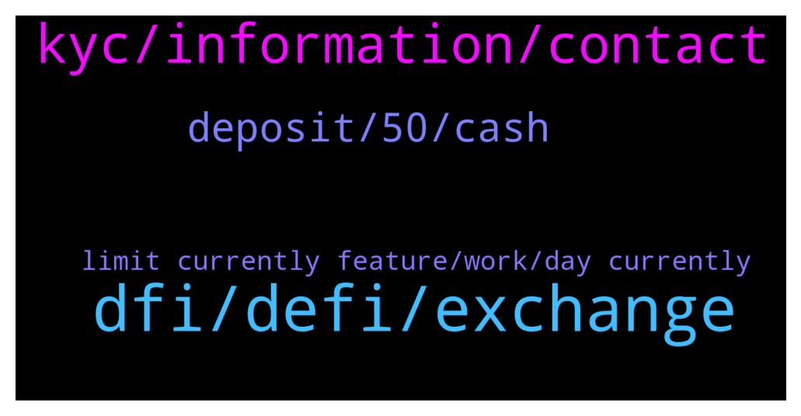

# **@CakeDeFi_EN**
 ## Analysis for **2022-01-19** - **2022-01-20**.

---

## 📊 **Basic Stats**

**n_messages_sent**: 150

---

---

## 🔝 **Top keywords and related messages**

1. **dfi, defi, exchange**

    @ExPwr --- *Guys, what is currently the cheapest, most recommended route to bring more assets into cake.defi? Would like to stay away from ERC20.* **--->** [TG Discussion](https://t.me/CakeDeFi_EN/166361)

    @zachgax --- *Those fees are negligible I feel in terms of swapping between different coins. Since there are many factors involved. The exchange you’re on, the fees they charge, and ultimate the price difference between the coin and dfi when you perform the swap.* **--->** [TG Discussion](https://t.me/CakeDeFi_EN/166382)

    @YSL --- *Is there a way to auto freeze the rewards from the freezer ?* **--->** [TG Discussion](https://t.me/CakeDeFi_EN/166384)

    @ExPwr --- *So LTC will be better than BTC in terms of the fees?* **--->** [TG Discussion](https://t.me/CakeDeFi_EN/166376)

    @UGilgamesh --- *Hi everyone! I'm wondering - having some tricky things to do to charge my Cryptopay card with some of my earned DFI (indeed, I have to swap DFI to dLTC in the light wallet, send dLTC to cake defi and then send LTC to my Cryptopay account and charge the card) - whether it is planned by Cake DeFi to provide some day a virtual card or something similar to pay directly from my Cake account.  Is that even a thing or I'm just dreaming about it?* **--->** [TG Discussion](https://t.me/CakeDeFi_EN/166349)

    @Ganative1978 --- *As far as impermanent loss, is it better to liquidity mine Defi against a stable coin such as tether, or better to stake it against something like litecoin? Or would something like Bitcoin versus Bitcoin cash be better??* **--->** [TG Discussion](https://t.me/CakeDeFi_EN/166759)

2. **kyc, information, contact**

    @krcnugr --- *Is my address paper accepted for government-approved account verification? color black white* **--->** [TG Discussion](https://t.me/CakeDeFi_EN/166156)

    @baskuy --- *I  am si many difficulties to do the vérification of my account.* **--->** [TG Discussion](https://t.me/CakeDeFi_EN/166236)

    @gottagrabthere --- *From uk how can I use my driving license to do my verification as don’t own a passport.* **--->** [TG Discussion](https://t.me/CakeDeFi_EN/166463)

    @Roxxiej --- *Thats the document I'm trying to upload as it has my address on its just my address so that you can see what I'm trying to insert* **--->** [TG Discussion](https://t.me/CakeDeFi_EN/166135)

    @Nith --- *Like within these many days after signing up ,as I had some issue's with verification* **--->** [TG Discussion](https://t.me/CakeDeFi_EN/166515)

    @DLR988 --- *KYC was done on 18th. My KYC is not completed yet. Whereas there was a time of 24 hours.* **--->** [TG Discussion](https://t.me/CakeDeFi_EN/166620)

3. **deposit, 50, cash**

    @fabioandreatta --- *Make a deposit bigger than $50 😉* **--->** [TG Discussion](https://t.me/CakeDeFi_EN/166512)

    @Hiikdje --- *deposit of 50 dollar worth of cripto and getting bonus working ?* **--->** [TG Discussion](https://t.me/CakeDeFi_EN/166240)

    @ExPwr --- *I assume it is 'CASH' but I'd like you to confirm.* **--->** [TG Discussion](https://t.me/CakeDeFi_EN/166498)

    @fadfunky --- *Hey guys, why sometimes i received btc as a reward LM, but sometimes didnt. 🤔* **--->** [TG Discussion](https://t.me/CakeDeFi_EN/166739)

    @ExPwr --- *Fabio, on your UI, when you want to deposit BCH it gives you two options: 'CASH' or 'LEGACY'. Please read my question and confirm what is the correct type to withdraw from KuCoin.* **--->** [TG Discussion](https://t.me/CakeDeFi_EN/166497)

    @ExPwr --- *Hi, KuCoin calls this 'Bitcoin Cash Node (BCHN)', is it 'CASH' on your UI, can you please confirm?* **--->** [TG Discussion](https://t.me/CakeDeFi_EN/166494)

4. **limit currently feature, work, day currently**

    @Michael_Schredl --- *Nope that won't work, you have to send them separately* **--->** [TG Discussion](https://t.me/CakeDeFi_EN/166700)

    @BerndMack --- *Sorry, there is no date for this functionality yet 😢* **--->** [TG Discussion](https://t.me/CakeDeFi_EN/166550)

    @DmgBautista --- *Hi! Currently no, that feature does not exist.* **--->** [TG Discussion](https://t.me/CakeDeFi_EN/166386)

    @DmgBautista --- *Hi! Currently, there are no such plans* **--->** [TG Discussion](https://t.me/CakeDeFi_EN/166350)

    @Michael_Schredl --- *No, there is no API Integration planned* **--->** [TG Discussion](https://t.me/CakeDeFi_EN/166172)

    @Nith --- *Is there  a time limit* **--->** [TG Discussion](https://t.me/CakeDeFi_EN/166513)

