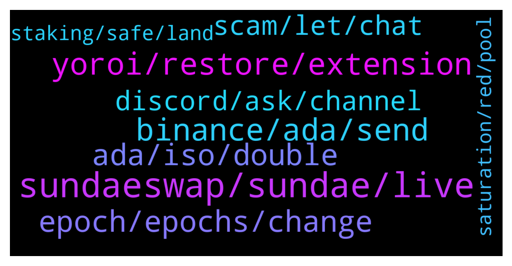

# **@Cardano**
 ## Analysis for **2022-01-19** - **2022-01-20**.

---

## 📊 **Basic Stats**

**n_messages_sent**: 388

---

---

## 🔝 **Top keywords and related messages**

1. **sundaeswap, sundae, live**

    @dstrategies --- *sundaswap has not launched yet (on the main net)* **--->** [TG Discussion](https://t.me/Cardano/772298)

    @tim_207 --- *When its posible tu buy sundaeswap?* **--->** [TG Discussion](https://t.me/Cardano/772704)

    @David --- *Can anyone explain what SundaeSwap is?* **--->** [TG Discussion](https://t.me/Cardano/772225)

    @Zyroxa --- *There is a offical sundaeswap discord channel : https://discord.gg/Sundae* **--->** [TG Discussion](https://t.me/Cardano/772838)

    @Randy --- *Can we directly swap ADA for SUNDAE token when the Dex goes live at 21:45utc?   Or only via Stake pools that we can earn Sundae* **--->** [TG Discussion](https://t.me/Cardano/772957)

    @Sasamihajlov --- *So,i can,wright? Where will i get sundae then?* **--->** [TG Discussion](https://t.me/Cardano/772979)

2. **yoroi, restore, extension**

    @No-Gate --- *Did anyone experience lagging in the Yoroi app while trying to delegate to a different pool today?* **--->** [TG Discussion](https://t.me/Cardano/771985)

    @cutyflame --- *i can even restore it on ccvault extension. but why cant restore on yoroi extension.  pls help. thanks man* **--->** [TG Discussion](https://t.me/Cardano/772021)

    @cutyflame --- *hello guys, i cant restore my yoroi wallet on chrome, but i can restore it on yoroi android. is there something wrong with the chrome extension version?* **--->** [TG Discussion](https://t.me/Cardano/772020)

    @ExInfernis --- *Because it downloads entire blockchain. You can always use different wallet* **--->** [TG Discussion](https://t.me/Cardano/771726)

    @DrNo8910 --- *Only other one I trust is Yoroi but ppl been sayin they had problemsI haven't tho. They always updating it.* **--->** [TG Discussion](https://t.me/Cardano/772530)

    @pool0AAAA --- *I use yoroi, but recently it has some problems* **--->** [TG Discussion](https://t.me/Cardano/771665)

3. **binance, ada, send**

    @ExInfernis --- *Even if i sent from binance everytime to one specific address they cant prove that it is mine. I can sent it to friend or family. It is still private* **--->** [TG Discussion](https://t.me/Cardano/771716)

    @Deadprez1411 --- *Hi all, l am trying to swap ada for sundae swap but it is saying that l have to use the testnet to join testnet.sundaeswap.finance then l cannot send any ada to nami testnet wallet, as l am trying to send some ada from binance to nami testnet wallet but there are no networks available to do this,* **--->** [TG Discussion](https://t.me/Cardano/772297)

    @Ilirkicks --- *Is there a way to have a private wallet address. I'm new to crypto I started a month ago. All "wallets" that come with coinbase or binance are connected to me since they know me through my documents. Is there a way to have a secret one for ADA or any crypto coin in general?* **--->** [TG Discussion](https://t.me/Cardano/771690)

    @Paradigm7 --- *Is this for ADA? Exodus apply?* **--->** [TG Discussion](https://t.me/Cardano/772596)

    @glitch04 --- *if exodus supports native assets in their wallet you would need to verify that with exodus/Sundae* **--->** [TG Discussion](https://t.me/Cardano/772599)

    @ExInfernis --- *Binance knows only the wallet on binance. They dont know to who you are sending right* **--->** [TG Discussion](https://t.me/Cardano/771719)

4. **ada, iso, double**

    @apex_pool_spo --- *they won't pay for distribution, you have to claim.* **--->** [TG Discussion](https://t.me/Cardano/772093)

    @apex_pool_spo --- *me neither. but anything can happen.  ISO is just the start, running a scooper node will be "forever". delegators don't realize that. that's what will probably bring real incomes for them.* **--->** [TG Discussion](https://t.me/Cardano/771761)

    @Eze_King --- *hi... some project said they would track people who double delegate to ISPOs to get double bonus awards?  How would they do this?* **--->** [TG Discussion](https://t.me/Cardano/772472)

    @glitch04 --- *They will be distributing their token after the iso* **--->** [TG Discussion](https://t.me/Cardano/772715)

    @glitch04 --- *It should count toward the distribution but not sure they can be stored there when you collect* **--->** [TG Discussion](https://t.me/Cardano/772600)

    @glitch04 --- *Yeah with delegation to their iso pool (s) they are just going to award those users additional tokens it's not a case where you risk impermanent losses and you still earn your ada rewards as well* **--->** [TG Discussion](https://t.me/Cardano/771957)

5. **epoch, epochs, change**

    @apex_pool_spo --- *you won't need, nothing will happen in 5 epochs (25 days).* **--->** [TG Discussion](https://t.me/Cardano/771766)

    @glitch04 --- *you have until the 25th so no if you move before the epoch, any further help you will need to ask in their support channel* **--->** [TG Discussion](https://t.me/Cardano/771809)

    @peeved82 --- *This current epoch ends on Jan 20, the next epoch ends on Jan 25.  How do I change Delegators between epochs?* **--->** [TG Discussion](https://t.me/Cardano/771731)

    @apex_pool_spo --- *you can change the stake pool anytime, but the change will be active at the epoch transition.* **--->** [TG Discussion](https://t.me/Cardano/771732)

    @CryptoM22 --- *is also confusing because after 20 days the first reward is paid, and in my case I have to switch pools.  but indeed at the time of the transaction you stake in the new pool.* **--->** [TG Discussion](https://t.me/Cardano/771615)

    @Zyroxa --- *You have to wait 3 full epochs before you receive any rewards.* **--->** [TG Discussion](https://t.me/Cardano/772237)

6. **discord, ask, channel**

    @No way she says --- *And what if they told me that that chat weren't the place to ask? (:* **--->** [TG Discussion](https://t.me/Cardano/772920)

    @andre426hemi --- *They're told me to ask here. You told me to ask there. 😂* **--->** [TG Discussion](https://t.me/Cardano/771932)

    @glitch04 --- *https://sundaeswap.finance/   Visit their site or their support discord listed above* **--->** [TG Discussion](https://t.me/Cardano/772226)

    @hansvb81 --- *And about this Telegram-channel: why do I get to see the welcome-message for every new join? Can this not be a private message? Thank you for reading my critical comments this morning (or afternoon/evening/... for wherever you are 😉)!* **--->** [TG Discussion](https://t.me/Cardano/772658)

    @glitch04 --- *You can ask in their discord support channel also* **--->** [TG Discussion](https://t.me/Cardano/772214)

    @apex_pool_spo --- *but you can ask for more details in their Discord.* **--->** [TG Discussion](https://t.me/Cardano/771780)

7. **scam, let, chat**

    @yogidan --- *me too. this is scam right? https://sundaeswap.finance/posts/wen-sundae* **--->** [TG Discussion](https://t.me/Cardano/772189)

    @TheC --- *Are scam attempts going rampant these days or its just me getting a lot of DMs? 🥱* **--->** [TG Discussion](https://t.me/Cardano/772868)

    @avishai4791 --- *Some stupid guy with your name Fabian called me  Stipid scam* **--->** [TG Discussion](https://t.me/Cardano/771685)

    @Bernard --- *Off to DMOR.  Thanks again.  Best wishes to all.* **--->** [TG Discussion](https://t.me/Cardano/771981)

    @Zyroxa --- *FYI: Since about one week I get approached DAILY by new contacts that either try some phishing attacks using URLs ("check out this giveaway/airdrop/...") - or they impersonate admins from here and say stuff like "thanks for buying cardano" or "thanks for reaching out to us" - afterwards they try to get personal/technical information or directly try to scam you by asking you to accept a giveaway or the typical "windows support" route: "Please pay this fee, so we can give you a lot of money" 💸  As soon as you show them, that you know what they're doing, they delete the chat history and block you - so usually I just report them and do the same. I don't know how many people have to deal with such annoyances but it happened a lot in the last week (relatively speaking) and I just wanted to let y'all know. I'm assuming they iterate through the user lists of these chat groups or something.. I don't know.   For anyone new to all this:  Don't fall for it, when some random new chat partner approaches you and states/asks anything important. Don't give out personal or important information. Check everything yourself instead of believing what they say. Don't let your guard down and always expect: If something is too good to be true, it unfortunately probably is. Creating fake websites is easily done with today's toolkits and when there is a way to exploit something, someone will try it. Good things are selfmade. Don't let evil people take those things away from you.  Best regards, A random stranger on the internet @TheBigLou13* **--->** [TG Discussion](https://t.me/Cardano/772830)

    @glitch04 --- *Launches are unfortunately the time where scammers come out of the woodwork* **--->** [TG Discussion](https://t.me/Cardano/772273)

8. **staking, safe, land**

    @TheBigBossK --- *Hey guys, I just realized I'm out of the loop with DEX.  Can you just put your money there to earn a no-risk interest like with staking?* **--->** [TG Discussion](https://t.me/Cardano/772635)

    @Mpd03 --- *Guys is it safe having your land on tokun instead of a wallet ?* **--->** [TG Discussion](https://t.me/Cardano/771995)

    @glitch04 --- *No trust required for staking as your funds remain in your control, you are just delegating the "balance" total for use in the network security of block creation* **--->** [TG Discussion](https://t.me/Cardano/771967)

    @Trey --- *Okay great is 5 percent staking good for cardano?* **--->** [TG Discussion](https://t.me/Cardano/772918)

    @Block101 --- *better than what your bank will give you that's for sure* **--->** [TG Discussion](https://t.me/Cardano/772922)

    @apex_pool_spo --- *not really, locking your coins in a DEX is not completely risk-free, like staking from your wallet.* **--->** [TG Discussion](https://t.me/Cardano/772637)

