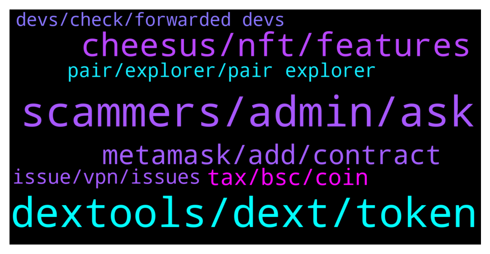

# **@DEXToolsCommunity**
 ## Analysis for **2022-01-18** - **2022-01-20**.

---

## 📊 **Basic Stats**

**n_messages_sent**: 366

---

---

## 🔝 **Top keywords and related messages**

1. **scammers, admin, ask**

    @hmk18990 --- *For the news, advertisements, sponsorships please DM @guillermorodriguez78 he's the only in charge (and he'll never DM you first)* **--->** [TG Discussion](https://t.me/DEXToolsCommunity/326896)

    @DiamondHandDaniel --- *You have read my DMs @pablojan but have given me no response  It's been weeks, please be professional and help us get this done* **--->** [TG Discussion](https://t.me/DEXToolsCommunity/325903)

    @cryptopete69 --- *it did show as this name, I already blocked this person anyway, sorry for the confusion* **--->** [TG Discussion](https://t.me/DEXToolsCommunity/326425)

    @jointhefuture4_0 --- *ah no, its a scammer indeed, with your username in his bio* **--->** [TG Discussion](https://t.me/DEXToolsCommunity/326683)

    @TheModBoss --- *Second referred me to the first one so they work together* **--->** [TG Discussion](https://t.me/DEXToolsCommunity/327114)

    @James --- *I am a professional telegram community manager I will love to be part of this  community project as an admin or a mod I believe I will create impact to the project growths please pm. I would love to be part of your  project* **--->** [TG Discussion](https://t.me/DEXToolsCommunity/327274)

2. **dextools, dext, token**

    @Natalia_Ave --- *To be honest DEXtools was one of things for my personal inspiration, especially your UI. There so many sources of info, things in one place and they don't seem like mess, but matches perfectly!   Future of DeFi is very hard to predict, but I believe that step by step DeFi will enter our daily routine in different ways!  done* **--->** [TG Discussion](https://t.me/DEXToolsCommunity/326110)

    @sunshinecrypto --- *Hi there! The number of holders listed on dext is very wrong from our actual holders. How do we get that fixed? This is for Kori Inu* **--->** [TG Discussion](https://t.me/DEXToolsCommunity/325985)

    @Ri_maxy --- *Hello. I need assistance with retrieving dext token into my wallet* **--->** [TG Discussion](https://t.me/DEXToolsCommunity/325869)

    @INF_king --- *Any help is much appreciated as this is an issue directly related to dextools (only shows on dextools) and destroyed our launching as we lost credibility since your app showed we are selling the marketing wallet constantly* **--->** [TG Discussion](https://t.me/DEXToolsCommunity/325759)

    @bastardganpunk --- *you should contact the support from this token. this is dextools support 🙂* **--->** [TG Discussion](https://t.me/DEXToolsCommunity/325672)

    @hmk18990 --- *this is dextools support guys so better to talk in https://t.me/DEXTtraderslounge for your other needs @GrowSilent* **--->** [TG Discussion](https://t.me/DEXToolsCommunity/326913)

3. **cheesus, nft, features**

    @Natalia_Ave --- *well it depends on feature itself  Main things we’ve done already: - Beta tools launch on https://cheesus.ai/en  - Analyzed Uniswap and Pancakeswap Trading activity https://uniswap.defirating.finance/  - list of the most profitable wallets trading on Uni & Pancake - list of the most tradable tokens on Uni & Pancake - DeFi & NFT projects report https://888defi.biz/crypto/  - NFT Holders report  - Token - token holders report for ETH, BSC, Avalanche and Polygon  - Profit - tracking all trading history on ETH and BSC networks  - NFT market data for all NFT projects on Opensea with inside information - Flippers - report of Flippers and Diamond Hands (real holders) ETH, BSC, Avalanche, Polygon tokens - Avalanche and Polygon expansion  - NFT Metaverse tracker   Our long term plans are quite simple:  1. Expanding on other blockchains: Solana, Polkadot, Kusama  2. Implementing new features: Tax calculation, Bridge analytics, more DEXes to track more projects and data to review. 3. Updating current features   it's all for Q1-Q2 2022!  done* **--->** [TG Discussion](https://t.me/DEXToolsCommunity/326073)

    @xbtwael --- *I saw Cheesus launched  https://cheesus.ai/en/main can you share what that is?* **--->** [TG Discussion](https://t.me/DEXToolsCommunity/326058)

    @Natalia_Ave --- *This is landing page for Cheesus project where you can find info about products, main usecases etc and go and try MVP tools already they are open for users!  done* **--->** [TG Discussion](https://t.me/DEXToolsCommunity/326060)

    @Natalia_Ave --- *we outperform with help of 2 points:   The first one is for NFT Metaverse Tracker  This unique feature opens unlimited access to the truth about any NFT metaverse! Choose the best NFT projects to follow, discover fake NFT wallets, market makers and pumpers and, find projects with live communities. Dive into NFT metaverses, take a look to see in-depth data and understand where any particular metaverse is headed.  and as for Onchain Truth  This feature gives you access to things that are hidden in blockchain in form of reports for  - Flippers and Diamond hands  - The most profitable wallets  - Gem tokens  - Insider, fake wallets  done* **--->** [TG Discussion](https://t.me/DEXToolsCommunity/326069)

    @Natalia_Ave --- *Cheesus provides pure data and objective metrics to give you onchain truth, but we don't give you any financial advices or fully ensure security of any project  So metrics for every project includes: - project profit and loss  - different types of holders e.g. traders, who bring life by selling and buying tokens, holders, who just hold tokens, do nothing with them, freeloaders who receive tokens by airdrop or any free distribution. Moreover we can track bots and fake wallets who pump prices and increase trading volume.  These data show how active the project are and you can conclude whether the project is worth investing in.  done* **--->** [TG Discussion](https://t.me/DEXToolsCommunity/326087)

    @Natalia_Ave --- *Right! TGE is scheduled on 20 January and let's look through utilities  Paying for API access - our API is open and you can create your own applications and tools using our data and pay for it with the Cheesus token.  Paying for subscriptions  We are making 5 types of subscription where one of them is fully free.  As I've mentioned before MVPs are ready to use and some features are available.  According to our subscription system you'll need fixed amount of tokens to get access to expanded features including copytrading bot, VIP chat, API access and others.   Staking/Farmig token rewards   Data mining rewards + DAO governance  For this purpose we've made an achievement system, where it is users who decide to give achievement or not! Also you can create new ones.  For example they are: best researcher, best NFT researcher, best language localizator, project auditor.   and as we are launching soon, we prepared some perks for users!  Unlimited access to Cheesus’ premium services Access to private airdrops A passkey to NFT drops Bonuses when using Strong & Weak Hands staking A subscription to weekly newsletters with project reviews Access to a closed Discord channel with insider info Private Diamond Hands & Flippers report  done* **--->** [TG Discussion](https://t.me/DEXToolsCommunity/326064)

4. **metamask, add, contract**

    @Olliver --- *Thank you for anwsering, dont know what roc is so i have not haha, is it another wallet or whats rpc?* **--->** [TG Discussion](https://t.me/DEXToolsCommunity/325641)

    @pablojan --- *Yes sir, it is added, sorry for not giving feedback, sometimes too much chats to process* **--->** [TG Discussion](https://t.me/DEXToolsCommunity/326001)

    @INF_king --- *Ok i can't post links I'll give the contract address 0x22F91a81c850994523b5c16bB42365b88ba47B40* **--->** [TG Discussion](https://t.me/DEXToolsCommunity/325756)

    @JoeyDieleman --- *Please give the contract of the token.* **--->** [TG Discussion](https://t.me/DEXToolsCommunity/325986)

    @MOONLIGGHTTT --- *any other way to do it* **--->** [TG Discussion](https://t.me/DEXToolsCommunity/327217)

    @MOONLIGGHTTT --- *there might be a way to exchange* **--->** [TG Discussion](https://t.me/DEXToolsCommunity/327222)

5. **tax, bsc, coin**

    @trojantechltd --- *Says no activity , but it’s at 5 cents not 1 cent* **--->** [TG Discussion](https://t.me/DEXToolsCommunity/326504)

    @eou2020 --- *how does the total supply of 150M work with both networks ethereum and bsc* **--->** [TG Discussion](https://t.me/DEXToolsCommunity/325885)

    @bitmart255 --- *Any update about BSC token newly listed* **--->** [TG Discussion](https://t.me/DEXToolsCommunity/326854)

    @Natalia_Ave --- *we do have plan to implement tax calculation feature, firstly in beta version it will be quite simple, as we have already tool that helps you to calculate profit from your crypto trading and there will be just tax percentage in your country!  done* **--->** [TG Discussion](https://t.me/DEXToolsCommunity/326082)

    @DrBrickFlair --- *Where it displays every block, poocoin has a slider up top…it’s great for scalping 0 tax coins… Wasn’t sure if you had it under a different name* **--->** [TG Discussion](https://t.me/DEXToolsCommunity/326704)

    @Luis_Diiaz --- *thanks for the information, but the bot I'm talking about is the one that adds the new pairs that are created in the bsc network, I want to know how I can make the currency be published in that channel https://t.me/DEXTNewPairsBotBSC* **--->** [TG Discussion](https://t.me/DEXToolsCommunity/326132)

6. **issue, vpn, issues**

    @rpoole69 --- *Having same issue, no vpn, intermittent* **--->** [TG Discussion](https://t.me/DEXToolsCommunity/326483)

    @Monolithof --- *Ok the issue has been solved. Im back to standard account again* **--->** [TG Discussion](https://t.me/DEXToolsCommunity/325826)

    @matt_000110 --- *It is annoying. I think they gave up w me* **--->** [TG Discussion](https://t.me/DEXToolsCommunity/326241)

    @FredericDEXT --- *If there is any issue after changing it , let us know.* **--->** [TG Discussion](https://t.me/DEXToolsCommunity/327194)

    @JoeyDieleman --- *Services are restarting, maybe wait a few minutes* **--->** [TG Discussion](https://t.me/DEXToolsCommunity/326505)

    @hmk18990 --- *yup and this is another issue just arrived :) if anyone using US VPNs with CF DNS or CF Warp in the US probably will have issues.* **--->** [TG Discussion](https://t.me/DEXToolsCommunity/326499)

7. **pair, explorer, pair explorer**

    @rpoole69 --- *Good morning, yesterday I had asked about a screen which showed all transactions for a token no matter which pool.  Which I know would take some time.  How hard to add a drop down next to the current pair address specified, giving quick access to all available LP's for the current token on the pair explorer screen?* **--->** [TG Discussion](https://t.me/DEXToolsCommunity/327186)

    @Ri_maxy --- *I know this might sound dumb but please, where to I see the pair explorer?* **--->** [TG Discussion](https://t.me/DEXToolsCommunity/325912)

    @hmk18990 --- *it's working per-pair. that's why the page named "pair explorer". we can ask the devs if this can be possible in the future for us or not. if enough demand comes from community they can consider it. @FredericDEXT this is a request to show all txes for a contract instead of pair. thank you for the suggestion.* **--->** [TG Discussion](https://t.me/DEXToolsCommunity/326942)

    @bastardganpunk --- *You just need to add the token to your wallet to be able to see it. You can do it by clicking the little fox 🦊 in the pair explorer.* **--->** [TG Discussion](https://t.me/DEXToolsCommunity/325878)

    @rpoole69 --- *This pair is acting very strange, displaying duplicates, pauses for 30s then shows a bunch, etc bsc/pair-explorer/0x1ce76390dd210b9c9ae28373fdf79714206ecb73* **--->** [TG Discussion](https://t.me/DEXToolsCommunity/326530)

    @quadraziD --- *Hello! What is the price list for placing an ads banner in pair explorer section?* **--->** [TG Discussion](https://t.me/DEXToolsCommunity/326698)

