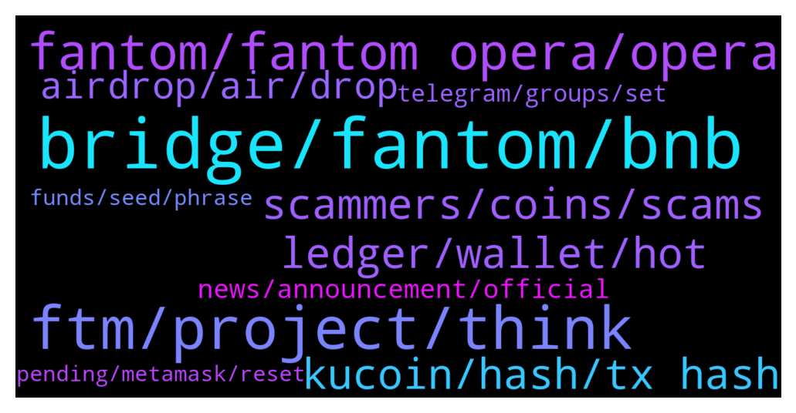

# **@Fantom_English**
 ## Analysis for **2022-01-19** - **2022-01-20**.

---

## 📊 **Basic Stats**

**n_messages_sent**: 424

---

---

## 🔝 **Top keywords and related messages**

1. **bridge, fantom, bnb**

    @KRYPTO_NIGHT --- *is there any recommended CEX currently brdging bsc to ftm please* **--->** [TG Discussion](https://t.me/Fantom_English/636676)

    @Janevietani --- *Helpful tip:   if you want a cheaper alternative than bridging ftm and paying eth gas From binance(US) ,crypto.com or kucoin, get BNB and withdraw as BNB BEP20, then use https://spookyswap.finance/bridge To bridge BNB BEP20 to BNB Fantom Then use spookyswap to swap BNB Fantom to FTM  You will need ftm gas for transaction. Use the faucet https://www.mentasuave01-tools.com/* **--->** [TG Discussion](https://t.me/Fantom_English/636922)

    @catsruledogsdrool --- *I'm trying to bridge and I keep on getting.... • Destination chain has insufficient liquidity to bridge. Please try again later.* **--->** [TG Discussion](https://t.me/Fantom_English/636520)

    @tazie --- *What’s the easiest way to bridge mainnet FTM to btc* **--->** [TG Discussion](https://t.me/Fantom_English/636954)

    @Janevietani --- *BUSD on BSC ? swap BUSD for BNB then bridge your BNB BEP2 to BNB Fantom using spookyswap bridge* **--->** [TG Discussion](https://t.me/Fantom_English/635663)

    @DrT0MO --- *I was told that fantom have a bridge by ferrum?  I spoke to ferrum and they said this:  We're already compatible with BSC, Ethereum, Polygon, Avalanche, Moonriver, and Fantom  It consists of our entire product suite of 8 products! These include 5 different Staking as a Service solutions, a revolutionary open ended Reflection Staking protocol  So I'm wondering if anyone here from fantom has used it? So I can give feedback to my team, if we should us it.* **--->** [TG Discussion](https://t.me/Fantom_English/635747)

2. **ftm, project, think**

    @perfumderose --- *I wanted to buy some FTM but I am confused by the 3 different tokens I have found.  Also I made two trial buys (small amounts) of FTM on Pancakeswap and poocoin I think and both transactions are visible on bscscan but the tokens have not appeared in my wallet.  And I did import them, the 3 FTM ticker symbols.  Why does it have to be so confusing and why don’t you explain how to buy some in your pinned message?  Also I tried Kukoin but I was unable to complete my registration there because of some circular computer reasoning- can’t explain.* **--->** [TG Discussion](https://t.me/Fantom_English/636129)

    @zenkert --- *Has this any connection with FTM?* **--->** [TG Discussion](https://t.me/Fantom_English/636073)

    @ZeZingh --- *guys does anyone know how do i pay with ftm on shopping . io* **--->** [TG Discussion](https://t.me/Fantom_English/635592)

    @Kay --- *I bridged ftm from eth network to ftm network and haven’t recieved yet.. is ftm network working ???* **--->** [TG Discussion](https://t.me/Fantom_English/636633)

    @Joe --- *Not to sure about it  But you need to be using ftm eco system* **--->** [TG Discussion](https://t.me/Fantom_English/635380)

    @Grim --- *Like I said the admin has laid down rules already. We want to hear more about ftm* **--->** [TG Discussion](https://t.me/Fantom_English/636185)

3. **fantom, fantom opera, opera**

    @Samuel --- *Thanks, really a fan of the fanthom ecosystem* **--->** [TG Discussion](https://t.me/Fantom_English/636461)

    @Bed of Roses Entertainment --- *Hello, good day everyone. Can someone please tell me about fantom? I just joined the project.* **--->** [TG Discussion](https://t.me/Fantom_English/636418)

    @ZarkNC --- *im inside, but should change it? instead of fantomtrading* **--->** [TG Discussion](https://t.me/Fantom_English/636443)

    @Janevietani --- *try join our discord at chat.fantom.network* **--->** [TG Discussion](https://t.me/Fantom_English/636102)

    @kreeda55 --- *Hi guys, I just have a guy called stelian message me saying he’s from the fantom team. I haven’t done anything yet or sent him anything* **--->** [TG Discussion](https://t.me/Fantom_English/636227)

    @PampBets --- *I voted fantom, but I also have high hopes for ONE* **--->** [TG Discussion](https://t.me/Fantom_English/636172)

4. **ledger, wallet, hot**

    @Fjody --- *Yes. Connect yout Ledger to fantom's PWA wallet and you can stake with some extra layer of security.* **--->** [TG Discussion](https://t.me/Fantom_English/636600)

    @Dimon --- *Can I store FTM on ledger?* **--->** [TG Discussion](https://t.me/Fantom_English/635433)

    @isaacberlin --- *Metamask is a hot wallet and ledger a cold wallet right?* **--->** [TG Discussion](https://t.me/Fantom_English/635319)

    @Riquacrpt0 --- *Can ftm be staked using ledger?* **--->** [TG Discussion](https://t.me/Fantom_English/636599)

    @Rico --- *go MM + ledger, i might be possible directly from ledger live but it's a garbage interface* **--->** [TG Discussion](https://t.me/Fantom_English/635335)

    @Mcjig --- *yes, using a ledger is preferred. extra security* **--->** [TG Discussion](https://t.me/Fantom_English/635316)

5. **scammers, coins, scams**

    @Tanglang1989 --- *HAHAAH 6 scammers already contacted me. Man, TG is such a mess* **--->** [TG Discussion](https://t.me/Fantom_English/635774)

    @Expresstail --- *Looks like you are one of the scammers, you have trouble when I post something against scammers.* **--->** [TG Discussion](https://t.me/Fantom_English/636182)

    @Expresstail --- *Scammers are claiming to send you 5000 FTM coins for 5 BNB coins. They are calling it a Airdrop.  Remb. Never do wallet transfers. No matter what  They mesg you as customer service or admin team.* **--->** [TG Discussion](https://t.me/Fantom_English/636153)

    @Expresstail --- *Scammers are claiming to send you 5000 FTM coins for 5 BNB coins. They are calling it a Airdrop.* **--->** [TG Discussion](https://t.me/Fantom_English/635617)

    @Nafez --- *scammers, please refrain from DMing me* **--->** [TG Discussion](https://t.me/Fantom_English/636738)

    @ricky787 --- *Scammers are relentless I just joined this chat and I have scammer already asking for my wallet address lol* **--->** [TG Discussion](https://t.me/Fantom_English/635548)

6. **kucoin, hash, tx hash**

    @Hasan --- *Hi. İ need help. İ sent ftm from trust wallet to kucoin. Token and chain is right but it didnt arrive for 9 hours. İs it normal ?* **--->** [TG Discussion](https://t.me/Fantom_English/635644)

    @Hasan --- *Why ftm is so slowly? İ send from wallet to kucoin 1 hour ago. But didnt arrive* **--->** [TG Discussion](https://t.me/Fantom_English/635366)

    @pedrong_mulat --- *Is there issue on the blockchain today? Most of my TXs failed, then was charged with TX fee* **--->** [TG Discussion](https://t.me/Fantom_English/635796)

    @Janevietani --- *Dm me your tx hash to @Mcjig . He will help you to check it* **--->** [TG Discussion](https://t.me/Fantom_English/635234)

    @pajamasfreak --- *You should be able to choose that during checkout* **--->** [TG Discussion](https://t.me/Fantom_English/635596)

    @Jannik_M --- *ok lol. MM said transaction failed but in fact fwallet shows that I did undelegate and will need to wait 7 days to claim.* **--->** [TG Discussion](https://t.me/Fantom_English/636013)

7. **airdrop, air, drop**

    @Johnnyfantom --- *Guys do a bit of research, read Andre's tweets etc, the airdrop is an NFT for the project, to be either used for voting or to sell. And please stop asking in this group* **--->** [TG Discussion](https://t.me/Fantom_English/635381)

    @Felix --- *what exactly must one do to qualify for the Ve3,3 AirDrop* **--->** [TG Discussion](https://t.me/Fantom_English/635815)

    @Stahr --- *Hi everyone :) is there an up and coming airdrop for fantom holders?* **--->** [TG Discussion](https://t.me/Fantom_English/636111)

    @zenkert --- *No airdrops ever, by the Fantom Foundation.* **--->** [TG Discussion](https://t.me/Fantom_English/636114)

    @Joe --- *I have brought t shares on tomb does that qualify for the air drop* **--->** [TG Discussion](https://t.me/Fantom_English/635299)

    @Joe --- *And will this count for the air drop* **--->** [TG Discussion](https://t.me/Fantom_English/635280)

8. **news, announcement, official**

    @Janevietani --- *if you dont see it on our announcement then its rumours or fake news* **--->** [TG Discussion](https://t.me/Fantom_English/636655)

    @Janevietani --- *it should not be official. never heard of those news* **--->** [TG Discussion](https://t.me/Fantom_English/636658)

    @Mcjig --- *https://t.me/fantomfoundation this is the announcements channel* **--->** [TG Discussion](https://t.me/Fantom_English/636420)

    @Antonio020 --- *I saw it on Twitter but idk if its the official Twitter or not, thats why i ask* **--->** [TG Discussion](https://t.me/Fantom_English/636657)

    @Drill123 --- *ROW is least bothered about this news.* **--->** [TG Discussion](https://t.me/Fantom_English/636046)

    @Brod111 --- *Yes you can visit the web for info about it* **--->** [TG Discussion](https://t.me/Fantom_English/636089)

9. **telegram, groups, set**

    @Expresstail --- *Scammers are adding you randomly to clone telegram groups. So settings-> privacy & security -> Groups -> Who can add me to groups -> change it to my contacts* **--->** [TG Discussion](https://t.me/Fantom_English/636706)

    @blockchain_Familia --- *IT SUCKS YOU CANT EVEN ASK A QUESTION ON TELEGRAM WITH OUT SCAMMERS* **--->** [TG Discussion](https://t.me/Fantom_English/636360)

    @Hogan120 --- *Hello, we want to do a telegram in Arabic for your currency* **--->** [TG Discussion](https://t.me/Fantom_English/635966)

    @Expresstail --- *EVERYONE PLEASE READ‼️‼️‼️‼️  🔴 Airdrops / free tokens = SCAM 🔴 Always double check you are in the official group and update your Telegram settings to only allow DMs and group invitations from known contacts  🔴 IF IN DOUBT, ASK AN ADMIN 🔴  Hey Everyone 🚨🚨🚨‼️‼️‼️If any scammer who acts as support/help desk/admin or whosoever writes u DM and they gonna send you some link for validation or whatever scamming link. Please send it to admins!!!   And please forward scammer messages @notoscam like this u report on them to Telegram.   📍Please read pinned messages    ✌️Everyone stay safe* **--->** [TG Discussion](https://t.me/Fantom_English/635685)

    @Janevietani --- *⬢ How to secure your #Telegram account? Use all of the tips below to stay safe from scammers and impersonators.  1️⃣ Change the default Privacy Settings of your account ≡ ➔⚙️ Settings ➔ Privacy and Security a) Phone number ➔ Set to »My Contacts« b) Calls ➔ Set to »My Contacts« c) Groups ➔ Set to »My Contacts« d) Security ➔ Two-Step Verification e) Advanced ➔ Set »Delete my account if away for« to »1 year«  2️⃣ Set unique username and profile bio ≡ ➔⚙️ Settings ➔ Edit profile a) Username b) Bio* **--->** [TG Discussion](https://t.me/Fantom_English/635635)

    @Expresstail --- *Only join, official groups on telegram. Fake groups also have members upto 20k. Reverify if you are in the legit group or not* **--->** [TG Discussion](https://t.me/Fantom_English/635633)

10. **pending, metamask, reset**

    @reandrisaja --- *Can I change it to my pending transaction? Or I should just wait for it to be sent / reverted* **--->** [TG Discussion](https://t.me/Fantom_English/635718)

    @Jannik_M --- *still strange that MM showed fails only and not a single tx confirmed* **--->** [TG Discussion](https://t.me/Fantom_English/636018)

    @tradecoin4fun --- *I have multiple stuck transactions on my Metamask. I seems like i need to pay high fee to cancel it. any suggestions?* **--->** [TG Discussion](https://t.me/Fantom_English/636580)

    @pajamasfreak --- *You can reset your metamask and all will revert back* **--->** [TG Discussion](https://t.me/Fantom_English/636581)

    @CryptoManiac 013 --- *To late i think it is out my metamask wallet or can i get it back* **--->** [TG Discussion](https://t.me/Fantom_English/636937)

    @Janevietani --- *go to metamask setting -> advanced -> reset then re-do tx* **--->** [TG Discussion](https://t.me/Fantom_English/635720)

