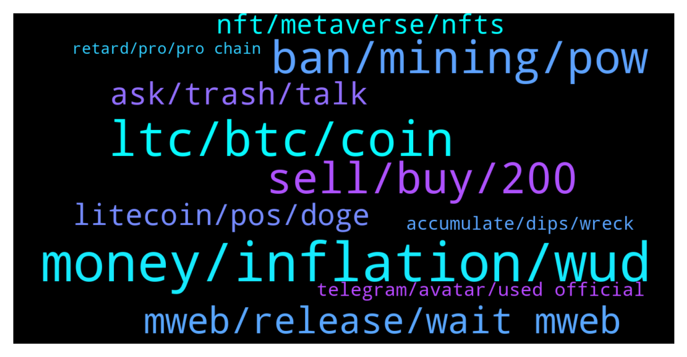

# **@Litecoin**
 ## Analysis for **2022-01-19** - **2022-01-20**.

---

## 📊 **Basic Stats**

**n_messages_sent**: 245

---

---

## 🔝 **Top keywords and related messages**

1. **money, inflation, wud**

    @Macro5674 --- *So we can all agree it's better than fiat, which is debt-based pyramid scheme where only cronies gets to climb above ranks , inflating our money by printing more constantly where our savings always devalued so that we always remain under pressure and keep people working ! And the fun fact is most of that printed money goes to corporates in loans which they don't even pay back mostly !* **--->** [TG Discussion](https://t.me/Litecoin/2050049)

    @Macro5674 --- *By the way employment anyways gonna decrease due to automation 😜 What wud inflationary world do when unemployed people have no money to buy things ? 🙃* **--->** [TG Discussion](https://t.me/Litecoin/2050027)

    @Macro5674 --- *It's not exactly more money , it's different form of money entirely altogether sir I think 🤔!* **--->** [TG Discussion](https://t.me/Litecoin/2049993)

    @Macro5674 --- *And we get no centralized authority printing out more money sir* **--->** [TG Discussion](https://t.me/Litecoin/2049996)

    @Macro5674 --- *That is true sir it won't solve class gap but it wud solve inflation maybe sir ! Fixed amount !* **--->** [TG Discussion](https://t.me/Litecoin/2049999)

    @Macro5674 --- *Yup I remember told me that before sir ! But I can't grasp how inflation is any good too ! 😕* **--->** [TG Discussion](https://t.me/Litecoin/2050003)

2. **ltc, btc, coin**

    @archus --- *LTC is still pow and the functions of Omnilite are kinda limited compared to real Smart contracts, so why should actually people make use of it when also payments web3 providers are implementing tokens, of various layer1 chains that are way superior to LTC to use in terms of speed, transaction fees, validation time and stability   What also does actually speak for LTC to be used as coin to purchase when its more likely to be a dropping stable coin rather than using upcoming DeFi stablecoins?* **--->** [TG Discussion](https://t.me/Litecoin/2049741)

    @K_arlso_n --- *LTC not have support from market... This is shit for MM and no more, LTC all short.* **--->** [TG Discussion](https://t.me/Litecoin/2049387)

    @arnego2 --- *Top 1+   I think that LTC is best placed in ecommerce.* **--->** [TG Discussion](https://t.me/Litecoin/2049633)

    @🔺ᬼ⃝ℝ🔺 --- *I don't support any coin I support my wallet I holded 5LTC  but I think cryptocurrency is a Bet. LTC is a second coin in the world after BTC but it never saw 500$ while many new coins X100 or X2000 for example LUNA and  SOL big number and big price but LTC can't fly because holders.  That's mean LTC doesn't have big dream it's a stoped coin  never can fly same YFI or ETH SOL DOGE AVAX XMR KCD BNB or many many coins are X10* **--->** [TG Discussion](https://t.me/Litecoin/2049270)

    @J --- *Check! How is your 0,1 ltc? Still hodling?* **--->** [TG Discussion](https://t.me/Litecoin/2049681)

    @RorschachTesst --- *The foundation should drop omni and go after metaverse providers and offer ltc as a in game currency. Microsoft is the next big player* **--->** [TG Discussion](https://t.me/Litecoin/2049631)

3. **ban, mining, pow**

    @RabbitL0v3r --- *EU also lookin to ban PoW coins* **--->** [TG Discussion](https://t.me/Litecoin/2049947)

    @finitemaz --- *there are some that think moonsie is satoshi* **--->** [TG Discussion](https://t.me/Litecoin/2049445)

    @Macro5674 --- *So I guess everything comes in it maybe ! Mining rigs, pool etc etc !* **--->** [TG Discussion](https://t.me/Litecoin/2049235)

    @Macro5674 --- *But but charlie said moonsie did that 🤔!* **--->** [TG Discussion](https://t.me/Litecoin/2049419)

    @Macro5674 --- *Okies just saw it again ! What he said was he going to build an open bitcoin mining system https://www.engadget.com/jack-dorseys-block-is-officially-building-an-open-bitcoin-mining-system-114033482.html* **--->** [TG Discussion](https://t.me/Litecoin/2049234)

    @Macro5674 --- *But in the end its creating a stateless , decentralized monetary system ! Moreover I heard pow just use less than 1% of world energy and more than 50% already turned into renewable source!* **--->** [TG Discussion](https://t.me/Litecoin/2049987)

4. **sell, buy, 200**

    @RabbitL0v3r --- *Ser, I sold, makin m0rket panic, hence why price is low 😔😔😔* **--->** [TG Discussion](https://t.me/Litecoin/2049682)

    @cvsridvan --- *If the price is 60, I will buy 200 ltc.* **--->** [TG Discussion](https://t.me/Litecoin/2049297)

    @syonfive --- *now i lost 60-70% of my money* **--->** [TG Discussion](https://t.me/Litecoin/2049244)

    @syonfive --- *will ltc goes up to 800$ ?? cause i have entry point 400$ with all my money (50$)  now my money worth 18-20$ .* **--->** [TG Discussion](https://t.me/Litecoin/2049876)

    @J --- *Thnx!! Sell order placed at $60,- and buy orders at $200,-..* **--->** [TG Discussion](https://t.me/Litecoin/2049707)

    @Goldy_X --- *Trading View Premium 1month Available 6$* **--->** [TG Discussion](https://t.me/Litecoin/2049980)

5. **mweb, release, wait mweb**

    @Ben --- *Most of us think of the same thing, which is the lightening network sudden jump can happen after mweb, the logic might be the same* **--->** [TG Discussion](https://t.me/Litecoin/2049456)

    @Zer0fact0r --- *If your coins are in mweb, you wouldn't want to go LN. It's inferior.* **--->** [TG Discussion](https://t.me/Litecoin/2049515)

    @ck42069 --- *Guys they say thry will release mweb last week of this month* **--->** [TG Discussion](https://t.me/Litecoin/2049776)

    @TonyNakamoto --- *is supp0seB'd B out within 2 weeks sjr* **--->** [TG Discussion](https://t.me/Litecoin/2049654)

    @TonyNakamoto --- *is not eBen release yet sjr* **--->** [TG Discussion](https://t.me/Litecoin/2049650)

    @ck42069 --- *Release mweb on the day that FED announces the first rate hike.* **--->** [TG Discussion](https://t.me/Litecoin/2049293)

6. **ask, trash, talk**

    @jon_poole --- *You aren’t ranked has any admin why are you replying me?* **--->** [TG Discussion](https://t.me/Litecoin/2049498)

    @bake_Crypto --- *Point is u can say it! It’s important imo* **--->** [TG Discussion](https://t.me/Litecoin/2049816)

    @jon_poole --- *Shut up and don’t talk again* **--->** [TG Discussion](https://t.me/Litecoin/2049495)

    @jon_poole --- *Don’t reply me you know nothing* **--->** [TG Discussion](https://t.me/Litecoin/2049492)

    @RabbitL0v3r --- *Cauz u ask a question lol* **--->** [TG Discussion](https://t.me/Litecoin/2049499)

    @Yhtrcgtfv566 --- *So your last name is 'Can'. What's your first name? Trash?* **--->** [TG Discussion](https://t.me/Litecoin/2049783)

7. **litecoin, pos, doge**

    @syonfive --- *i have buy ed litecoin at ath 400usd and wait for 800usd* **--->** [TG Discussion](https://t.me/Litecoin/2049243)

    @RabbitL0v3r --- *But eth gonna be PoS with eth2.0 and doge prolly too with help of vitalik* **--->** [TG Discussion](https://t.me/Litecoin/2049953)

    @Yhtrcgtfv566 --- *Doge? Come on man. That thing is merged mined with Litecoin so technically more like parasite POW mined. Vitalik has jack shit to say about all those nodes. Lord Musk even have more influence on doge.* **--->** [TG Discussion](https://t.me/Litecoin/2049972)

    @RabbitL0v3r --- *Its litecoin group, not some bad memes group* **--->** [TG Discussion](https://t.me/Litecoin/2049513)

    @RabbitL0v3r --- *Charlie Lee doesn't own litecoin, cannot force upgrade of the network without a consensus agreement of the network participant, hence the network is decentralized and has no owner, only participant* **--->** [TG Discussion](https://t.me/Litecoin/2049505)

    @PPCFTW1 --- *why is litecoin such a POS* **--->** [TG Discussion](https://t.me/Litecoin/2049283)

8. **nft, metaverse, nfts**

    @RorschachTesst --- *The metaverse can actually take us to top 3. With NFTs we're just chasing the trend* **--->** [TG Discussion](https://t.me/Litecoin/2049636)

    @RorschachTesst --- *Like go super hard on marketing for the metaverse. We absolutely cannot compete in the nft space* **--->** [TG Discussion](https://t.me/Litecoin/2049632)

    @Macro5674 --- *👆There is still legal confusion over what rights ownership one entails with nfts* **--->** [TG Discussion](https://t.me/Litecoin/2049845)

    @RabbitL0v3r --- *Metaverse crapto is just AR/VR NFT's* **--->** [TG Discussion](https://t.me/Litecoin/2049641)

    @arnego2 --- *Metaverse is not even in the kiddo shoes.* **--->** [TG Discussion](https://t.me/Litecoin/2049639)

    @arnego2 --- *NFT is a Fraction of ecommerce. Once people go belly up and you are big in NFT you have to suffer the consequences.* **--->** [TG Discussion](https://t.me/Litecoin/2049638)

9. **telegram, avatar, used official**

    @Gurpreet --- *I have been verified now what to do next* **--->** [TG Discussion](https://t.me/Litecoin/2049470)

    @Bkltrez --- *Is this telegram used for official communications as well?* **--->** [TG Discussion](https://t.me/Litecoin/2049627)

    @RabbitL0v3r --- *Get an avatar, put a telegram username then enjoy* **--->** [TG Discussion](https://t.me/Litecoin/2049472)

    @finitemaz --- *just a picture in your profile.  Anything.  It's a way to counter spam and bots* **--->** [TG Discussion](https://t.me/Litecoin/2049411)

    @finitemaz --- *But please get an avatar per @termsconditions* **--->** [TG Discussion](https://t.me/Litecoin/2049408)

    @bake_Crypto --- *Honestly! This is one of the best groups in telegram with the max amount of freedoms of expression.* **--->** [TG Discussion](https://t.me/Litecoin/2049805)

10. **accumulate, dips, wreck**

    @Congressional_Liason --- *Haha 😂 You are buying. Good luck scaring weak hands. You do you.   Everyone else, research, and let's think for ourselves.   Fake bearish charting and chronic fudders are here to wreck you while they accumulate the dips.  I enjoy a good dip. They will say it will go lower; then it will bounce. :D  Research the fundamentals, and upcoming events. The market will follow the improvements.* **--->** [TG Discussion](https://t.me/Litecoin/2049388)

    @Congressional_Liason --- *Well maybe. People who do that chronically think their posts affect them while they accumulate. Otherwise, they would not be here.   They wreck new owners and weak hands, but they don't care as long as they get more. I buy more when such posts increase, and the news is good, like now. :)    Think for Yourself, new people; the negative posters are buying too, that's why they are here.  Think for yourselves and enjoy.   I love these dips being long. Omnilite, MWEB, Flare, Adoption, Collaboration; it's all coming to LTC this year and soon when least expected.* **--->** [TG Discussion](https://t.me/Litecoin/2049383)

    @Congressional_Liason --- *Enjoy everyone. I accumulate the dips, and so do many bearish charters.   Research and think on your own, be cautious of letting them wreck you or create unnecessary fear while they accumulate despite what they say.  :)* **--->** [TG Discussion](https://t.me/Litecoin/2049384)

    @Congressional_Liason --- *Good people can be found. :) Enjoying the dips here. :)* **--->** [TG Discussion](https://t.me/Litecoin/2049380)

    @bake_Crypto --- *Maybe today makes second bottom for C. We will ser if it doesn’t dip to invalidation.* **--->** [TG Discussion](https://t.me/Litecoin/2049817)

    @Congressional_Liason --- *Some information but mostly whales are trying to scare new holders and wreck weak hands to replace them with long-term holders, like themselves.  Enjoy. :)* **--->** [TG Discussion](https://t.me/Litecoin/2049875)

