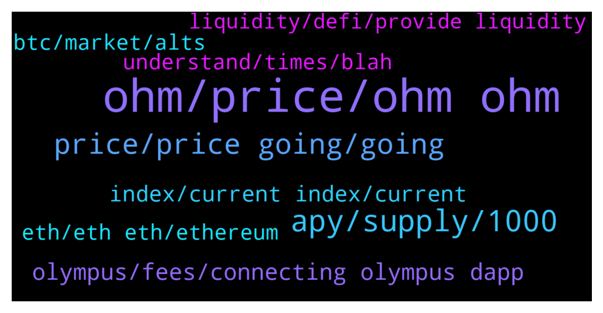

# **@OlympusTG**
 ## Analysis for **2022-01-19** - **2022-01-20**.

---

## 📊 **Basic Stats**

**n_messages_sent**: 1918

---

---

## 🔝 **Top keywords and related messages**

1. **ohm, price, ohm ohm**

    @chitangxxx --- *Is this the end of the ohm model then? That's what they are peddling on the other daos. Looks like time are very vocal a out moving away from this model. I own ohm, time, klima, Fort. FML.* **--->** [TG Discussion](https://t.me/OlympusTG/159758)

    @MaradoCrypto --- *Ohm shot up to $1400. If you were smart you would have taken your initial investment * 2 and then right now your be laughing . And you could sit through all this. So many buyers are going to come into Ohm at this price. There's no doubt. This thing is still at 800 million market cap... And it came out it may* **--->** [TG Discussion](https://t.me/OlympusTG/158776)

    @Danimal84 --- *Yea he is definitely pompous. But, I was interested more on your thoughts on the price floor.* **--->** [TG Discussion](https://t.me/OlympusTG/161221)

    @DIVIdoc --- *100 sOHM will be 1000 sOHM in just under a year.   Long term, who cares if the market determines that ohm is a $100 token.  Let the rebases do their thing.* **--->** [TG Discussion](https://t.me/OlympusTG/159173)

    @Pateinco --- *Is there anyplace with legit news on OHM? Seems like real information is sketchy. Even the website doesn’t have anything current.* **--->** [TG Discussion](https://t.me/OlympusTG/160147)

    @bodMIX --- *Don't let me compare OHM with other projects, there are competition in the market* **--->** [TG Discussion](https://t.me/OlympusTG/160950)

2. **apy, supply, 1000**

    @adrianbeveridge --- *No I haven’t. It was very clear that when price drops APY goes up !!!!! Don’t treat us like fools. This was made explicitly clear* **--->** [TG Discussion](https://t.me/OlympusTG/158915)

    @sbackes --- *Why would someone choose OHM over TIME since apy is so Much greater with TIME? Honest question.* **--->** [TG Discussion](https://t.me/OlympusTG/159317)

    @Host_Matt --- *Not sure why you’re using 1000 apy* **--->** [TG Discussion](https://t.me/OlympusTG/160603)

    @adrianbeveridge --- *Why is the APY not reflective of the low price. That’s what’s meant to happen when price goes down!!!!!!!!* **--->** [TG Discussion](https://t.me/OlympusTG/158908)

    @nfwaple --- *APY gets to 1% I think maybe a fraction of 1%* **--->** [TG Discussion](https://t.me/OlympusTG/161182)

    @nfwaple --- *APY falls as token supply expands, see OIP-18* **--->** [TG Discussion](https://t.me/OlympusTG/159188)

3. **price, price going, going**

    @MaradoCrypto --- *It wouldn't be 1 dollar cause then it wouldnt  have all happened at once like this and cascaded . New people would buy . Etc... It's the cascading that does it . Ya cause people don't know what time it is* **--->** [TG Discussion](https://t.me/OlympusTG/158784)

    @abe1738384 --- *when people say price is gonna go up, isnt that misinformation* **--->** [TG Discussion](https://t.me/OlympusTG/158948)

    @scardanelli --- *what do you mean in terms of %? the price itself is also going down...* **--->** [TG Discussion](https://t.me/OlympusTG/159073)

    @Ap0l1o --- *by doing so, we believe it should affect the price as well* **--->** [TG Discussion](https://t.me/OlympusTG/162113)

    @Cixex --- *Because volume jumped by 3X on massive sell off* **--->** [TG Discussion](https://t.me/OlympusTG/159116)

    @Bob_Crypto_Builder --- *Hopefully price stays low for another 2 weeks* **--->** [TG Discussion](https://t.me/OlympusTG/158632)

4. **olympus, fees, connecting olympus dapp**

    @lars900 --- *What really shocks me, is that the olympus price is even under the low from may* **--->** [TG Discussion](https://t.me/OlympusTG/159213)

    @Ap0l1o --- *You can bridge it from the Olympus page* **--->** [TG Discussion](https://t.me/OlympusTG/160713)

    @Wijaya0007 --- *If i want to buy? the right coin is olympus Dao V1 right?* **--->** [TG Discussion](https://t.me/OlympusTG/159556)

    @DayBe009 --- *How can I buy Olympus ?* **--->** [TG Discussion](https://t.me/OlympusTG/161808)

    @Esomo96 --- *Who can please give me his personal experience with Olympus so far?* **--->** [TG Discussion](https://t.me/OlympusTG/159896)

    @nfwaple --- *yea I am down too, I can't blame Olympus* **--->** [TG Discussion](https://t.me/OlympusTG/159924)

5. **index, current index, current**

    @nfwaple --- *Second pic: https://twitter.com/dopex_intern/status/1473439395999068162/photo/1  gohm does not increase, number of gohm x current index = number of sohm, gOHM price = OHM price x current index, current index increases every rebase, you can find current index on the dashboard of the olympus dapp, you can see your equivalent Staked balance in sOHM in the Stake page holding gOHM* **--->** [TG Discussion](https://t.me/OlympusTG/159852)

    @nfwaple --- *you can find the index on the website, 1 gOHM contains (current index) sOHM, if the index is 70 it means 1 gOHM = 70 sOHM* **--->** [TG Discussion](https://t.me/OlympusTG/159543)

    @nfwaple --- *haha look at gOHM it makes you feel better being index adjusted* **--->** [TG Discussion](https://t.me/OlympusTG/160312)

    @Ap0l1o --- *Current index is what increases with each rebase, so if the price of Ohm remains the same, the price of gOhm will increase.* **--->** [TG Discussion](https://t.me/OlympusTG/160777)

    @nfwaple --- *gOHM is wrapped staked OHM, there is a 'current index' on the website dashboard, gOHM is a wrapped staked version of OHM, 1 gOHM = (current index) OHM. If the index is 70, it means 1 gOHM contains 70 sOHM. That index increases every rebase* **--->** [TG Discussion](https://t.me/OlympusTG/160504)

    @nfwaple --- *1 gOHM = (current index) OHM. If the index is 70, it means 1 gOHM contains 70 sOHM. That index increases every rebase* **--->** [TG Discussion](https://t.me/OlympusTG/160528)

6. **btc, market, alts**

    @IAM7zero9 --- *BTC and ETH have also only been going down since November. Go figure.* **--->** [TG Discussion](https://t.me/OlympusTG/158275)

    @Ap0l1o --- *When btc drops or moves sideways, alts bleed, when sp500 and nasdaq drop, so does btc* **--->** [TG Discussion](https://t.me/OlympusTG/161521)

    @georgitimenov --- *So what if BTC went to the moon and from here everyone withdraw? 🤔* **--->** [TG Discussion](https://t.me/OlympusTG/159774)

    @S --- *So are we waiting for btc to stabilise?* **--->** [TG Discussion](https://t.me/OlympusTG/158547)

    @georgitimenov --- *I just give it as example to try to make you think that maybe there is case when will not depends of BTC* **--->** [TG Discussion](https://t.me/OlympusTG/159786)

    @mario_99990 --- *It is true in traditional stock market but crypto not   Why interest on usd increased   Because interest on stables in crypto reach 20 %* **--->** [TG Discussion](https://t.me/OlympusTG/159796)

7. **eth, eth eth, ethereum**

    @Kng3000 --- *Haha 😄,  as network engineer eth2 won't help until side chain and sharding comes out* **--->** [TG Discussion](https://t.me/OlympusTG/160360)

    @cdp279 --- *I haven’t bought eth in 4 years. Like 4k is insane lol* **--->** [TG Discussion](https://t.me/OlympusTG/160400)

    @bweet --- *Always more newbies as potential victims unfortunately. Just watched a guy get hit with the ole "send me one ETH and I'll double it in 10 mins" bit lol* **--->** [TG Discussion](https://t.me/OlympusTG/159980)

    @Arthur_0102 --- *eth trading hurts my heart with gas lol* **--->** [TG Discussion](https://t.me/OlympusTG/160122)

    @Arthur_0102 --- *watch me wait for too long then eth shoots back up to an ATH and then im gonna have to wait even longer 😂* **--->** [TG Discussion](https://t.me/OlympusTG/160126)

    @Kng3000 --- *I think eth will become cheap but I do not think you will see it day one* **--->** [TG Discussion](https://t.me/OlympusTG/160367)

8. **understand, times, blah**

    @Pim --- *I understand , but people dont understand.* **--->** [TG Discussion](https://t.me/OlympusTG/158581)

    @nfwaple --- *you prolly have some deep misunderstandings* **--->** [TG Discussion](https://t.me/OlympusTG/161262)

    @abe1738384 --- *all im saying is the term is a bit of a misnomer* **--->** [TG Discussion](https://t.me/OlympusTG/158881)

    @nfwaple --- *you seem to have misunderstood how it works* **--->** [TG Discussion](https://t.me/OlympusTG/158910)

    @nfwaple --- *if you're not going to be accurate in your statement, then don't come here to spread misinformation* **--->** [TG Discussion](https://t.me/OlympusTG/158946)

    @bodMIX --- *I done my homework but it doesn't fit to my vision, the is my point of view* **--->** [TG Discussion](https://t.me/OlympusTG/160969)

