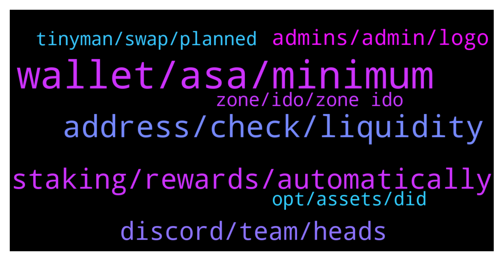

# **@algorand**
 ## Analysis for **2022-01-19** - **2022-01-20**.

---

## 📊 **Basic Stats**

**n_messages_sent**: 148

---

---

## 🔝 **Top keywords and related messages**

1. **wallet, asa, minimum**

    @martibro --- *you can swap on binance and sent it to algo wallet* **--->** [TG Discussion](https://t.me/algorand/334129)

    @qrtxzy --- *very newbie to algo  -  i went to the web site and there seems only to be a mobile wallet.  Are there any other wallets like desktop for window and/or linux - thanks* **--->** [TG Discussion](https://t.me/algorand/333867)

    @NightAlgorand --- *It says Insufficient balance, you need to keep a minimum of ALGO in your wallet .* **--->** [TG Discussion](https://t.me/algorand/333925)

    @MackDenver --- *If you add ASA to your wallet, your minimum ALGO requirement increases. If you want to remove ASA, you can do it from the wallet you are using* **--->** [TG Discussion](https://t.me/algorand/333707)

    @kramercrypto --- *You'd have to use a third party wallet like a Ledger, Exodus etc. Do not answer a DM about that.* **--->** [TG Discussion](https://t.me/algorand/333870)

    @hapsarinuha --- *Why i cant connect my algo?* **--->** [TG Discussion](https://t.me/algorand/333924)

2. **address, check, liquidity**

    @MackDenver --- *You can check it at https://algoexplorer.io/. Just input an asset ID, you will find an option check its holder and other stats.* **--->** [TG Discussion](https://t.me/algorand/333970)

    @MackDenver --- *Hello there,  In Algorand, there is asset ID which is quite similar like contracts. You can check the creator address in Algoscan.* **--->** [TG Discussion](https://t.me/algorand/333956)

    @MackDenver --- *If you scan an asset ID, you will be able to know it's creator and manager.* **--->** [TG Discussion](https://t.me/algorand/333967)

    @fatherAbraham1 --- *is there a way I can tell a contract address and a regular holder's address? Just as it is done on etherscan and bscscan?* **--->** [TG Discussion](https://t.me/algorand/333966)

    @MackDenver --- *I'm not sure about such tool. You can directly ask to the project's social media regarding it.* **--->** [TG Discussion](https://t.me/algorand/333959)

    @fatherAbraham1 --- *How then do we verify if the tokens they hold are vested?* **--->** [TG Discussion](https://t.me/algorand/333968)

3. **staking, rewards, automatically**

    @maze --- *Hello there I'm from Germany and got a question.  Heard about staking rewards automatically if you hold algorand.  In Germany you need to pay about 10 years taxes if you sell a staking coin.  Can I deactivate staking function?* **--->** [TG Discussion](https://t.me/algorand/333544)

    @NightAlgorand --- *You can simply stake you algo by keep it in your wallet. Please check the staking APY here 👉 https://algoexplorer.io/rewards-calculator* **--->** [TG Discussion](https://t.me/algorand/333620)

    @Nigel --- *Hey new to algorand. Is there algorand staking?* **--->** [TG Discussion](https://t.me/algorand/333616)

    @savvas1985 --- *Sry I’m new to this ecosystem . Where do you stake algo ?* **--->** [TG Discussion](https://t.me/algorand/333675)

    @Erdinc --- *Hello can somebody help me with my algorand* **--->** [TG Discussion](https://t.me/algorand/334095)

    @MackDenver --- *It's time for building on Algorand, looking forward to seeing it.* **--->** [TG Discussion](https://t.me/algorand/333975)

4. **discord, team, heads**

    @MackDenver --- *You should post about it in our discord  https://discord.gg/84AActu3at* **--->** [TG Discussion](https://t.me/algorand/333722)

    @MackDenver --- *I will check it with the team for confirmation. Thanks for the heads up.* **--->** [TG Discussion](https://t.me/algorand/333983)

    @MackDenver --- *You will get a reply soon* **--->** [TG Discussion](https://t.me/algorand/333731)

    @MackDenver --- *I will confirm with the team and let you know* **--->** [TG Discussion](https://t.me/algorand/334068)

    @NightAlgorand --- *Hi there, thank you for your feedback 🙂 We will look into it 🙂* **--->** [TG Discussion](https://t.me/algorand/333619)

    @NightAlgorand --- *I will keep you posted once we get the update 🙂* **--->** [TG Discussion](https://t.me/algorand/333595)

5. **admins, admin, logo**

    @Bhavnasatish --- *It's a lie. I understand the admins of this group have two accounts here , one with the group logo and they are using it to scam people* **--->** [TG Discussion](https://t.me/algorand/333933)

    @gabriel --- *how can you tell who's the admin then* **--->** [TG Discussion](https://t.me/algorand/333813)

    @fatherAbraham1 --- *I would appreciate if any of the admins could help me on this* **--->** [TG Discussion](https://t.me/algorand/333955)

    @Tiny_Philosopher_784 --- *Most admin here don't have the logo. They use a personal logo, but they have the word in the upper right hand corner that says admin. The name may be in color, but the word admin is either white or black. I use dark mode, so it's white for me.* **--->** [TG Discussion](https://t.me/algorand/333935)

    @NightAlgorand --- *Please do not spread false information, the admins here will never scam. Sometimes you will see people impersonate admins.  Please take a note, admins and our support will never DM you first 🙂* **--->** [TG Discussion](https://t.me/algorand/333934)

    @Bhavnasatish --- *Someone should warn the admin not to text me privately again* **--->** [TG Discussion](https://t.me/algorand/333801)

6. **tinyman, swap, planned**

    @Franklinsmooth --- *Not sure tinyman is working at the moment* **--->** [TG Discussion](https://t.me/algorand/333737)

    @NightAlgorand --- *Hi there, Tinyman will live soon, please stay tuned 🙂* **--->** [TG Discussion](https://t.me/algorand/333590)

    @aplszczykowski --- *Hello, is there any alternative to tinyman (swap)???* **--->** [TG Discussion](https://t.me/algorand/333588)

    @Kaypacha --- *Hi, is there any dex, beside tinyman, planned to release in the near future?* **--->** [TG Discussion](https://t.me/algorand/333889)

    @Rico_Hernandez --- *We need to wait for Tinyman now* **--->** [TG Discussion](https://t.me/algorand/334090)

    @NightAlgorand --- *You would have more clarity if you head to the tinyman group* **--->** [TG Discussion](https://t.me/algorand/333797)

7. **opt, assets, did**

    @rafamacias --- *Why do I have to block Algos again if, when the App failed, I did not see the previous opt-in's being released?* **--->** [TG Discussion](https://t.me/algorand/333705)

    @Pablo_cast --- *es un contrato nuevo, hay que opt-in otra vez* **--->** [TG Discussion](https://t.me/algorand/333756)

    @deadlypuppy --- *"Its a new contract, you have to opt in again"* **--->** [TG Discussion](https://t.me/algorand/333758)

    @rafamacias --- *I just want to go into real mode and I don't plan to add more assets but if I don't accept the opt-in of ALL the assets for which I already did it once, I can't continue.* **--->** [TG Discussion](https://t.me/algorand/333708)

    @rafamacias --- *I also want to remove some assets but you do not have the opt-out option active yet.* **--->** [TG Discussion](https://t.me/algorand/333706)

    @Erdinc --- *How can i activate it again* **--->** [TG Discussion](https://t.me/algorand/334097)

8. **zone, ido, zone ido**

    @dalila_turaeva --- *Hello! When will be Zone IDO?* **--->** [TG Discussion](https://t.me/algorand/334072)

    @Mohamed --- *Hi  Could anyone explain the above  Zone token  On algo* **--->** [TG Discussion](https://t.me/algorand/333764)

    @aplszczykowski --- *can You reveal something more specific? zone do is coming;)* **--->** [TG Discussion](https://t.me/algorand/333591)

    @empo1980 --- *nice! tks a lot for information!!* **--->** [TG Discussion](https://t.me/algorand/334130)

    @MackDenver --- *What is Zone? Please reach out to the project about it* **--->** [TG Discussion](https://t.me/algorand/334073)

    @Rico_Hernandez --- *Im trying to get into buying some Zone on IDO through Algorand* **--->** [TG Discussion](https://t.me/algorand/334077)

