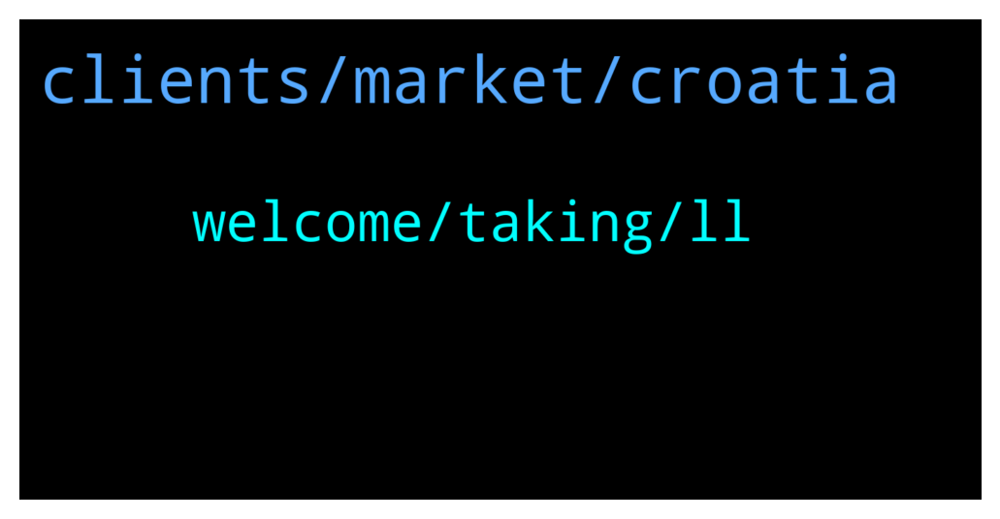

# **@ampnetapxchat**
 ## Analysis for **2022-01-15** - **2022-01-20**.

---

## 📊 **Basic Stats**

**n_messages_sent**: 46

---

---

## 🔝 **Top keywords and related messages**

1. **clients, market, croatia**

    @PFCBLic --- *Cool. Thanks for answer! So setup fee will be generating buybacks? Will this be visible as  public event?  I think validating that buyback actualy works is very important for future of this token  I understand that price cant be fixation for the team but some focus is to be expected since this community also supported this financial stabilty team has in upcomming period* **--->** [TG Discussion](https://t.me/ampnetapxchat/36622)

    @panos_dim --- *So AMPnet is focused purely in Croatia market?* **--->** [TG Discussion](https://t.me/ampnetapxchat/36550)

    @North --- *For the sports token take a look at Chiliz. Like a $1.2bn market cap project vs a $2m market cap here. Huge room for growth if AmpNet can capitalise on the Croatia deal and make some gains in that space* **--->** [TG Discussion](https://t.me/ampnetapxchat/36548)

    @jakovtradingmentor --- *We're focusing on tech integrations, development with our partners and educating clients on tokenization* **--->** [TG Discussion](https://t.me/ampnetapxchat/36536)

    @PFCBLic --- *Hey chat chief,  Any info on current business model? I mean about possible changes in it? If we dont generate income than buyback mechanism wont live. Paying for using your solution only upon successful funding is maybe questionable. Risk of failed campaign is on you instead on client side. Especially if you claim to be technology/solution provider.  I am here from beggining and i like vision for this project but are we going to see any adaptability on this road?  I support great efforts regarding onboarding of new clients and i like enthusiasm.  Stay safe!* **--->** [TG Discussion](https://t.me/ampnetapxchat/36619)

    @jakovtradingmentor --- *Yeah that is most likely because you have to add the contract in manually* **--->** [TG Discussion](https://t.me/ampnetapxchat/36473)

2. **welcome, taking, ll**

    @TroopSep --- *Hi @jakovtradingmentor! Thanks for taking care of us! Welcome! 😊* **--->** [TG Discussion](https://t.me/ampnetapxchat/36423)

    @tradingjo98 --- *Maybe you wanna tell us some things about you?* **--->** [TG Discussion](https://t.me/ampnetapxchat/36422)

    @jakovtradingmentor --- *good good, was a very busy week so friday is welcome* **--->** [TG Discussion](https://t.me/ampnetapxchat/36528)

    @jakovtradingmentor --- *Hey, welcome to the group Sera* **--->** [TG Discussion](https://t.me/ampnetapxchat/36441)

    @jakovtradingmentor --- *looking forward to hanging out with you all* **--->** [TG Discussion](https://t.me/ampnetapxchat/36424)

    @jakovtradingmentor --- *Thanks for the warm welcome :D* **--->** [TG Discussion](https://t.me/ampnetapxchat/36421)

