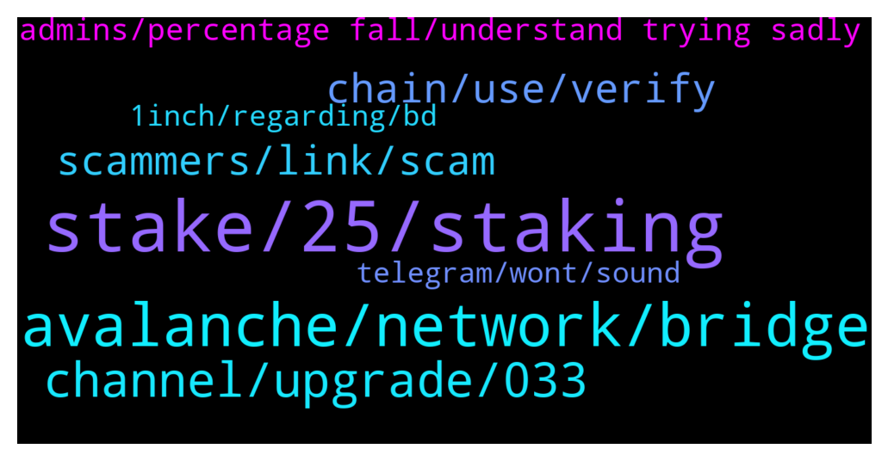

# **@avalancheavax**
 ## Analysis for **2022-01-19** - **2022-01-20**.

---

## 📊 **Basic Stats**

**n_messages_sent**: 146

---

---

## 🔝 **Top keywords and related messages**

1. **stake, 25, staking**

    @oathtobarbatos --- *2000 AVAX are required to stake. 25 to delegate.* **--->** [TG Discussion](https://t.me/avalancheavax/323285)

    @Crysis112 --- *What are the staking requirements for avalanche wallet ? I read somewhere you need 25 but yesterday I saw someone here saying you need to have 2000 and stake 25.* **--->** [TG Discussion](https://t.me/avalancheavax/323524)

    @Nicolas_A --- *Crypto.com , Bitfinex there are others but they don’t come up in my mind right now* **--->** [TG Discussion](https://t.me/avalancheavax/323539)

    @Jenkinz999 --- *For the stake in official eco system yes, 25* **--->** [TG Discussion](https://t.me/avalancheavax/323280)

    @cryptolemico --- *what is avax annual emission for staking?* **--->** [TG Discussion](https://t.me/avalancheavax/323420)

    @CypherBlock --- *I just started a short (15 day) validation period, so if anyone wants to earn some coins by delegating you have 1 day to do it (since minimum delegation period is 15 days). Let me know and I'll give my NodeID* **--->** [TG Discussion](https://t.me/avalancheavax/323445)

2. **avalanche, network, bridge**

    @Nicolas_A --- *Bridge.Avax.network if it’s on Ethereum else I would recommend synapse protocol / Celer network* **--->** [TG Discussion](https://t.me/avalancheavax/323216)

    @Cody_0x --- *Hey team. What is the rules re speaking about up and coming projects to avalanche?  I am invested in a project which is migrating to avalanche this month.   It is a diamond, trust worthy project with a great use case in my opinion.    Also, I am not affiliated with the project other than invested and support the team, I am curious what are the requirements if the team wants to do an ama on avalanche?  Who would they contact and what is required?  I am just reaching out for a bit of intel really that is all at the moment.* **--->** [TG Discussion](https://t.me/avalancheavax/323228)

    @Raffaeler --- *Hi guys, there is a bridge to bring avax from bsc to avalanche network? On anyswap avax is not supported, i need to bring avax because is first transaction. NO SCAMMER IN PM PLS* **--->** [TG Discussion](https://t.me/avalancheavax/323287)

    @jpwjs --- *Can anyone explain or link me to a resource that explain the difference between Avalanche consensus and snowman consensus.... I have read the docs... I am trying to find out how they work together and how C-Chain transaction undersnow man, being linear and not DAG... how can these transactions has the same finality as X-Chain transactions?* **--->** [TG Discussion](https://t.me/avalancheavax/323582)

    @JustZee12 --- *Best bridge for bnb/eth to avax?* **--->** [TG Discussion](https://t.me/avalancheavax/323211)

    @forbitspacex --- *Why we build protocol on Avalanche not support an recognized?* **--->** [TG Discussion](https://t.me/avalancheavax/323558)

3. **channel, upgrade, 033**

    @modelRh --- *How do I get Avax projects* **--->** [TG Discussion](https://t.me/avalancheavax/323401)

    @AlexDuvnjak --- *Someone stole 533 Avax from my account. Can anyone retrieve this?* **--->** [TG Discussion](https://t.me/avalancheavax/323242)

    @pimsilva --- *does avax have another rpc besides the default one?* **--->** [TG Discussion](https://t.me/avalancheavax/323391)

    @forbitspacex --- *We inform to avax support communication* **--->** [TG Discussion](https://t.me/avalancheavax/323565)

    @Crysis112 --- *Ah oké cool. Than I'll make a wallet and start transferring my avax . Thanks for the reply 👍* **--->** [TG Discussion](https://t.me/avalancheavax/323531)

    @Jowelkhan24 --- *Today Beta token is coming on avax* **--->** [TG Discussion](https://t.me/avalancheavax/323299)

4. **chain, use, verify**

    @kevinngzw --- *Celsius only use avax c chain to receive avax from other exchange right?* **--->** [TG Discussion](https://t.me/avalancheavax/323514)

    @Nicolas_A --- *Yes you can only use Metamask. Most exchange support C chain withdrawals* **--->** [TG Discussion](https://t.me/avalancheavax/323508)

    @Link4Questions --- *Anybody knows, which on doesn't need kyc..?* **--->** [TG Discussion](https://t.me/avalancheavax/323556)

    @Nicolas_A --- *Avax C  Exchange refer to X chain as avax and C chain as AVAX C (A bit weird I agree)* **--->** [TG Discussion](https://t.me/avalancheavax/323564)

    @Nicolas_A --- *mexc supports C chain and doesn't require verification under some amount* **--->** [TG Discussion](https://t.me/avalancheavax/323561)

    @Nicolas_A --- *I don’t know what they offer. If it’s an address starting with 0x it’s C chain if it’s X-avax it’s X chain.* **--->** [TG Discussion](https://t.me/avalancheavax/323515)

5. **scammers, link, scam**

    @Crysis112 --- *Wow the amount of scammers trying to contact you after 1 message is insane* **--->** [TG Discussion](https://t.me/avalancheavax/323532)

    @michael_moe --- *The scammers are relentless. The drive that they have is phenomenal* **--->** [TG Discussion](https://t.me/avalancheavax/323569)

    @JustmeRay --- *i will send the link to that here but i am suspecitng it COULD BE A SCAM so don't click on it until any admin confirm if is real or not* **--->** [TG Discussion](https://t.me/avalancheavax/323437)

    @Vlastimil --- *—God also wants you to stop this scam..* **--->** [TG Discussion](https://t.me/avalancheavax/323298)

    @oathtobarbatos --- *It's an obvious scam, do not enter any suspicious links! Also, be careful with anyone's DM.* **--->** [TG Discussion](https://t.me/avalancheavax/323237)

    @hooftly --- *Lol at all the scammers DMing me.  Keep wasting your time* **--->** [TG Discussion](https://t.me/avalancheavax/323386)

6. **admins, percentage fall, understand trying sadly**

    @THEREALTWENTEMINING --- *your bio says you're the expert* **--->** [TG Discussion](https://t.me/avalancheavax/323402)

    @Crysis112 --- *Sadly there's always a small percentage of people that fall for it.  Good thing that admins constantly post that admins will never DM you* **--->** [TG Discussion](https://t.me/avalancheavax/323535)

    @ale128888 --- *Hi sir, I have sent you a DM 😊* **--->** [TG Discussion](https://t.me/avalancheavax/323491)

    @sitoGGG --- *After this message , in my dm write 2 guys and tell me that he is a support(* **--->** [TG Discussion](https://t.me/avalancheavax/323316)

    @Outlawyer7 --- *Does anyone require help with proofreading or content writing? :D Just DM me.  Nominal charges. Work as per your desire. Help your boy out.  Thanks🥰* **--->** [TG Discussion](https://t.me/avalancheavax/323289)

    @JustZee12 --- *I've received 2 separate dms so far* **--->** [TG Discussion](https://t.me/avalancheavax/323222)

7. **1inch, regarding, bd**

    @Nicolas_A --- *BD team receives dozens of requests each day. They can't help everyone sadly. If you launch and get traction it will be easier to get noticed* **--->** [TG Discussion](https://t.me/avalancheavax/323570)

    @ale128888 --- *Hi, may I know who shall I speak to regarding applying for DApps grants and partnerships? thanks! 😊* **--->** [TG Discussion](https://t.me/avalancheavax/323484)

    @ale128888 --- *may I know if I can contact the BD here? Would love to explore opportunities for a partnership with our protocol. 😊🙏* **--->** [TG Discussion](https://t.me/avalancheavax/323362)

    @Rogi_7 --- *Hi, who may I talk to from the team regarding bis-dev and ecosystem growth?* **--->** [TG Discussion](https://t.me/avalancheavax/323433)

    @Cody_0x --- *Thanks for your reply. What is the best way to contact the marketing team?* **--->** [TG Discussion](https://t.me/avalancheavax/323232)

    @forbitspacex --- *We inform we fill form ! We available technically , we only need press and communication to community* **--->** [TG Discussion](https://t.me/avalancheavax/323571)

8. **telegram, wont, sound**

    @Al6666666 --- *Same, they call me at like 2am, wont let me sleep 🛌* **--->** [TG Discussion](https://t.me/avalancheavax/323457)

    @Al6666666 --- *I didn’t, jus the sound wakes you up, and i cant turn it off because i wont hear a alarm sound in the morning* **--->** [TG Discussion](https://t.me/avalancheavax/323473)

    @JustZee12 --- *😜🤪😂 like you would be stupid enough to answer a telegram call* **--->** [TG Discussion](https://t.me/avalancheavax/323467)

    @JustZee12 --- *Yeah, got a call 📞 from HELP LINE* **--->** [TG Discussion](https://t.me/avalancheavax/323224)

    @Nicolas_A --- *You can restrict who can call you in your telegram  privacy settings* **--->** [TG Discussion](https://t.me/avalancheavax/323472)

    @geekmidget --- *via Telegram, or to your actual phone number?* **--->** [TG Discussion](https://t.me/avalancheavax/323227)

