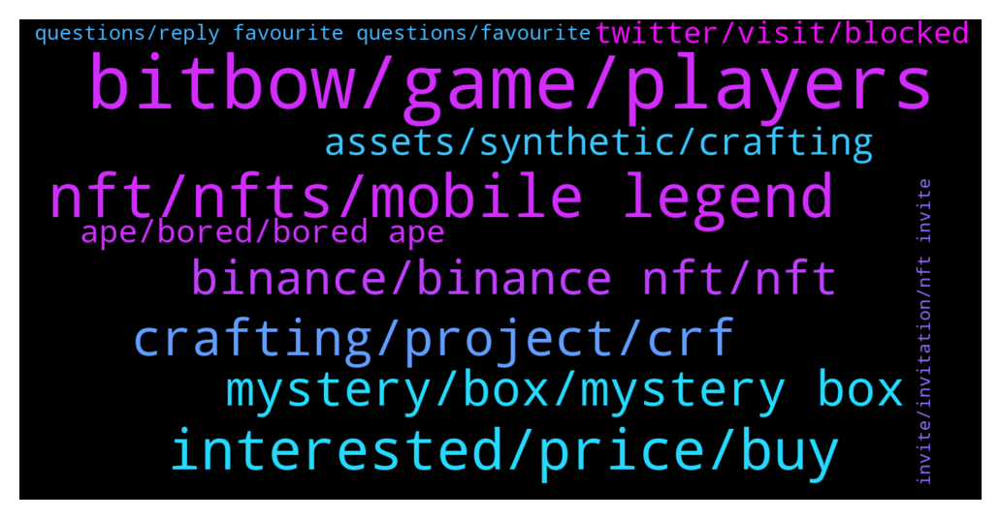

# **@binancenfts**
 ## Analysis for **2022-01-19** - **2022-01-20**.

---

## 📊 **Basic Stats**

**n_messages_sent**: 561

---

---

## 🔝 **Top keywords and related messages**

1. **bitbow, game, players**

    @YilanGulsum --- *Why "ARCHERY"? Why not other sports? Has there been any movie, book, game, etc. characters that gave you the idea of making a game about archery? #BitBow* **--->** [TG Discussion](https://t.me/binancenfts/438401)

    @TERRIFICZ --- *I’m actually a novice in blockchain game! How do I play BitBow on my laptop? (Any Blog/Video illustration for beginners) Does anyone can play it or any requirement for play?  #BitBow* **--->** [TG Discussion](https://t.me/binancenfts/438428)

    @Zoii_Khan --- *Where can i see the game play and roadmap? #Bitbow @dlee7769* **--->** [TG Discussion](https://t.me/binancenfts/438405)

    @Jallenreyesm --- *Based on my research, "Clubs" are the game guilds in BitBow. What are the advantages of becoming a club member in the BitBow? Also, who are those eligible to create a Club of their own?  #BitBow* **--->** [TG Discussion](https://t.me/binancenfts/438394)

    @dlee7769 --- *This is actually what makes BitBow stand out, because our game is playable at any device and requires a relatively low size of memory. You can play the game on your laptop using a web browser or using your mobile phone. We have sucessfully tested our app on both Android and iOS and receives a great feedbacks from our beta testers that are coming from our early community members* **--->** [TG Discussion](https://t.me/binancenfts/438450)

    @GoodMaleficent --- *Hello 👋 @dlee7769   Most of the Crypto Gaming projects requires a high investment to let the gamers play!  Can you kindly tell us, how much should we invest in to start playing BitBow? Is BitBow suitable for small investors and Crypto Beginners?  #BitBow* **--->** [TG Discussion](https://t.me/binancenfts/438393)

2. **nft, nfts, mobile legend**

    @boxyboxx --- *SELLING 10 NFTS FOR 50 USDT* **--->** [TG Discussion](https://t.me/binancenfts/437532)

    @tommycrypto21 --- *Almost every one is selling NFTs, and also P2E. but we all have to research* **--->** [TG Discussion](https://t.me/binancenfts/437560)

    @M7566868 --- *My delisted NFTs are not displaying in my nft assets* **--->** [TG Discussion](https://t.me/binancenfts/436898)

    @Yjuuu7 --- *Buy 1 nft and get one for free  Dm fast* **--->** [TG Discussion](https://t.me/binancenfts/438120)

    @semeerkv --- *Then I think your nft is mystery box nft . You can check mystery box nft sections* **--->** [TG Discussion](https://t.me/binancenfts/436908)

    @patrickbiede --- *Please how can I sell my NFTs of I want to se* **--->** [TG Discussion](https://t.me/binancenfts/436910)

3. **interested, price, buy**

    @Yjuuu7 --- *Only 30 $ for both Buy fast or dm me* **--->** [TG Discussion](https://t.me/binancenfts/437120)

    @emrclgn --- *How much do you think I should put up for sale?  I'm waiting for your sincere reply* **--->** [TG Discussion](https://t.me/binancenfts/438557)

    @AMS1369 --- *Is anyone interested? send me an offer* **--->** [TG Discussion](https://t.me/binancenfts/437119)

    @Gheter --- *Choose yours and tell me they are cheap and profitable* **--->** [TG Discussion](https://t.me/binancenfts/437076)

    @Blonquis --- *I have found a collection that can become a hit. Can I share the link and give me your opinion? I am willing to invest if you think it may be worth it.* **--->** [TG Discussion](https://t.me/binancenfts/436826)

    @kubazzzz --- *Satoshi meta Club how much for this one?* **--->** [TG Discussion](https://t.me/binancenfts/438286)

4. **crafting, project, crf**

    @amit_cyp --- *How do you plan to spread awareness about your project in different countries where English is not good? Do you have local communities like Vietnam, Indonesia, Thailand, Korea,.. so they can better understand your project? #BitBow* **--->** [TG Discussion](https://t.me/binancenfts/438427)

    @minhazurrahman --- *Can you please share your tokonomics & roadmap plan for 2022..? @tionyobed  #Crafting* **--->** [TG Discussion](https://t.me/binancenfts/437344)

    @Venlessw --- *Dear sir,,@tionyobed  Do your crafting finance have reward giving system by STAKING , Holding or adding liquidity?? Can $CRF Reward giving system attract investors??#Crafting* **--->** [TG Discussion](https://t.me/binancenfts/437358)

    @Blonquis --- *Hello, do you know of any project that could be a purchase opportunity?* **--->** [TG Discussion](https://t.me/binancenfts/436652)

    @Soponb --- *In the whitepaper you mentioned "crafting loss", can you explain to us about it? How can users manage this risk? And is this a weak point of Crafting Finance?  #Crafting* **--->** [TG Discussion](https://t.me/binancenfts/437366)

    @Kenikky --- *AMA with Crafting Finance is about to start* **--->** [TG Discussion](https://t.me/binancenfts/437289)

5. **mystery, box, mystery box**

    @dlee7769 --- *This is the first public offering of BitBow, and we are providing a total of 280,000 mystery boxes for sale at a price of 19.9 BUSD.* **--->** [TG Discussion](https://t.me/binancenfts/438354)

    @Kenikky --- *Can you tell us about the team's development plan after the mystery box release?* **--->** [TG Discussion](https://t.me/binancenfts/438375)

    @Tegacy --- *Poison Mystery Box 📦 for sale* **--->** [TG Discussion](https://t.me/binancenfts/438248)

    @M7566868 --- *It's not displaying in collection & mystry box also not displaying* **--->** [TG Discussion](https://t.me/binancenfts/436918)

    @semeerkv --- *Click here you can see mystery box* **--->** [TG Discussion](https://t.me/binancenfts/436920)

    @Gheter --- *Can sell one unopened box for someone when sales are open* **--->** [TG Discussion](https://t.me/binancenfts/437159)

6. **binance, binance nft, nft**

    @semeerkv --- *Allowed here . Include your Binance NFT full screenshot* **--->** [TG Discussion](https://t.me/binancenfts/437853)

    @Hisouravroy --- *MetaMaster Mahadev travels through the fabric of Space and Time to defeat any negativity and bring 888 times more wealth, power, propserity, fortune and good news to its collectors, especially during the Chinese New Year. Launching soon on Binance NFT Marketplace.* **--->** [TG Discussion](https://t.me/binancenfts/438680)

    @BIackAdam18 --- *Binance NFT team is the best on whole TG AMA communities. These guys bring very great projects for us. I'm really hyped for this project* **--->** [TG Discussion](https://t.me/binancenfts/438501)

    @Kadirt123 --- *Binance nft is limited to only 10 and is the only nft among Binance nfts with a photo of CZ.* **--->** [TG Discussion](https://t.me/binancenfts/438173)

    @semeerkv --- */report only BINANCE market place nft’S allowed here . @Sahib_BNB @Dean_khan* **--->** [TG Discussion](https://t.me/binancenfts/438109)

    @Sahib_BNB --- *How to Buy an NFT on Binance NFT Marketplace: https://www.binance.com/en/support/faq/777d6487fb7b491696571e3cbf3518f7* **--->** [TG Discussion](https://t.me/binancenfts/437498)

7. **assets, synthetic, crafting**

    @xperia3 --- *Hi! ⛵️  When I check the website of Crafting Finance, I see there are 4 different classes as RaftStable, Raft, UnivRaft, and BondRaft. What are the main differences of these classes? Can you please explain the reason of creating them?  @tionyobed  #Crafting* **--->** [TG Discussion](https://t.me/binancenfts/437345)

    @YilanGulsum --- *You will be in favor of NFT synthetic fractions. How are NFTs fragmented and fractionalized? How does this enable you to generate NFT liquidity and address NFT trading issues? #Crafting* **--->** [TG Discussion](https://t.me/binancenfts/437352)

    @tionyobed --- *Moreover, we are excited to add and support the NFT fragmentation function. Crafting’s NFT fragmentation will be dedicated to solving NFT liquidity and trading issues, providing a massive impetus for the development of the industry.* **--->** [TG Discussion](https://t.me/binancenfts/437306)

    @tionyobed --- *Here are  advantages or features that make us competitive  compared with other projects  Flexible Collateral - we will allow different Collateral in the Forge, for example, BTC, ETH, NFT, CRF, DOT, KSM, etc. The collateral rate is different in each type of the tokens Universal Raft-Raft will support almost all kinds of potential synthetic assets.* **--->** [TG Discussion](https://t.me/binancenfts/437312)

    @tionyobed --- *Optional Crafting-User could choose whether to enter the SDP, which will allow flexible position choice.  NFT fractions-Crafting finance will support the NFT synthetic fraction rafts.  Low Slippage-Due to sharing the whole SDP’s liquidity, the price slippage of trading in Kingsman is significantly lower than existing exchanges.  Multiple debt pools are natively supported, and we are hoping that the debt pool can be split based on various methods (when the liquidity is enough, it can be completed by DAO).* **--->** [TG Discussion](https://t.me/binancenfts/437313)

    @tionyobed --- *As i have said earlier , Crafting Finance added the NFT fragmentation function. Crafting’s NFT fragmentation will be dedicated to solving NFT liquidity and trading issues, providing a massive impetus for the development of the industry.* **--->** [TG Discussion](https://t.me/binancenfts/437316)

8. **ape, bored, bored ape**

    @EM --- *$2.34 Wow! This is by far the cheapest Bored Ape Soldier!* **--->** [TG Discussion](https://t.me/binancenfts/436739)

    @KritosArt --- *FANTASTIC APE collection is on the sunday with a price of 11 BUSD* **--->** [TG Discussion](https://t.me/binancenfts/436633)

    @Ramuk_Arvind --- *Just now watching your collection.... And also noticed that u listed by mistake 10busd for groomed ape* **--->** [TG Discussion](https://t.me/binancenfts/436635)

    @Seller769 --- *BORED APE #10147▵43╳55  🥶The real cheap price on the market🥶* **--->** [TG Discussion](https://t.me/binancenfts/437004)

    @EM --- *Wow!!! $3.30 current bid for a Bored Ape Soldier 👍🏼* **--->** [TG Discussion](https://t.me/binancenfts/437659)

    @Noahh99 --- *All of them are cheaper now. Ape is 1.5bnb only. Crypto man 150 :)* **--->** [TG Discussion](https://t.me/binancenfts/437610)

9. **twitter, visit, blocked**

    @Ramuk_Arvind --- *Ha ha when ever I try to inform u in telegram before that it is purchased* **--->** [TG Discussion](https://t.me/binancenfts/436641)

    @idrusee --- *Help @ChibiMaya_bnb .. I was banned from the Indonesian group because I forward announcement Binance NFTs Voucher by Biswap (there is a link)* **--->** [TG Discussion](https://t.me/binancenfts/438162)

    @dlee7769 --- *You can visit our website but to stay updated please join our telegram group at https://t.me/BitBowOfficial and make friends with 30k+ of our community members* **--->** [TG Discussion](https://t.me/binancenfts/438449)

    @jualmia --- *Visit Twitter or search about that* **--->** [TG Discussion](https://t.me/binancenfts/437271)

    @robilone --- *You can go to their social medias like discprd and twitter you have to see their followers and also if they are active,you have to see if the creators or the admins are active after that ask your self if you really like the art. You need to see how rare it is and also the utility* **--->** [TG Discussion](https://t.me/binancenfts/436683)

    @Ariyanrigi --- *What do you think should be done when Bainance has blocked Iranian users? Select other websites* **--->** [TG Discussion](https://t.me/binancenfts/436839)

10. **questions, reply favourite questions, favourite**

    @RealJassia --- *Mention not we are here to help ☺️* **--->** [TG Discussion](https://t.me/binancenfts/436724)

    @adrn1216 --- *thank you, the username is @mallikkkkkkkk7777* **--->** [TG Discussion](https://t.me/binancenfts/438132)

    @YilanGulsum --- *thank you guys. you were perfect again Kenneth* **--->** [TG Discussion](https://t.me/binancenfts/438471)

    @tionyobed --- *Thanks, @Kenikky I am glad to be here .* **--->** [TG Discussion](https://t.me/binancenfts/437293)

    @dlee7769 --- *Thank you Kenneth and thank you everyone for the enthusiasm* **--->** [TG Discussion](https://t.me/binancenfts/438466)

    @Kenikky --- *And thank you everyone for joining us today* **--->** [TG Discussion](https://t.me/binancenfts/438459)

