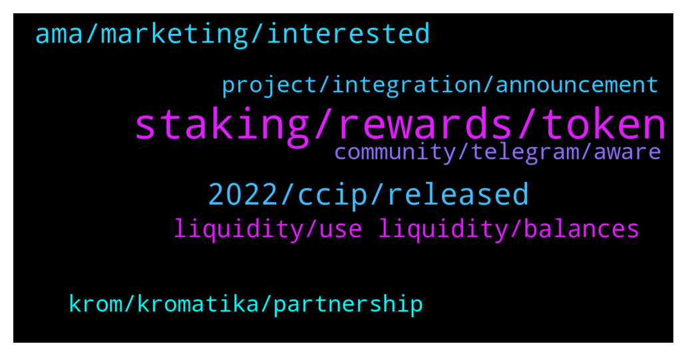

# **@chainlinkofficial**
 ## Analysis for **2022-01-19** - **2022-01-20**.

---

## 📊 **Basic Stats**

**n_messages_sent**: 118

---

---

## 🔝 **Top keywords and related messages**

1. **staking, rewards, token**

    @Sylvarantt --- *There are no "staking rewards" but LINK payments to node operators that fulfill job requests* **--->** [TG Discussion](https://t.me/chainlinkofficial/366495)

    @nam_nguyenson --- *Explicit Staking is still being developed and planned for release in 2022. Be on the lookout for that.* **--->** [TG Discussion](https://t.me/chainlinkofficial/366263)

    @Rpatel1443 --- *there are no staking rewards right now, but when staking is live there will be rewards for stakers...and is there details on what % of rewards goes to stakers?* **--->** [TG Discussion](https://t.me/chainlinkofficial/366499)

    @Agustín --- *Hello! I have a question if someone can answer, where is the best place to do staking with this token (Link)?* **--->** [TG Discussion](https://t.me/chainlinkofficial/366375)

    @Rpatel1443 --- *thanks so no real estimate on when staking will go live yet either right?* **--->** [TG Discussion](https://t.me/chainlinkofficial/366503)

    @Linkederic --- *As with the overall job payment, this will vary based on a number of factors, so there is no fixed return amount, nor is that estimable at this time.* **--->** [TG Discussion](https://t.me/chainlinkofficial/366501)

2. **2022, ccip, released**

    @ShermanShillax --- *Hey guys, i there an estimation on when CCIP will be released? I've tried looking for a date but i cant find anything.* **--->** [TG Discussion](https://t.me/chainlinkofficial/366381)

    @RomainSwitzerland --- *No 😌 As a rule the team doesn’t offer timelines for development targets. You can follow development progress via github* **--->** [TG Discussion](https://t.me/chainlinkofficial/366382)

    @ShermanShillax --- *Thanks. So is there a reason why everyone assumes it will be released in 2022? Is that false?* **--->** [TG Discussion](https://t.me/chainlinkofficial/366383)

    @AmunRaGOC --- *2 of the projects I am most bullish about in 2022* **--->** [TG Discussion](https://t.me/chainlinkofficial/366672)

    @Linkederic --- *I'm not that familiar with the project. If the team is interested they will comment on it themselves independently, but at this time I'm not aware of any plans.* **--->** [TG Discussion](https://t.me/chainlinkofficial/366445)

    @RomainSwitzerland --- *No, that's right! Sergey Nazarov explains in this video that CCIP is for 2022. But we don't have a day/month* **--->** [TG Discussion](https://t.me/chainlinkofficial/366384)

3. **ama, marketing, interested**

    @serqpo --- *hello 🥰 who is the right candidate to contact regarding AMA marketing??* **--->** [TG Discussion](https://t.me/chainlinkofficial/366715)

    @jubuda109 --- *Hi there 👋  I have a business proposal its about doing an AMA & posting ads on different social media with our community. Our community including  investors, traders, ambassador etc. Should I contact with?* **--->** [TG Discussion](https://t.me/chainlinkofficial/366635)

    @evanrabbi --- *I'm looking for a job. If anyone wants, you can hire me as your moderator🙂* **--->** [TG Discussion](https://t.me/chainlinkofficial/366226)

    @evanrabbi --- *You can hire me as moderator to manage your business discussion group well🙂* **--->** [TG Discussion](https://t.me/chainlinkofficial/366270)

    @nam_nguyenson --- *Please check out our job listings here: https://chainlinklabs.com/jobs  If the role you wanted to work as doesn’t exist, that means we’re not interested in hiring that position yet.* **--->** [TG Discussion](https://t.me/chainlinkofficial/366271)

    @Sylvarantt --- *Hey, we’re not interested in paid AMA offers. Thank you.* **--->** [TG Discussion](https://t.me/chainlinkofficial/366721)

4. **liquidity, use liquidity, balances**

    @aguibsang --- *Okay but besides that is there a way to use the liquidity ?* **--->** [TG Discussion](https://t.me/chainlinkofficial/366264)

    @aguibsang --- *And how a regular holder can make passive income with chainlink ?* **--->** [TG Discussion](https://t.me/chainlinkofficial/366262)

    @zermoise --- *Has there been a discussion around chainlink foundations use of treasury balances? Can those balances be observed?* **--->** [TG Discussion](https://t.me/chainlinkofficial/366768)

    @QuantumLeap68 --- *whole lotta partnerships and price in cellar…* **--->** [TG Discussion](https://t.me/chainlinkofficial/366462)

    @AD707070 --- *A new generation of blockchain Defi liquidity mining model. Defi is a fully decentralized financial product built on the blockchain. Humans cannot intervene, everything relies on smart contracts to function* **--->** [TG Discussion](https://t.me/chainlinkofficial/366927)

    @manhhhg --- *I mean...What is chainlink's deflation mechanism?* **--->** [TG Discussion](https://t.me/chainlinkofficial/366282)

5. **krom, kromatika, partnership**

    @Aristokrates_eth --- *Thank you Chainlink for the collaboration and integrating Kromatika into the Chainlink keepers ecosystem. Looking forward to the future collaboration between CHainlink and Kromatika* **--->** [TG Discussion](https://t.me/chainlinkofficial/366424)

    @pra_rz --- *Do you have a partner ship with krom?* **--->** [TG Discussion](https://t.me/chainlinkofficial/366407)

    @carevski --- *such a nice move for both Kromatika and Chainlink ❤️* **--->** [TG Discussion](https://t.me/chainlinkofficial/366429)

    @thenewseer --- *Krom don’t have partnership with link* **--->** [TG Discussion](https://t.me/chainlinkofficial/366423)

    @FrTLitl1z --- *Hello 👋 so nice to see the partnership with Kromatika! 🔥* **--->** [TG Discussion](https://t.me/chainlinkofficial/366399)

    @johnnybravok --- *Chainlink is pushing Civilization and Krom, amazing* **--->** [TG Discussion](https://t.me/chainlinkofficial/366406)

6. **project, integration, announcement**

    @harrumphharrumph --- *"Partnership” is an overused word in crypto.  Current integrations are announced through Twitter and later listed on Chainlink Ecosystem.  The nature of the integration will be included in the official announcement you can find through the above links.  If an integration has not been announced there are two possibilities: * A project is using Chainlink on it’s own accord since Chainlink is an open source project that anyone can use. * An announcement is forthcoming acknowledging the integration.  Please be aware that an announcement of an integration is not an endorsement of another project and that you should perform due diligence.* **--->** [TG Discussion](https://t.me/chainlinkofficial/366413)

    @Cryptothi --- *Hi guys, it came to my attention this project called TuringDao which seems cool but kind of suspicious, and they claim to have a partnership which Chainlink. Can any insider confirm this information for me, please?* **--->** [TG Discussion](https://t.me/chainlinkofficial/366925)

    @John --- *i just saw that $link has collaboration with civ  did someone from link check them? i heard some rumors on different chats that they got sued from Uniswap for license stealing* **--->** [TG Discussion](https://t.me/chainlinkofficial/366562)

    @pra_rz --- *Oh, I just saw it rn on powered by chainlink twitter, will check chainlink twitter too. Seems a legit project to me* **--->** [TG Discussion](https://t.me/chainlinkofficial/366414)

    @DanielWolfFIT --- *Thanks Chainlink. 😊👍 cheers on a bright future for both projects 😎* **--->** [TG Discussion](https://t.me/chainlinkofficial/366428)

    @Anderstalige --- *Anyone any news from Chainlink's side?* **--->** [TG Discussion](https://t.me/chainlinkofficial/366442)

7. **community, telegram, aware**

    @kiraaa_the_death_God --- *Hello everyone, whom may I contact. I have an interesting offer that would benefit the chain link community.* **--->** [TG Discussion](https://t.me/chainlinkofficial/366243)

    @cankinglion --- *What is the Wallet for chainlink on mobile iOS?* **--->** [TG Discussion](https://t.me/chainlinkofficial/366903)

    @marcromeron --- *‼️Remember: We will not PM you first. We will never ask for your passwords, keys, or funds for any reason. We don’t have special deals to offer you and there is not now nor will there ever be a Chainlink airdrop.* **--->** [TG Discussion](https://t.me/chainlinkofficial/366914)

    @nam_nguyenson --- *You can search for unofficial Chainlink groups on Telegram, but be aware that they’re not endorsed by us.* **--->** [TG Discussion](https://t.me/chainlinkofficial/366269)

    @Linkederic --- *Hey there, sorry but this channel is intended for technical discussion of the Chainlink protocol, not for technical support for wallets or dexes, youll need to follow up with your wallet provider or the exchange you used  anybody DMing you is NOT a Chainlink representative, but IS a scammer* **--->** [TG Discussion](https://t.me/chainlinkofficial/366155)

    @marcromeron --- *Welcome new members to the Official Chainlink Telegram Community!  Please review the pinned post for our community rules and resources.   Be aware that price/trading discussion is strictly prohibited.  New to Chainlink? Check out these resources:  - What is Chainlink? - Chainlink 2.0 Whitepaper Overview - The Community Factsheet - Explicit Staking in Chainlink 2.0  - 77 Smart Contract Use Cases Enabled By Chainlink  - The Ultimate Chainlink Deep Dive: Completing The God Protocols: A Comprehensive Overview of Chainlink in 2021   ‼️Remember: We will not PM you first. We will never ask for your passwords, keys, or funds for any reason. We don’t have special deals to offer you and there is not now nor will there ever be a Chainlink airdrop. See this article to learn how to avoid the most common scams.* **--->** [TG Discussion](https://t.me/chainlinkofficial/366115)

