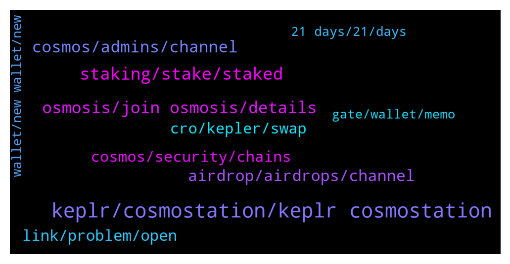

# **@cosmosproject**
 ## Analysis for **2022-01-19** - **2022-01-20**.

---

## 📊 **Basic Stats**

**n_messages_sent**: 482

---

---

## 🔝 **Top keywords and related messages**

1. **keplr, cosmostation, keplr cosmostation**

    @Giusep24 --- *Thanks, but I don't want to use chrome or chrome based browser, I will search a way to install keplr on firefox* **--->** [TG Discussion](https://t.me/cosmosproject/477197)

    @ZoltanAtom --- *Just don’t forget this ;  you don’t need “memo” sending assets from cex to Keplr!  And don’t forget to fill up “memo” if you send your assets from Keplr to cex or cex to cex.* **--->** [TG Discussion](https://t.me/cosmosproject/478189)

    @Cordtus --- *Keplr is a chrome extension only. Mobile use cosmostation* **--->** [TG Discussion](https://t.me/cosmosproject/477177)

    @JasonOfArgonaut --- *Nope.  Just istall chrome and only use it for keplr* **--->** [TG Discussion](https://t.me/cosmosproject/477183)

    @TicoJohnny --- *Take care with that route, Keplr is not officially supported on Firefox so you will likely find some scam apps on there.* **--->** [TG Discussion](https://t.me/cosmosproject/477198)

    @JasonOfArgonaut --- *Keplr works fine in brave? I know its chromium.based but never thought to check* **--->** [TG Discussion](https://t.me/cosmosproject/477205)

2. **staking, stake, staked**

    @Thomas --- *Hi,  Is there any guide available on liquid staking? So I can join lp on osmo?* **--->** [TG Discussion](https://t.me/cosmosproject/477430)

    @ZoltanAtom --- *Liquid staking is not ready yet. Expecting in couple of months.* **--->** [TG Discussion](https://t.me/cosmosproject/477435)

    @Noideawhattochose --- *"stake.fish" this one should be good ?* **--->** [TG Discussion](https://t.me/cosmosproject/478282)

    @Dome --- *ok I'll give it a look .. very kind .. but from there besides staking there are other types of advantages?* **--->** [TG Discussion](https://t.me/cosmosproject/477567)

    @JasonOfArgonaut --- *Okay so looks like you are still staked.* **--->** [TG Discussion](https://t.me/cosmosproject/477016)

    @ZoltanAtom --- *Liquid staking feature will give to you flexibility to use your staked Atoms as liquid one. So you will able to use staked Atom at defi platforms such as Osmosis,Kava,Umee and many others.* **--->** [TG Discussion](https://t.me/cosmosproject/477443)

3. **osmosis, join osmosis, details**

    @lionkim958 --- *Transaction details here. On the bottom there's a fail mark for osmosis acknowledgement: https://www.mintscan.io/osmosis/txs/1BEEF14F9227CCF358F33BD6E9ED235390B3F69F03C8CBAD737A851BE3997F6C* **--->** [TG Discussion](https://t.me/cosmosproject/477220)

    @ZoltanAtom --- *Yes,No fee at Osmosis. Why don’t you join Osmosis community to learn more;  https://t.me/osmosis_chat* **--->** [TG Discussion](https://t.me/cosmosproject/478162)

    @ufficioerasmus --- *Ehi guys, a stupid question: if you have a pool atom/osmo on osmosis, how the apr is distributed? On token osmos or directly in the LPtoken? (Or other ways?)* **--->** [TG Discussion](https://t.me/cosmosproject/478230)

    @crypto4life4eva --- *Just want to know how to get funds from osmosis to eth…* **--->** [TG Discussion](https://t.me/cosmosproject/477247)

    @koffiemachine --- *quick question, I heard the pools pay out once a day on Osmosis, does anyone know the time or has a link for me where I can read it myself?* **--->** [TG Discussion](https://t.me/cosmosproject/478169)

    @ZoltanAtom --- *Please DM to @TisMeAgain , Osmosis admin and ask to him about your situation.* **--->** [TG Discussion](https://t.me/cosmosproject/478250)

4. **cosmos, admins, channel**

    @Jczheng --- *ok. It seems I need to take time to learn about cosmos.Thanks* **--->** [TG Discussion](https://t.me/cosmosproject/477666)

    @cronoscontinuum --- *all my memes are cosmos related 😂 https://twitter.com/eblkronos/status/1483912493743452161?s=21* **--->** [TG Discussion](https://t.me/cosmosproject/477851)

    @web3admiral --- *Hi. Are there any ambassador program for Cosmos that I can apply?* **--->** [TG Discussion](https://t.me/cosmosproject/477373)

    @Thanhdcb --- *any metaverse project in cosmos ecosystem?* **--->** [TG Discussion](https://t.me/cosmosproject/477968)

    @cronoscontinuum --- *Yes, Iris, Osmos, CROs...all stuck on Cosmos Hub* **--->** [TG Discussion](https://t.me/cosmosproject/477514)

    @ZoltanAtom --- *👩🏻‍🚀👨🏽‍🚀 Cosmonauts,  Reminding you that Cosmos has many “Local Community Groups.”  Join Our Local Communities and support your fellows!  ⚛️ Our Local Communities ⚛️ 🇰🇷 @Cosmos_Korea 🇨🇳@CosmosNetworkChina 🇷🇺 @CosmosprojectRu 🇯🇵 @cosmos_japan 🇹🇷 @cosmosturkeycommunity 🇮🇳 @cosmosindia 🇭🇷 @CosmosCroatia 🇸🇬 @cosmosSG 🇵🇭 @cosmosPH 🇮🇩 @CosmosID 🇪🇸 @Cosmos_Network_ES 🇩🇪 @cosmosDE 🇫🇷 @CosmosFrance 🇧🇷 @cosmosnetworkbrasil* **--->** [TG Discussion](https://t.me/cosmosproject/478234)

5. **airdrop, airdrops, channel**

    @Juljan20 --- *Wat is diference to keprl or cosmostation for airdrop ?🙏* **--->** [TG Discussion](https://t.me/cosmosproject/477607)

    @Jczheng --- *May I ask how to claim airdrop from cosmos station wallet? Are there any guide? Don't DM me* **--->** [TG Discussion](https://t.me/cosmosproject/477652)

    @Thanhdcb --- *and so, a lot people buy it because airdrop culture* **--->** [TG Discussion](https://t.me/cosmosproject/477467)

    @AtomJazz --- *Each airdrop is different. Probably best to join airdrop channel to stay up to date https://t.me/CosmosAirdrops* **--->** [TG Discussion](https://t.me/cosmosproject/477771)

    @ZoltanAtom --- *Here is the Cosmos community airdrops channel ;  https://t.me/CosmosAirdrops* **--->** [TG Discussion](https://t.me/cosmosproject/477700)

    @ZoltanAtom --- *Next airdrop is Flix from Omniflix! Check details at their channel ;  https://t.me/OmniFLixChat* **--->** [TG Discussion](https://t.me/cosmosproject/477396)

6. **link, problem, open**

    @catdotfish --- *The first page is identical because the website are almost all open source but you just have to click something to see that something is wrong* **--->** [TG Discussion](https://t.me/cosmosproject/477006)

    @Tim_0012 --- *not so clear to see the map on https://mapofzones.com/?testnet=false&period=24&tableOrderBy=totalIbcTxs&tableOrderSort=desc* **--->** [TG Discussion](https://t.me/cosmosproject/477695)

    @Vladislav_M143 --- *A typical problem with finding the right links. I hope Cyber will solve this problem in the future.* **--->** [TG Discussion](https://t.me/cosmosproject/476978)

    @catdotfish --- *Just go to the official websites only, isn’t really that difficult :3* **--->** [TG Discussion](https://t.me/cosmosproject/476984)

    @Alfonso --- *Thanks man, but the link doesnt work.* **--->** [TG Discussion](https://t.me/cosmosproject/477319)

    @Vladislav_M143 --- *Yeah, for the most time :D But what I should do if I don`t know an official website?* **--->** [TG Discussion](https://t.me/cosmosproject/476990)

7. **cosmos, security, chains**

    @AtomJazz --- *If you mean if Cosmos hub is a smart contracts platform then the answer is no. Cosmos ecosystem is an ecosystem of interconnected application specific blockchains. Each dAPP runs its own L1 blockchain in Cosmos* **--->** [TG Discussion](https://t.me/cosmosproject/477823)

    @ZoltanAtom --- *Each chain is sovereign at Cosmos. But yes,they both use Cosmos tech.* **--->** [TG Discussion](https://t.me/cosmosproject/477941)

    @ascuoladibitcoin --- *Do you know the name of nexts blockchain entering in the cosmos hub from now on ?* **--->** [TG Discussion](https://t.me/cosmosproject/477752)

    @AlfredDefiwontDMu --- *Who's going to fork Bitcoin on cosmos for me😍?* **--->** [TG Discussion](https://t.me/cosmosproject/478126)

    @LATOKEN_Jogiyat --- *Would cosmos have a 2022 marketing or BD plan?* **--->** [TG Discussion](https://t.me/cosmosproject/477620)

    @trader_ksm --- *How can I bridge ETH over to COSMOS to trade offchain?* **--->** [TG Discussion](https://t.me/cosmosproject/478095)

8. **cro, kepler, swap**

    @Dome --- *hello guys, is there someone kind enough to give me some advice on how to make my atom as much as possible? (I started investing yesterday in cosmos) thank you very much for your patience🙏* **--->** [TG Discussion](https://t.me/cosmosproject/477553)

    @theassinonassis --- *didnt have atom supported as an asset for cro  using this bridge https://cronos.crypto.org/bridge/ ** **--->** [TG Discussion](https://t.me/cosmosproject/477764)

    @AtomJazz --- *Hey. I think you can use Cronos bridge for that https://cronos.crypto.org/bridge* **--->** [TG Discussion](https://t.me/cosmosproject/477750)

    @ZoltanAtom --- *Thank you! This is very informative and one more use case for Atom!* **--->** [TG Discussion](https://t.me/cosmosproject/478220)

    @theassinonassis --- *i have $atom on the cronos chain in my metamask. How can I send it to my kepler wallet? Metamask doesnt allow me to send bc its not an erc address* **--->** [TG Discussion](https://t.me/cosmosproject/477749)

    @aghiles22 --- *Yes several Kepler accounts It's for my girlfriend I made her buy Atoms but she doesn't want to deal with it 🤣* **--->** [TG Discussion](https://t.me/cosmosproject/477785)

9. **wallet, new wallet, new**

    @AtomJazz --- *I mean if they actually do have access to his wallet they'd probably start unstaking already. That's what they usually do* **--->** [TG Discussion](https://t.me/cosmosproject/477057)

    @Boc40 --- *You sharing your wallet with someone?* **--->** [TG Discussion](https://t.me/cosmosproject/477098)

    @AtomJazz --- *This is a scam. Please move your funds to another wallet immidiately* **--->** [TG Discussion](https://t.me/cosmosproject/476928)

    @CryptoSpace7 --- *I would use a bot to move the funds out of that wallet in any case...* **--->** [TG Discussion](https://t.me/cosmosproject/477075)

    @JasonOfArgonaut --- *Give someone your housekey, you go get a new housekey made.  The old key still works.* **--->** [TG Discussion](https://t.me/cosmosproject/477049)

    @AtomJazz --- *You need to move your assets to a new wallet asap if they haven't already* **--->** [TG Discussion](https://t.me/cosmosproject/476938)

10. **21 days, 21, days**

    @Juljan20 --- *Thankyou for this aprecable information !ai unstake  from validator 0 fee. Time to unlock my atom ai put my atom to Block United thank you🙏👍* **--->** [TG Discussion](https://t.me/cosmosproject/477625)

    @Dad_Dado --- *My ATOM and AWC is still in my atomic wallet but can’t unstake or move them around* **--->** [TG Discussion](https://t.me/cosmosproject/476989)

    @JasonOfArgonaut --- *Can you see if the atom was unstaked by the scammer already?  A countdown timer visible* **--->** [TG Discussion](https://t.me/cosmosproject/477004)

    @Lukas --- *Is only my ATOM stuck on withdrawal from CEX?* **--->** [TG Discussion](https://t.me/cosmosproject/478242)

    @JasonOfArgonaut --- *Riggt now, atom is staked.  Cant be moved for 21 days.  When that time.is up, then something needs to happen.  Either by you or them.* **--->** [TG Discussion](https://t.me/cosmosproject/477056)

    @ZoltanAtom --- *No need to undelegate your Atoms. Testnet is already happening right now. First priority is “using staked atoms without undelegation”* **--->** [TG Discussion](https://t.me/cosmosproject/477439)

