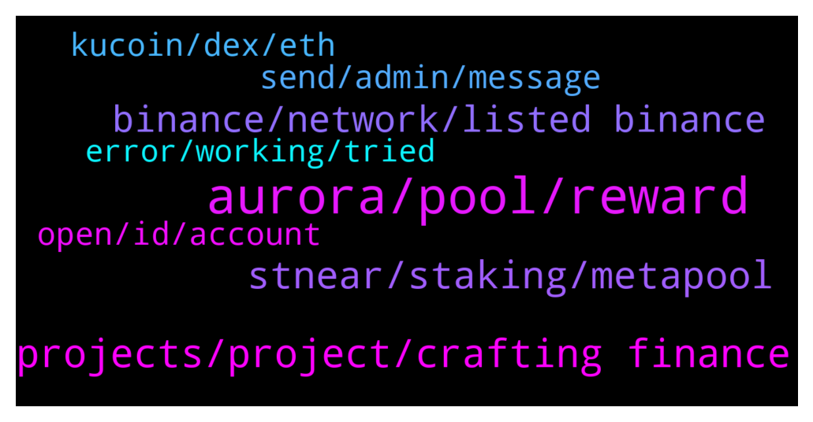

# **@cryptonear**
 ## Analysis for **2022-01-19** - **2022-01-20**.

---

## 📊 **Basic Stats**

**n_messages_sent**: 800

---

---

## 🔝 **Top keywords and related messages**

1. **aurora, pool, reward**

    @HODL_R --- *Anyone else still waiting on Aurora stakefarm tokens? I don’t see them in my NEAR web wallet yet, it’s been about 2.5 days now?* **--->** [TG Discussion](https://t.me/cryptonear/292935)

    @Sammy9ce --- *Aurora weekly analysis from merchants of near🙌 https://youtu.be/5rPhkv1cnIs* **--->** [TG Discussion](https://t.me/cryptonear/293744)

    @tino_1703 --- *how can we know the aurora reward when staking on aurora pool? I couldn't find it* **--->** [TG Discussion](https://t.me/cryptonear/293442)

    @marcNear --- *but on Aurora you can participate* **--->** [TG Discussion](https://t.me/cryptonear/292818)

    @choc0707 --- *Any update about Near or Aurora* **--->** [TG Discussion](https://t.me/cryptonear/293181)

    @yucacapital --- *are all transactions free? dont have eth or near on aurora* **--->** [TG Discussion](https://t.me/cryptonear/291617)

2. **projects, project, crafting finance**

    @TheGo1denBull --- *@salihkite here's a wallet list for you and other projects in the near Ecosystem https://awesomenear.com/categories/wallets/* **--->** [TG Discussion](https://t.me/cryptonear/292534)

    @Greater_O --- *yea I'm in way too many things, but NEAR seems promising, but as of right now, a lot of projects are.* **--->** [TG Discussion](https://t.me/cryptonear/293117)

    @TheGo1denBull --- *I'm waiting for the next one. 😶 Even if I can't participate in the idos I'll still have the token lol* **--->** [TG Discussion](https://t.me/cryptonear/292813)

    @Caripady --- *How do we take part in IDO or early participation* **--->** [TG Discussion](https://t.me/cryptonear/291562)

    @NearFritz --- *The update for tokens weight voting is coming for Astro DAO* **--->** [TG Discussion](https://t.me/cryptonear/292859)

    @larry_lang --- *We do have our own blockchain with multiple projects running with it* **--->** [TG Discussion](https://t.me/cryptonear/293039)

3. **stnear, staking, metapool**

    @iwllbel --- *there is something I don’t understand tho. So I staked my near in meta, then I used stnear in ref and staked it in a farm oin-stnear (so I swapped half my stnear to oin)  Do I still earn staking rewards in meta..?* **--->** [TG Discussion](https://t.me/cryptonear/293728)

    @GeorgePro1 --- *This is the answer  When you swap stnears or transfer them into another account. your stake on meta disappears and no longer accumulating until you acquire them back.* **--->** [TG Discussion](https://t.me/cryptonear/293740)

    @GeorgePro1 --- *The moment you swap near for stnear your staking in metapool stops(in simple terms)* **--->** [TG Discussion](https://t.me/cryptonear/293742)

    @iwllbel --- *if I staked near into metapool, I rec stnear, then on ref finance, I swap that to wnear and unwrap to near… does that mean I can stake this same amount of near into metapool again and the process repeats?* **--->** [TG Discussion](https://t.me/cryptonear/293660)

    @supersaiyan_goku --- *If I stake 100 Near to Metapool, I will get 100 stNear If I swap stNear to wNear atm I will receive 104 wNear, then I got 104 Near after unwraped? 🤔 Is there anything wrong here?* **--->** [TG Discussion](https://t.me/cryptonear/293709)

    @Diederiek --- *Hey, hope you re OK. I have a question. I can accès my near wallet again since yesterday, but the balance still ain't ok. I mean 17 January I deposited NEAR from binance into my wallet, this I can see in recent activity, then I staked the amount with a validator (same day), but I cannot see these in staking panel. Instead when I go to near-staking.com I find them there (with my other delegated validators) with the rewards accumulated.* **--->** [TG Discussion](https://t.me/cryptonear/291945)

4. **binance, network, listed binance**

    @kv9990 --- *Wow Binance US lists NEAR Protocol! It's definitely huge!!  https://support.binance.us/hc/en-us/articles/4419537277847-Binance-US-Will-List-NEAR-Protocol-NEAR-Deposits-Now-Open* **--->** [TG Discussion](https://t.me/cryptonear/291673)

    @Bakry --- *When it is going to be listed on Binance?* **--->** [TG Discussion](https://t.me/cryptonear/292375)

    @marcNear --- *🥳 @BinanceUS Will List @NEARProtocol - Deposits Now Open  #BinanceUS will list NEAR and open trading on $NEAR/$USD, $NEAR/$USDT, and $NEAR/$BUSD pairs 🤩 ⏰ Jan 19, 2022, at 8PM, EST / 5PM, PST   More details: 🟢 https://t.co/84lYgstJJC  #Nearinsider #NEAR $USD $USDT #BinanceUS  https://twitter.com/near_insider/status/1483692866522464257* **--->** [TG Discussion](https://t.me/cryptonear/292388)

    @WallsOflife --- *I bought near on Binance. How do I transfer to near Wallet to stake ? I don’t have a wallet yet .* **--->** [TG Discussion](https://t.me/cryptonear/292353)

    @naveenkandwal --- *MAKE MEME - EARN $NEAR  🆕️ Date: 19/01/2022 ✅ Meme Theme: Binance US will list $NEAR. Deposits are open.  💰EARN: Best Two MEMEs receive 0.25 $NEAR in 24 Hours  🚀 Tag: #NEARmemedaily #NEAR #Binance  🚀Account Tag: @NearMemeDaily on Twitter   Reference: 1. Twitter: https://twitter.com/BinanceUS/status/1483605162279292929  Join: https://t.me/memesdaily_tg For Earning NEAR: https://t.me/NearMemeDaily* **--->** [TG Discussion](https://t.me/cryptonear/292345)

    @GeorgePro1 --- *There are couple of ways you can stake near  Metapool  Near wallet  Binance   For Near wallet and metapool  Refer to below links and you will get the idea  https://t.me/cryptonear/289255  https://t.me/cryptonear/282216  For binance, they have locked system with 30 and 60 days and apy varies on that* **--->** [TG Discussion](https://t.me/cryptonear/292009)

5. **send, admin, message**

    @RomanRomanJ --- *Immediately after my message, received a DM from “Admin” and even a phone call* **--->** [TG Discussion](https://t.me/cryptonear/293321)

    @NUERnft --- *and now someone is calling me regarding my concern? Admin doesn't message/call you first ryt?* **--->** [TG Discussion](https://t.me/cryptonear/292129)

    @GeorgePro1 --- *Send me a DM. Admin/moderators will never DM you first* **--->** [TG Discussion](https://t.me/cryptonear/293772)

    @Alorad_Gem --- *Please admin can I DM I need to discuss something with you* **--->** [TG Discussion](https://t.me/cryptonear/293755)

    @kv9990 --- *Pls refrain yourself from asking users to DM you!* **--->** [TG Discussion](https://t.me/cryptonear/292034)

    @Alorad_Gem --- *Only mutual friends can chat him I can't send a DM can he send* **--->** [TG Discussion](https://t.me/cryptonear/293771)

6. **kucoin, dex, eth**

    @Greater_O --- *yea i was over there. Apr's are cool, but I was looking for other options before I married myself to it. What chain are you utilizing NEAR on? I'm trying to avoid ETH chain at all cost, lol* **--->** [TG Discussion](https://t.me/cryptonear/293109)

    @NearFritz --- *We need to add Kucoin to this meme* **--->** [TG Discussion](https://t.me/cryptonear/291402)

    @larry_lang --- *Hmm if u looking for a CEX which doesnt  require KYC for Near withdrawal/deposit then Houbi works as well* **--->** [TG Discussion](https://t.me/cryptonear/291812)

    @generaljohnstark --- *Best DEX on ETH to purchase NEAR?* **--->** [TG Discussion](https://t.me/cryptonear/291798)

    @TheGo1denBull --- *Cool I'll be ready for it. Will we have to download an extension to use the dex?* **--->** [TG Discussion](https://t.me/cryptonear/292713)

    @GeorgePro1 --- *Actually I haven’t tried. I bump into it when doing research about projects building on near. Let me gather more information I will get back to you about how to avoid eth chain when you are near.* **--->** [TG Discussion](https://t.me/cryptonear/293114)

7. **open, id, account**

    @NearFritz --- *That's the only way I know.  1) Open your wallet (legible address) 2) Open a new tab and go to: https://wallet.near.org/recover-account* **--->** [TG Discussion](https://t.me/cryptonear/291361)

    @larry_lang --- *Pretty sure it has to show you once so that u can write it down* **--->** [TG Discussion](https://t.me/cryptonear/291835)

    @NearFritz --- *Click on details of the card, and there you have the option for sell* **--->** [TG Discussion](https://t.me/cryptonear/291433)

    @viccer_3 --- *Yeah, showed once and i saved it but don’t remember where* **--->** [TG Discussion](https://t.me/cryptonear/291837)

    @Y --- *Good question, how can I find out?* **--->** [TG Discussion](https://t.me/cryptonear/291385)

    @viccer_3 --- *Before that, what’s account ID pls?* **--->** [TG Discussion](https://t.me/cryptonear/291855)

