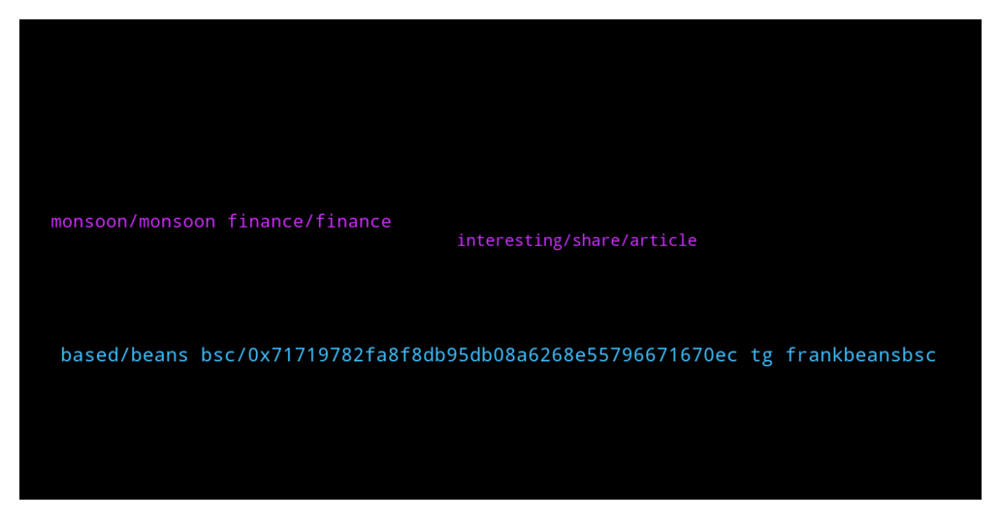

# **@de_fi**
 ## Analysis for **2022-01-19** - **2022-01-20**.

---

## 📊 **Basic Stats**

**n_messages_sent**: 32

---

---

## 🔝 **Top keywords and related messages**

1. **based, beans bsc, 0x71719782fa8f8db95db08a6268e55796671670ec tg frankbeansbsc**

    @Bilel2k38 --- *Super pumped to announce our $𝟓𝐦 𝐩𝐫𝐞-𝐒𝐞𝐫𝐢𝐞𝐬 𝐀 𝐟𝐮𝐧𝐝𝐢𝐧𝐠 led by Polygon and Hashed! The PlotX (https://plotx.io/) community has already grown to over 83,000 paying users verifiable on-chain, and we are growing at 144% month-on-month. If you're building on Polygon, please reach out to discuss working together :)* **--->** [TG Discussion](https://t.me/de_fi/234649)

    @Rolly Crypto --- *[В ответ на Rick Tropic] Frank & Beans BSC 🚀    New moonshot based on Elon's tweet.  JUST LAUNCHED  ✅ 100X GEM ✅  2k MC ✅  4% DOGE REWARDS ✅  LP Locked  ✅  Website Soon ✅  SAFU Dev ✅  HARD Marketing Coming  CA: 0x71719782fa8f8db95db08a6268e55796671670ec  TG: FrankBeansBSC* **--->** [TG Discussion](https://t.me/de_fi/234867)

    @Rolly Crypto --- *Frank & Beans BSC 🚀    New moonshot based on Elon's tweet.  JUST LAUNCHED  ✅ 100X GEM ✅  1.5k MC ✅  4% DOGE REWARDS  CA: 0x71719782fa8f8db95db08a6268e55796671670ec  TG: FrankBeansBSC* **--->** [TG Discussion](https://t.me/de_fi/234841)

    @kirito --- *🏥Medi_Token 🏥  An ERC-20 charity token focused on worldwide donations in healthcare  🔴1000Q max supply 🔴P2E games and NFTs 🔴Future utility in development (blockchain & wallet)   Telegram: @ medi_token* **--->** [TG Discussion](https://t.me/de_fi/234840)

    @crystaljepp --- *BreederDao looks to be launching this year, and set to become the NFT factory of blockchain games.* **--->** [TG Discussion](https://t.me/de_fi/234785)

    @Aira --- *Hello there bro, Why don't you try $MCASH* **--->** [TG Discussion](https://t.me/de_fi/234844)

2. **monsoon, monsoon finance, finance**

    @dOn_k0 --- *Monsoon? sounds like familiar to me* **--->** [TG Discussion](https://t.me/de_fi/234847)

    @dOn_k0 --- *Okay I will do more research on this Monsoon Finance project* **--->** [TG Discussion](https://t.me/de_fi/234863)

    @Aira --- *Also Monsoon Finance Already audited by Armor Lab* **--->** [TG Discussion](https://t.me/de_fi/234862)

    @Aira --- *Currently, monsoon supports BSC mainnet, polygon testent and avalanche testent* **--->** [TG Discussion](https://t.me/de_fi/234856)

    @Aira --- *Monsoon enables privacy transactions on every smart contracts blockchain* **--->** [TG Discussion](https://t.me/de_fi/234851)

    @Aira --- *It's Monsoon Finance token name, are you familiar with that?* **--->** [TG Discussion](https://t.me/de_fi/234845)

3. **interesting, share, article**

    @dOn_k0 --- *Good day, any interesting project here?* **--->** [TG Discussion](https://t.me/de_fi/234842)

    @Aira --- *maybe you've seen this on twitter or other channels and groups.* **--->** [TG Discussion](https://t.me/de_fi/234848)

    @CryptoRyder88 --- *Hey everyone, here's a recent article I wrote on DRIP. Feel free to comment, share, follow me and clap it up: https://cryptozoa.com/heres-your-second-chance-to-make-a-million-with-drip-crypto-seriously-58a5a4948066* **--->** [TG Discussion](https://t.me/de_fi/234719)

    @Aira --- *No problem, Im not getting tired to share this project* **--->** [TG Discussion](https://t.me/de_fi/234865)

    @dOn_k0 --- *It seems interesting, thanks for sharing this with me* **--->** [TG Discussion](https://t.me/de_fi/234864)

    @dOn_k0 --- *Yeah i saw some post on social media about this Project* **--->** [TG Discussion](https://t.me/de_fi/234849)

