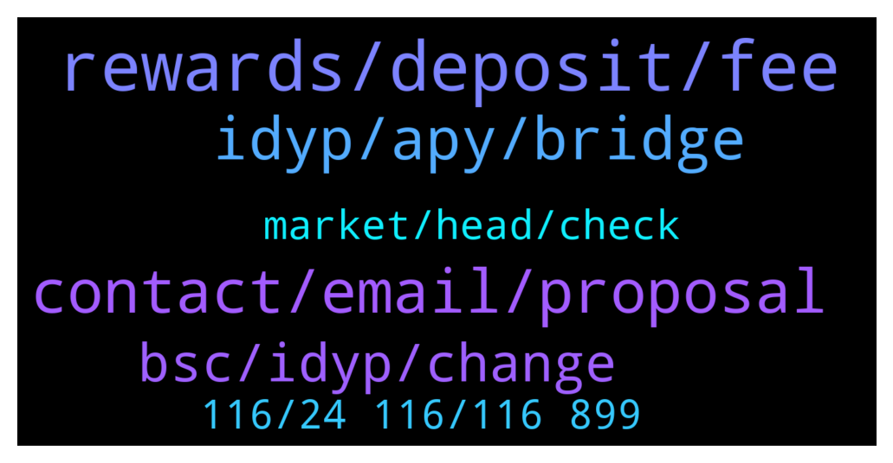

# **@dypfinance**
 ## Analysis for **2022-01-19** - **2022-01-20**.

---

## 📊 **Basic Stats**

**n_messages_sent**: 137

---

---

## 🔝 **Top keywords and related messages**

1. **rewards, deposit, fee**

    @Paulus --- *So what would it mean when we add more LP and it still slit 25% to dyp* **--->** [TG Discussion](https://t.me/dypfinance/241057)

    @ThunderChaos --- *But since yesterday DYP price actually went down, you can get more DYP for $, not less. Certainly not 30 less.* **--->** [TG Discussion](https://t.me/dypfinance/241339)

    @herbie1996 --- *200k dyp in eth stake I wouldn’t have to go to work no more lol* **--->** [TG Discussion](https://t.me/dypfinance/240989)

    @MJMuppet_JayJay --- *Can anyone explain me how that happens? As in what does the contract have to do to explain such high gas fees needed?* **--->** [TG Discussion](https://t.me/dypfinance/241021)

    @D0nkeyKong --- *Lockt my DYP for 90 days 495 APY, after 40 day's i lost 60% 😂* **--->** [TG Discussion](https://t.me/dypfinance/241315)

    @N --- *Hi Guys, I really really need some help. Have been trying numerous times to reinvest. Keeps failing but still I pay the gas fee’s. Can anybody help me??? Please DM if you can and many thanks in advance.* **--->** [TG Discussion](https://t.me/dypfinance/241159)

2. **contact, email, proposal**

    @DhoniMSD516 --- *Please email your proposal to contact@dyp.finance* **--->** [TG Discussion](https://t.me/dypfinance/241239)

    @Davidjoobitfinex001 --- *Hello, who should I contact regarding listing?* **--->** [TG Discussion](https://t.me/dypfinance/241238)

    @jeffanderwood --- *@Tekkol Hello,I'm jeff from DigiFinex,integrated marketing manager. How can I contact with the admin of project party?* **--->** [TG Discussion](https://t.me/dypfinance/241412)

    @DhoniMSD516 --- *And innocent ppl still fall for them, one investors lost 1 ETH to such scammer just yesterday 🤦🏻‍♂️ We always keep on saying and bot runs message saying don't fall for scammers* **--->** [TG Discussion](https://t.me/dypfinance/241454)

    @Kaya --- *bro you didn't write to me privately did you?* **--->** [TG Discussion](https://t.me/dypfinance/241447)

    @Manuel --- *Terrible how many people are investing so much time just to scam someone* **--->** [TG Discussion](https://t.me/dypfinance/241453)

3. **idyp, apy, bridge**

    @Kaya --- *So, is this bridging a transfer from dyp to idyp?* **--->** [TG Discussion](https://t.me/dypfinance/241469)

    @Disguy125 --- *Is there a DYP/IDYP chart anywhere. To help see whens best to swap between them* **--->** [TG Discussion](https://t.me/dypfinance/241002)

    @DhoniMSD516 --- *As our CTO is effected with Covid cannot promise any dates yet, but everything is ready, just one last confirmation from our CTO is needed so whenever he is back strong the bridge will be live* **--->** [TG Discussion](https://t.me/dypfinance/241215)

    @tamtamkanto --- *Is it possible to launch idyp bridge this week? or next week?* **--->** [TG Discussion](https://t.me/dypfinance/241214)

    @Disguy125 --- *But I want to see a Dyp/idyp chart correlation* **--->** [TG Discussion](https://t.me/dypfinance/241004)

    @Kaya --- *well, we don't need to do anything when the feature comes, right?* **--->** [TG Discussion](https://t.me/dypfinance/241465)

4. **bsc, idyp, change**

    @DhoniMSD516 --- *$DYP is always hot with continuous updates :)* **--->** [TG Discussion](https://t.me/dypfinance/241131)

    @Kaya --- *There is no pass in the wallet in dyp, there is no change in the coin, right?* **--->** [TG Discussion](https://t.me/dypfinance/241281)

    @Kaya --- *I received the dyp on the bsc network, no problem, right?* **--->** [TG Discussion](https://t.me/dypfinance/241282)

    @Kaya --- *What is the difference between dyp and idyp are they two different coins or the same?* **--->** [TG Discussion](https://t.me/dypfinance/241274)

    @RuuneL --- *Thanks. Did dyp get listed on a high tier exchange?* **--->** [TG Discussion](https://t.me/dypfinance/241518)

    @ArchieHerrera --- *Hi what is the iDYP token address on BSC?* **--->** [TG Discussion](https://t.me/dypfinance/241483)

5. **market, head, check**

    @DhoniMSD516 --- *Please head here to discuss about price :) https://t.me/dypprice* **--->** [TG Discussion](https://t.me/dypfinance/241289)

    @Tyler --- *sound fun bro, let me check a little bit* **--->** [TG Discussion](https://t.me/dypfinance/241133)

    @Kaya --- *I will invest, do you have a price target?* **--->** [TG Discussion](https://t.me/dypfinance/241288)

    @hemanrock --- *Hi Tyler, please use price discussion https://t.me/dypprice 🙌🏻* **--->** [TG Discussion](https://t.me/dypfinance/241328)

    @DhoniMSD516 --- *Hey nothing happened this is just market movement for further price discussions you can head to https://t.me/dypprice* **--->** [TG Discussion](https://t.me/dypfinance/241236)

    @DhoniMSD516 --- *Sure you can head here to check our products https://t.me/dypfinance/229271* **--->** [TG Discussion](https://t.me/dypfinance/241135)

6. **116, 24 116, 116 899**

    @DhoniMSD516 --- *Yes 24,116,899 to be exact and also can be further reduced from burns* **--->** [TG Discussion](https://t.me/dypfinance/241293)

    @TaylorSwift360rekt --- *Tried to. Is dapp not working properly?* **--->** [TG Discussion](https://t.me/dypfinance/241207)

    @TaylorSwift360rekt --- *Gonna have to do on desktop, too glitchy* **--->** [TG Discussion](https://t.me/dypfinance/241210)

    @DhoniMSD516 --- *Hey insufficient output amount means you are doing more than what is available please dm me your wallet address so that I can check* **--->** [TG Discussion](https://t.me/dypfinance/241160)

    @hemanrock --- *Please clear your cache and cookies in your device.* **--->** [TG Discussion](https://t.me/dypfinance/241038)

    @UUP_DOWNNNN --- *just a Click I can go + 800K 😉* **--->** [TG Discussion](https://t.me/dypfinance/240986)

