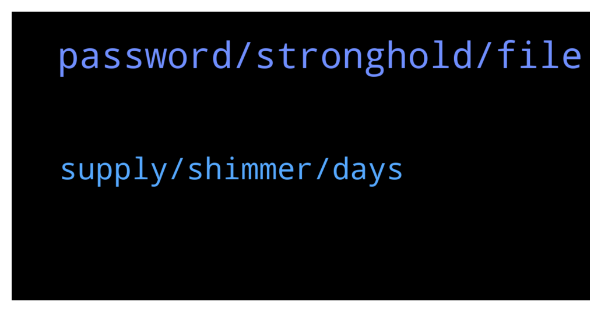

# **@iotatangle**
 ## Analysis for **2022-01-19** - **2022-01-20**.

---

## 📊 **Basic Stats**

**n_messages_sent**: 32

---

---

## 🔝 **Top keywords and related messages**

1. **password, stronghold, file**

    @ApolloniusTr --- *Anyone help me to recover firefly wallet on which I have staked miota, on my other computer?* **--->** [TG Discussion](https://t.me/iotatangle/307134)

    @Micky --- *Password and 24 words are in safe custody. But stronghold is in my pc. Any advice on this how I should look forward* **--->** [TG Discussion](https://t.me/iotatangle/307155)

    @Micky --- *What if stronghold file copied by someone.. is it possible for them to steal* **--->** [TG Discussion](https://t.me/iotatangle/307151)

    @Tahmis --- *As Yoman said. Use your 24 word seed or stronghold file with password* **--->** [TG Discussion](https://t.me/iotatangle/307138)

    @Tahmis --- *If they also get your password. Then yes. You should keep them separated* **--->** [TG Discussion](https://t.me/iotatangle/307152)

    @ApolloniusTr --- *They tried, Referred me a website asking seed phrases. Blocked that person and reached peace of mind* **--->** [TG Discussion](https://t.me/iotatangle/307164)

2. **supply, shimmer, days**

    @Lyfee --- *But the price per token has nothing to do with how similar projects are. It's almost completely depending on the supply of tokens.   Look at this: Someone staking 100 MIOTA for the full 90 days will earn around 75 Million SMR.   If Shimmer started trading for $2 it would turn thousands of people into multi-billionaires and thats not how money/ crypto works. You are more likely to look at something like $0.0000001 per SMR.* **--->** [TG Discussion](https://t.me/iotatangle/307106)

    @Zebrin3 --- *Is that iota 60 day reward for staking 60 days in a row or 60 days total.* **--->** [TG Discussion](https://t.me/iotatangle/307111)

    @regidosky --- *do u know what apr is?* **--->** [TG Discussion](https://t.me/iotatangle/307163)

    @Micky --- *Ok great I will think about it* **--->** [TG Discussion](https://t.me/iotatangle/307159)

    @potatooe --- *@iotatrader for any price related discussion please* **--->** [TG Discussion](https://t.me/iotatangle/307125)

    @Ilham --- *🆕 [#FAQ /3] What is the max supply of $ASMB and $SMR? A: Max supply @assembly_net tokens: 100 billion w/ 8% inflation per annum Max supply @shimmernet tokens: total supply is defined by the total of staking rewards paid out to users within the current 90-day staking period* **--->** [TG Discussion](https://t.me/iotatangle/307186)

