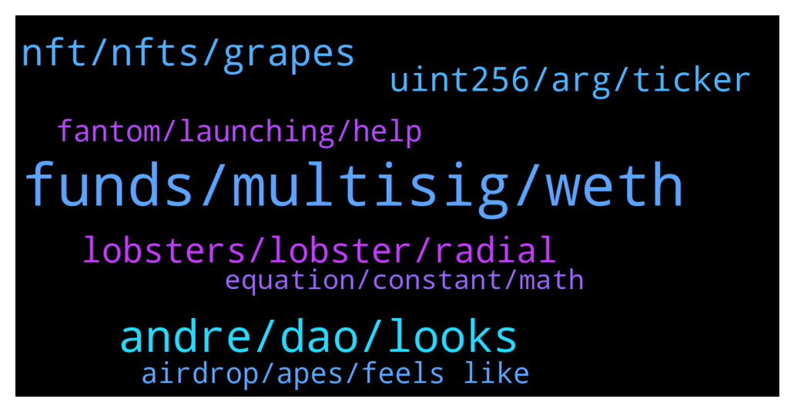

# **@lobsters_chat**
 ## Analysis for **2022-01-19** - **2022-01-20**.

---

## 📊 **Basic Stats**

**n_messages_sent**: 433

---

---

## 🔝 **Top keywords and related messages**

1. **funds, multisig, weth**

    @yic_alex --- *You got exploited. Looks like the wETH went to a wallet that's exploiting the Multichain exploit: https://etherscan.io/tx/0xc57d154089623364c1935389efeaac8c31d6ce489bff739b8b202bcc8d021836* **--->** [TG Discussion](https://t.me/lobsters_chat/317114)

    @jpwjs --- *so are you guys willing to deploy funds to sit in that contract for a few days ?* **--->** [TG Discussion](https://t.me/lobsters_chat/316958)

    @Nicolas_A --- *Hey guys did this guy got abused by the discovered Multichain bug of yesterday ? https://etherscan.io/tx/0x9600fea499fdbb708d1669b725eb693e08371a883d01054e66cfca13ff925f35 His WETH were sent out to a contract upon arrival on Ethereum mainnet  His address is 0xC02aaA39b223FE8D0A0e5C4F27eAD9083C756Cc2* **--->** [TG Discussion](https://t.me/lobsters_chat/316519)

    @svenblockchain --- *Actually reading (attempting to understand the legaleze - https://www.bailii.org/ew/cases/EWHC/Ch/2022/2.html) it seems he is claiming that nChain (BSV devs) are finishing up a tool to regain access to lost private keys. He is trying to attempt to force 15 other chain devs/companies to implement this or some similar feature in their chains so he can access 'his' funds again. But I could be reading it wrong.* **--->** [TG Discussion](https://t.me/lobsters_chat/316717)

    @Sergelove --- *guys, can somebody help me to understand whats going on here? https://etherscan.io/tx/0x855e9c909a64c68113e6b8bb687aac14008ea1989f6ce5baba617b3c3ff69f7d  Actually what I did is just swap ETH to wETH through uniswap interface. but... funds just disappeared.  Then I repeat same operation with much less funds... and all worked fine.   I dont get what happened. Etherscan dosnt make any clearance to me ..  there is another THE SAME action i did with lower funds.. and which works well https://etherscan.io/tx/0xdf283819b8b297e505211ade997f7709c608e200ef6c69d4ae062a9aeed80e6d* **--->** [TG Discussion](https://t.me/lobsters_chat/317107)

    @cactushoes --- *Lyra and StarkWare announce $10,000 Cairo Developer Grant https://blog.lyra.finance/cairo-developer-grant/* **--->** [TG Discussion](https://t.me/lobsters_chat/317044)

2. **andre, dao, looks**

    @JuanCarrillo --- *It looks fake, but apparently it's true (https://twitter.com/CoinbaseExch )* **--->** [TG Discussion](https://t.me/lobsters_chat/316864)

    @DefiApe --- *https://twitter.com/coinbase/status/1483456973555343367?s=20  Its real ser. just a new handle* **--->** [TG Discussion](https://t.me/lobsters_chat/316865)

    @ivangbi --- *He was, but we kinda shat on him, while I still believe it was rightfully done ://* **--->** [TG Discussion](https://t.me/lobsters_chat/317223)

    @ivangbi --- *OMG ANDRE ALREADY SAY THE WORDS AND TICKERS WHAT IS THIS BLABLA* **--->** [TG Discussion](https://t.me/lobsters_chat/316830)

    @nickbtts --- *for sure, this is an ongoing discussion right now, as usual there are differing opinions within a DAO. FWIW I agree with you, things just went a bit...a lot...quicker than expected* **--->** [TG Discussion](https://t.me/lobsters_chat/316498)

    @cooper3456 --- *I have the same question Ivan ain't doing it what about others?* **--->** [TG Discussion](https://t.me/lobsters_chat/316967)

3. **nft, nfts, grapes**

    @basmag0x --- *do you have horse in race ser? if so disclosure could be good  anyway here is difference…  farm-to-get-NFT: zero-sum game. I get more TVL, you get NFT with less veSOLID. I get NFT with more veSOLID.  grapes: we don’t have a horse in race. the more veSOLID NFTs work with us, the more power all those who come get. this is positive sum. Your NFT does not become less worth than mine. Make sense?* **--->** [TG Discussion](https://t.me/lobsters_chat/317160)

    @alexinlife --- *the approach of grapes to rent the nfts is fine but you cant complain about protocols trying to get ownership of the same* **--->** [TG Discussion](https://t.me/lobsters_chat/317151)

    @alexinlife --- *i hear you but ultimately the crux is the same. you either print a new valueless governance token to directly get the nft or print it to encourage protocols to deposit theirs with you. i think you make references to the tune of "OG protocols of fantom deserve the nft" which I disagree with. The NFT isnt some 1 of 1 mint special thing. Its just a representation of locked tokens which ultimately all convex forks will acquire either by buying on market or getting users/protocols to deposit. So why not just get those tokens from the very beginning.* **--->** [TG Discussion](https://t.me/lobsters_chat/317156)

    @basmag0x --- *1. gib us NFT 2. we merge all NFT into one giant NFT, store in contract 3. voting of giant NFT contract is controlled by GRP token* **--->** [TG Discussion](https://t.me/lobsters_chat/316789)

    @ivangbi --- *@basmag0x ur design seems most logical from all larpers so far, imho. But question about the “XYZ project gives us NFT, we give back X% of our supply” - because your supply gets diluted with team / other LPs / AND veLocker does not grow 1:1 protportionally due to the (3,3) mechanics - doesn’t project XYZ get diluted and pretty much lose its share? I am not sure it makes from the project perspective to give their NFT then, unless I missed something* **--->** [TG Discussion](https://t.me/lobsters_chat/317128)

    @alexinlife --- *and yes i agree pure farms are not of interest to me either. i thought that was already assumed that we believe the farms will go on to develop positive sum protocols which have utilitity beyond being a nft wrapper. if you are losing your mind over a nft wrapper protocol, may be better to spend your time elsewhere* **--->** [TG Discussion](https://t.me/lobsters_chat/317163)

4. **lobsters, lobster, radial**

    @Chris_hodl --- *No way not in the lobsters group 🙃* **--->** [TG Discussion](https://t.me/lobsters_chat/317224)

    @Pantani0x --- *So is there a lobsters' consensus on Radial? It's supposed to launch in 30mins but there aren't any smart contracts released among other suspicious things.* **--->** [TG Discussion](https://t.me/lobsters_chat/316849)

    @mewny --- *now give lobsterdao 2% of tokies* **--->** [TG Discussion](https://t.me/lobsters_chat/316938)

    @ivangbi --- *Yes, I been working on pushing them gib lobsters perks and get them to the bridge side of supporting Andre instead of farma-dampa* **--->** [TG Discussion](https://t.me/lobsters_chat/316666)

    @Pantani0x --- *Don't want to spam my fellow lobsters though.* **--->** [TG Discussion](https://t.me/lobsters_chat/316873)

    @ivangbi --- *Well @nickbtts didn’t give anything to lobsters so screw him :// Jk. It’s a meme launch to get an NFT huh, dunno if @andrecronje would even tolerate it* **--->** [TG Discussion](https://t.me/lobsters_chat/316484)

5. **uint256, arg, ticker**

    @tiequan --- *On AVAX it is possible to spam empty blocks, not sure about FTM — https://support.avax.network/en/articles/5106526-measuring-time-in-smart-contracts* **--->** [TG Discussion](https://t.me/lobsters_chat/316546)

    @kemmeson --- *So the startblock has passed already* **--->** [TG Discussion](https://t.me/lobsters_chat/316881)

    @kemmeson --- *Arg [3] : _rewardsPerBlock (uint256): 0 Arg [4] : _startBlock (uint256): 28465335 Arg [5] : _endBlock (uint256): 28465335* **--->** [TG Discussion](https://t.me/lobsters_chat/316877)

    @nickbtts --- *they forgot to change the $weve ticker in their forked code as well (lol)* **--->** [TG Discussion](https://t.me/lobsters_chat/316672)

    @RobAnon --- *Ahhhh, I see. It’s late lol* **--->** [TG Discussion](https://t.me/lobsters_chat/317073)

    @ivangbi --- *Everybody should be keeping $ snx ticker anyway lol* **--->** [TG Discussion](https://t.me/lobsters_chat/316674)

6. **fantom, launching, help**

    @melinoe0x --- *Yes! I help builders on Fantom, my DMs are open for projects who are interested in launching or have questions* **--->** [TG Discussion](https://t.me/lobsters_chat/316512)

    @suzumiyachan --- *one of my friends asked me to help her with one, so i've been looking in to them as well. i'm not entirely sure what people are actually looking for in these things, it just seems like they want utility fanclubs?* **--->** [TG Discussion](https://t.me/lobsters_chat/316574)

    @juju1234534 --- *Do you happen to know if high congestion translates to fast block time on Fantom? Or what is the origin of the variable block times on Fantom?* **--->** [TG Discussion](https://t.me/lobsters_chat/316548)

    @Icescreamerr --- *But ser, there are only vampire attacks on Fantom.  🦇 👻 🩸* **--->** [TG Discussion](https://t.me/lobsters_chat/316708)

    @juju1234534 --- *Are Fantom blocks produced on a on demand basis similar to Avax?* **--->** [TG Discussion](https://t.me/lobsters_chat/316544)

    @jpwjs --- *There is another one launching today... 0xDAO... Devs from Scream, Revenant, and other big fantom eco dApps* **--->** [TG Discussion](https://t.me/lobsters_chat/316920)

7. **airdrop, apes, feels like**

    @ivangbi --- *It’s 3,3. If u don’t deposit or deposit too late, it will lose the snapshot, so ur airdrop will be worthless* **--->** [TG Discussion](https://t.me/lobsters_chat/316908)

    @Joe_C1 --- *Looking at twitter it feels like a lot of users still think that they’re going to get tokens directly airdropped to them post snapshot as well feels like a lot of people are going to be pretty mad on launch* **--->** [TG Discussion](https://t.me/lobsters_chat/316761)

    @hendrikJ --- *I am waiting for a lobs to confirm so I can boost our airdrop* **--->** [TG Discussion](https://t.me/lobsters_chat/317050)

    @thegreatestpotato --- *Simply think about it as a retroactive airdrop.* **--->** [TG Discussion](https://t.me/lobsters_chat/316968)

    @ivangbi --- *Me? I am trying to make sure we all get fed w the airdrops, didn’t bridge even, send me tokens later* **--->** [TG Discussion](https://t.me/lobsters_chat/316959)

    @Joe_C1 --- *Feels like time and ohm semi collapsing has created the perfect shitstorm of homeless apes looking to find the next 100x and a bunch are going to get burned by protocols being churned out for the sole purpose of obtaining the 3,3 airdrop* **--->** [TG Discussion](https://t.me/lobsters_chat/316760)

