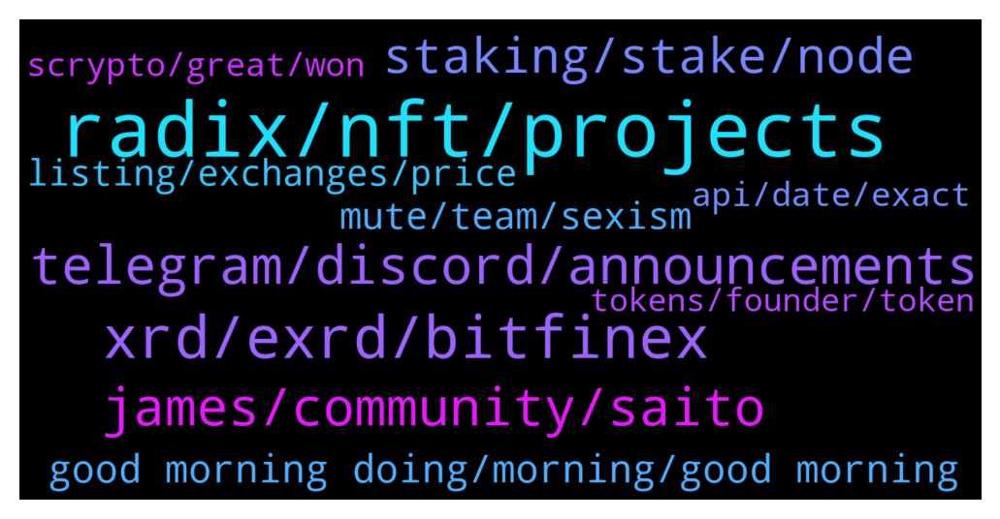

# **@radix_dlt**
 ## Analysis for **2022-01-19** - **2022-01-20**.

---

## 📊 **Basic Stats**

**n_messages_sent**: 555

---

---

## 🔝 **Top keywords and related messages**

1. **radix, nft, projects**

    @ABCDEFG --- *Are there any more technically adept people that can respond to this argument against Radix on reddit? I believe there is a 'quick response' telegram group for when technical answers are needed, but I'm not sure what it's called. Thanks.* **--->** [TG Discussion](https://t.me/radix_dlt/343380)

    @StefanPersson --- *https://twitter.com/BuyXRD/status/1483838805899632640  We'll be at Miami Hack Week on Jan 23 to show some love from the Radix Community by introducing Radix and Scrypto to developers. If you are someone you know is going to be there, we'd love to meet IRL.  I'll personally be there too in case anyone wants to meet me in particular (:* **--->** [TG Discussion](https://t.me/radix_dlt/342957)

    @gummy558 --- *Hey guys, upcoming radix project from me https://t.me/windowsradix Join up* **--->** [TG Discussion](https://t.me/radix_dlt/342759)

    @Kansuler --- *Do you want to get notifications when new radix projects get announced? Subscribe to the Radixlist announcement channel, and you'll be the first to know!  https://t.me/radixlist* **--->** [TG Discussion](https://t.me/radix_dlt/343464)

    @soulkiller7 --- *Radix is also mentioned on Quants front page of their website 👀* **--->** [TG Discussion](https://t.me/radix_dlt/342799)

    @Radstakes --- *Hi, there's a useful guide on the Radix Talk forum here to help you choose: https://radixtalk.com/t/how-do-i-choose-which-validators-to-delegate-stake-to/140?u=faraz* **--->** [TG Discussion](https://t.me/radix_dlt/342973)

2. **xrd, exrd, bitfinex**

    @1000x --- *Is there any way team extraction of XRD can be _good_ news?  I heard someone speculate big exchanges might be on the way. What is the timeframe for that?* **--->** [TG Discussion](https://t.me/radix_dlt/343367)

    @Shang En --- *can someone help me to send 1 xrd to me...? i want to unstake but i don't have enough available xre lol* **--->** [TG Discussion](https://t.me/radix_dlt/342729)

    @Face000 --- *The price of the xrd is only red color Whats happening with the crypto* **--->** [TG Discussion](https://t.me/radix_dlt/343427)

    @scorplife --- *If you’re interested in seeing how many accounts there are with more than 1M xrd. Created a list that is updated every 30 min.   http://xrd-whales.surge.sh/* **--->** [TG Discussion](https://t.me/radix_dlt/343443)

    @Raviin1 --- *Is rdx on any USA exchange? I'm staking but can't trade it since bitfinex not available to me. Rdx is not on kucoin.* **--->** [TG Discussion](https://t.me/radix_dlt/342595)

    @Svenvestor --- *When 1 XRD = 100 you will have 2000 am month* **--->** [TG Discussion](https://t.me/radix_dlt/343001)

3. **telegram, discord, announcements**

    @Avaunt --- *I'm probably stealing someone's thunder but yes. I thought we needed a little positive distraction. On Discord Node Runner Announcements* **--->** [TG Discussion](https://t.me/radix_dlt/343597)

    @chrisijoyah --- *Scammers seen to be out in full force today* **--->** [TG Discussion](https://t.me/radix_dlt/343138)

    @Bent --- *Those links take me to empty pages and I don't use discord enough to understand what that means* **--->** [TG Discussion](https://t.me/radix_dlt/342951)

    @Jacob_XRD --- *Promise I am not a bot 🚀* **--->** [TG Discussion](https://t.me/radix_dlt/342711)

    @peterkimkz --- *Please check my question on Discord: https://discord.com/channels/417762285172555786/421646460258615317/933578050132639815* **--->** [TG Discussion](https://t.me/radix_dlt/343368)

    @Peter (HAM) --- *Can you perhaps post it here for the people not on Discord?* **--->** [TG Discussion](https://t.me/radix_dlt/343607)

4. **james, community, saito**

    @Jacob_XRD --- *Thank you for the input. It was sad to see James resign from his moderation role here, he was a big part since the early days, but with his commitments with the community run marketing council,  and community run trader channel he still had a big part to play in the Radix community.* **--->** [TG Discussion](https://t.me/radix_dlt/342860)

    @BenzBoyJon --- *JAmes was heavily shilling saito not to long ago lol* **--->** [TG Discussion](https://t.me/radix_dlt/343308)

    @a00000333 --- *Em saito is concerning. Nothing james has said about them is undeserved.* **--->** [TG Discussion](https://t.me/radix_dlt/343305)

    @Jacob_XRD --- *It’s not appropriate for us to comment on the reasons why James is no longer in the program. We are not going to publicly go into the details.* **--->** [TG Discussion](https://t.me/radix_dlt/343252)

    @NotBen --- *He decided to resign as mod* **--->** [TG Discussion](https://t.me/radix_dlt/343215)

    @a00000333 --- *Community was what BUILT ethereum when they got stuck and didn’t know how to move forward. And james and his absolute dedication was a big part of radix’s community.* **--->** [TG Discussion](https://t.me/radix_dlt/342858)

5. **staking, stake, node**

    @Med --- *Hello everyone, What are the best validtors im first time staking* **--->** [TG Discussion](https://t.me/radix_dlt/342972)

    @aus87 --- *What will be the motivations for picking between staking to another node or starting your own node post xi'an?* **--->** [TG Discussion](https://t.me/radix_dlt/343509)

    @ledtdg --- *Does It pays me if i stake 2k radix?* **--->** [TG Discussion](https://t.me/radix_dlt/342998)

    @Smwau2001 --- *If Radix gets to $5 what do you think the staking APY will be at?* **--->** [TG Discussion](https://t.me/radix_dlt/343420)

    @ledtdg --- *Hello guys Is a good idea ti put 2k rdx in stake? Has stake some dangerous thinkgs?* **--->** [TG Discussion](https://t.me/radix_dlt/342992)

    @Mryyc2022 --- *Yeah yeah that's what all holders say in Ada, dot, and sol as well* **--->** [TG Discussion](https://t.me/radix_dlt/342756)

6. **good morning doing, morning, good morning**

    @Jacob_XRD --- *I look at it a lot lately* **--->** [TG Discussion](https://t.me/radix_dlt/343635)

    @Mryyc2022 --- *Yeah so no one knows anything* **--->** [TG Discussion](https://t.me/radix_dlt/342763)

    @peterkimkz --- *yeah, but not everyone get it like you said* **--->** [TG Discussion](https://t.me/radix_dlt/343353)

    @a00000333 --- *if that really is all to it* **--->** [TG Discussion](https://t.me/radix_dlt/343323)

    @yr12345678 --- *I am.. is it relevant? :P* **--->** [TG Discussion](https://t.me/radix_dlt/343523)

    @a00000333 --- *You are actually weaker for it imo.* **--->** [TG Discussion](https://t.me/radix_dlt/342856)

7. **mute, team, sexism**

    @NotBen --- *Getting a little too heated in a discussion? Mute. Racism or sexism? Ban* **--->** [TG Discussion](https://t.me/radix_dlt/343574)

    @NotBen --- *Generally we would like to strongly discourage off-topic and potentially offensive discussion* **--->** [TG Discussion](https://t.me/radix_dlt/343577)

    @NotBen --- *They have no right to anything. It is a privilege to be here and if someone is behaving offensively, the team and the mods reserve the right to mute or ban them* **--->** [TG Discussion](https://t.me/radix_dlt/343580)

    @1000x --- *So mute them.  Why deprive them of read rights? It just looks like spite.* **--->** [TG Discussion](https://t.me/radix_dlt/343579)

    @sebcrypto --- *Existing in a channel or group is not offensive* **--->** [TG Discussion](https://t.me/radix_dlt/343572)

    @NotBen --- *Think of it as a permanent mute without viewing privileges* **--->** [TG Discussion](https://t.me/radix_dlt/343566)

8. **listing, exchanges, price**

    @Alex --- *Guys without saying it is price talk. Are there any news I potentially missed, that the market reacts so strong in this direction?* **--->** [TG Discussion](https://t.me/radix_dlt/342771)

    @Wolf Speakers --- *That's the same day the price collapsed. Those bastards!* **--->** [TG Discussion](https://t.me/radix_dlt/343386)

    @PR888DN --- *And no other major event coming up soon to boost the price?* **--->** [TG Discussion](https://t.me/radix_dlt/342873)

    @IskrenR --- *Does that realeas finally mean we can be listed somewhere, or are we still waiting for something additional?* **--->** [TG Discussion](https://t.me/radix_dlt/343700)

    @Blind5ight --- *Exchanges, instabridge, stable coin reserve, ...* **--->** [TG Discussion](https://t.me/radix_dlt/343451)

    @Radstakes --- *Hi, price discussion is not allowed here.  Please feel free to discuss in the trader group* **--->** [TG Discussion](https://t.me/radix_dlt/343430)

9. **scrypto, great, won**

    @saeglopur10 --- *Also, what's this? Was looking up info on Scrypto and found something posted on Github by IOHK (Cardano)... https://github.com/input-output-hk/scrypto* **--->** [TG Discussion](https://t.me/radix_dlt/343383)

    @Jazzer9F --- *The third instalment in the blog series focusing on our new programming language, Scrypto, is now live on the blog!  https://www.radixdlt.com/post/scrypto-an-asset-oriented-smart-contract-language* **--->** [TG Discussion](https://t.me/radix_dlt/342657)

    @Avaunt --- *#roundtable As we know Solidity is the basic root cause for a lot of hacks and exploits in De-Fi, however it also weirdly keeps a lot of people employed in security and auditing roles. People who get paid alot of money to pen test, white hat hackers, auditing firms etc. How does the team plan to counteract the argument or issue of loss of income from the people or organisations who will be impacted when Scrypto becomes mainstream. It will effectively make their role redundant or at a minimum reduces their income.* **--->** [TG Discussion](https://t.me/radix_dlt/342954)

    @tesslerc --- *Scrypto is so easy to learn that even my 2.5y old can learn to build dApps 😉* **--->** [TG Discussion](https://t.me/radix_dlt/343413)

    @Sciwalker --- *It's not purely coincidence, because scrypto is basically just a wordplay between "script" and "crypto". Anyone designing a toolkit that has these two main themes would have easily thought about this term.* **--->** [TG Discussion](https://t.me/radix_dlt/343394)

    @thenotthatgreat --- *started with scrypto yesterday so i'm no expert* **--->** [TG Discussion](https://t.me/radix_dlt/342943)

10. **api, date, exact**

    @Avaunt --- *Changing topic, I'm surprised no-one has asked Wen API lately...* **--->** [TG Discussion](https://t.me/radix_dlt/343586)

    @sonotopia --- *no exact date is given yet and to be honest giving exact dates doesn't work for tech development* **--->** [TG Discussion](https://t.me/radix_dlt/342871)

    @NotBen --- *Layer 1 requires actual engineering work to integrate* **--->** [TG Discussion](https://t.me/radix_dlt/343656)

    @sonotopia --- *api is production ready and released!!* **--->** [TG Discussion](https://t.me/radix_dlt/343647)

    @Mleekko --- *not fully though, I'm still waiting for docs on running my own Gateway API cluster* **--->** [TG Discussion](https://t.me/radix_dlt/343613)

    @yr12345678 --- *Soon after the API update would be my guess, to leverage the new API* **--->** [TG Discussion](https://t.me/radix_dlt/343052)

