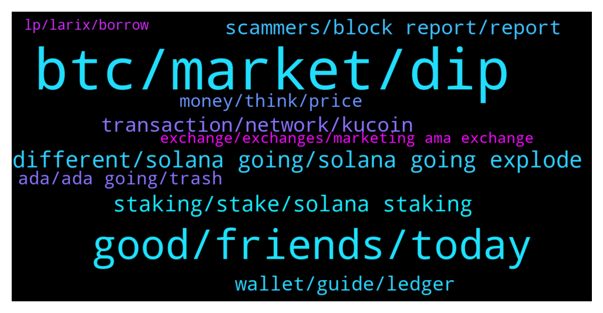

# **@solana**
 ## Analysis for **2022-01-19** - **2022-01-20**.

---

## 📊 **Basic Stats**

**n_messages_sent**: 526

---

---

## 🔝 **Top keywords and related messages**

1. **btc, market, dip**

    @NorbertWeiner --- *i think bitcoin dip to 10k* **--->** [TG Discussion](https://t.me/solana/908069)

    @jin_n_nnnn --- *Currently, Major Cryptos like BTC, ETH, and others are slowly into a downward which may be flipped forward / backward in the next couple of hours.* **--->** [TG Discussion](https://t.me/solana/908119)

    @Queens_daughter --- *Lol well I can’t agree, they are several strategies to make you rich but of course buying the dip is worth it* **--->** [TG Discussion](https://t.me/solana/909426)

    @azale0 --- *I'm a little worried about investing in cryptocurrency.  I'm worried the market is down* **--->** [TG Discussion](https://t.me/solana/907518)

    @Jack --- *Indeed im all in on Cardano because it is the future it will be here when 100 btc might buys you a pizza* **--->** [TG Discussion](https://t.me/solana/907851)

    @Queens_daughter --- *Buying the dips is just one of the many strategies, you still need to know how to buy the dip right 🤷🏼‍♀️* **--->** [TG Discussion](https://t.me/solana/909433)

2. **good, friends, today**

    @mahib45 --- *Hello 👋  Feel free to join your local community @SolanaBangladesh* **--->** [TG Discussion](https://t.me/solana/909022)

    @Dianasns --- *I'm bored. Do you have any friends to chat with?* **--->** [TG Discussion](https://t.me/solana/907897)

    @Emmly I. --- *Why are you agreeing to these now ?   👀* **--->** [TG Discussion](https://t.me/solana/909435)

    @Emmly I. --- *You just got quick at saying newbies lol !  Mate you can’t skip these process ! You don’t need to deceive yourself .* **--->** [TG Discussion](https://t.me/solana/909434)

    @Boragora --- *yes, I'll try to stay some more time* **--->** [TG Discussion](https://t.me/solana/909766)

    @daniela2i --- *So that make the complaint to big time* **--->** [TG Discussion](https://t.me/solana/908299)

3. **different, solana going, solana going explode**

    @Jack --- *Whose that bum Charles at least a true leader solana has no face no purpose its a vcscm* **--->** [TG Discussion](https://t.me/solana/907804)

    @Boragora --- *Francium too, they are one of the winners of past year Solana's competition* **--->** [TG Discussion](https://t.me/solana/909780)

    @MuffyYang --- *Any admin? Why solana beach is not updating the data?* **--->** [TG Discussion](https://t.me/solana/908356)

    @Seba --- *is still problem with chain solana?* **--->** [TG Discussion](https://t.me/solana/908763)

    @ASVARoom --- *Solanart is not linked to Solana ? Or is just a different chanel i have to go through ?* **--->** [TG Discussion](https://t.me/solana/909036)

    @Justin --- *Hey all, is solana support service anything to do with this page?* **--->** [TG Discussion](https://t.me/solana/909928)

4. **staking, stake, solana staking**

    @cryptolover1987 --- *There is no minimum SOL is required to start staking. But I would say, go with 0.01 or more SOL to ensure you can stake successfully, as well as pay the Solana staking network transaction fee.* **--->** [TG Discussion](https://t.me/solana/908809)

    @Agustín --- *Hello everybody!, I have a question if someone can answer, where is the best place to stake Solana token?* **--->** [TG Discussion](https://t.me/solana/908547)

    @R --- *Where is the best pool to stake your SOL into? What APY does it pay?* **--->** [TG Discussion](https://t.me/solana/909355)

    @shueybkhan --- *Also do you know what’s the minimum amount of Solana we need to stake ?* **--->** [TG Discussion](https://t.me/solana/908800)

    @vikash4086 --- *Anyone knows approx APR for staking in phatom wallet and solarise wallet* **--->** [TG Discussion](https://t.me/solana/908705)

    @Cabernet3girl --- *What is the best staking pool on Phantom for Sol?* **--->** [TG Discussion](https://t.me/solana/908681)

5. **transaction, network, kucoin**

    @f0995 --- *I sent USDC to an nft platform (BigTime) 28 days ago on Sol Network. My deposit still hasn't reflect on my BigTime Solana Wallet, even though my transaction has been confirmed. They told me:  "While it may still be a bit early for us to confirm the issue entirely, this appears to be an edge case involving either Associated Token Accounts (ATA) or a contract-to-contract transfer." What does it mean guys? I have proof of my transaction. Can a developer or a competent person help? Thank you very much* **--->** [TG Discussion](https://t.me/solana/908298)

    @shueybkhan --- *I sent it from Ascendex to my wallet but it’s stuck in Ascendex* **--->** [TG Discussion](https://t.me/solana/907895)

    @ShadowFiend22 --- *Hi guys, I have this error when I try to withdraw, do you have any solution? failed to send transaction: Transaction simulation failed: Attempt to debit an account but found no record of a prior credit.* **--->** [TG Discussion](https://t.me/solana/909369)

    @Folaross --- *If your transaction has been confirmed on the blockchain and your USDC does not reflect then you need to reach out to the platform support for assistance on it. I am sure they will be happy to help.* **--->** [TG Discussion](https://t.me/solana/908314)

    @Rascalspunk --- *Why my withdraw suspend from gate io ?* **--->** [TG Discussion](https://t.me/solana/909903)

    @MakingMoney30 --- *Hi what's wrong with network? Kucoin and binance not allowing withdrawals on sol?* **--->** [TG Discussion](https://t.me/solana/909859)

6. **scammers, block report, report**

    @Nigel --- *i'm sure it does a little at least.  jeeze, lotsa scammers in this site* **--->** [TG Discussion](https://t.me/solana/909761)

    @denizalagoz --- *Hundreds of scammers came private. Please can I get a quick reply :)* **--->** [TG Discussion](https://t.me/solana/909007)

    @shueybkhan --- *Reason I say that is because scammers are lurking everywhere in here trying to steal your tokens 😆* **--->** [TG Discussion](https://t.me/solana/907913)

    @かなkaname --- *Yes you are very correct too much scammers* **--->** [TG Discussion](https://t.me/solana/909762)

    @Emmly I. --- *It’s scammers . That’s spam to get attention lol* **--->** [TG Discussion](https://t.me/solana/908285)

    @vaibhavkwadhwa --- *Is it common to be bombarded by scamsters the moment you join this channel?* **--->** [TG Discussion](https://t.me/solana/907542)

7. **wallet, guide, ledger**

    @denizalagoz --- *Hi. I'm going to post the Wrapped Sol, but I have to convert it to SOL first. From which site can I do this the easiest? Thank you.* **--->** [TG Discussion](https://t.me/solana/909002)

    @Folaross --- *Check out Solana explorer like solanabeach.io or solscan.io for holders of a particular token.* **--->** [TG Discussion](https://t.me/solana/908355)

    @mahib45 --- *List of wallets where SOL is supported.  You can store your Sol tokens in any wallet of your preference below. Make sure you save your Private key or phrase words in a safe place. And don't share your private key or phrase words with anyone.  🖥 Desktop Wallets ▪️ Solflare   • https://www.solflare.com/access-wallet?hardware  Solflare wallet guide using Nano S and X - https://docs.solana.com/wallet-guide/solflare  ▪️phantom wallet  https://phantom.app/download  ▪️Solong chrome extension - https://chrome.google.com/webstore/detail/solong/memijejgibaodndkimcclfapfladdchj  ▪️ Ledger Live   • Ledger Nano S and X      Guide - https://docs.solana.com/wallet-guide/ledger-live  https://support.ledger.com/hc/en-us/articles/360016265659/  ▪️Math wallet    • Chrome extension - https://mathwallet.org/en-us/      🌐 Web Wallets ▪️Solflare    • https://www.solflare.com/create-wallet  ▪️Sollet    • https://www.sollet.io/    ▪️Sollet extension wallet  •https://chrome.google.com/webstore/detail/sollet/fhmfendgdocmcbmfikdcogofphimnkno?hl=en  ▪️Math wallet    • Web Wallet - https://mathwallet.org/en-us/   📱Mobile Wallets ▪️Trust wallet    • Download Trust Wallet app for iOS or Android app and create or import your wallet with multi-coin wallet and press add + button and search for SOL then switch on - https://trustwallet.com/  ▪️Math wallet    • Download Mathwallet app for iOS or Android app - https://mathwallet.org/en-us/  ▪️Coin98 wallet    • Android       https://play.google.com/store/apps/details?id=coin98.crypto.finance.media  • iPhone    https://apps.apple.com/vn/app/coin98-crypto-super-app/id1483029574    https://coin98.net/  ▪️SwipeWallet    • Android       https://play.google.com/store/apps/details?id=com.swipe.wallet     • iPhone          https://apps.apple.com/app/swipe-wallet/id1476726454    https://swipe.io/  https://moonlet.io/  ▪️Exodus  iPhone: https://apps.apple.com/app/apple-store/id1414384820?pt=118366236&ct=download&mt=8  Android: https://play.google.com/store/apps/details?id=exodusmovement.exodus  ▪️Slope Finance slope.finance  iOS: https://apps.apple.com/us/app/slope-wallet/id1574624530  Android: https://play.google.com/store/apps/details?id=com.wd.wallet  Note: Sollet wallet is supporting Erc20 <-> SPL conversion. And Coin98 wallet is supporting Sol and SPL tokens.* **--->** [TG Discussion](https://t.me/solana/908084)

    @cryptolover1987 --- *List of wallets where SOL is supported.  You can store your Sol tokens in any wallet of your preference below. Make sure you save your Private key or phrase words in a safe place. And don't share your private key or phrase words with anyone.  🖥 Desktop Wallets ▪️ Solflare   • https://www.solflare.com/access-wallet?hardware  Solflare wallet guide using Nano S and X - https://docs.solana.com/wallet-guide/solflare  ▪️phantom wallet  https://phantom.app/download  ▪️Solong chrome extension - https://chrome.google.com/webstore/detail/solong/memijejgibaodndkimcclfapfladdchj  ▪️ Ledger Live   • Ledger Nano S and X      Guide - https://docs.solana.com/wallet-guide/ledger-live  https://support.ledger.com/hc/en-us/articles/360016265659/  ▪️Math wallet    • Chrome extension - https://mathwallet.org/en-us/      🌐 Web Wallets ▪️Solflare    • https://www.solflare.com/create-wallet  ▪️Sollet    • https://www.sollet.io/    ▪️Sollet extension wallet  •https://chrome.google.com/webstore/detail/sollet/fhmfendgdocmcbmfikdcogofphimnkno?hl=en  ▪️Math wallet    • Web Wallet - https://mathwallet.org/en-us/   📱Mobile Wallets ▪️Trust wallet    • Download Trust Wallet app for iOS or Android app and create or import your wallet with multi-coin wallet and press add + button and search for SOL then switch on - https://trustwallet.com/  ▪️Math wallet    • Download Mathwallet app for iOS or Android app - https://mathwallet.org/en-us/  ▪️Coin98 wallet    • Android       https://play.google.com/store/apps/details?id=coin98.crypto.finance.media  • iPhone    https://apps.apple.com/vn/app/coin98-crypto-super-app/id1483029574    https://coin98.net/  ▪️SwipeWallet    • Android       https://play.google.com/store/apps/details?id=com.swipe.wallet     • iPhone          https://apps.apple.com/app/swipe-wallet/id1476726454    https://swipe.io/  https://moonlet.io/  ▪️Exodus  iPhone: https://apps.apple.com/app/apple-store/id1414384820?pt=118366236&ct=download&mt=8  Android: https://play.google.com/store/apps/details?id=exodusmovement.exodus  ▪️Slope Finance slope.finance  iOS: https://apps.apple.com/us/app/slope-wallet/id1574624530  Android: https://play.google.com/store/apps/details?id=com.wd.wallet  Note: Sollet wallet is supporting Erc20 <-> SPL conversion. And Coin98 wallet is supporting Sol and SPL tokens.* **--->** [TG Discussion](https://t.me/solana/909224)

    @David --- *I use Exodus wallet. It seems to work fine and never had any issues with it* **--->** [TG Discussion](https://t.me/solana/908550)

    @therealthinkright --- *You can use Atomic Wallet for sol* **--->** [TG Discussion](https://t.me/solana/908137)

8. **money, think, price**

    @Saj --- *You don’t know what Solana has planned. You think Sam Bankmanfried is stupid to invest heavily in Solana? And integrate Solana to his FTX exchange???* **--->** [TG Discussion](https://t.me/solana/907796)

    @RussianKarina --- *How high do you think Sol will go?* **--->** [TG Discussion](https://t.me/solana/908686)

    @Hent --- *I'm starting to regret putting my money in SOL 😥* **--->** [TG Discussion](https://t.me/solana/909169)

    @vaibhavkwadhwa --- *So yes. I believe it will go up. But I wouldn't bet my life savings, or any money that I can't afford to let go, on Solana.* **--->** [TG Discussion](https://t.me/solana/907666)

    @Alex --- *Is possible Solana 1000 dollars this year ?* **--->** [TG Discussion](https://t.me/solana/908734)

    @Rad --- *Hi guys will Sol go up?* **--->** [TG Discussion](https://t.me/solana/907654)

9. **ada, ada going, trash**

    @Jack --- *Ada at least going up thats a fact* **--->** [TG Discussion](https://t.me/solana/907831)

    @Jack --- *Ada will overtake ETH this year while sol will fall out of top10* **--->** [TG Discussion](https://t.me/solana/907854)

    @Jack --- *Sol is trash ada is the new sol 😉* **--->** [TG Discussion](https://t.me/solana/907826)

    @Jack --- *Ada at least is going up sol under 100 soon 😒* **--->** [TG Discussion](https://t.me/solana/907783)

    @Jack --- *Store of wat its like dirt on adas shoes kill that trash already delist it* **--->** [TG Discussion](https://t.me/solana/907847)

    @B_sh999 --- *Every event on even shits cause growing up. Ada just pulled back due to new app annancemnt* **--->** [TG Discussion](https://t.me/solana/907839)

10. **exchange, exchanges, marketing ama exchange**

    @anshuman --- *Go buy on some indian exchange* **--->** [TG Discussion](https://t.me/solana/907691)

    @Emmly I. --- *Anyone can list exchanges where I can buy solana ?* **--->** [TG Discussion](https://t.me/solana/908548)

    @Sanjeet70045 --- *Any one from india...need some sole of 1 dollar* **--->** [TG Discussion](https://t.me/solana/907684)

    @bbymy --- *Ok, can I buy on poocoin or only on an exchange?* **--->** [TG Discussion](https://t.me/solana/909450)

    @sereshtet --- *Let me know if anyone trades in the currency* **--->** [TG Discussion](https://t.me/solana/909328)

    @Amadeus03 --- *Private trader available with proven track record of 42% return in 2021. Trading done through API commission based only.  PM for more info* **--->** [TG Discussion](https://t.me/solana/909293)

