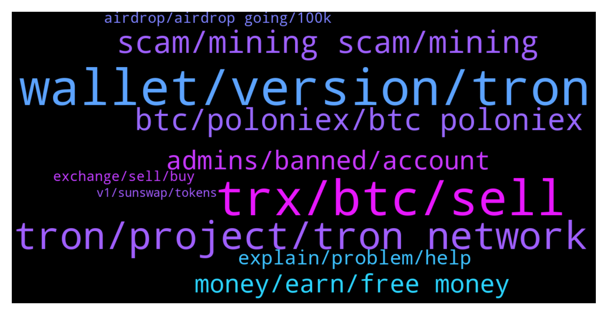

# **@tronnetworkEN**
 ## Analysis for **2022-01-19** - **2022-01-20**.

---

## 📊 **Basic Stats**

**n_messages_sent**: 260

---

---

## 🔝 **Top keywords and related messages**

1. **wallet, version, tron**

    @Vsr9999 --- *But I can’t open the download the older version bro, where do I login in* **--->** [TG Discussion](https://t.me/tronnetworkEN/3843341)

    @Vsr9999 --- *Dont have my private key, how do I verify myself in the new wallet* **--->** [TG Discussion](https://t.me/tronnetworkEN/3843326)

    @kipbhu --- *I was sent 900$ Ethereum and I don't find anything in my wallet* **--->** [TG Discussion](https://t.me/tronnetworkEN/3843712)

    @Ali --- *Without pharas u can't able recover your wallet* **--->** [TG Discussion](https://t.me/tronnetworkEN/3843345)

    @Moneyversac --- *Make it visible on trustwallet. But I would not recommend to buy on pancake because pancake is Binance Smart Chain.* **--->** [TG Discussion](https://t.me/tronnetworkEN/3843189)

    @Carlos_TRX --- *have you connected your wallet correctly? are you ni the correct version?* **--->** [TG Discussion](https://t.me/tronnetworkEN/3840220)

2. **trx, btc, sell**

    @ttuanphong --- *Hi, is there a place where I can get some TRX for free? I am learning about cryptocurrencies. Thanks* **--->** [TG Discussion](https://t.me/tronnetworkEN/3841800)

    @fiona_220 --- *Why my trx still freze after unstake?* **--->** [TG Discussion](https://t.me/tronnetworkEN/3840992)

    @Silvernitrate1 --- *Where can I buy TRX with cheaper rate ?* **--->** [TG Discussion](https://t.me/tronnetworkEN/3841882)

    @Moneyversac --- *Next time better buy on an exchange so you get the orginal TRX, but it's not a problem since price is 1:1 no matter which Blockchain you use* **--->** [TG Discussion](https://t.me/tronnetworkEN/3843211)

    @Samch007 --- *Thanks, so one can unfreeze the TRX before the snapshot date for any TRX held say on tronlink and then freeze it again* **--->** [TG Discussion](https://t.me/tronnetworkEN/3841244)

    @jarcola --- *But I can sell trx for BTC* **--->** [TG Discussion](https://t.me/tronnetworkEN/3840649)

3. **tron, project, tron network**

    @Carlos_TRX --- *TRON is a cryptocurrency, u can buy it in all big exchanges* **--->** [TG Discussion](https://t.me/tronnetworkEN/3841497)

    @agentpiki --- *Bitrue is not tron network project as far as I know. So proceed with caution* **--->** [TG Discussion](https://t.me/tronnetworkEN/3840689)

    @PiterSpain --- *There is a bridge between TRON <<>> BTTC and also between BTTC <<>> ETH/BSC* **--->** [TG Discussion](https://t.me/tronnetworkEN/3840180)

    @Rahul --- *What about Rubiktron in tronpro Link....???* **--->** [TG Discussion](https://t.me/tronnetworkEN/3841729)

    @simon866 --- *Just checked and its a mining site? Tron is not mined so thats a pure scam* **--->** [TG Discussion](https://t.me/tronnetworkEN/3843461)

    @agentpiki --- *Beyond TRON NETWORK is beyond our knowledge. You can always research thoroughly to avoid mistakes* **--->** [TG Discussion](https://t.me/tronnetworkEN/3840672)

4. **scam, mining scam, mining**

    @iammdtopor --- *There’s a f🤬ckn scammer in this group trying to get your secret recovery phrase* **--->** [TG Discussion](https://t.me/tronnetworkEN/3843638)

    @simon866 --- *Nothing to do with us mate, you been scammed* **--->** [TG Discussion](https://t.me/tronnetworkEN/3842071)

    @simon866 --- *Assume everything is a scam until proven otherwise 😂* **--->** [TG Discussion](https://t.me/tronnetworkEN/3842095)

    @kamelion --- *If you receive a pm it's 99% a scammer* **--->** [TG Discussion](https://t.me/tronnetworkEN/3841213)

    @simon866 --- *Scam tokens, don't touch them man 😂* **--->** [TG Discussion](https://t.me/tronnetworkEN/3842094)

    @agentpiki --- *Friendly reminder:  Never deal privately   Most probably scam!!!   Scammers operate using private messages!* **--->** [TG Discussion](https://t.me/tronnetworkEN/3840692)

5. **btc, poloniex, btc poloniex**

    @jarcola --- *I’m not depositing BTC onto Poloniex. I want to swap trx for BTC. So do I swap trx for BTC then send to Poloniex ?* **--->** [TG Discussion](https://t.me/tronnetworkEN/3840598)

    @agentpiki --- *Swap trx to btc in sunswap.com  then send btc to poloniex  this is possible right? @PiterSpain* **--->** [TG Discussion](https://t.me/tronnetworkEN/3840608)

    @PiterSpain --- *Once you deposit in Poloniex you have BTC, just BTC. You can trade or withdraw using the original Bitcoin network or the TRON Network.  👇* **--->** [TG Discussion](https://t.me/tronnetworkEN/3840591)

    @agentpiki --- *Yes 100%. You have to understand how CEX wallets work. But it doesn't matter as long as your question is answered, right?  Going back to your question, yes.  If you own BTC in poloniex, you can transfer to any BTC wallet* **--->** [TG Discussion](https://t.me/tronnetworkEN/3840636)

    @jarcola --- *So once I sell trx for BTC on Poloniex it will be regular BTC?* **--->** [TG Discussion](https://t.me/tronnetworkEN/3840574)

    @PiterSpain --- *You can deposit BTC TRON and WBTC TRON in Poloniex.com* **--->** [TG Discussion](https://t.me/tronnetworkEN/3840564)

6. **admins, banned, account**

    @س.محمدی --- *So why did i kicked and lose access* **--->** [TG Discussion](https://t.me/tronnetworkEN/3841942)

    @س.محمدی --- *Hi Please help i think my other account is wrongly banned by the bot* **--->** [TG Discussion](https://t.me/tronnetworkEN/3841927)

    @agentpiki --- *You have been here for long enough.  You should know admins and mods and BOTS do not message you first  Don't act like you don't know, and don't troll please* **--->** [TG Discussion](https://t.me/tronnetworkEN/3840976)

    @agentpiki --- *Take a look, the user is not banned* **--->** [TG Discussion](https://t.me/tronnetworkEN/3841941)

    @simon866 --- *Bots can block or ban for content posted or in profile that looks connected to any harmful sites or scams   Best to continue with the profile you are using now 👍* **--->** [TG Discussion](https://t.me/tronnetworkEN/3841945)

    @agentpiki --- *What account? Why do you have second account?* **--->** [TG Discussion](https://t.me/tronnetworkEN/3841929)

7. **money, earn, free money**

    @Jhaybhoy --- *Please can anybody teach me how to earn money here?* **--->** [TG Discussion](https://t.me/tronnetworkEN/3843975)

    @agentpiki --- *Highest now is 9% per year* **--->** [TG Discussion](https://t.me/tronnetworkEN/3841401)

    @rima19940 --- *Approximately how much profit per month* **--->** [TG Discussion](https://t.me/tronnetworkEN/3841398)

    @billyp258 --- *Why are voter rewards so much higher in the new year?* **--->** [TG Discussion](https://t.me/tronnetworkEN/3840753)

    @Carlos_TRX --- *nobody gives money away, you have other options like https://SUNSwap.com, sun.io or justlend* **--->** [TG Discussion](https://t.me/tronnetworkEN/3841422)

    @Zer0log --- *No free money here or elsewhere* **--->** [TG Discussion](https://t.me/tronnetworkEN/3843980)

8. **explain, problem, help**

    @agentpiki --- *This is the way to do it 👌* **--->** [TG Discussion](https://t.me/tronnetworkEN/3840602)

    @kipbhu --- *I have a very big problem again* **--->** [TG Discussion](https://t.me/tronnetworkEN/3843902)

    @kipbhu --- *Hello my ETH is back thanks* **--->** [TG Discussion](https://t.me/tronnetworkEN/3843763)

    @A_JarsLife_Thomas --- *frankly I don't know if I am making the right procedure...can you explain that to me?* **--->** [TG Discussion](https://t.me/tronnetworkEN/3842985)

    @kipbhu --- *I need any official to help* **--->** [TG Discussion](https://t.me/tronnetworkEN/3843945)

    @PiterSpain --- *I Know, follow the steps https://t.me/tronnetworkEN/3840564* **--->** [TG Discussion](https://t.me/tronnetworkEN/3840571)

9. **airdrop, airdrop going, 100k**

    @xPommepote --- *You don’t have to unfreeze. You have to be in the top 100k holders* **--->** [TG Discussion](https://t.me/tronnetworkEN/3841248)

    @Samch007 --- *@PiterSpain do we get the monthly apenft airdrop against the TRX which has been staked on a private wallet like tronlink* **--->** [TG Discussion](https://t.me/tronnetworkEN/3840155)

    @𝕍𝕚𝕛𝕒𝕪 --- *Hello all, is there any airdrop going?* **--->** [TG Discussion](https://t.me/tronnetworkEN/3843392)

    @DmG_90 --- *Frozen TRX is still eligible, though only the top 100 000 holders are distributed. Its advised to use supporting exchanges to participate in the ApeNFT airdrop with lower balances* **--->** [TG Discussion](https://t.me/tronnetworkEN/3840157)

    @Vsr9999 --- *2018 I think, I have lot airdrop coins in it* **--->** [TG Discussion](https://t.me/tronnetworkEN/3843318)

    @Samch007 --- *So basically whether we freeze or not, the airdrop would only happen for top 100k* **--->** [TG Discussion](https://t.me/tronnetworkEN/3841254)

10. **exchange, sell, buy**

    @jarcola --- *There is a buy or sell option* **--->** [TG Discussion](https://t.me/tronnetworkEN/3840650)

    @jarcola --- *Maybe I can send to bitrue and sell for BTC* **--->** [TG Discussion](https://t.me/tronnetworkEN/3840670)

    @simon866 --- *It can take a while for exchanges to credit them however the blockchain is correct 👍* **--->** [TG Discussion](https://t.me/tronnetworkEN/3843389)

    @agentpiki --- *Remember, BTC in exchange is "regular" BTC ones. The one we know 👌* **--->** [TG Discussion](https://t.me/tronnetworkEN/3840653)

    @DmG_90 --- *These requirements do not apply to supporting exchanges, and can be used with the minimum requiremend amount* **--->** [TG Discussion](https://t.me/tronnetworkEN/3840166)

    @Marg317 --- *Buy from any good exchange like binance or kucoin* **--->** [TG Discussion](https://t.me/tronnetworkEN/3841894)

