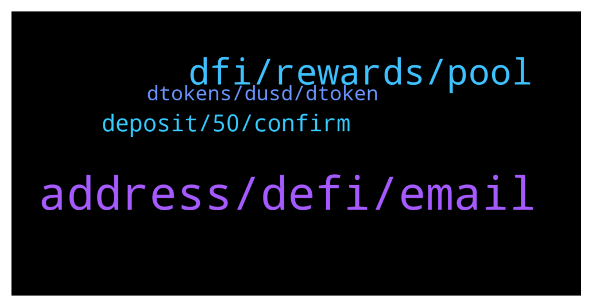

# **@CakeDeFi_EN**
 ## Analysis for **2022-01-20** - **2022-01-21**.

---

## 📊 **Basic Stats**

**n_messages_sent**: 149

---

---

## 🔝 **Top keywords and related messages**

1. **address, defi, email**

    @Rahatox --- *Yest .but they are wanting the utility bill also .Please dont offend ,But what shoul i do* **--->** [TG Discussion](https://t.me/CakeDeFi_EN/166940)

    @Rahatox --- *I tried to verify my id but they rejected it .My passport address is my hometown address ..and i also submitted the utility bill of my present address ..is it okay* **--->** [TG Discussion](https://t.me/CakeDeFi_EN/166933)

    @DLR988 --- *And I am getting messages from many people from this group.  Those people are asking me my personal details.* **--->** [TG Discussion](https://t.me/CakeDeFi_EN/166621)

    @SuBerDeFu --- *I can see it rn. I'm little bit amateur so thanks* **--->** [TG Discussion](https://t.me/CakeDeFi_EN/166659)

    @DmgBautista --- *That's strange. Never heard that from any user, if there was any problem with the IOS app, more than garanteed that half of the telegram group would have been making quite a fuss on that. Maybe some update that went less well? I am sorry, but if you could not use the app since like forever, that is really strange, and to my best knowledge, quite unique 😕* **--->** [TG Discussion](https://t.me/CakeDeFi_EN/166894)

    @Brian --- *Yea.. really weird. But I am now able to login through the website thanks to you😊* **--->** [TG Discussion](https://t.me/CakeDeFi_EN/166899)

2. **dfi, rewards, pool**

    @Stephan --- *That makes sense, so receiving less DFI as reward does not correlate with actual Dollar price of DFI, but rather with how many ppl are in the LM pool correct?* **--->** [TG Discussion](https://t.me/CakeDeFi_EN/166971)

    @Ganative1978 --- *As far as impermanent loss, is it better to liquidity mine Defi against a stable coin such as tether, or better to stake it against something like litecoin? Or would something like Bitcoin versus Bitcoin cash be better??* **--->** [TG Discussion](https://t.me/CakeDeFi_EN/166759)

    @rhodium219 --- *The rewards have been consistently 10% higher for the last 2 months. Just looking for a reason. Happy to accept the reason just want to understand it. I suspect that it may very well be that 10% more investment has been put into the pool and therefore there is a pro rata reduction in the amount of rewards I get since I’ve not up my investment. Thanks* **--->** [TG Discussion](https://t.me/CakeDeFi_EN/167016)

    @Michael_Schredl --- *This is part of it - don't forget that a lot of people went out of the pool and went in after the update* **--->** [TG Discussion](https://t.me/CakeDeFi_EN/167015)

    @rhodium219 --- *Thanks Michael. That’s cool and I think that is a genius solution to the dBTC shortfall issue. But it doesn’t explain 12% drop. I was wondering what other factors have contributed to the reduction.* **--->** [TG Discussion](https://t.me/CakeDeFi_EN/167014)

    @rhodium219 --- *Thanks, I'm aware of that and I seldom bother to look at the estimate APR as this is indeed an estimate. I'm asking from experience, what has changed since last week that would cause a 10% reduction in the LM rewards? Do you know? Can I find out? For example it could be that we now have 10% more investment in the LM pool. Which would be great. It could be that the LM rewards have been reduced because they have been diverted to other schemes. I was just interested in understanding what has happened so I can manage my own expectations.* **--->** [TG Discussion](https://t.me/CakeDeFi_EN/167002)

3. **deposit, 50, confirm**

    @fabioandreatta --- *Make a deposit bigger than $50 😉* **--->** [TG Discussion](https://t.me/CakeDeFi_EN/166512)

    @ExPwr --- *I assume it is 'CASH' but I'd like you to confirm.* **--->** [TG Discussion](https://t.me/CakeDeFi_EN/166498)

    @ExPwr --- *Hi, KuCoin calls this 'Bitcoin Cash Node (BCHN)', is it 'CASH' on your UI, can you please confirm?* **--->** [TG Discussion](https://t.me/CakeDeFi_EN/166494)

    @ExPwr --- *Fabio, on your UI, when you want to deposit BCH it gives you two options: 'CASH' or 'LEGACY'. Please read my question and confirm what is the correct type to withdraw from KuCoin.* **--->** [TG Discussion](https://t.me/CakeDeFi_EN/166497)

    @jezzkng --- *could you elaborate a bit more?* **--->** [TG Discussion](https://t.me/CakeDeFi_EN/166615)

    @AtanuIzHere --- *what is the process of deposit fund* **--->** [TG Discussion](https://t.me/CakeDeFi_EN/166529)

4. **dtokens, dusd, dtoken**

    @Dorian R. 1204 --- *The thing i can’t even select the dtoken from the drop down menu when i click on swap* **--->** [TG Discussion](https://t.me/CakeDeFi_EN/166832)

    @Dorian R. 1204 --- *Thanks for looking into it. I really hope the team can work on that quickly. This is a big deal if we can’t sell our dtokens...* **--->** [TG Discussion](https://t.me/CakeDeFi_EN/166857)

    @DmgBautista --- *Indeed you are correct! Tried with dTSLA and dBABA. Nothing appears to even allow the swap into DUSD. I'll report this and see what is happening!* **--->** [TG Discussion](https://t.me/CakeDeFi_EN/166855)

    @DmgBautista --- *You need to change the dtokens into dusd first, ir you want to swap them for a different dtoken. Dtokens are created through dusd, so you need to make that conversion, a direct route that does that in the background is not yet implemented. Maybe it can eventually exist, but for now, you must go the full route* **--->** [TG Discussion](https://t.me/CakeDeFi_EN/166830)

    @Dorian R. 1204 --- *Hi, how do i sell/swap my dtokens (e.g. Tesla) ? Thanks* **--->** [TG Discussion](https://t.me/CakeDeFi_EN/166826)

    @Dorian R. 1204 --- *Can you try from dtesla to dusd?you will see that dtokens are not part of the currencies available in the drop down menu. @DmgBautista* **--->** [TG Discussion](https://t.me/CakeDeFi_EN/166846)

