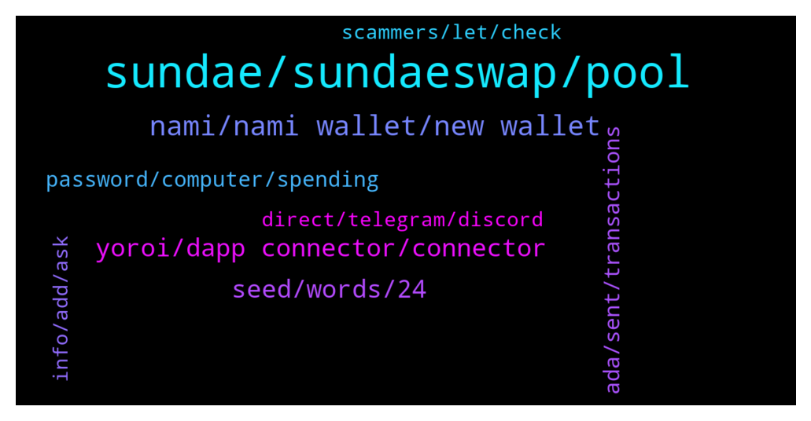

# **@Cardano**
 ## Analysis for **2022-01-20** - **2022-01-21**.

---

## 📊 **Basic Stats**

**n_messages_sent**: 412

---

---

## 🔝 **Top keywords and related messages**

1. **sundae, sundaeswap, pool**

    @Agilmore77 --- *Can we still earn the sundaeswap rewards for staking to their iso scoopers?* **--->** [TG Discussion](https://t.me/Cardano/773414)

    @bongs.btc --- *I'm sorry  to ask this question here . can we swipe    on sundaeswap  already  ?* **--->** [TG Discussion](https://t.me/Cardano/773481)

    @Wellsy89 --- *Is there a link to live price action on Sundae finance?* **--->** [TG Discussion](https://t.me/Cardano/773598)

    @myholosma --- *What a shhitshow sunday prise going up and swap still not working* **--->** [TG Discussion](https://t.me/Cardano/773276)

    @Agarta --- *If you staked to a listed pool provided by S-swap then your profit will be shown in 5 days. But ur Ada is still their (if it’s daudlaus Wallet)* **--->** [TG Discussion](https://t.me/Cardano/773267)

    @Randy --- *Can we directly swap ADA for SUNDAE token when the Dex goes live at 21:45utc?   Or only via Stake pools that we can earn Sundae* **--->** [TG Discussion](https://t.me/Cardano/772957)

2. **nami, nami wallet, new wallet**

    @J --- *Pissed.  Yoroi wasn't gonna be ready for Dapp interaction so I made a Nami wallet and transferred.  Now I can't delegate to anything except their BERRY pool.  I tried changing on Pool.pm but transactions won't go through and I can't even move my funds out of Nami now.  Zero delegation when I was already set up to qualify for airdrops* **--->** [TG Discussion](https://t.me/Cardano/772407)

    @apex_pool_spo --- *you still have time until 25th of January to delegate.  and you did not have to move your funds. you can delegate from Yoroi and you can restore the same wallet in Nami (or better in ccvault) to interact with the DApp.* **--->** [TG Discussion](https://t.me/Cardano/772410)

    @J --- *I moved my funds because I would not be able to interact with SundaeSwap using Yoroi since their Dapp interaction not released yet.  And created new wallet because it suggested interaction would be better.  Just didn't realize Nami would not let me change delegation in app* **--->** [TG Discussion](https://t.me/Cardano/772423)

    @nonsub --- *Hi thanks for any help. If I transfer from daed to nami this will break my stake delegation right? and will I then miss out on ss drop?* **--->** [TG Discussion](https://t.me/Cardano/773125)

    @Niro01 --- *Hello, I have sent some ADA from nami wallet to another account within the same wallet. I got the green banner sayng transaction submitted but it does not show up on cardano scan.It has been more than 15 hours. Will it go through eventually? Or I need to send my ADA again?* **--->** [TG Discussion](https://t.me/Cardano/773817)

    @ExInfernis --- *In nami wallet is stated that it is prefered to create new wallet and transfer to it* **--->** [TG Discussion](https://t.me/Cardano/773121)

3. **yoroi, dapp connector, connector**

    @Eddie --- *Is there a wallet I can get on my phone to stake and get sundae? My laptop just cooked it* **--->** [TG Discussion](https://t.me/Cardano/772765)

    @ExInfernis --- *I think yoroi will have very soon also dapp connector* **--->** [TG Discussion](https://t.me/Cardano/773127)

    @barryire --- *But when I search yoroi there are so many options, how do I know they aren't copy cats?* **--->** [TG Discussion](https://t.me/Cardano/773339)

    @Agilmore77 --- *Does sundaeswap not support the yoroi wallet?* **--->** [TG Discussion](https://t.me/Cardano/773408)

    @glitch04 --- *if exodus supports native assets in their wallet you would need to verify that with exodus/Sundae* **--->** [TG Discussion](https://t.me/Cardano/772599)

    @AyodeleFaiyetole --- *Yes, you can't. But you can't yet interact Yoroi with SundaeSwap* **--->** [TG Discussion](https://t.me/Cardano/772977)

4. **seed, words, 24**

    @glitch04 --- *The seedwords you have are the master key to the wallets anyone that controls them is able to control the wallet and restore yes* **--->** [TG Discussion](https://t.me/Cardano/772617)

    @TJSP2024 --- *So just to be sure, any restored wallet can be deleted and restored again with the original seed words used right? Not only the new seed words for the new restored wallet right?* **--->** [TG Discussion](https://t.me/Cardano/772616)

    @glitch04 --- *you shouldn't enter the 24 words into anything unless you are restoring the device* **--->** [TG Discussion](https://t.me/Cardano/773507)

    @RobertKi --- *I entered the 24 words and the pin* **--->** [TG Discussion](https://t.me/Cardano/773506)

    @RobertKi --- *Sorry I might have been unclear. I just bought the device and had to come  up with a pin and jot down the 24 words* **--->** [TG Discussion](https://t.me/Cardano/773508)

    @Zyroxa --- *There are some words which are on a blacklist and they get deleted asap because there arent 24/7 mods available.* **--->** [TG Discussion](https://t.me/Cardano/772833)

5. **ada, sent, transactions**

    @FlamingElim --- *My ADA has been deducted but didnt reveive any SS token..* **--->** [TG Discussion](https://t.me/Cardano/773467)

    @Paradigm7 --- *Is this for ADA? Exodus apply?* **--->** [TG Discussion](https://t.me/Cardano/772596)

    @Braine --- *What’s the community doing to ensure ADA is back up in a few days?* **--->** [TG Discussion](https://t.me/Cardano/773420)

    @Agilmore77 --- *Whats the lock up period when we stake ada?* **--->** [TG Discussion](https://t.me/Cardano/773428)

    @MisterPinecone --- *Thanks. Do I have to cancel my order to get my ada back on my wallet?* **--->** [TG Discussion](https://t.me/Cardano/773289)

    @Niro01 --- *Hello, I use nami waller. I have sent my ADA from one account to the other one within the wallet. I sent them more than 10 hours ago. I still did not receive them. Anyone had the same issue?* **--->** [TG Discussion](https://t.me/Cardano/773614)

6. **password, computer, spending**

    @mihhai0 --- *can they find out my password ?* **--->** [TG Discussion](https://t.me/Cardano/773783)

    @apex_pool_spo --- *no, they don't. if you did not give the password to anyone else, the spending password was just on the computer where you set it for the wallet.* **--->** [TG Discussion](https://t.me/Cardano/773804)

    @mihhai0 --- *they have that password and that password is used also on metamask* **--->** [TG Discussion](https://t.me/Cardano/773802)

    @mihhai0 --- *but if they find the password maybe they can go into some others accounts on my email* **--->** [TG Discussion](https://t.me/Cardano/773787)

    @apex_pool_spo --- *if you did not give them that password, they cannot discover it from the receovery words.* **--->** [TG Discussion](https://t.me/Cardano/773796)

    @apex_pool_spo --- *or you are worried about the password that your wallet had on your computer?* **--->** [TG Discussion](https://t.me/Cardano/773794)

7. **info, add, ask**

    @Roland --- *if you get stuck on your maths homework. make sure to ask here first before googling the answers* **--->** [TG Discussion](https://t.me/Cardano/772667)

    @Zyroxa --- *If you make such statements you probably should add some explanations, otherwise you will be gone very very quickly.* **--->** [TG Discussion](https://t.me/Cardano/773669)

    @apex_pool_spo --- *of course it does. you are welcome.* **--->** [TG Discussion](https://t.me/Cardano/773159)

    @ExInfernis --- *Ok. Thank you for the info* **--->** [TG Discussion](https://t.me/Cardano/773148)

    @TheBigLou13 --- *Ahh, got it. Thanks for your quick reaction and for clearing that up!* **--->** [TG Discussion](https://t.me/Cardano/772836)

    @TJSP2024 --- *Makes sense. Thanks for all the help* **--->** [TG Discussion](https://t.me/Cardano/772623)

8. **direct, telegram, discord**

    @Zyroxa --- *You may want to ask here : https://t.me/ProjectCatalystChat* **--->** [TG Discussion](https://t.me/Cardano/772903)

    @No way she says --- *And what if they told me that that chat weren't the place to ask? (:* **--->** [TG Discussion](https://t.me/Cardano/772920)

    @Rlabs --- *Never done this on any tg chat before* **--->** [TG Discussion](https://t.me/Cardano/773263)

    @No way she says --- *Hello there whom can i speak considering collaboration proposal?* **--->** [TG Discussion](https://t.me/Cardano/772902)

    @glitch04 --- *Best solution I can currently give you is make direct contact via their socials unfortunately I don't have anymore information and the best source is direct.   Socials:  - discord https://discord.gg/gCU8uPJ6ku - Twitter https://twitter.com/veritree_?s=21 - LinkedIn https://www.linkedin.com/company/veritree/* **--->** [TG Discussion](https://t.me/Cardano/773570)

    @glitch04 --- *Best place to find the information about a project is in their official channels directly, either their Discord or Website.* **--->** [TG Discussion](https://t.me/Cardano/772717)

