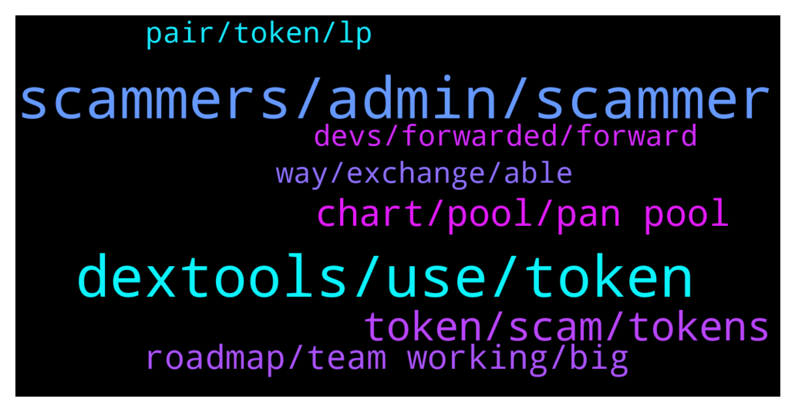

# **@DEXToolsCommunity**
 ## Analysis for **2022-01-19** - **2022-01-21**.

---

## 📊 **Basic Stats**

**n_messages_sent**: 280

---

---

## 🔝 **Top keywords and related messages**

1. **scammers, admin, scammer**

    @cryptopete69 --- *it did show as this name, I already blocked this person anyway, sorry for the confusion* **--->** [TG Discussion](https://t.me/DEXToolsCommunity/326425)

    @hmk18990 --- *For the news, advertisements, sponsorships please DM @guillermorodriguez78 he's the only in charge (and he'll never DM you first)* **--->** [TG Discussion](https://t.me/DEXToolsCommunity/326896)

    @hmk18990 --- *as I said before. he's the only one. so no other admin can help you about this.* **--->** [TG Discussion](https://t.me/DEXToolsCommunity/326905)

    @napascual --- *Sure, just remember admins never dm first* **--->** [TG Discussion](https://t.me/DEXToolsCommunity/326413)

    @James --- *I am a professional telegram community manager I will love to be part of this  community project as an admin or a mod I believe I will create impact to the project growths please pm. I would love to be part of your  project* **--->** [TG Discussion](https://t.me/DEXToolsCommunity/327274)

    @resn0ta --- *I already sent one scam guy dirty picture for asking me about promo...* **--->** [TG Discussion](https://t.me/DEXToolsCommunity/326906)

2. **dextools, use, token**

    @hani_disclosed --- *How come? The dex launch yesterday* **--->** [TG Discussion](https://t.me/DEXToolsCommunity/327473)

    @Godsonisstilldamademan --- *They must have bridge dextools algorythms i guess then. Or someone is not been sincere in your team just saying.* **--->** [TG Discussion](https://t.me/DEXToolsCommunity/327529)

    @MOONLIGGHTTT --- *CAN DEXT SUPPORT DO ANYTHING ABOUT IT* **--->** [TG Discussion](https://t.me/DEXToolsCommunity/327258)

    @memes_rule --- *My coin is not trading on Dextools* **--->** [TG Discussion](https://t.me/DEXToolsCommunity/326593)

    @bastardganpunk --- *watch the video joey posted, there are different kind of scams. this token has a dextscore of 1. for what reason would you prefer this token to bitcoin, ethereum or dext? ;)* **--->** [TG Discussion](https://t.me/DEXToolsCommunity/327236)

    @Frederic | DEXT --- *why cant i connect my bc wallet to dextools app to swap the token i wanna buy?* **--->** [TG Discussion](https://t.me/DEXToolsCommunity/326323)

3. **token, scam, tokens**

    @Cathy7717 --- *Hello, I would like to ask how to apply for the token's social networking software.* **--->** [TG Discussion](https://t.me/DEXToolsCommunity/327414)

    @Mad4mp3z --- *perfect bud, thanks, the amount of people in here trying ot money out of you is mad haha* **--->** [TG Discussion](https://t.me/DEXToolsCommunity/327163)

    @bastardganpunk --- *have you checked the token you bought is not a scam?* **--->** [TG Discussion](https://t.me/DEXToolsCommunity/327218)

    @bastardganpunk --- *About social Information for your token, please update etherscan.io, bscscan.com or the blockchain explorer from the chain your coin is built on or coingecko.com/ coinmarketcap We pull info from there.* **--->** [TG Discussion](https://t.me/DEXToolsCommunity/327333)

    @un_defi_ned_F --- *Hi Team, How can I upgrade the “information” score? I read the bot advises and the Medium articles but I cannot find the answer! TY in advance* **--->** [TG Discussion](https://t.me/DEXToolsCommunity/327331)

    @Larry --- *they have no social links there* **--->** [TG Discussion](https://t.me/DEXToolsCommunity/326528)

4. **chart, pool, pan pool**

    @nate102 --- *Normally it’s okay but at times like that it makes it look like chart is at all time high when it’s not even close* **--->** [TG Discussion](https://t.me/DEXToolsCommunity/327403)

    @TBGOATOFFICIAL --- *Whenever you try go on the chart* **--->** [TG Discussion](https://t.me/DEXToolsCommunity/327497)

    @bastardganpunk --- *It’s because you’re looking at pan pool, so it shows the chart from this pool* **--->** [TG Discussion](https://t.me/DEXToolsCommunity/327387)

    @nate102 --- *I’m confused is it not the same pool?* **--->** [TG Discussion](https://t.me/DEXToolsCommunity/327389)

    @nate102 --- *It’s just the launch of tokens doesn’t sync correctly to the chart* **--->** [TG Discussion](https://t.me/DEXToolsCommunity/327397)

    @nate102 --- *Thank you, the odd part I noticed as well is on launch the actual trade history has the correct price even when the chart bugs out like it did for that example.* **--->** [TG Discussion](https://t.me/DEXToolsCommunity/327405)

5. **roadmap, team working, big**

    @stanes --- *That's what you will know thanks to the roadmap 😄 + some surprises because team likes keeping secrets 😉* **--->** [TG Discussion](https://t.me/DEXToolsCommunity/327537)

    @stanes --- *New roadmap will be out soon, stay tuned!* **--->** [TG Discussion](https://t.me/DEXToolsCommunity/327527)

    @nimrod620 --- *Just curious what the plan is for 2022 and what the team is working on to get us to the next level* **--->** [TG Discussion](https://t.me/DEXToolsCommunity/327525)

    @JoeyDieleman --- *Team is working on an update of the roadmap* **--->** [TG Discussion](https://t.me/DEXToolsCommunity/327503)

    @nimrod620 --- *Hey do we have a roadmap or something* **--->** [TG Discussion](https://t.me/DEXToolsCommunity/327500)

    @nimrod620 --- *So putting the roadmap aside, what is the team working on?* **--->** [TG Discussion](https://t.me/DEXToolsCommunity/327535)

6. **way, exchange, able**

    @MOONLIGGHTTT --- *there might be a way to exchange* **--->** [TG Discussion](https://t.me/DEXToolsCommunity/327222)

    @MOONLIGGHTTT --- *any other way to do it* **--->** [TG Discussion](https://t.me/DEXToolsCommunity/327217)

    @bastardganpunk --- *Yes you can if it’s an erc20 or on bsc, polygon, avalanche or cronos* **--->** [TG Discussion](https://t.me/DEXToolsCommunity/327175)

    @rpoole69 --- *Unless it can already do that, I just am unaware* **--->** [TG Discussion](https://t.me/DEXToolsCommunity/326934)

    @napascual --- *Real time swaps should be working though* **--->** [TG Discussion](https://t.me/DEXToolsCommunity/326507)

    @bastardganpunk --- *(Just a personal question:) Do you already use it? 🤔 it takes 3-4 days to make a swap 🤔* **--->** [TG Discussion](https://t.me/DEXToolsCommunity/327474)

7. **devs, forwarded, forward**

    @FredericDEXT --- *Ok, thanks for confirming ,it's already reported to the devs* **--->** [TG Discussion](https://t.me/DEXToolsCommunity/326562)

    @bastardganpunk --- *Yes you’re right! Thank you for reporting, you’re very helpful 🙂* **--->** [TG Discussion](https://t.me/DEXToolsCommunity/327404)

    @JoeyDieleman --- *I'll forward it to the team* **--->** [TG Discussion](https://t.me/DEXToolsCommunity/327522)

    @JoeyDieleman --- *Hmm.. will forward it to the devs* **--->** [TG Discussion](https://t.me/DEXToolsCommunity/326484)

    @stanes --- *This is not fine, as I said I have forwarded the issue to the devs.* **--->** [TG Discussion](https://t.me/DEXToolsCommunity/326359)

    @stanes --- *Ok, forwarded to the devs, thanks.* **--->** [TG Discussion](https://t.me/DEXToolsCommunity/326353)

