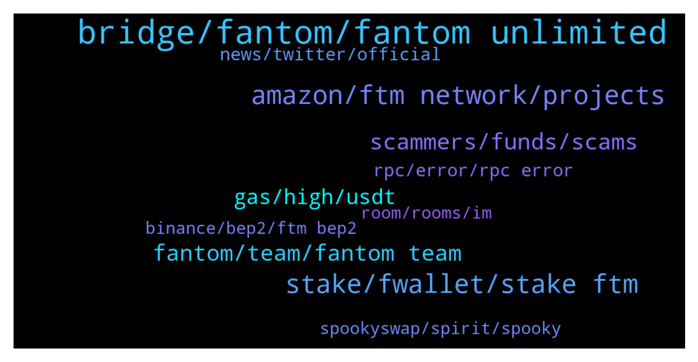

# **@Fantom_English**
 ## Analysis for **2022-01-20** - **2022-01-21**.

---

## 📊 **Basic Stats**

**n_messages_sent**: 357

---

---

## 🔝 **Top keywords and related messages**

1. **bridge, fantom, fantom unlimited**

    @Janevietani --- *Helpful tip:   if you want a cheaper alternative than bridging ftm and paying eth gas From binance(US) ,crypto.com or kucoin, get BNB and withdraw as BNB BEP20, then use https://spookyswap.finance/bridge To bridge BNB BEP20 to BNB Fantom Then use spookyswap to swap BNB Fantom to FTM  You will need ftm gas for transaction. Use the faucet https://www.mentasuave01-tools.com/* **--->** [TG Discussion](https://t.me/Fantom_English/636922)

    @KRYPTO_NIGHT --- *is there any recommended CEX currently brdging bsc to ftm please* **--->** [TG Discussion](https://t.me/Fantom_English/636676)

    @catsruledogsdrool --- *I'm trying to bridge and I keep on getting.... • Destination chain has insufficient liquidity to bridge. Please try again later.* **--->** [TG Discussion](https://t.me/Fantom_English/636520)

    @tazie --- *What’s the easiest way to bridge mainnet FTM to btc* **--->** [TG Discussion](https://t.me/Fantom_English/636954)

    @fantyboi --- *i dont think u can buy fantom on BSC network, unless there's a fantom peg i'm not aware of.. sounds like a scam coin. Only buy on CEX's and of course Fantom Mainnet via Spookyswap, etc* **--->** [TG Discussion](https://t.me/Fantom_English/636192)

    @Mcjig --- *1. use a bridge/ if you bridge from a network thats not erc then its cheaper* **--->** [TG Discussion](https://t.me/Fantom_English/637107)

2. **stake, fwallet, stake ftm**

    @Mcjig --- *yes, you can only stake with fwallet* **--->** [TG Discussion](https://t.me/Fantom_English/637055)

    @mighty_flyt --- *so if I have like 10, I definitely can't stake like 5?* **--->** [TG Discussion](https://t.me/Fantom_English/637673)

    @mighty_flyt --- *Unfortunately, can't stake anything because the balance shows 0, however I have more than 10 in my wallet* **--->** [TG Discussion](https://t.me/Fantom_English/637666)

    @Riquacrpt0 --- *Can ftm be staked using ledger?* **--->** [TG Discussion](https://t.me/Fantom_English/636599)

    @phillipeli --- *What a pity ... we were encouraged to stake on fwallet and now we aren’t part of this huge project ... I don’t understand... we support FTM on fwallet ....* **--->** [TG Discussion](https://t.me/Fantom_English/636944)

    @Fjody --- *Yes. Connect yout Ledger to fantom's PWA wallet and you can stake with some extra layer of security.* **--->** [TG Discussion](https://t.me/Fantom_English/636600)

3. **amazon, ftm network, projects**

    @Grim --- *Like I said the admin has laid down rules already. We want to hear more about ftm* **--->** [TG Discussion](https://t.me/Fantom_English/636185)

    @Expresstail --- *So why people are still falling for it dude? Three people mesgd me today they have lost 5BNB* **--->** [TG Discussion](https://t.me/Fantom_English/636164)

    @fieldBruce --- *@pajamasfreak I'd like to have FTM t-shirt or goodies. Is that possible ?* **--->** [TG Discussion](https://t.me/Fantom_English/637452)

    @Oliver --- *Hi everyone. I don't know why FTM have just pumped up. What's going on?* **--->** [TG Discussion](https://t.me/Fantom_English/636392)

    @Kay --- *I bridged ftm from eth network to ftm network and haven’t recieved yet.. is ftm network working ???* **--->** [TG Discussion](https://t.me/Fantom_English/636633)

    @Removsk --- *Well, considering the general bloodbath, ftm is doing allright* **--->** [TG Discussion](https://t.me/Fantom_English/637298)

4. **scammers, funds, scams**

    @Expresstail --- *Looks like you are one of the scammers, you have trouble when I post something against scammers.* **--->** [TG Discussion](https://t.me/Fantom_English/636182)

    @Expresstail --- *Scammers are claiming to send you 5000 FTM coins for 5 BNB coins. They are calling it a Airdrop.  Remb. Never do wallet transfers. No matter what  They mesg you as customer service or admin team.* **--->** [TG Discussion](https://t.me/Fantom_English/636153)

    @Nafez --- *scammers, please refrain from DMing me* **--->** [TG Discussion](https://t.me/Fantom_English/636738)

    @zenkert --- *👆👆👆  WOW scammers really took that bait. Stupid asses.* **--->** [TG Discussion](https://t.me/Fantom_English/637043)

    @redrose2 --- *9 scammers reached me in pm lmao* **--->** [TG Discussion](https://t.me/Fantom_English/637287)

    @pickaatg --- *also jesus christ how many scammers are there dming me* **--->** [TG Discussion](https://t.me/Fantom_English/637621)

5. **fantom, team, fantom team**

    @Bed of Roses Entertainment --- *Hello, good day everyone. Can someone please tell me about fantom? I just joined the project.* **--->** [TG Discussion](https://t.me/Fantom_English/636418)

    @Samuel --- *Thanks, really a fan of the fanthom ecosystem* **--->** [TG Discussion](https://t.me/Fantom_English/636461)

    @PampBets --- *I voted fantom, but I also have high hopes for ONE* **--->** [TG Discussion](https://t.me/Fantom_English/636172)

    @ZarkNC --- *im inside, but should change it? instead of fantomtrading* **--->** [TG Discussion](https://t.me/Fantom_English/636443)

    @kreeda55 --- *Hi guys, I just have a guy called stelian message me saying he’s from the fantom team. I haven’t done anything yet or sent him anything* **--->** [TG Discussion](https://t.me/Fantom_English/636227)

    @Antonio020 --- *Hallo guys, i heart that Amazon accept fantom pays out?, is it true?* **--->** [TG Discussion](https://t.me/Fantom_English/636654)

6. **gas, high, usdt**

    @xChrisMoneyMakerx --- *do u know why gas is high today?* **--->** [TG Discussion](https://t.me/Fantom_English/637566)

    @timthompson --- *I am having a hard time finding anything about this. I feel like the IRS doesnt even know what they want to do with that shit but I dont want to take the risk and get slapped with huge taxes* **--->** [TG Discussion](https://t.me/Fantom_English/637325)

    @Sax --- *Guys, we're about to reach 37k... Maybe it's already a winter antecipated 😢😱* **--->** [TG Discussion](https://t.me/Fantom_English/637286)

    @bulaaoea --- *Why does geist spend huge fee ?* **--->** [TG Discussion](https://t.me/Fantom_English/637646)

    @Oliver --- *It's from 1.1 usdt to 3.3 usdt.* **--->** [TG Discussion](https://t.me/Fantom_English/636398)

    @Janevietani --- *it is not. gas price are not very high while we have a lot tx. https://ftm.guru/fantomscan.html* **--->** [TG Discussion](https://t.me/Fantom_English/637239)

7. **rpc, error, rpc error**

    @sefroth77 --- *RPC under update progress, can you explain further sir* **--->** [TG Discussion](https://t.me/Fantom_English/637373)

    @Duke_Raul --- *"code": -32603,   "message": "Internal JSON-RPC error.",* **--->** [TG Discussion](https://t.me/Fantom_English/637678)

    @Janevietani --- *make sure to check it on ftmscan, i have experience it couple times, metamsk gave failed tx notifications but tx actually already success thats why we got internal json rpc error   btw if you wanna use differnt RPC you can use this one, eventho ftm.tools are working good  Network Name: Fantom Ultimates New RPC Url: https://ftmrpc.ultimatenodes.io/ ChainID: 250 Symbol: FTM Browser : https://ftmscan.com* **--->** [TG Discussion](https://t.me/Fantom_English/637682)

    @Janevietani --- *Network Name: Fantom Ultimates New RPC Url: https://ftmrpc.ultimatenodes.io/ ChainID: 250 Symbol: FTM Browser : https://ftmscan.com* **--->** [TG Discussion](https://t.me/Fantom_English/636916)

    @Janevietani --- *you can use this oen for testnet* **--->** [TG Discussion](https://t.me/Fantom_English/636905)

    @Janevietani --- *another RPC that user can use* **--->** [TG Discussion](https://t.me/Fantom_English/636896)

8. **news, twitter, official**

    @Janevietani --- *it should not be official. never heard of those news* **--->** [TG Discussion](https://t.me/Fantom_English/636658)

    @Antonio020 --- *I saw it on Twitter but idk if its the official Twitter or not, thats why i ask* **--->** [TG Discussion](https://t.me/Fantom_English/636657)

    @Janevietani --- *if you dont see it on our announcement then its rumours or fake news* **--->** [TG Discussion](https://t.me/Fantom_English/636655)

    @damybroeshart --- *Any update on snapshot for ve3,3?* **--->** [TG Discussion](https://t.me/Fantom_English/636669)

    @crypticZorba --- *seems like they are live already* **--->** [TG Discussion](https://t.me/Fantom_English/637607)

    @ahmadsarfarz --- *You can check that it's official* **--->** [TG Discussion](https://t.me/Fantom_English/636870)

9. **spookyswap, spirit, spooky**

    @Volt12 --- *I know of anyswap and spirit* **--->** [TG Discussion](https://t.me/Fantom_English/636623)

    @HanMooKwan --- *you won‘t get all coins on Spooky, some exclusive on Spiritswap… the blue chips are on both dex.* **--->** [TG Discussion](https://t.me/Fantom_English/636306)

    @arefinny --- *Hi, if I Buy MIM in pancakeswap, can I use it at spookyswap??* **--->** [TG Discussion](https://t.me/Fantom_English/636609)

    @reandrisaja --- *Why i cant swap on spookyswap?* **--->** [TG Discussion](https://t.me/Fantom_English/637207)

    @Janevietani --- *try ask it on spookyswap https://t.me/SpookySwapCommunity* **--->** [TG Discussion](https://t.me/Fantom_English/637264)

    @Northern chief --- *Main dex for fantom is spookyswap?* **--->** [TG Discussion](https://t.me/Fantom_English/636296)

10. **binance, bep2, ftm bep2**

    @Mcjig --- *binance.us has 4.5 mil ftm and i see out transactions* **--->** [TG Discussion](https://t.me/Fantom_English/637083)

    @Janevietani --- *try BinanceUS, Bitfinex, Huobi and Binance if you can use it* **--->** [TG Discussion](https://t.me/Fantom_English/637596)

    @Janevietani --- *if i am not mistaken BinanceUS support FTM BEP2 , please check it your self* **--->** [TG Discussion](https://t.me/Fantom_English/637270)

    @Mcjig --- *binance has 47mil ftm and i see a lot of out transactions* **--->** [TG Discussion](https://t.me/Fantom_English/637081)

    @bboldbayar --- *is there any difference between binance staking* **--->** [TG Discussion](https://t.me/Fantom_English/636733)

    @Janevietani --- *probably that because you have FTM BEP2 . you can send FTM BEP2 to Binance and withdraw native FTM from Binance* **--->** [TG Discussion](https://t.me/Fantom_English/637267)

