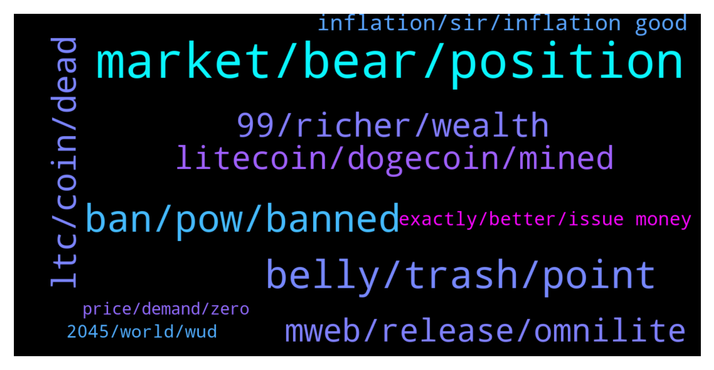

# **@Litecoin**
 ## Analysis for **2022-01-20** - **2022-01-21**.

---

## 📊 **Basic Stats**

**n_messages_sent**: 240

---

---

## 🔝 **Top keywords and related messages**

1. **market, bear, position**

    @ck42069 --- *Im keeping my shorts at 149 meanwhile you noob hodlers go straigth to zero* **--->** [TG Discussion](https://t.me/Litecoin/2049779)

    @ck42069 --- *I panicked a bit at 137.5* **--->** [TG Discussion](https://t.me/Litecoin/2050542)

    @ck42069 --- *I still have40% of my short position open from 149* **--->** [TG Discussion](https://t.me/Litecoin/2050538)

    @Namchio --- *relax, the market will bounce soon :)* **--->** [TG Discussion](https://t.me/Litecoin/2050313)

    @RorschachTesst --- *We crashed through 40k like molten butter. It will bounce back to 40k before sliding down again, probably into oblivion this time around* **--->** [TG Discussion](https://t.me/Litecoin/2050333)

    @K_arlso_n --- *David is a slow man.... ))) Waiting bearish market... HAHAHA* **--->** [TG Discussion](https://t.me/Litecoin/2050201)

2. **belly, trash, point**

    @jericho2411 --- *dont get y amuricans allways stare own belly puttons.. y think  rest of the world does it also..* **--->** [TG Discussion](https://t.me/Litecoin/2050180)

    @born_slippy81 --- *There comes a time we gone fly* **--->** [TG Discussion](https://t.me/Litecoin/2050457)

    @RabbitL0v3r --- *If i miss out u gonna be legally responsible* **--->** [TG Discussion](https://t.me/Litecoin/2050403)

    @ck42069 --- *You guys are seriously out of your minds* **--->** [TG Discussion](https://t.me/Litecoin/2050185)

    @Macro5674 --- *Just 23 years away ! From that ! 🙈😃* **--->** [TG Discussion](https://t.me/Litecoin/2050086)

    @TonyNakamoto --- *let's see if we can boumce here* **--->** [TG Discussion](https://t.me/Litecoin/2050332)

3. **ban, pow, banned**

    @RabbitL0v3r --- *EU also lookin to ban PoW coins* **--->** [TG Discussion](https://t.me/Litecoin/2049947)

    @Macro5674 --- *But in the end its creating a stateless , decentralized monetary system ! Moreover I heard pow just use less than 1% of world energy and more than 50% already turned into renewable source!* **--->** [TG Discussion](https://t.me/Litecoin/2049987)

    @Yhtrcgtfv566 --- *Instead of signaling for mimble wimble activation, market is signaling for crypto deactivation* **--->** [TG Discussion](https://t.me/Litecoin/2050521)

    @Macro5674 --- *I thought Putin was pro bitcoin! It's only their banks 🏦 calling for ban !* **--->** [TG Discussion](https://t.me/Litecoin/2050342)

    @Augusto --- *Because all this news of ban something related with cripto* **--->** [TG Discussion](https://t.me/Litecoin/2049963)

    @Cezto --- *Wow,look like EU ban is working perfectly 😂* **--->** [TG Discussion](https://t.me/Litecoin/2050021)

4. **ltc, coin, dead**

    @K_arlso_n --- *LTC not have support. Dead coin.* **--->** [TG Discussion](https://t.me/Litecoin/2050420)

    @archus --- *LTC is still pow and the functions of Omnilite are kinda limited compared to real Smart contracts, so why should actually people make use of it when also payments web3 providers are implementing tokens, of various layer1 chains that are way superior to LTC to use in terms of speed, transaction fees, validation time and stability   What also does actually speak for LTC to be used as coin to purchase when its more likely to be a dropping stable coin rather than using upcoming DeFi stablecoins?* **--->** [TG Discussion](https://t.me/Litecoin/2049741)

    @lisalust --- *if LTC would Copy that Smart Move, then it can also be more Stable* **--->** [TG Discussion](https://t.me/Litecoin/2050248)

    @jblife --- *Yeah I hope LTC to the moon* **--->** [TG Discussion](https://t.me/Litecoin/2050017)

    @syonfive --- *waiting for ltc touch the lowest point at bollonger paths* **--->** [TG Discussion](https://t.me/Litecoin/2049885)

    @jblife --- *LTC gave me a lambo and I can’t complain, but it’s kinda dead lately. I just hope it doesn’t go to shits bc I’m HODL* **--->** [TG Discussion](https://t.me/Litecoin/2050023)

5. **99, richer, wealth**

    @RorschachTesst --- *Look at the demand for automobiles and electronics. Demand outpaced supply and not the other way around. You still think only 100M people increased their wealth?* **--->** [TG Discussion](https://t.me/Litecoin/2050444)

    @RorschachTesst --- *Homeless people are not a gauge for the economy. While the pandemic has pushed more people below the poverty line, it has vastly increased the wealth divide compared to the 2008 recession. People in skilled jobs have become richer. The gdp has grown. More companies are entering the trillion $ mcap benchmark* **--->** [TG Discussion](https://t.me/Litecoin/2050424)

    @RorschachTesst --- *The top 10 did become richer but to claim nearly everyone became poorer is stupid. Why is there so much money in speculative assets if everyone is poor?* **--->** [TG Discussion](https://t.me/Litecoin/2050436)

    @RabbitL0v3r --- *99% become poorer according to oxfam* **--->** [TG Discussion](https://t.me/Litecoin/2050427)

    @RabbitL0v3r --- *Doesnt mean every speculator became richer* **--->** [TG Discussion](https://t.me/Litecoin/2050440)

    @RorschachTesst --- *If indeed we were facing a historical poverty wave the demand would take years to pick up.* **--->** [TG Discussion](https://t.me/Litecoin/2050447)

6. **mweb, release, omnilite**

    @Zer0fact0r --- *Tether just freeze 160m. Stablecoins are all centralized. Even dai to a certain degree if eth is the authority. Omnilite is just for tokenization. Smart contracts are limited on pow L1s, there are dozen of bridge to other networks to get smart contracts. We are not going to get native until some sidechain for btc arrive, it's just build differently than say eth, which has a ton of problem to solves being tuning complete.* **--->** [TG Discussion](https://t.me/Litecoin/2049846)

    @Notbiden --- *They needed to release mweb at 400* **--->** [TG Discussion](https://t.me/Litecoin/2050220)

    @RorschachTesst --- *A woman could give birth to 3 kids in the time mweb was created. Sheesh. Make it fast* **--->** [TG Discussion](https://t.me/Litecoin/2049938)

    @ck42069 --- *Guys they say thry will release mweb last week of this month* **--->** [TG Discussion](https://t.me/Litecoin/2049776)

    @TonyNakamoto --- *R th0t it would B digital waPch that always displays '2 weeks'* **--->** [TG Discussion](https://t.me/Litecoin/2049728)

    @RorschachTesst --- *January ending in 10 days. Any news on mweb?????* **--->** [TG Discussion](https://t.me/Litecoin/2049937)

7. **litecoin, dogecoin, mined**

    @RabbitL0v3r --- *And akshually merchant adoption through bitpay is also faked, for ltc narrative, as they provide a multitude of crypto, including tru shitcoin token with a dog logo* **--->** [TG Discussion](https://t.me/Litecoin/2050389)

    @Macro5674 --- *Transactions are at all time high in litecoin but yeah I got the point everything also can be faked !* **--->** [TG Discussion](https://t.me/Litecoin/2050390)

    @Macro5674 --- *There were days when dogecoin survived due to litecoin. Now due to elon musk, litecoin surviving due to dogecoin ? Nope I don't think so 🤔! Litecoin as survived without dogecoin for so many years and as new value kept on added on litecoin, it would survive without dogecoin again !* **--->** [TG Discussion](https://t.me/Litecoin/2050379)

    @professional --- *Litecoin is Very fast in down trand* **--->** [TG Discussion](https://t.me/Litecoin/2050190)

    @arnego2 --- *There is more than one direction you can go. IMHO Litecoin is best suited for trade and payment for goods* **--->** [TG Discussion](https://t.me/Litecoin/2049747)

    @Macro5674 --- *There is a history of wash trading linked to litecoin also but don't know how true it is 🙈😭😜* **--->** [TG Discussion](https://t.me/Litecoin/2050392)

8. **inflation, sir, inflation good**

    @Macro5674 --- *Yup I remember told me that before sir ! But I can't grasp how inflation is any good too ! 😕* **--->** [TG Discussion](https://t.me/Litecoin/2050003)

    @Macro5674 --- *That is true sir it won't solve class gap but it wud solve inflation maybe sir ! Fixed amount !* **--->** [TG Discussion](https://t.me/Litecoin/2049999)

    @Macro5674 --- *By the way employment anyways gonna decrease due to automation 😜 What wud inflationary world do when unemployed people have no money to buy things ? 🙃* **--->** [TG Discussion](https://t.me/Litecoin/2050027)

    @Augusto --- *If we have a lower inflation % that's can be good* **--->** [TG Discussion](https://t.me/Litecoin/2050046)

    @RabbitL0v3r --- *For a long time there was a correlation between inflation and unemployement rate, but got invalidated with the stagnation* **--->** [TG Discussion](https://t.me/Litecoin/2050010)

    @JohnTheApostle --- *Those who defend inflation keep saying "ye but deflation bad"* **--->** [TG Discussion](https://t.me/Litecoin/2050005)

9. **exactly, better, issue money**

    @Macro5674 --- *So we can all agree it's better than fiat, which is debt-based pyramid scheme where only cronies gets to climb above ranks , inflating our money by printing more constantly where our savings always devalued so that we always remain under pressure and keep people working ! And the fun fact is most of that printed money goes to corporates in loans which they don't even pay back mostly !* **--->** [TG Discussion](https://t.me/Litecoin/2050049)

    @K_arlso_n --- *Need more $ for government. )))* **--->** [TG Discussion](https://t.me/Litecoin/2050165)

    @Macro5674 --- *And we get no centralized authority printing out more money sir* **--->** [TG Discussion](https://t.me/Litecoin/2049996)

    @Macro5674 --- *It's not exactly more money , it's different form of money entirely altogether sir I think 🤔!* **--->** [TG Discussion](https://t.me/Litecoin/2049993)

    @RabbitL0v3r --- *No monetary system is better than any other one* **--->** [TG Discussion](https://t.me/Litecoin/2050053)

    @RabbitL0v3r --- *Come exactly to the same, with exactly the same issue money involve because it's money after all* **--->** [TG Discussion](https://t.me/Litecoin/2049995)

10. **2045, world, wud**

    @RabbitL0v3r --- *Indirect democracy is in my opinion a failure* **--->** [TG Discussion](https://t.me/Litecoin/2050090)

    @Macro5674 --- *Something like Global Resource Based Economic system in which all goods and services are available without use of money ! Maybe but yeah by then (2045) something new economic system wud arise as everything is automated and run by robots and ai/algorithms but yeah cud be totalitarian or authoritarian in nature !* **--->** [TG Discussion](https://t.me/Litecoin/2050085)

    @Augusto --- *I pray that in 2045 that democracy be treated as the minimum necessary for a society and be adopted by all* **--->** [TG Discussion](https://t.me/Litecoin/2050069)

    @Macro5674 --- *Just live thru 2045 people , world gonna change alot in those times seriously !* **--->** [TG Discussion](https://t.me/Litecoin/2050068)

    @Macro5674 --- *It's won't be a capitalist world around 2045 as need of workers wud be finished by then! It would be most probably totalitarian or authoritarian maybe 🤔 without capitalism/money!* **--->** [TG Discussion](https://t.me/Litecoin/2050064)

    @Macro5674 --- *So a world without money ! Hmmm it's a utopian dream which can become true too if we get totally automated in every sphere and thru AI eventually ! By 2045 maybe ! 🤔 my prediction as that's when we would roughly reach that stage according to any scientists too! But if not monetary system something else wud take place of it , fear that too ! Without money who wud control the world ? AI and robot operators!* **--->** [TG Discussion](https://t.me/Litecoin/2050058)

