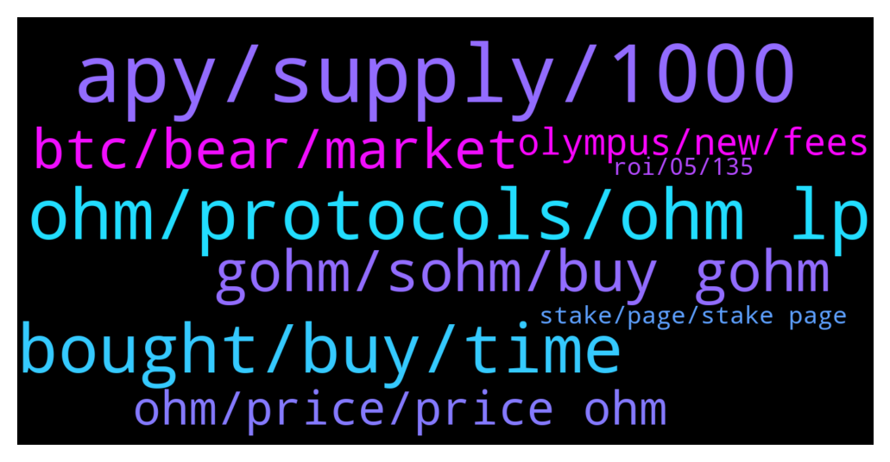

# **@OlympusTG**
 ## Analysis for **2022-01-20** - **2022-01-21**.

---

## 📊 **Basic Stats**

**n_messages_sent**: 1444

---

---

## 🔝 **Top keywords and related messages**

1. **apy, supply, 1000**

    @Ap0l1o --- *No, it means that after that the APY may decrease even further or stop altogether* **--->** [TG Discussion](https://t.me/OlympusTG/162353)

    @Host_Matt --- *Not sure why you’re using 1000 apy* **--->** [TG Discussion](https://t.me/OlympusTG/160603)

    @Host_Matt --- *Ohm is complicated because all people see is the APY* **--->** [TG Discussion](https://t.me/OlympusTG/163204)

    @nfwaple --- *APY gets to 1% I think maybe a fraction of 1%* **--->** [TG Discussion](https://t.me/OlympusTG/161182)

    @Cixex --- *When APY gets to 0%, what happens* **--->** [TG Discussion](https://t.me/OlympusTG/161181)

    @Cixex --- *Contradicting response.   You said prolly 1000%  Then it drops as supply expands.   There is no cap for % APY* **--->** [TG Discussion](https://t.me/OlympusTG/161688)

2. **ohm, protocols, ohm lp**

    @bodMIX --- *Don't let me compare OHM with other projects, there are competition in the market* **--->** [TG Discussion](https://t.me/OlympusTG/160950)

    @nfwaple --- *OHM is not something that falls apart* **--->** [TG Discussion](https://t.me/OlympusTG/161019)

    @MrMann89 --- *My apologies I’m all in Ohm, I knew this would happen with a lot of ohm forks* **--->** [TG Discussion](https://t.me/OlympusTG/163419)

    @nfwaple --- *yes but cutting supply does not help with OHM vision* **--->** [TG Discussion](https://t.me/OlympusTG/161120)

    @Danimal84 --- *Glad to hear that OHM is getting more involved in other projects though* **--->** [TG Discussion](https://t.me/OlympusTG/161040)

    @nfwaple --- *like imagine when OHM can be used to swap to any defi in the future* **--->** [TG Discussion](https://t.me/OlympusTG/161195)

3. **bought, buy, time**

    @nfwaple --- *wow I sold a lot of SOL at $30, RIP* **--->** [TG Discussion](https://t.me/OlympusTG/161478)

    @ceFarzin --- *what do u suggest for people who bought at 700?* **--->** [TG Discussion](https://t.me/OlympusTG/163310)

    @Derrick --- *hmm that strange... I'll look into. I bought some a few weeks ago and was thinking about doing more* **--->** [TG Discussion](https://t.me/OlympusTG/160664)

    @Legend --- *I bought 90k it been 35k, it is no problem I  don't care but how I can know price will back to 300$ again?!* **--->** [TG Discussion](https://t.me/OlympusTG/162110)

    @Ap0l1o --- *Had lots of sol with an average buy of 28-29, sold with average of 243* **--->** [TG Discussion](https://t.me/OlympusTG/161473)

    @Dave_881010 --- *Same. Got on another 100k at 180 - 190* **--->** [TG Discussion](https://t.me/OlympusTG/163243)

4. **gohm, sohm, buy gohm**

    @Danimal84 --- *Yea he is definitely pompous. But, I was interested more on your thoughts on the price floor.* **--->** [TG Discussion](https://t.me/OlympusTG/161221)

    @nfwaple --- *if you sOHM number goes up it means you're already on v2, no need to convert to gohm* **--->** [TG Discussion](https://t.me/OlympusTG/162949)

    @SinisterCyclops --- *Ok so my 10 sOHM just turned into 0.1465 gOHM* **--->** [TG Discussion](https://t.me/OlympusTG/161420)

    @Ahmad --- *Thanks for the info. It is a great help. I have also come to a conclusion and that is to just buy gOhm and dun think so much on the APY.* **--->** [TG Discussion](https://t.me/OlympusTG/162366)

    @Z --- *Hi all we can’t go back to sohm can we as ever since I gone to gohm it’s just flying down like a rug lol 😂 (don’t attack I’m not saying it’s a rug pull) but going back to sohm at least we have more tokens* **--->** [TG Discussion](https://t.me/OlympusTG/163439)

    @nm --- *now is it better to buy gohm? where is it bought? Oh, I shouldn't buy it? Excuse my ignorance.* **--->** [TG Discussion](https://t.me/OlympusTG/161220)

5. **btc, bear, market**

    @Cixex --- *BTC support has been broken. Kiss bull run a good bye* **--->** [TG Discussion](https://t.me/OlympusTG/162998)

    @malmsta --- *Dont listen too much to the doom and gloomers because it doesn't matter... So what if btc drops to 12k. it isn't going to stay there... It will go up again. The only variable that has changed is time. There is a delay. My experience with people who call the apocalypse is that they just want to sound smart... If they are positive then they are just considered naïve so better to be negative about it, then you won't look so dumb... You'll be fine...* **--->** [TG Discussion](https://t.me/OlympusTG/163566)

    @Cixex --- *The final bull wave 5 is complete. It’s bear time. Very painful one.* **--->** [TG Discussion](https://t.me/OlympusTG/163564)

    @Valihora --- *It's hard to say now. I believe BTC is still a good value saver, but now the situation can be even worse. S&P and other indexes did big dump today, so BTC has followed. And I hope it's not just a beginning of bear market...* **--->** [TG Discussion](https://t.me/OlympusTG/163563)

    @GordonTheGecko --- *Let's see if BTC drops below $37k. After that $30k.* **--->** [TG Discussion](https://t.me/OlympusTG/163561)

    @ccryii --- *Chart is parabolic . It is already on bear , for now* **--->** [TG Discussion](https://t.me/OlympusTG/163460)

6. **ohm, price, price ohm**

    @VincentStatic --- *Ohm looks strong today. Maybe 200$ soon* **--->** [TG Discussion](https://t.me/OlympusTG/162217)

    @MrMann89 --- *So what’s price prediction for ohm when BTC hits ATH.* **--->** [TG Discussion](https://t.me/OlympusTG/163433)

    @Cixex --- *He thought the ohm was backed at $100.* **--->** [TG Discussion](https://t.me/OlympusTG/161322)

    @orzalacoin --- *What is ohm's current plan, will prices improve when the market improves?* **--->** [TG Discussion](https://t.me/OlympusTG/160968)

    @Cixex --- *Ohms is not designed to go up in price.* **--->** [TG Discussion](https://t.me/OlympusTG/161680)

    @Shot caller --- *Is Zeus or Hercules going to do anything to increase the price of OHM?* **--->** [TG Discussion](https://t.me/OlympusTG/161596)

7. **olympus, new, fees**

    @RecoDedon --- *Can someone tell me the use case of Olympus?!?!* **--->** [TG Discussion](https://t.me/OlympusTG/163552)

    @thomasdb12 --- *Hi guys~ Would love to build some Olympus farms and pools on our DEX. It’s still fairly new but already top 5 in TVL on BSC and FTM. Could someone please direct me to the best place to ask or person to talk to? Thank you!* **--->** [TG Discussion](https://t.me/OlympusTG/162735)

    @nfwaple --- *those are the fees Olympus get from the OlympusPro partners* **--->** [TG Discussion](https://t.me/OlympusTG/163431)

    @Derrick --- *Hello I am new to the group but wanted to share something that may help save on Gas fees. Not sure if many of you are aware but you can buy OHM on hotbit exchange with usdt for minimum trading fees, then send to metamask and stake on Olympus. This way you can avoid high swamping fees, and only have to pay the staking fee. Also since the market is down, its a great time to buy!* **--->** [TG Discussion](https://t.me/OlympusTG/160654)

    @OGCryptoo --- *Olympus is an earning monster with treasury plus earnings; so chillax everyone* **--->** [TG Discussion](https://t.me/OlympusTG/162935)

    @DayBe009 --- *How can I buy Olympus ?* **--->** [TG Discussion](https://t.me/OlympusTG/161808)

8. **stake, page, stake page**

    @SAJ000111 --- *It worked - I can now see my staked sOHMs  But do I need to convert those to gOHM or let them as they are?* **--->** [TG Discussion](https://t.me/OlympusTG/162944)

    @Chriso1970 --- *Mine is staked currently. Where do you swap directly* **--->** [TG Discussion](https://t.me/OlympusTG/160577)

    @Vec --- *I can’t see my staked balance on my dashboard* **--->** [TG Discussion](https://t.me/OlympusTG/162699)

    @l0_pl --- *When the dust settles, people are gonna scramble to find a place to stake* **--->** [TG Discussion](https://t.me/OlympusTG/163461)

    @nfwaple --- *ok, and also if you need to convert the stake page will have a message asking you to do it* **--->** [TG Discussion](https://t.me/OlympusTG/162956)

    @Fake_Muse --- *hi everyone. quick question if you dont mind. Ive been a longish term staker - and I recently tempted an associate to get involved with Olympus. I gave him the usual steps on how to stake and we have followed them but it is not working for him at the final step. we are on the stake page, clicking MAX and then stake, but its just not going through. My question is are there any known issues right now with staking that might be causing this?* **--->** [TG Discussion](https://t.me/OlympusTG/161851)

