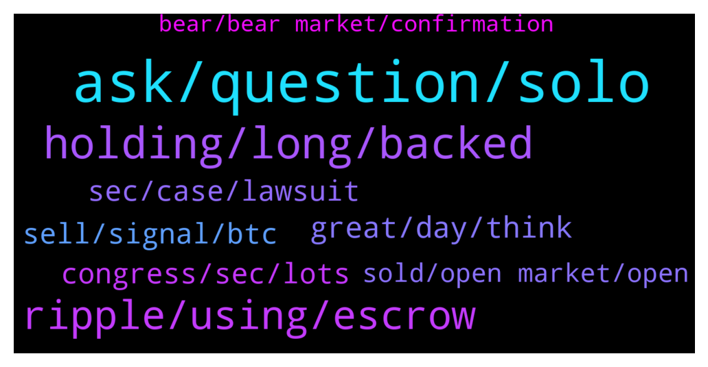

# **@Ripple**
 ## Analysis for **2022-01-20** - **2022-01-21**.

---

## 📊 **Basic Stats**

**n_messages_sent**: 238

---

---

## 🔝 **Top keywords and related messages**

1. **ask, question, solo**

    @iNakazumi --- *I have a technical question, anyone here that can help?* **--->** [TG Discussion](https://t.me/Ripple/3042841)

    @krtdxn --- *Ok. Will do. Didn't realize that. Other chat rooms didn't mention* **--->** [TG Discussion](https://t.me/Ripple/3042604)

    @krtdxn --- *I do have one? Don't understand* **--->** [TG Discussion](https://t.me/Ripple/3042602)

    @Tetsuya15 --- *I thought you will be sharing you t.a. Now, I realized that you asking for help. Sorry, my bad. 😅✌️* **--->** [TG Discussion](https://t.me/Ripple/3042862)

    @JustNNM --- *@kenyiofficial You made it as per your previous post, stop reposting the same thing to get views or you will be warned/banned for spamming* **--->** [TG Discussion](https://t.me/Ripple/3043053)

    @GSvetoslav --- *Hey guys, I have been holding my XRP at xumm with setup trustline for Solo. Did the airdrop already happened as I am not seeing my Solo tokens?* **--->** [TG Discussion](https://t.me/Ripple/3043075)

2. **holding, long, backed**

    @xrp211 --- *Best way to buy xrp in uk?* **--->** [TG Discussion](https://t.me/Ripple/3043079)

    @Pouyahamii --- *Xrp does not need to be analyzed, just sell on it. With 100 leverage, you become a billionaire.* **--->** [TG Discussion](https://t.me/Ripple/3042427)

    @kosta2809 --- *Xrp Will be the dominate ONE , and Will be backed by gold, btc is backed by nothing , xlm second ONE backed by silver* **--->** [TG Discussion](https://t.me/Ripple/3043301)

    @fadfunky --- *I think the best way to buy/send/received xrp in UK is luno. Check their fees, https://www.luno.com/en/countries/GB* **--->** [TG Discussion](https://t.me/Ripple/3043198)

    @EML1993 --- *Well XRP actually hit 50c to 51c last June and July last year.* **--->** [TG Discussion](https://t.me/Ripple/3042936)

    @richguysoon --- *Xrp in fire but not now.. Waiting the boom* **--->** [TG Discussion](https://t.me/Ripple/3042456)

3. **ripple, using, escrow**

    @iNakazumi --- *No worries. Thanks bud. I am writing an article about Ripple. If you know anyone who knows these things, please let me know* **--->** [TG Discussion](https://t.me/Ripple/3042863)

    @tijarist36 --- *It’s good that you’re dreamers I dream too !!!  But I have one question to all of you... What if the sec wins against ripple ?  How will you investors react on that ?  Let’s say sec wins and ripple becomes much cheaper again... What will you do ?* **--->** [TG Discussion](https://t.me/Ripple/3042551)

    @iNakazumi --- *I am writing an educational article about Ripple and I need to understand how it works. And there are not so many resources that explain what happens to new tokens that come intro circulation* **--->** [TG Discussion](https://t.me/Ripple/3043005)

    @iNakazumi --- *So i understand that the money might not be spent bad and that Ripple is very careful of what it's used for* **--->** [TG Discussion](https://t.me/Ripple/3043003)

    @ukppppp --- *Ripple transaction verification method? (or account tracking method)* **--->** [TG Discussion](https://t.me/Ripple/3043085)

    @Jake_ripple_XRP --- *I've read that the Federal Reserve's Faster Payments Task Force gives Ripple/XRP high marks for speed and efficiency of cross-border transactions... though that might be old news...* **--->** [TG Discussion](https://t.me/Ripple/3042463)

4. **great, day, think**

    @lucinogenu --- *Well prices never got so low* **--->** [TG Discussion](https://t.me/Ripple/3042912)

    @ayanothio --- *off course it will happen in 2030* **--->** [TG Discussion](https://t.me/Ripple/3042496)

    @underciverman --- *Will we see 1.00 usd again?* **--->** [TG Discussion](https://t.me/Ripple/3042777)

    @theblokchainbaker --- *Maybe a little burst to $1 that's it* **--->** [TG Discussion](https://t.me/Ripple/3042915)

    @underciverman --- *guys, do you think that today, 01/21/2022, we will see the $0.70? please leave your opinion* **--->** [TG Discussion](https://t.me/Ripple/3042844)

    @Dardarkom2 --- *2030 $ that's will be great* **--->** [TG Discussion](https://t.me/Ripple/3042497)

5. **congress, sec, lots**

    @theblokchainbaker --- *We just lost support :( down we go* **--->** [TG Discussion](https://t.me/Ripple/3042812)

    @EML1993 --- *“I finally got a call from DonYoungAK office today.  We had a long talk about my concerns regarding GaryGensler severe overreach and lack of accountability to anyone.  They said many members of Congress have been taking notice and have been receiving lots of emails/calls” -John Deaton retweeting one of those who contacted Congress. It’s a start. Better than doing nothing.* **--->** [TG Discussion](https://t.me/Ripple/3043065)

    @NotoriousJJG --- *So true. We’re veterans of this shit now!* **--->** [TG Discussion](https://t.me/Ripple/3043226)

    @theblokchainbaker --- *Crash it's over :( sec was too late* **--->** [TG Discussion](https://t.me/Ripple/3042889)

    @theblokchainbaker --- *Nothing can save us now :( not even sec.* **--->** [TG Discussion](https://t.me/Ripple/3042879)

    @Voltaire123 --- *Now? How do you know? Next week he speaks with sec. 24th Jan* **--->** [TG Discussion](https://t.me/Ripple/3042506)

6. **sec, case, lawsuit**

    @Cointh88 --- *SEC can’t shake off Empower Oversight’s questions about improper conduct in XRP lawsuit  The case that is likely to be made in court in the SEC v. Ripple lawsuit is that SEC officials, namely ex-SEC Commissioner William Hinman, have given a leg up to Ethereum.  https://financefeeds.com/sec-cant-shake-off-empower-oversights-questions-improper-conduct-xrp-lawsuit/* **--->** [TG Discussion](https://t.me/Ripple/3042421)

    @anuj90322 --- *Very realistic if sec looses case or agree settlement* **--->** [TG Discussion](https://t.me/Ripple/3042778)

    @richcryto --- *Its about time this case was closed in Ripples favour . The SEC are a Bunch of corrupt crooked dick heads* **--->** [TG Discussion](https://t.me/Ripple/3042562)

    @Zakkah --- *Whole bunch of crooks working with each other. And that's why SEC has  been extremely reluctant to hand over any internal documents.   Please also look at the case Empower Oversight (not for profit agency who works to promote transparency). They have sued SEC because SEC is refusing to hand over documents that deals with their dealing with Etherium.* **--->** [TG Discussion](https://t.me/Ripple/3042560)

    @Zakkah --- *If you have been following the case - I think everyone who is into cryptos should follow this case - this is such a nonsense of a case. Founders of Etherium were opening shilling their coin back in the days just like a security. It would have been easier to use ETH and win. But of course, one of the previous SEC commissioners gave  ETH the free pass. The same commissioners who now works for  a firm who gets money from the Etherium Foundation.* **--->** [TG Discussion](https://t.me/Ripple/3042555)

    @JustNNM --- *You should read and understand the initial filling by the SEC firstly. Its got to do with federal security laws.  We wont even touch on the losing part.* **--->** [TG Discussion](https://t.me/Ripple/3042400)

7. **sell, signal, btc**

    @marianmp --- *Market is down because of news on WALL STREET and because Krypto hasn't decouple from stock market* **--->** [TG Discussion](https://t.me/Ripple/3042960)

    @Qi3883 --- *but it looks more like we are all following btc* **--->** [TG Discussion](https://t.me/Ripple/3042902)

    @Rektallstar --- *Coordinated government FUD, traditional markets inflated, people not buying, fears of major wars, BTC rejection in the 60k range multiple times and has been trending down since. That is about the least technical way to explain it...but its what's happening* **--->** [TG Discussion](https://t.me/Ripple/3043264)

    @Briggslet --- *What is your question. I am looking at the weekly chart an I see it forming an dropping wedge. We are also sitting just above last year March  resistance level where it broke through northwards. The stochastic has given the sell signal in november 2021 and has dropped through the 50% line and has given another sell signal on the 9th Jan2022 The RSI is below 50% and is forming a downward trend line since Aug 2021. Your ADX indicator is showing buyers in the market are below 20% sellers are above 20%. Your MACD gave the sell signal on 26Dec 2021. Awsom oscilator gave the sell signal on the 12Dec2021 an confirmed it again now on the 16Jan. We are below the 30 moving average above the 200 moving average. SAR Parabolle says sell and has not changed yet. The fast 5 and slow 15 moving averages are also still in free fall mode... no buy signal yet.  So my opinion is we will still drop unless we bounce off the previous resistance but then you need more than just one confirmation to show a trend reversal.. So I would advise  HOLD.and when we rich the dip... BUY MORE. I usually watch the hourly and daily charts to follow whats happening but the weekly chart I find the most answers that actually confirm each other and give a descisive picture. Every share or security or fx currency will be different. I find this is the most acurate for XRP. Just my opinion😉* **--->** [TG Discussion](https://t.me/Ripple/3043255)

    @arunmaster --- *It happened today. Today also stock market down 200 points blood bath.* **--->** [TG Discussion](https://t.me/Ripple/3043143)

    @Montini1984 --- *Its game on , dont leave the big money fool you , market will resume* **--->** [TG Discussion](https://t.me/Ripple/3043292)

8. **sold, open market, open**

    @iNakazumi --- *Either sold on exchanges or ODL, that is* **--->** [TG Discussion](https://t.me/Ripple/3043021)

    @iNakazumi --- *But is it sold on the open market or not?* **--->** [TG Discussion](https://t.me/Ripple/3043008)

    @iNakazumi --- *What happens to the 100 million that isn't returned? Is it sold on the open market?* **--->** [TG Discussion](https://t.me/Ripple/3043000)

    @JustNNM --- *Exchanges but like i said, the ODL use is not “sales” since it would be held for use* **--->** [TG Discussion](https://t.me/Ripple/3043016)

    @iNakazumi --- *What I can't see if it's sold for market price or how that works* **--->** [TG Discussion](https://t.me/Ripple/3043014)

    @iNakazumi --- *What I don't understand is if whether of not it is sold on the open market* **--->** [TG Discussion](https://t.me/Ripple/3043004)

9. **bear, bear market, confirmation**

    @Rektallstar --- *👍👍👍 BTC may range in this area for a while between 38-43ish. But if we can't break out bears may take over* **--->** [TG Discussion](https://t.me/Ripple/3043266)

    @Jai_Rambo --- *The recent up was a bull trap.. hahaha ouch..* **--->** [TG Discussion](https://t.me/Ripple/3043029)

    @EML1993 --- *Been hearing “bear market confirmed” since may last year. Is that the “confirmation of confirmation”? Lol.* **--->** [TG Discussion](https://t.me/Ripple/3042909)

    @Qi3883 --- *feels like in bear since new year started* **--->** [TG Discussion](https://t.me/Ripple/3042897)

    @GULUacityinUganda --- *are we in a bear market now* **--->** [TG Discussion](https://t.me/Ripple/3042819)

    @Andrew --- *So we are officially in a bear market?* **--->** [TG Discussion](https://t.me/Ripple/3042890)

