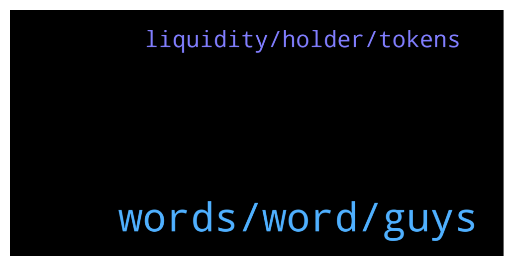

# **@algorand**
 ## Analysis for **2022-01-20** - **2022-01-21**.

---

## 📊 **Basic Stats**

**n_messages_sent**: 160

---

---

## 🔝 **Top keywords and related messages**

1. **words, word, guys**

    @MackDenver --- *A wallet phrase is usually English and 24-25 words long. Not sure if I can help you with this* **--->** [TG Discussion](https://t.me/algorand/334281)

    @callq --- *Well. From a risk-management point of view, you should probably wait for it to hit resistance *and* start to bounce up before re-entry.* **--->** [TG Discussion](https://t.me/algorand/333921)

    @NightAlgorand --- *Algorand does not have Contract address as it is not ERC. Did you send your funds to the wrong address? If so, there is nothing we can do to retrieve my funds unfortunately.* **--->** [TG Discussion](https://t.me/algorand/334139)

    @Bhavnasatish --- *It's a lie. I understand the admins of this group have two accounts here , one with the group logo and they are using it to scam people* **--->** [TG Discussion](https://t.me/algorand/333933)

    @MackDenver --- *I will check it with the team for confirmation. Thanks for the heads up.* **--->** [TG Discussion](https://t.me/algorand/333983)

    @dalila_turaeva --- *Hello! When will be Zone IDO?* **--->** [TG Discussion](https://t.me/algorand/334072)

2. **liquidity, holder, tokens**

    @MackDenver --- *You can check it at https://algoexplorer.io/. Just input an asset ID, you will find an option check its holder and other stats.* **--->** [TG Discussion](https://t.me/algorand/333970)

    @MackDenver --- *If you scan an asset ID, you will be able to know it's creator and manager.* **--->** [TG Discussion](https://t.me/algorand/333967)

    @fatherAbraham1 --- *How then do we verify if the tokens they hold are vested?* **--->** [TG Discussion](https://t.me/algorand/333968)

    @fatherAbraham1 --- *Is there any measure put in place to check if the liquidity of a coin is locked?* **--->** [TG Discussion](https://t.me/algorand/333958)

    @fatherAbraham1 --- *is there a way I can tell a contract address and a regular holder's address? Just as it is done on etherscan and bscscan?* **--->** [TG Discussion](https://t.me/algorand/333966)

    @MackDenver --- *Hello there,  In Algorand, there is asset ID which is quite similar like contracts. You can check the creator address in Algoscan.* **--->** [TG Discussion](https://t.me/algorand/333956)

