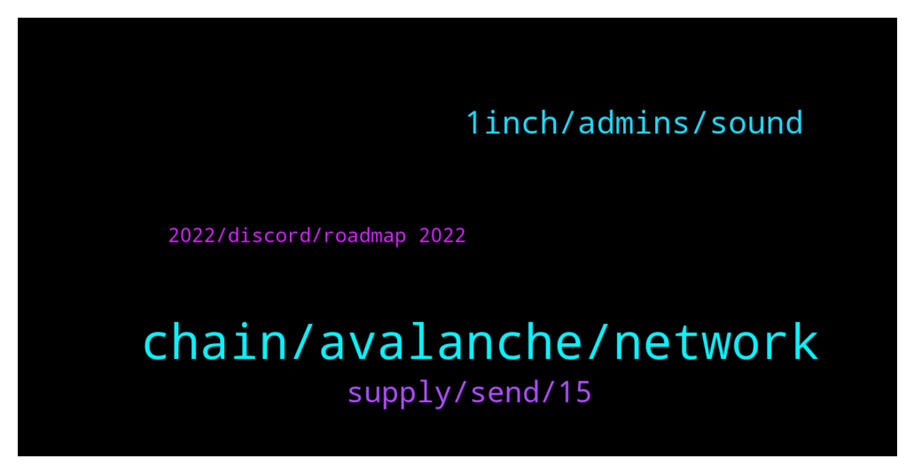

# **@avalancheavax**
 ## Analysis for **2022-01-20** - **2022-01-21**.

---

## 📊 **Basic Stats**

**n_messages_sent**: 137

---

---

## 🔝 **Top keywords and related messages**

1. **chain, avalanche, network**

    @heyslt --- *Hi, how the subnets with 0 gas fees will be protected against bots / spam attacks?* **--->** [TG Discussion](https://t.me/avalancheavax/323762)

    @Global_Defi --- *https://bridge.avax.network/   <— is this avax's official bridge ?  it says beta at the top left of the web page.   is there another bridge that we could move big money  ?* **--->** [TG Discussion](https://t.me/avalancheavax/323649)

    @espiritodesertanejo --- *You can do it only if Binance gives you the option to withdraw them using Avax C-Chain.* **--->** [TG Discussion](https://t.me/avalancheavax/323630)

    @lukasschafer1 --- *I don’t know if it’s the avanlanche Mainet that I installed in my metamask wallet that’s causing the issues or if there was just insufficient funds for gas fee when I did the wrapping.* **--->** [TG Discussion](https://t.me/avalancheavax/323648)

    @Flo (Don't pm) --- *Hey I have a question. Want to send Avax from MetaMask to Binance. I copied my adress in MM and it's not possible. The notification is: " No ETH- network, small writing"* **--->** [TG Discussion](https://t.me/avalancheavax/323733)

    @Nicolas_A --- *Yes you can only use Metamask. Most exchange support C chain withdrawals* **--->** [TG Discussion](https://t.me/avalancheavax/323508)

2. **1inch, admins, sound**

    @Al6666666 --- *Same, they call me at like 2am, wont let me sleep 🛌* **--->** [TG Discussion](https://t.me/avalancheavax/323457)

    @JustZee12 --- *😜🤪😂 like you would be stupid enough to answer a telegram call* **--->** [TG Discussion](https://t.me/avalancheavax/323467)

    @Al6666666 --- *I didn’t, jus the sound wakes you up, and i cant turn it off because i wont hear a alarm sound in the morning* **--->** [TG Discussion](https://t.me/avalancheavax/323473)

    @Crysis112 --- *Sadly there's always a small percentage of people that fall for it.  Good thing that admins constantly post that admins will never DM you* **--->** [TG Discussion](https://t.me/avalancheavax/323535)

    @ale128888 --- *Hi sir, I have sent you a DM 😊* **--->** [TG Discussion](https://t.me/avalancheavax/323491)

    @lukasschafer1 --- *And please no dms and calls.* **--->** [TG Discussion](https://t.me/avalancheavax/323645)

3. **supply, send, 15**

    @oathtobarbatos --- *This is a scammer, be careful* **--->** [TG Discussion](https://t.me/avalancheavax/323640)

    @ericds1 --- *Has anyone claimed? Any idea how to do it? https://twitter.com/_patrickogrady/status/1484221404111245312?s=21* **--->** [TG Discussion](https://t.me/avalancheavax/323654)

    @Crysis112 --- *Wow the amount of scammers trying to contact you after 1 message is insane* **--->** [TG Discussion](https://t.me/avalancheavax/323532)

    @Christopher --- *Yes my transactions have been closer to the 5 minute mark* **--->** [TG Discussion](https://t.me/avalancheavax/323677)

    @holiadour --- *Yesterday circulation 156M token today 157M and tomorrow 158M ………* **--->** [TG Discussion](https://t.me/avalancheavax/323505)

    @Larry --- *For Platypus finance…. The circulating supply numbers aren’t showing on CMC or C gecko.   Is that something that should be live soon? Or maybe it’s a api error on cmc/ gecko’s side?* **--->** [TG Discussion](https://t.me/avalancheavax/323608)

4. **2022, discord, roadmap 2022**

    @neirenoir --- *Are there any plans on releasing docs for spacesvm or at least commenting the code? 😅* **--->** [TG Discussion](https://t.me/avalancheavax/323756)

    @Joe79 --- *Hello, Is there any roadmap for 2022? I remember seeing one at least for Q1, but cannot find it. THanks* **--->** [TG Discussion](https://t.me/avalancheavax/323502)

    @Nicolas_A --- *If you want a detailed answer you will have to ask the devs on Discord chat.avax.network Here is a great resource on consensus btw https://gyuho.dev/nakamoto-bitcoin-vs-snow-avalanche-consensus.html* **--->** [TG Discussion](https://t.me/avalancheavax/323583)

    @Nicolas_A --- *Probably at some point. Best to ask in Discord though ^^* **--->** [TG Discussion](https://t.me/avalancheavax/323760)

    @Nicolas_A --- *Not at the moment. No idea when it comes out* **--->** [TG Discussion](https://t.me/avalancheavax/323507)

    @confIagrate --- *Hey guys, is there a roadmap for 2022 yet?* **--->** [TG Discussion](https://t.me/avalancheavax/323518)

